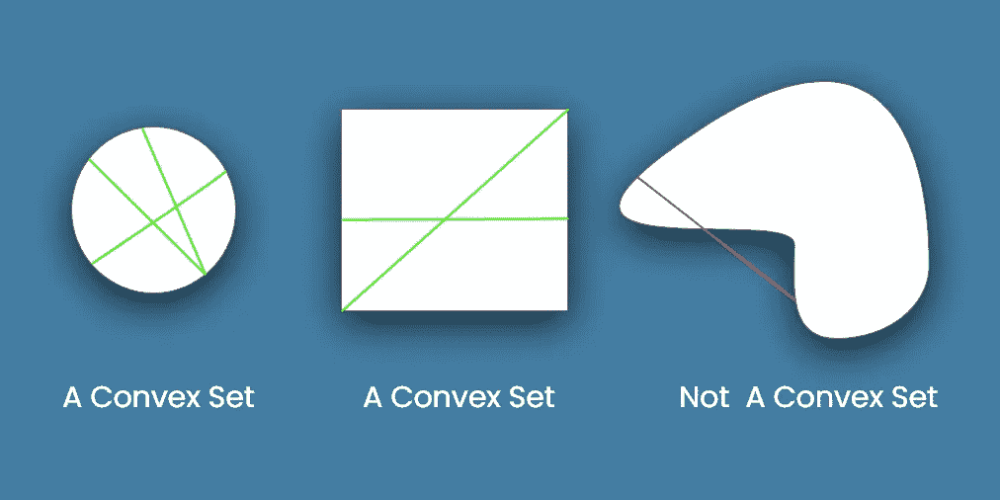
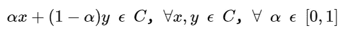
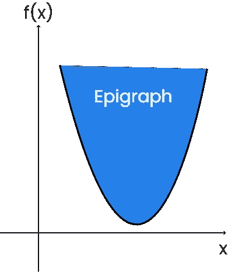
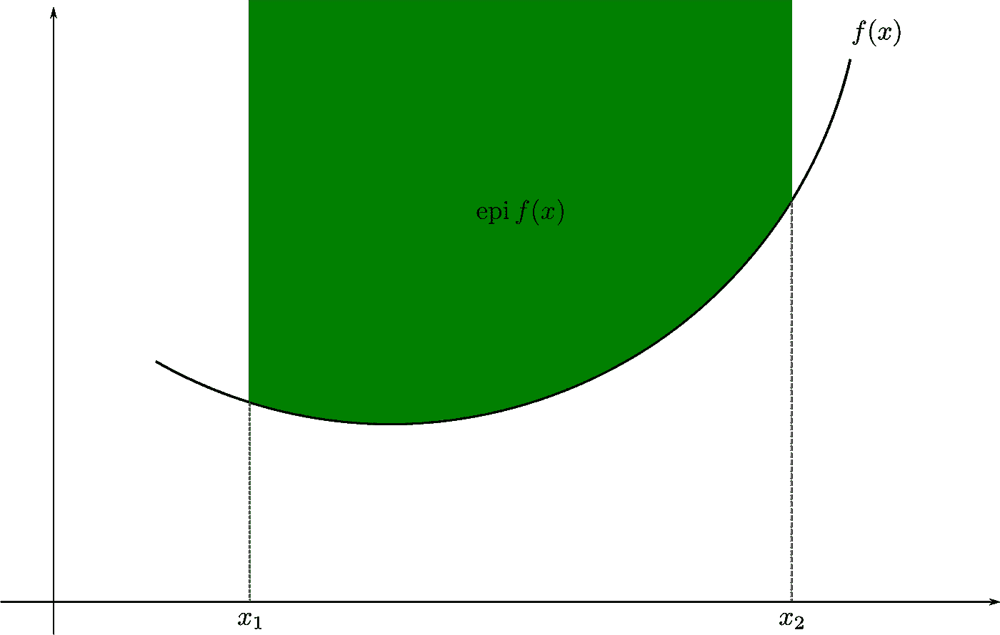
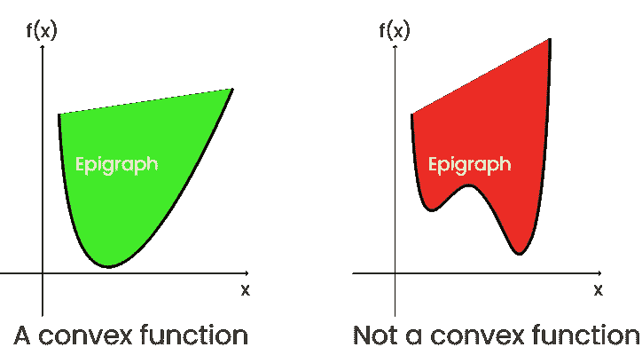
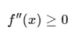
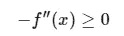
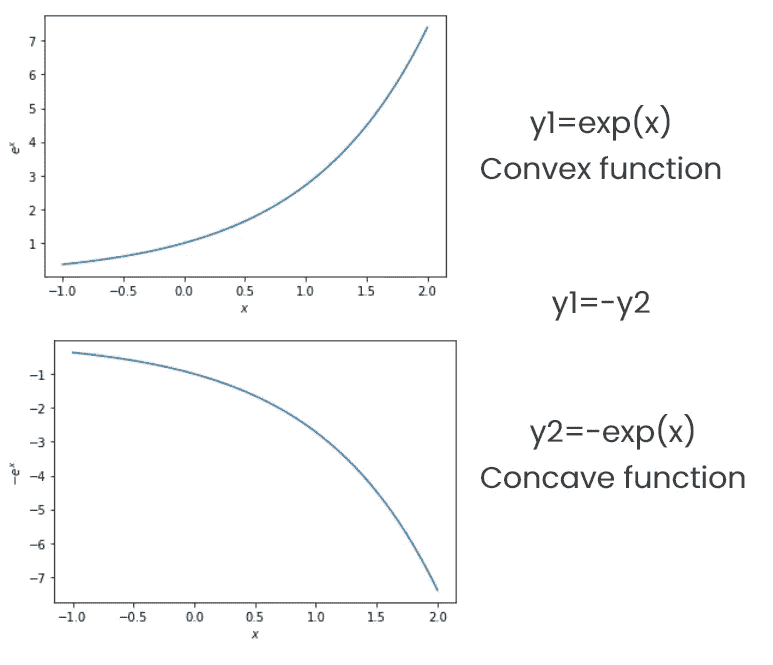
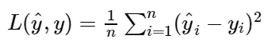
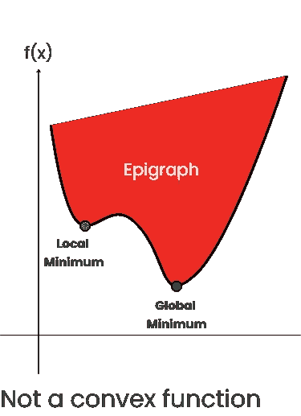

# 为什么凸性是最优化的关键

> 原文：<https://towardsdatascience.com/understand-convexity-in-optimization-db87653bf920?source=collection_archive---------9----------------------->

## 机器学习

## 使用凸成本函数是很容易的

凸函数。来源[维基百科](https://en.wikipedia.org/wiki/Convex_function)。

当开始机器学习时，你首先会遇到的最有趣的事情是优化算法，具体来说，就是梯度下降，这是一种一阶迭代优化算法，用于最小化成本函数。

梯度下降背后的直觉是收敛到一个解，这可能是邻域中的局部最小值，或者在最好的情况下，是全局最小值。

一切似乎都很好，直到你开始质疑自己的收敛问题。对凸性有很好的理解有助于你证明梯度下降思想背后的直觉。所以让我们讨论同样的问题。

> 希望大家对梯度下降有很好的理解。查看这篇文章的摘要。

 [## 了解梯度下降

### “让我们达到全局最小值。”

nvsyashwanth.github.io](https://nvsyashwanth.github.io/machinelearningmaster/understanding-gradient-descent/) 

# 凸集

***简单来说，把凸集想象成这样的形状，其中连接该集合中两点的任何线都不会在该集合之外。这叫做凸集。***

看看下面的例子。

理解凸集。图片由作者提供(使用 Adobe Xd 制作)。

很明显，任何连接圆或正方形(最左边和中间的形状)上的两点的线，将具有该形状内的所有线段。这些是凸集的例子。

另一方面，上图中最右边的形状有一部分线在形状外面。**由此可见，这不是凸集。**

凸集 C 可以表示如下。

凸集条件。作者图片

# 碑文

考虑一个函数的图形 f.
***题图是位于函数的图形之上或上方的一组点。***

一个函数的词表。图片由作者提供(使用 Adobe Xd 制作)。

# 凸函数

好了，现在你明白了什么是凸集和上图，我们可以谈谈凸函数了。

凸函数及其题图。来源[维基百科](https://en.wikipedia.org/wiki/Convex_function)。

***一个函数 f 称之为凸函数*** ***如果它的词牌是一个凸集(如下图左边绿色图所示)*** *。
这意味着在这个图* ***上画的每一条线段总是*** *等于或高于函数图。暂停一分钟，自己检查一下。*

理解凸函数。图片由作者提供(使用 Adobe Xd 制作)。

***这意味着函数 f 不是凸的，如果存在两个点 x，y 使得连接 f(x)和 f(y)的线段在函数 f 的曲线下面*** *。* ***这导致词牌的凸性丧失(如上图右侧红色部分所示)。*** *这意味着在这个图* ***上画的每一条线段都是*** ***不总是等于或高于函数图*** *。通过在弯曲处取点也可以证明这一点。*

# 凸性测试

在神经网络的情况下，大多数成本函数是非凸的。因此，你必须测试函数的凸性。

***若函数 f 的二阶导数大于或等于 0，则称该函数为凸函数。***

凸函数的条件。

**凸函数例子:** y=eˣ，y=x .这两个函数都是两次可微的。

***如果-f(x)(减去 f(x))是凸函数，那么这个函数叫做凹函数。***

凹函数的条件。

**凹函数的例子:** y=-eˣ.这个函数可微分两次。

让我们通过绘制指数函数 eˣ.来检查凸性

用于绘制凸凹函数的代码。作者写的。

**代码输出:**

凸凹函数。图片由作者提供(代码输出)。

# 梯度下降优化中的凸性

如前所述，梯度下降是一种一阶迭代优化算法，用于最小化成本函数。

为了理解凸性如何在梯度下降中起关键作用，让我们以凸和非凸成本函数为例。

对于线性回归模型，我们定义了成本函数均方误差(MSE ),它衡量实际值和预测值之间的平均平方差。我们的目标是最小化这个成本函数，以便提高模型的准确性。 **MSE 是一个** **凸函数(两次可微)。**这意味着没有局部最小值，只有全局最小值。因此梯度下降将收敛到全局最小值。

MSE 方程。图片由作者提供。

现在让我们考虑一个非凸的成本函数。在这种情况下，取一个任意的非凸函数，如下图所示。

非凸函数上的梯度下降。图片由作者提供(使用 Adobe Xd 制作)。

您可以看到，梯度下降不会收敛到全局最小值，而是会停止在局部最小值，因为该点的梯度为零(斜率为 0)并且在邻域中最小。解决这个问题的一个方法是使用动量的概念。

# 结论

凸函数在优化中起着巨大的作用。优化是机器学习模型的核心。理解凸性对于 same 来说非常重要，我相信你从这篇文章中已经了解到了。

## 谢谢你。下一场见。