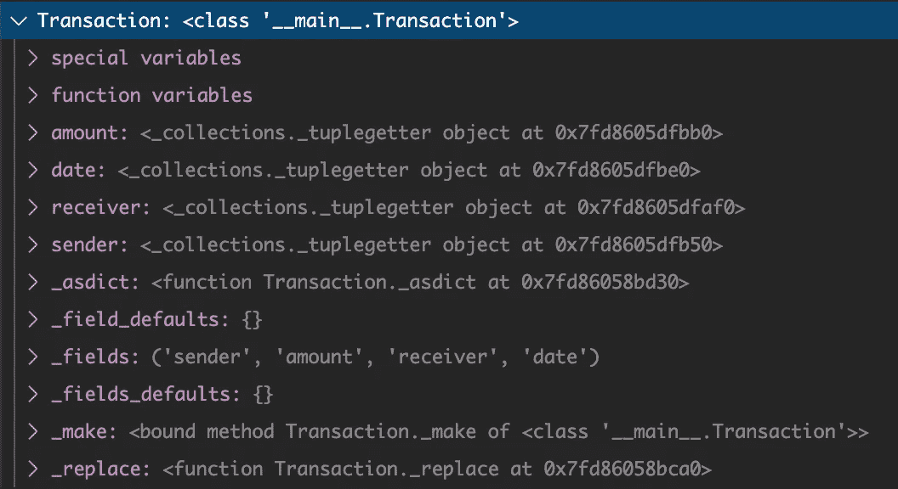
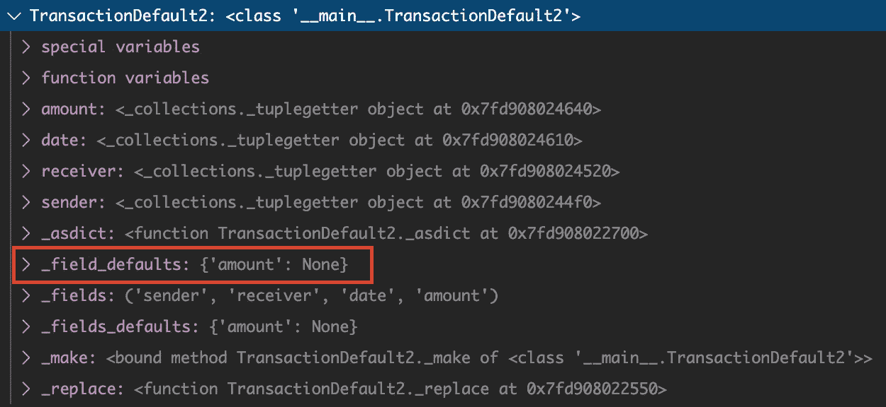
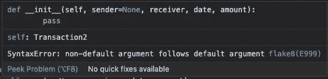
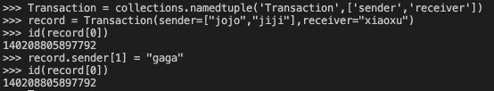
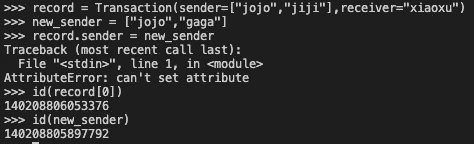
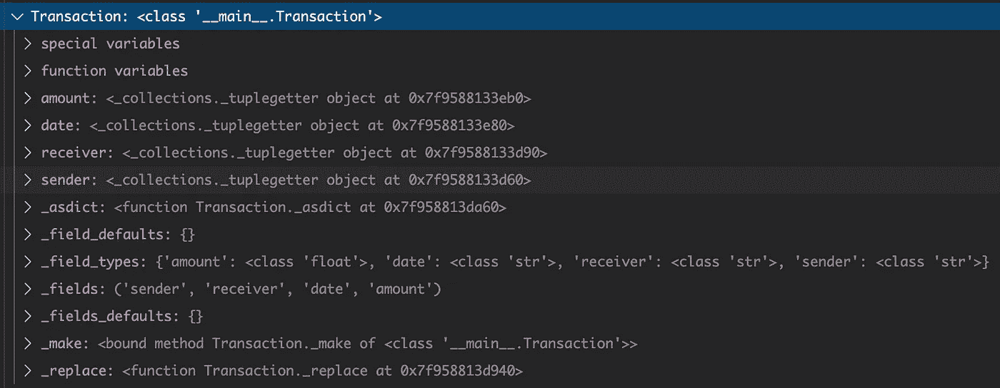

# 了解如何在 Python 中使用 NamedTuple 和 Dataclass

> 原文：<https://towardsdatascience.com/understand-how-to-use-namedtuple-and-dataclass-in-python-e82e535c3691?source=collection_archive---------0----------------------->

## 创建一个超出 __init__ 的 Python 对象

照片 [**希斯·乔德里**](https://unsplash.com/@hiteshchoudhary) 上 [**下**](https://unsplash.com/)

如果我要求你在 10 秒内为交易记录创建一个 Python 类，你会怎么做？可能大多数人都会用`__init__`创建一个类。在本文中，我想分享 Python 中构造一个类的两个替代方案:**名为 Tuple** 和 **Dataclass** 。最后，我将比较这三个选项的性能，并就何时使用哪一个给出一些建议。

*我将在本文中把带有* `*__init__*` *的类称为“常规”Python 类。请让我知道它是否有正式名称。如果您想深入了解命名元组和数据类，请查看参考链接。*

每笔支付交易都有发送者、接收者、日期和金额。如果我使用常规的 Python 类，它可能看起来像这样:

[transaction.py](https://gist.github.com/highsmallxu/b469e182998b8a055bc09f3be9a8005a)

很直白。但是说实话，代码很多，至少很多行。在一个用例中，我从一个源(例如 Kafka)消费实时交易记录，我不希望有修改记录的灵活性。我如何以更干净的方式实现这一点？

## 命名元组

命名元组是构造类的一个很好的选择。命名元组基本上是 Python 内置元组数据类型的扩展。Python 的 tuple 是一种简单的数据结构，用于对不同类型的对象进行分组。它的定义特征是**是不可变的**。

> 不可变对象是在创建后其状态不能被修改的对象。

在 Python 中，不可变类型有 *int* ， *float* ， *bool* ， *str* ， *tuple* 和 *unicode* 。

然而，内置元组类型的一个缺点是它给程序员增加了很多责任。当访问内置元组的一个属性时，需要知道它的索引。如果你正在开发一个将被成千上万的用户使用的库，这会引起一些混乱。

另一种可能的方法是使用内置字典，像`{"sender":"","receiver":"","date":"","amount":""}`。但是这里的问题是你需要正确的拼写键名。而且根本不是一个档次。

我们可以使用命名元组来避免这些问题。命名元组允许我们给元素命名，所以我们可以通过属性名和它的索引来访问属性。

Python3.8 中的命名元组实际上有两种类型，一种来自已经存在很久的`collections`包，另一种来自从 Python3.6 开始引入的`typing`包。

## ***collections . named tuple***

我先从`[*collections*](https://docs.python.org/3.8/library/collections.html)` [*包*](https://docs.python.org/3.8/library/collections.html) 。这个包提供了 Python 通用内置类型的替代方案，如*字典*、*列表*、*集合*和*元组*。

[collections-named tuple . py](https://gist.github.com/highsmallxu/26a46e42299300df75f856b50797e5d8)

这就是如何创建一个`namedtuple`类。哇，就一行代码！

我们刚刚创建的`Transaction`本质上是一个类。它有属性*发送者、接收者、日期、金额*和`_fields`，允许我们通过名称和索引来访问属性。

***创建一个对象***

创建一个 *namedtuple* 对象和创建类一样简单。我还喜欢的是 *namedtuple* 对象的表示。您也可以通过覆盖`__repr__`方法在常规 Python 类中定制它。

[namedtuple-create.py](https://gist.github.com/highsmallxu/f6349b3bc6731c57bc40e27c5dfad3be)

为属性分配默认值也是可能的。

[named tuple-create-default . py](https://gist.github.com/highsmallxu/06bf2ce8433c220e8175195cf8a26317)

⚠️ ️ **注意了！**

[named tuple-create-default-career . py](https://gist.github.com/highsmallxu/03172fd592d454af8ff3b202975f998d)

在这个例子中，我只将`None`作为默认值分配给一个属性。分配了哪个属性？想想吧。

`None`被分配给属性`amount`，它是元组的最后一个属性。

这里发生了什么事？我鼓励你在进一步阅读前思考一分钟。

好吧。本质上，命名元组的创建遵循与常规 Python 类相同的语法。

神奇的是，当我们创建一个类时，**非默认参数不能跟在默认参数**后面。在常规的 Python 类中，我们会立即注意到这个错误。这个语法规则也适用于命名元组，**，所以默认值将从最后一个元素开始分配。**

[named tuple-create-default-regular-class . py](https://gist.github.com/highsmallxu/23101c2437ff2d63728b4f71f254c9e2)

回到子主题:创建对象。也可以使用`_make()`方法创建一个`namedtuple`对象。但是你需要记住属性的顺序。

[named tuple-create-make . py](https://gist.github.com/highsmallxu/e4595c0b2f7bf67f330b5bb5de55a198)

***访问属性***

访问`namedtuple`中的属性也非常简单。事实上，它是一个元组，我们可以像访问基本元组一样访问属性。一个`namedtuple`可以用`_asdict()`转换成一本字典。

[namedtuple-access.py](https://gist.github.com/highsmallxu/cba968af7bebb383c6367616c8958f14)

***分配属性***

等等？你刚才说 tuple 是一个不可变的数据类型，你怎么能在一个不可变的对象中分配属性呢？

这取决于元组属性的数据类型。如果属性像 *str，float，int* 一样是不可变的，那么我们就不能修改状态，比如`("1.0","xiaoxu","2019-01-01")`。

**但是如果属性本身像 *list 一样是可变的，*你可以改变列表中的元素，而不让元组知道这种改变。**

具有可变属性的 namedtuple

在这个例子中，发送者是一个可变对象的列表。在修改属性之前，我使用 Python 内置函数`id`来检查链表的内存地址。

然后，我将列表的第二个元素更改为“gaga ”,并打印出同一列表的 id。原来 id 是一样的！因此，对于*命名的元组，*状态没有改变。

具有可变属性 2 的 namedtuple

但是如果我们用相同的元素创建一个新的列表:“jojo”和“gaga”，并试图将它分配给 *namedtuple* ，这是行不通的，因为它们有不同的 id。

***继承类***

有时我们想要继承一个类并扩展其属性。在`namedtuple`中，您可以使用`@property`添加一个新属性。就像你看到的一样简单。

[在命名元组中继承](https://gist.github.com/highsmallxu/f81bff245987a758f1eeaec0e9694e56)

***分配字段名导致 csv 或 db 查询返回元组***

我喜欢`namedtuple`的另一个很酷的特性是，它可以将 csv 记录或 db 查询结果映射到一个 *namedtuple* 对象。它可以减少样板代码的数量。

[named duple-read-CSV-database . py](https://gist.github.com/highsmallxu/45d91b7d3f45fcece87007b695eebd3e)

## ***打字。名为*的一对**

创建一个名为的*元组的第二个选项是使用`typing.NamedTuple`。它来自`typing`包，所以每个属性都绑定到一个类型。在我看来，这就是`collections.namedtuple`和`typing.NamedTuple`的唯一区别。*

这种格式看起来有点像常规的 Python 类，但是带有类型。确保你继承了`typing.NamedTuple`。

[NamedTuple-create.py](https://gist.github.com/highsmallxu/63788271aeafdfa82cad3ce3d538eca0)

从`typing.NamedTuple`创建的类有一个额外的字段`_field_types`，显示每个属性的定义类型。

有时候，如果你真的不想为某些属性定义类型，你可以使用 type `Any`。静态类型检查器会将每个类型视为与任何类型兼容。

[named tuple-create-any . py](https://gist.github.com/highsmallxu/0882aef3fb73066eddde5b28ba7fdd67)

***创建一个对象，访问属性&分配属性***

[NamedTuple-access.py](https://gist.github.com/highsmallxu/a6e3ec176f1845063e85146a00e9b5fa)

在创建对象、访问属性和分配属性方面，`typing.NamedTuple`与`collections.tuple`相同。

## ***数据类***

Dataclass 是 Python 3.7 中引入的新特性。它被用作装饰器。它为我们实现了`__init__`、`__repr__`等。

[dataclass-create.py](https://gist.github.com/highsmallxu/a87e1901c497e1c95ca8f4edea1733d8)

命名元组的行为类似于元组，而*数据类*的行为更像常规的 Python 类。我为什么这么说？因为默认情况下，属性都是可变的，只能通过名称访问，而不能通过索引访问。

***继承类***

当继承一个*数据类*时，子类的属性跟随父类，所以要小心默认值。如果父类中的一个字段被赋予了默认值，那么子类中的所有属性都应该有默认值。

[dataclass-inherit.py](https://gist.github.com/highsmallxu/5bbd894aa21467c863af8b963d8058a3)

***不可变数据类***

命名元组的关键特性之一是不可变的。您也可以通过`frozen=True`在 *dataclass* 中设置不可变的属性。

[dataclass-immutable.py](https://gist.github.com/highsmallxu/b55f7262f12ddfad5b397fa844783888)

在冻结的*数据类*中，如果试图修改状态，将引发`FrozenInstanceError`异常。

## 性能比较

最后，我想比较一下常规 Python 类、`collections.namedtuple`、`typing.NamedTuple`和`dataclass`的性能。比较内容包括:

*   对象的大小
*   创建对象的时间
*   检索属性的时间到了

我已经创建了 5 个不同的类。最后一个是带有字段`__slot__`的优化的*数据类*。[槽](https://docs.python.org/3/reference/datamodel.html#slots)用于使类更快，使用更少的内存。

[named tuple-data class-comparison-init . py](https://gist.github.com/highsmallxu/611cef8f11f31f6e88b8427d420a46c8)

***比较物体的大小***

第一步是使用`sys.getsizeof`比较每个创建对象的大小。

[named tuple-data class-size-comparison . py](https://gist.github.com/highsmallxu/38bceca4c75f948d55f03aecd5ff467a)

***比较时间创建一个对象***

然后我用 Python 内置函数`[timeit](https://docs.python.org/3.8/library/timeit.html)`对比对象创建时间。

[named tuple-data class-creation-comparison . py](https://gist.github.com/highsmallxu/80097313ce7c27d1cfc114e23378d419)

***比较时间访问属性***

[named duple-data class-access-comparison . py](https://gist.github.com/highsmallxu/3035f3e86a32b4df20d14500d1eb6f02)

***结果***

named tuple-data class-comparsion-result . CSV

基于元组的对象通常较大，因为它们包含属性名和索引。具有槽的数据类具有最少的对象创建时间。常规 Python 类似乎擅长访问属性。

## 结论

在做决定之前，你必须了解你的要求。

*   您希望对象是不可变的吗？
*   您希望在 Python 代码中显式输入吗？
*   你在乎记忆吗？
*   你喜欢简洁的风格还是易读的风格？

……

**选择常规 Python 类，如果你……**

*   用于创建任何带有`__init__`的类。拥有`__init__`让我感觉很安全。
*   每个人都能理解代码。
*   正在使用 3.6 以下的 Python 版本。
*   不需要不可变的对象。
*   不喜欢显式打字。

**选择** `**collections.namedtuple**` **类如果你……**

*   想要不可变的对象。
*   不喜欢显式打字。
*   想要更少的代码。少即是多！

**选择** `**typing.NamedTuple**` **类如果你……**

*   想要不可变的对象。
*   确实需要显式输入。
*   想要更少的代码。少即是多！

**选择** `**dataclass**` **如果你……**

*   希望灵活地使它既可变又不可变。
*   确实需要显式输入。
*   想要更少的代码。少即是多！
*   想要好的速度表现。

希望你喜欢这篇文章！如果你有任何想法，请在下面留下你的评论。

## **资源**

 [## 用命名元组编写干净的 Python-dbader.org

### 命名元组是手动定义类的一个很好的选择，它们还有一些其他有趣的特性…

dbader.org](https://dbader.org/blog/writing-clean-python-with-namedtuples)  [## Python 3.7 中数据类的终极指南——真正的 Python

### Python 3.7 中一个令人兴奋的新特性是数据类。数据类通常包含…

realpython.com](https://realpython.com/python-data-classes/)  [## 数据类-数据类- Python 3.8.3 文档

### 这个模块提供了一个装饰器和函数，用于自动添加生成的特殊方法，比如和…

docs.python.org](https://docs.python.org/3/library/dataclasses.html)  [## 类型-支持类型提示- Python 3.8.3 文档

### 源代码:Lib/typing.py 注意 Python 运行时不强制函数和变量类型注释。他们可以是…

docs.python.org](https://docs.python.org/3/library/typing.html)  [## 集合-容器数据类型- Python 3.8.3 文档

### 源代码:Lib/collections/__init__。py 3.3 版本新增。该类可以用来模拟嵌套的作用域，并且是…

docs.python.org](https://docs.python.org/3/library/collections.html)