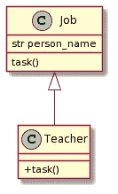
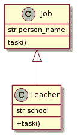

# 理解 Python 中的继承

> 原文：<https://towardsdatascience.com/understand-inheritance-in-python-74f8e3025f3c?source=collection_archive---------22----------------------->

## 一个简单但重要的设计模式


照片由[迈克尔在](https://unsplash.com/@walkthecreator) [Unsplash](https://unsplash.com/) 上行走

In 继承是任何面向对象编程语言的关键特性，包括 Python。当您在 Python 3 中编写代码时，您可能已经在不知不觉中使用了继承特性。与 Java 等其他面向对象语言不同，Python 支持单继承和多继承。

在本文中，我将讨论 Python 中不同类型的继承，并解释这个概念是如何集成到 Python 3 中的，以及我们如何在日常编程中使用它。我们开始吧！

## 什么是继承？

继承是基于现有的类创建一个类，新的类继承现有类的属性和方法。新的类通常称为“子类”，现有的类称为“父类”。这一概念与现实世界的运作方式相同，在现实世界中，孩子从父母那里继承了一些特征，但同时，他或她也可以拥有独特的特征。

任何面向对象编程语言中的继承都应该遵循 [**Liskov 替换原则**](https://en.wikipedia.org/wiki/Liskov_substitution_principle) 其中说:

> 如果 S 是 T 的子类型，那么 T 类型的对象可以用 S 类型的对象替换

这意味着子类将从父类继承属性、方法和实现。允许修改和添加新功能，但不能从父功能中删除功能。

例如，我有一个父类`Student`和子类`HighSchoolStudent`和`PrimarySchoolStudent`。两个子类都继承了来自`Student`的所有属性，但是它们中的每一个对于`grade`都有不同的值。例如，如果你想创建一个不需要`school`属性的对象，那么你可能不应该在这里继承。

[什么是继承. py](https://gist.github.com/highsmallxu/d2661e226b870a364329bf971d836b2d)

## 每个类的祖先:Object

如果你在 Python 中创建了一个新类，那么它已经从某个地方继承了。我们从一个虚拟类`BaseClass`开始，使用`__bases__`方法检查它的父类。我们得到了`<class 'object'>`，它有一些带有双前导和尾随下划线的[方法，所以从`object`继承的类也实现了这些方法。它们在 Python 中被称为](/5-different-meanings-of-underscore-in-python-3fafa6cd0379)[魔法方法](https://www.geeksforgeeks.org/dunder-magic-methods-python/#:~:text=OpenCV%20and%20OCR-,Dunder%20or%20magic%20methods%20in%20Python,commonly%20used%20for%20operator%20overloading.)。

**类** `**object**` **是 Python 中每个类的祖先。**如果做`object.__bases__`，会得到一个空值。

*在 Python 2.x 中，仍然像* `*class BaseClass(object)*` *一样强制显式继承* `*object*` *，但是从 Python 3.x 开始，已经没有必要了。*

[继承-dummy.py](https://gist.github.com/highsmallxu/2c771f7eb1c80d24a5017c4acc7d31b5)

对于 Python 中定制的异常，它们应该从类`BaseException`或其子类`Exception`扩展而来，尽管`BaseException`的父类也是`object`。**不能提升不是从** `**BaseException**` **类继承的类。**

```
raise BaseClass
# TypeError: exceptions must derive from BaseException
```

## 单一遗传

单一继承是指类只从一个类继承。根据在子类中做什么，子类可能有不同的结构。这里我们使用 UML 来显示类之间的关系。在每个例子中，我将首先说明用例，然后画出 UML 图。最后，我将展示代码。请在检查答案之前考虑解决方案。

**例 1** :我有一个父类`Job`，它有一个属性`person_name`和一个方法`task`。我想创建一个继承自`Job`的子类`Teacher`，并用*“教学生”*覆盖`task`。

UML 图看起来像这样。这是一个非常简单的例子，我们唯一需要做的就是覆盖方法`task()`。



UML 图

让我们检查一下代码。

[继承-覆盖-方法. py](https://gist.github.com/highsmallxu/0a951ed38977bda13f21aecd8c734b41#file-inheritance-overwrite-method-py)

**例 2:** 我们仍然使用`Job`作为父类，但是这次除了重写`task()`之外，我还想创建一个带有额外属性`school_name`的子类`Teacher`。

在 UML 图中，我们会在类`Teacher`中找到一个新的属性。



UML 图—新属性

`school`是一个新属性，所以这意味着我们需要覆盖`__init__`方法来添加属性。在这个例子中，我们将使用一个内置函数`[super()](https://docs.python.org/3.8/library/functions.html#super)`。

简而言之，`super()`返回一个将方法调用委托给父类的对象。它允许您重用父类的属性和行为。在下面的代码中，`super().__init__`将执行`Job.__init__`中的所有内容，以避免重复代码。

[继承-新建-属性. py](https://gist.github.com/highsmallxu/9fe2c0b48b9ea5236bc7981422fbc4ff)

`super()`可以在其他方法中使用，所以也可以在子类中调用`super().task()`。

**例 3:** 除了例 2，我想防止类`Job`被实例化，因为没有名为`Job`的作业。

UML 图将与示例 2 相同。


UML 图—新属性

为了实现这一点，我们将讨论 Python 中抽象类的概念。**抽象类是打算被继承但从不实例化的类。** Python 提供了`abc`模块定义抽象基类，提供了`@abstractmethod` decorator 定义抽象方法。

所以新的`Job`类是从`ABC`类扩展而来的，方法`task()`有装饰器`@abstractmethod`。通过这样做，它告诉程序员这个类不允许被实例化。如果您试图创建一个对象，它将引发一个异常。此外，将任何有意义的逻辑放入抽象方法是没有意义的，尽管你仍然可以这样做。

继承-抽象. py

```
job = Job("xiaoxu")
# TypeError: Can't instantiate abstract class Job with abstract methods task
```

子类`Teacher`将与前面的例子相同。

## 多重遗传

多重继承是指类从多个父类继承。在某种程度上，这可以减少冗余，但也会增加代码的复杂性。你应该清楚自己在做什么。

**例子**:我有一个父类`Dad`和另一个父类`Mum`。子类`Kid`扩展了两个父类。父类如下所示。有些属性具有相同的值(例如城市)，但有些属性不具有相同的值(例如眼睛颜色)。

[继承-multi.py](https://gist.github.com/highsmallxu/9f680533f9033b94db354021db85ffbf)

好吧，那么问题来了。一个`kid`对象的默认`eye_color`是什么？当涉及到多重继承时，子类将首先在它自己的类中搜索属性，如果没有，那么在它的父类中以深度优先、从左到右的顺序搜索。这在 Python 中叫做 [**方法解析顺序**](https://bytes.vokal.io/20151207-python-super-mro/#:~:text=The%20MRO%20(Method%20Resolution%20Order,point%20to%20the%20parent%20class)) **(MRO)。MRO 定义了 Python 如何搜索继承的方法。**

幸运的是，我们可以通过执行`Kid.__mro__`来检查这个订单。由于`Kid`类第一次访问`Dad`，那么它默认会有蓝眼睛。此外，`kid`将会兼具游泳和舞蹈“技能”。

[继承-多结果. py](https://gist.github.com/highsmallxu/9a2680c38528f2c577766e06f5233c4d)

如果你只想从类`Mum`继承属性，那么你可以在`Kid`的`__init__`中明确提到。

[继承-多-2.py](https://gist.github.com/highsmallxu/4955d74d282b289302d3c67c77dcf16c)

## 结论

继承是任何面向对象编程语言中极其常见的设计模式。它有助于程序员重用代码，节省大量的时间和精力。这种模式在 Python 中得到了很好的实现，既有单一继承的可能性，也有多重继承的可能性。

我希望你喜欢这篇文章！如果你有任何想法，请在下面留下你的评论。

## 参考

[](https://realpython.com/python-super/) [## 用 Python super() -真正的 Python 来增强你的类

### 免费奖励:关于 Python 精通的 5 个想法，这是一个面向 Python 开发者的免费课程，向你展示了路线图和…

realpython.com](https://realpython.com/python-super/)