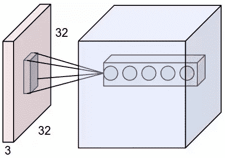

# 理解卷积神经网络中的局部感受野

> 原文：<https://towardsdatascience.com/understand-local-receptive-fields-in-convolutional-neural-networks-f26d700be16c?source=collection_archive---------3----------------------->

## 技术和解释

## 想过为什么卷积神经网络中的所有神经元都是相连的吗？

> [**在我主持的这个现场培训环节，用 TensorFlow 和 Keras 学习 AI 和深度学习的基础知识。**](https://www.oreilly.com/live-events/practical-introduction-to-the-world-of-computer-vision-and-deep-learning-with-tensorflow-keras/0636920060577/0636920061406/)

> 这篇文章面向所有水平的练习机器学习或更具体地说深度学习的个人。

C 旋转神经网络(CNN)具有对通过网络输入的图像的仿射变换保持不变的特性。这提供了识别图像中偏移、倾斜或轻微扭曲的图案的能力。

由于 CNN 架构的三个主要属性，引入了仿射不变性的这些特征。

1.  **局部感受野**
2.  共享权重
3.  空间子采样

在这篇文章中，我们将探索局部感受野，理解它们的目的和它们在 CNN 架构中的优势。

# 介绍

在 CNN 架构中，有几个层的组合，其中有一组单元或神经元。

这些单元接收来自前一层中类似子部分的相应单元的输入。在传统的全连接前馈神经网络中，层内的单元/神经元接收来自前一层的所有单元的输入。

曾经想知道为什么卷积神经网络中的所有神经元没有连接起来吗？

将前一层的所有单元连接到当前层的单元是不切实际的。由于连接的增加，训练这种网络的计算资源将是巨大的。此外，这样的网络将需要一组更广泛的训练数据来利用网络的全部容量。

但更重要的是，CNN 中的每个神经元负责输入数据的一个定义区域，这使神经元能够学习构成图像的线条、边缘和小细节等模式。

神经元或单元在输入数据中暴露的这一限定的空间区域被称为**局部感受野**。

# 感受野

感受野是空间或空间结构的定义部分，包含向相应层内的一组单元提供输入的单元。

感受野由卷积神经网络中一层的滤波器大小来定义。感受野也是一个层内的神经元或单元可以接触到的输入数据范围的指示*(见下图)。*

# 例子

下图显示了输入体积为 32x32x3 的输入数据(红色)。

输入体积基本上告诉我们，输入数据中的图像具有 32×32(高/宽)的尺寸，沿着三个颜色通道:红色、绿色和蓝色。

图像中的第二个对象(蓝色)代表一个卷积层。conv 层的滤波器大小为 5×5，对应于该层中每个神经元对输入数据的局部感受野面积。

感受野不仅作用于输入体积的面积，而且也作用于深度，在本例中是 3。

对于下图中的示例，我们可以根据输入量得出每个神经元具有的可训练参数的数量。这是感受野乘以输入体积的深度(5x5x3 = 75 个可训练参数)。

假设我们有(32，32，3)的输入量，卷积层的感受野是 5×5，那么卷积层中的每个神经元将具有 5×5×3 区域的权重，这是神经元内的 75 个权重。



[局部感受野示意图](https://cs231n.github.io/convolutional-networks/)

卷积图层的输出是特征地图，图层中特征地图的数量是一个定义的超参数，通过将特征地图的维度乘以可训练参数的数量，可以推导出特征地图中的连接数。

> 局部感受野是由卷积层中的神经元在卷积过程中暴露的输入数据内容所占据的定义的分段区域。

[LeNet 论文](http://yann.lecun.com/exdb/publis/pdf/lecun-01a.pdf)介绍了利用卷积神经网络进行字符识别的第一个用例。它还介绍了 CNN 中局部感受野的概念和实现。


照片由 Cole Wyland 在 Unsplash 上拍摄

但是，局部感受域或者更确切地说是仅暴露于一段输入数据的后续单位——局部连接——的概念早在 20 世纪 60 年代就在一项研究中引入了，该研究由[探索猫的视觉皮层](https://www.ncbi.nlm.nih.gov/pmc/articles/PMC1359523/pdf/jphysiol01247-0121.pdf)。

# 优势

局部感受野在识别视觉模式方面的优势在于，层内的单元或神经元直接负责从一小块输入数据区域中学习视觉特征——这不是全连接神经网络的情况，在全连接神经网络中，单元接收来自前一层内单元的输入。

在 CNN 内的较低层中，单元/神经元学习图像内的低级特征，例如线条、边缘、轮廓等。较高层学习图像的更多抽象特征，例如形状，因为较高层内的单元暴露的图像区域较大，这是先前较低层的感受野累积的结果。


[神经网络模拟](https://www.cybercontrols.org/)功劳归于[丹尼斯·德米特列夫](https://www.youtube.com/channel/UC8m-a4A0jk2bkesfPdz1z_A)

下面的代码片段展示了如何使用 TensorFlow 深度学习 python 库定义卷积层。

[*Conv2D*](https://www.tensorflow.org/api_docs/python/tf/keras/layers/Conv2D) 类构造函数接受参数“过滤器”,该参数对应于过滤器产生的输出数量，也是特征映射的数量。参数“kernel_size”采用一个表示内核/筛选器的高度和宽度的整数；在这种情况下，整数 5 对应于尺寸 5×5。

```
simple_conv_layer = tf.keras.layers.Conv2D(filters=6, kernel_size=5, activation='relu', input_shape=(28,28,1))
```

# 我希望这篇文章对你有用。

要联系我或找到更多类似本文的内容，请执行以下操作:

1.  订阅我的 [**YouTube 频道**](https://www.youtube.com/channel/UCNNYpuGCrihz_YsEpZjo8TA) 即将发布的视频内容 [**这里**](https://www.youtube.com/channel/UCNNYpuGCrihz_YsEpZjo8TA)
2.  跟着我上 [**中**](https://medium.com/@richmond.alake)
3.  通过 [**LinkedIn**](https://www.linkedin.com/in/richmondalake/) 联系我

[](/batch-normalization-explained-algorithm-breakdown-23d2794511c) [## 解释了神经网络中的批量标准化(算法分解)

### 理解深度神经网络中使用的一种常见转换技术

towardsdatascience.com](/batch-normalization-explained-algorithm-breakdown-23d2794511c) [](/5-soft-skills-you-need-as-a-machine-learning-engineer-and-why-41ef6854cef6) [## 作为机器学习工程师你需要的 5 个软技能(以及为什么)

### 包括成为任何劳动力的有用组成部分的提示

towardsdatascience.com](/5-soft-skills-you-need-as-a-machine-learning-engineer-and-why-41ef6854cef6)