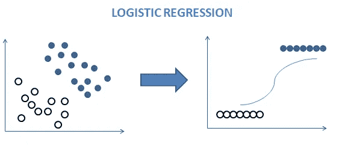
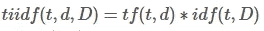
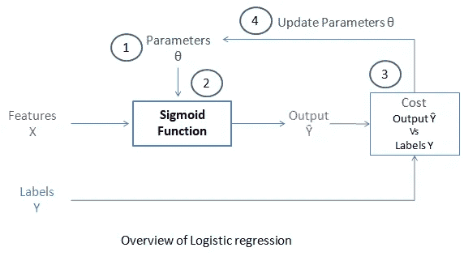
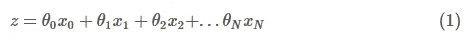
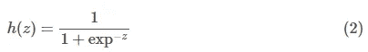
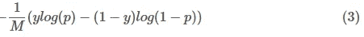
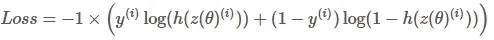
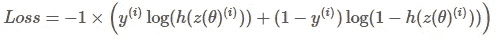
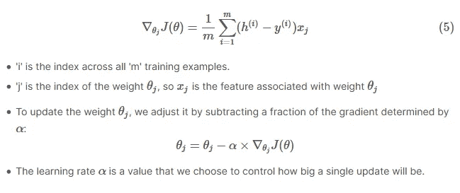
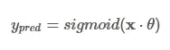

# 从零开始理解逻辑回归— Kaggle 笔记本

> 原文：<https://towardsdatascience.com/understand-logistic-regression-from-scratch-430aedf5edb9?source=collection_archive---------28----------------------->

## 通过自己实现来学习算法。



由作者创建

## 目录

1.目标

2.加载数据

3.从文本中提取特征

4.实施逻辑回归

*   4.1 概述
*   4.2 乙状结肠
*   4.3 成本函数
*   4.4 梯度下降
*   4.5 正规化

5.火车模型

6.测试我们的逻辑回归

7.用 Scikit 学习逻辑回归测试

让我们用 Python 导入所有必要的模块。

```
# regular expression operations
import re    
# string operation 
import string  
# shuffle the list
from random import shuffle

# linear algebra
import numpy as np 
# data processing
import pandas as pd 

# NLP library
import nltk
# download twitter dataset
from nltk.corpus import twitter_samples                          

# module for stop words that come with NLTK
from nltk.corpus import stopwords          
# module for stemming
from nltk.stem import PorterStemmer        
# module for tokenizing strings
from nltk.tokenize import TweetTokenizer   

# scikit model selection
from sklearn.model_selection import train_test_split

# smart progressor meter
from tqdm import tqdm
```

## 1.目标

这个内核的目标是使用 twitter 数据集从零开始实现用于情感分析的逻辑回归。我们将主要关注逻辑回归的构建模块。这个内核可以提供对 ***内部如何进行逻辑回归*** 的深入理解。使用 [JupytertoMedium](https://pypi.org/project/jupyter-to-medium/) python 库将笔记本转换成中型文章。Kaggle 笔记本可从[这里](https://www.kaggle.com/narendrageek/understand-the-logistic-regression-from-scratch)获得。

给定一条推文，如果它有**正面情绪，它将被分类👍或者消极情绪👎**。这对初学者和其他人都很有用。

## 2.加载数据

```
# Download the twitter sample data from NLTK repository
nltk.download('twitter_samples')
```

*   `twitter_samples`包含 5000 条正面推文和 5000 条负面推文。总共有 10，000 条推文。
*   我们每个班都有相同数量的数据样本。
*   这是一个平衡的数据集。

```
# read the positive and negative tweets
pos_tweets = twitter_samples.strings('positive_tweets.json')
neg_tweets = twitter_samples.strings('negative_tweets.json')
print(f"positive sentiment 👍 total samples {len(pos_tweets)} \nnegative sentiment 👎 total samples {len(neg_tweets)}")positive sentiment 👍 total samples 5000 
negative sentiment 👎 total samples 5000# Let's have a look at the data
no_of_tweets = 3
print(f"Let's take a look at first {no_of_tweets} sample tweets:\n")
print("Example of Positive tweets:")
print('\n'.join(pos_tweets[:no_of_tweets]))
print("\nExample of Negative tweets:")
print('\n'.join(neg_tweets[:no_of_tweets]))Let's take a look at first 3 sample tweets:
```

**输出:**

```
Example of Positive tweets:
#FollowFriday @France_Inte @PKuchly57 @Milipol_Paris for being top engaged members in my community this week :)
@Lamb2ja Hey James! How odd :/ Please call our Contact Centre on 02392441234 and we will be able to assist you :) Many thanks!
@DespiteOfficial we had a listen last night :) As You Bleed is an amazing track. When are you in Scotland?!

Example of Negative tweets:
hopeless for tmr :(
Everything in the kids section of IKEA is so cute. Shame I'm nearly 19 in 2 months :(
@Hegelbon That heart sliding into the waste basket. :(
```

*   推文可能包含 URL、数字和特殊字符。因此，我们需要对文本进行预处理。

## 预处理文本

预处理是流水线中的重要步骤之一。它包括在建立机器学习模型之前清理和删除不必要的数据。

预处理步骤:

1.  对字符串进行标记
2.  将 tweet 转换成小写，并将 tweet 拆分成令牌(单词)
3.  删除停用字词和标点符号
4.  删除 twitter 平台上的常用词，如标签、转发标记、超链接、数字和电子邮件地址
5.  堵塞物

*   这是把一个单词转换成它最普通形式的过程。它有助于减少我们的词汇量。例如，engage 这个词有不同的词干，
*   **订婚**
*   订婚的
*   订婚

让我们看看如何实现这一点。

```
# helper class for doing preprocessing
class Twitter_Preprocess():

    def __init__(self):
        # instantiate tokenizer class
        self.tokenizer = TweetTokenizer(preserve_case=False, strip_handles=True,
                                       reduce_len=True)
        # get the english stopwords 
        self.stopwords_en = stopwords.words('english') 
        # get the english punctuation
        self.punctuation_en = string.punctuation
        # Instantiate stemmer object
        self.stemmer = PorterStemmer() 

    def __remove_unwanted_characters__(self, tweet):

        # remove retweet style text "RT"
        tweet = re.sub(r'^RT[\s]+', '', tweet)

        # remove hyperlinks
        tweet = re.sub(r'https?:\/\/.*[\r\n]*', '', tweet)

        # remove hashtags
        tweet = re.sub(r'#', '', tweet)

        #remove email address
        tweet = re.sub('\S+@\S+', '', tweet)

        # remove numbers
        tweet = re.sub(r'\d+', '', tweet)

        ## return removed text
        return tweet

    def __tokenize_tweet__(self, tweet):        
        # tokenize tweets
        return self.tokenizer.tokenize(tweet)

    def __remove_stopwords__(self, tweet_tokens):
        # remove stopwords
        tweets_clean = []

        for word in tweet_tokens:
            if (word not in self.stopwords_en and  # remove stopwords
                word not in self.punctuation_en):  # remove punctuation
                tweets_clean.append(word)
        return tweets_clean

    def __text_stemming__(self,tweet_tokens):
        # store the stemmed word
        tweets_stem = [] 

        for word in tweet_tokens:
            # stemming word
            stem_word = self.stemmer.stem(word)  
            tweets_stem.append(stem_word)
        return tweets_stem

    def preprocess(self, tweets):
        tweets_processed = []
        for _, tweet in tqdm(enumerate(tweets)):        
            # apply removing unwated characters and remove style of retweet, URL
            tweet = self.__remove_unwanted_characters__(tweet)            
            # apply nltk tokenizer
/            tweet_tokens = self.__tokenize_tweet__(tweet)            
            # apply stop words removal
            tweet_clean = self.__remove_stopwords__(tweet_tokens)
            # apply stemmer 
            tweet_stems = self.__text_stemming__(tweet_clean)
            tweets_processed.extend([tweet_stems])
        return tweets_processed# initilize the text preprocessor class object
twitter_text_processor = Twitter_Preprocess()

# process the positive and negative tweets
processed_pos_tweets = twitter_text_processor.preprocess(pos_tweets)
processed_neg_tweets = twitter_text_processor.preprocess(neg_tweets)5000it [00:02, 2276.81it/s]
5000it [00:02, 2409.93it/s]
```

让我们看看预处理 tweets 后得到了什么输出。我们能够成功处理推文，这很好。

```
pos_tweets[:no_of_tweets], processed_pos_tweets[:no_of_tweets](['#FollowFriday @France_Inte @PKuchly57 @Milipol_Paris for being top engaged members in my community this week :)',
  '@Lamb2ja Hey James! How odd :/ Please call our Contact Centre on 02392441234 and we will be able to assist you :) Many thanks!',
  '@DespiteOfficial we had a listen last night :) As You Bleed is an amazing track. When are you in Scotland?!'],
 [['followfriday', 'top', 'engag', 'member', 'commun', 'week', ':)'],
  ['hey',
   'jame',
   'odd',
   ':/',
   'pleas',
   'call',
   'contact',
   'centr',
   'abl',
   'assist',
   ':)',
   'mani',
   'thank'],
  ['listen', 'last', 'night', ':)', 'bleed', 'amaz', 'track', 'scotland']])
```

## 3.从文本中提取特征

*   给定文本，以这样一种方式表示`features (numeric values)`是非常重要的，这样我们就可以输入到模型中。

## 3.1 创建一个单词包(BOW)表示法

BOW 代表单词及其在每个类中的出现频率。我们将创建一个`dict`来存储每个单词的`positive`和`negative`类的频率。让我们指出一条`positive`推文是`1`，而`negative`推文是`0`。`dict`键是一个包含`(word, y)`对的元组。`word`是处理过的字，`y`表示类的标签。dict 值代表类`y`的`frequency of the word`。

示例:#单词 bad 在 0(负)类中出现 45 次{(“bad”，0) : 32}

```
# word bad occurs 45 time in the 0 (negative) class 
{("bad", 0) : 45}# BOW frequency represent the (word, y) and frequency of y class
def build_bow_dict(tweets, labels):
    freq = {}
    ## create zip of tweets and labels
    for tweet, label in list(zip(tweets, labels)):
        for word in tweet:
            freq[(word, label)] = freq.get((word, label), 0) + 1

    return freq# create labels of the tweets
# 1 for positive labels and 0 for negative labels
labels = [1 for i in range(len(processed_pos_tweets))]
labels.extend([0 for i in range(len(processed_neg_tweets))])

# combine the positive and negative tweets
twitter_processed_corpus = processed_pos_tweets + processed_neg_tweets

# build Bog of words frequency 
bow_word_frequency = build_bow_dict(twitter_processed_corpus, labels)
```

现在，我们有各种方法来表示 twitter 语料库的特征。一些基本而强大的技术是，

*   计数矢量器
*   TF-IDF 功能

## 1.计数矢量器

计数矢量器指示稀疏矩阵，并且该值可以是单词的频率**。在我们的语料库中，每一列都是唯一的标记。**

> 稀疏矩阵的维数将是`*no of unique tokens in the corpus * no of sample tweets*`。

示例:`corpus = [ 'This is the first document.', 'This document is the second document.', 'And this is the third one.', 'Is this the first document?', ]`并且 CountVectorizer 表示为

`[[0 1 1 1 0 0 1 0 1] [0 2 0 1 0 1 1 0 1] [1 0 0 1 1 0 1 1 1] [0 1 1 1 0 0 1 0 1]]`

## 2.TF-IDF(术语频率-逆文档频率)

TF-IDF 统计度量，用于评估单词与文档集合中的文档的相关程度。TF-IDF 的计算如下:



TF-IDF 方程

**词频:**词频 ***tf(t，d)*** ，最简单的选择就是使用一个词(词)在文档中的出现频率。**逆文档频率:** ***idf(t，D)*** 衡量单词提供多少信息，即它在所有文档中是常见还是罕见。它是包含该单词的文档的逆分数的**对数标度**。定义见[维基](https://en.wikipedia.org/wiki/Tf%E2%80%93idf)。

## 3.2.为我们的模型提取简单特征

*   给定一个推文列表，我们将提取两个特征。
*   第一个特征是一条推文中正面词的数量。
*   第二个特征是推文中负面词的数量。

这看似简单，不是吗？也许是的。我们没有向稀疏矩阵表示我们的特征。将使用最简单的特征进行分析。

```
# extract feature for tweet
def extract_features(processed_tweet, bow_word_frequency):
    # feature array
    features = np.zeros((1,3))
    # bias term added in the 0th index
    features[0,0] = 1

    # iterate processed_tweet
    for word in processed_tweet:
        # get the positive frequency of the word
        features[0,1] = bow_word_frequency.get((word, 1), 0)
        # get the negative frequency of the word
        features[0,2] = bow_word_frequency.get((word, 0), 0)

    return features
```

打乱语料库，将训练集和测试集分开。

```
# shuffle the positive and negative tweets
shuffle(processed_pos_tweets)
shuffle(processed_neg_tweets)

# create positive and negative labels
positive_tweet_label = [1 for i in processed_pos_tweets]
negative_tweet_label = [0 for i in processed_neg_tweets]

# create dataframe
tweet_df = pd.DataFrame(list(zip(twitter_processed_corpus, positive_tweet_label+negative_tweet_label)), columns=["processed_tweet", "label"])
```

## 3.3 训练和测试分割

让我们保留 80%的数据用于训练，20%的数据样本用于测试。

```
# train and test split
train_X_tweet, test_X_tweet, train_Y, test_Y = train_test_split(tweet_df["processed_tweet"], tweet_df["label"], test_size = 0.20, stratify=tweet_df["label"])
print(f"train_X_tweet {train_X_tweet.shape}, test_X_tweet {test_X_tweet.shape}, train_Y {train_Y.shape}, test_Y {test_Y.shape}")train_X_tweet (8000,), test_X_tweet (2000,), train_Y (8000,), test_Y (2000,)# train X feature dimension
train_X = np.zeros((len(train_X_tweet), 3))

for index, tweet in enumerate(train_X_tweet):
    train_X[index, :] = extract_features(tweet, bow_word_frequency)

# test X feature dimension
test_X = np.zeros((len(test_X_tweet), 3))

for index, tweet in enumerate(test_X_tweet):
    test_X[index, :] = extract_features(tweet, bow_word_frequency)

print(f"train_X {train_X.shape}, test_X {test_X.shape}")train_X (8000, 3), test_X (2000, 3)
```

**输出:**

```
train_X[0:5]array([[1.000e+00, 6.300e+02, 0.000e+00],
       [1.000e+00, 6.930e+02, 0.000e+00],
       [1.000e+00, 1.000e+00, 4.570e+03],
       [1.000e+00, 1.000e+00, 4.570e+03],
       [1.000e+00, 3.561e+03, 2.000e+00]])
```

看一看样本训练特征。

*   第 0 个索引是添加的偏差项。
*   第一个指标代表正词频
*   第二个指数代表负词频

## 4.实施逻辑回归

## 4.1 概述

现在，让我们看看逻辑回归是如何工作和实现的。

很多时候，当你听到逻辑回归时，你可能会想，这是一个回归问题。不，不是， **Logistic 回归**是一个分类问题，是一个非线性模型。



由作者创建

如上图所示，大多数最大似然算法有 4 个阶段，

第一步。初始化权重

*   随机权重已初始化

第二步。应用功能

*   计算乙状结肠

第三步。计算成本(算法的目标)

*   计算二元分类的对数损失

第四步。梯度下降

*   迭代更新权重，直到找到最小成本

逻辑回归采用线性回归，并将 **sigmoid** 应用于线性回归的输出。因此，它产生了每一类的概率，其总和为 1。

**回归:**一元线性回归方程如下:



单变量线性回归公式

*   注意，**θ**值是 ***权重***
*   **x_0，x_1，x_2，… x_N** 是输入特征

你可能会想到这个方程有多复杂。我们需要将在`ith`位置的每个特征的所有权重相乘，然后求和。

> 好在**线性代数**带来了这个易操作的方程。没错，就是矩阵`*dot*`产品。您可以应用特征和权重的点积来找到 **z** 。

## 4.2 乙状结肠

*   sigmoid 函数定义为:



[乙状结肠功能](https://en.wikipedia.org/wiki/Sigmoid_function)

它将输入“z”映射到一个介于 0 和 1 之间的值，因此它可以被视为一个**概率**。

```
def sigmoid(z): 

    # calculate the sigmoid of z
    h = 1 / (1+ np.exp(-z))

    return h
```

## 4.3 成本函数

逻辑回归中使用的成本函数是:



这就是二进制分类的**测井损失。**在逻辑回归中计算所有训练样本的对数损失的平均值，对所有训练样本的等式 ***3*** 修改如下:



*   ***m*** 是训练样本的数量
*   *是 ***与*** 训练实例的实际标签。*
*   ****【h(z(\theta)^{(i)}】***为 ***与*** 训练样本的模型预测。*

*单个训练示例的损失函数是，*

**

*损失函数*

*   *所有的 ***h*** 的值都在 0 到 1 之间，所以日志会是负数。这就是将系数-1 应用于两个损失项之和的原因。*
*   *当模型预测 1，(*h*(*z*(*θ*))= 1)且标签 ***y*** 也为 1 时，该训练示例的损失为 0。*
*   *同样，当模型预测为 0，(*h*(*z*(*θ*))= 0，而实际标签也为 0 时，该训练示例的损失为 0。*
*   *但当模型预测接近 1(*h*(*z*(*θ*))= 0.9999)且标号为 0 时，对数损失的第二项变成一个很大的负数，再乘以-1 的总因子，转换成正的损失值。1×(1 0)×*log*(1 0.9999)≈9.2 模型预测越接近 1，损耗越大。*

## *4.4 梯度下降*

*梯度下降是一种用于**迭代更新权重*θ*以最小化目标函数(成本)的算法。我们需要迭代地更新权重，因为，***

> *在初始随机权重下，模型不会学到太多东西。为了改进预测，我们需要通过多次迭代从数据中学习，并相应地调整随机权重。*

*对于权重之一***θ_ J***的成本函数 ***J*** 的梯度是:*

**

*梯度函数*

## *4.5 正规化*

*正则化是一种通过惩罚成本函数来解决机器学习算法中过拟合问题的技术。在成本函数中会有一个附加的惩罚项。有两种类型的正则化技术:*

*   *拉索(L1 范数)正则化*
*   *岭(L2 范数)正则化*

***拉索回归(L1)**L1-范数损失函数也被称为最小绝对误差(LAE)。$λ*∑ |w| $是一个正则项。它是$λ$正则化项与权的绝对和的乘积。较小的值表示较强的正则化。*

***岭回归(L2)**L2-范数损失函数也称为最小二乘误差(LSE)。$λ*∑ (w) $是一个正则项。它是$λ$正则化项与权的平方和的乘积。较小的值表示较强的正则化。*

*你会注意到，这有很大的不同。是的，它做得很好。主要的区别在于你在成本函数中加入了什么类型的正则项来最小化误差。*

> *L2(岭)缩小所有系数相同的比例，但它不消除任何特征，而 L1(拉索)可以缩小一些系数为零，也执行特征选择。*

*在下面的代码中将添加 L2 正则化*

```
*# implementation of gradient descent algorithm def gradientDescent(x, y, theta, alpha, num_iters, c): # get the number of samples in the training
    m = x.shape[0]

    for i in range(0, num_iters):

        # find linear regression equation value, X and theta
        z = np.dot(x, theta)

        # get the sigmoid of z
        h = sigmoid(z)

        # calculate the cost function, log loss
        #J = (-1/m) * (np.dot(y.T, np.log(h)) + np.dot((1 - y).T, np.log(1-h)))

        # let's add L2 regularization
        # c is L2 regularizer term
        J = (-1/m) * ((np.dot(y.T, np.log(h)) + np.dot((1 - y).T, np.log(1-h))) + (c * np.sum(theta)))

        # update the weights theta
        theta = theta - (alpha / m) * np.dot((x.T), (h - y))

    J = float(J)
    return J, theta*
```

## *5.火车模型*

*让我们训练梯度下降函数来优化随机初始化的权重。在第 4 节中已经给出了简要的解释。*

```
*# set the seed in numpy
np.random.seed(1)
# Apply gradient descent of logistic regression
# 0.1 as added L2 regularization term
J, theta = gradientDescent(train_X, np.array(train_Y).reshape(-1,1), np.zeros((3, 1)), 1e-7, 1000, 0.1)
print(f"The cost after training is {J:.8f}.")
print(f"The resulting vector of weights is {[round(t, 8) for t in np.squeeze(theta)]}")The cost after training is 0.22154867.
The resulting vector of weights is [2.18e-06, 0.00270863, -0.00177371]*
```

## *6.测试我们的逻辑回归*

*是时候在模型之前没有见过的测试数据上测试我们的逻辑回归函数了。*

*预测一条推文是正面的还是负面的。*

*   *将 sigmoid 应用于 logits 以获得预测值(介于 0 和 1 之间的值)。*

**

*新推文预测*

```
*# predict for the features from learned theata values
def predict_tweet(x, theta):

    # make the prediction for x with learned theta values
    y_pred = sigmoid(np.dot(x, theta))

    return y_pred# predict for the test sample with the learned weights for logistics regression
predicted_probs = predict_tweet(test_X, theta)
# assign the probability threshold to class
predicted_labels = np.where(predicted_probs > 0.5, 1, 0)
# calculate the accuracy
print(f"Own implementation of logistic regression accuracy is {len(predicted_labels[predicted_labels == np.array(test_Y).reshape(-1,1)]) / len(test_Y)*100:.2f}")Own implementation of logistic regression accuracy is 93.45*
```

*到目前为止，我们已经看到了如何自己实现逻辑回归。得到了 **94.45 的精度。**让我们看看来自流行的机器学习(ML) Python 库的结果。*

## *7.用 Scikit 学习逻辑回归测试*

*这里，我们将训练内置 Python 库中的逻辑回归来检查结果。*

```
*# scikit learn logiticsregression and accuracy score metric
from sklearn.linear_model import LogisticRegression
from sklearn.metrics import accuracy_score
clf = LogisticRegression(random_state=42, penalty='l2')
clf.fit(train_X, np.array(train_Y).reshape(-1,1))
y_pred = clf.predict(test_X)/opt/conda/lib/python3.7/site-packages/sklearn/utils/validation.py:73: DataConversionWarning: A column-vector y was passed when a 1d array was expected. Please change the shape of y to (n_samples, ), for example using ravel().
  return f(**kwargs)print(f"Scikit learn logistic regression accuracy is {accuracy_score(test_Y , y_pred)*100:.2f}")Scikit learn logistic regression accuracy is 94.45*
```

*太好了！！！。结果非常接近。*

*最后，我们自己实现了逻辑回归，并尝试使用内置的 Scikit learn 逻辑回归来获得类似的准确性。但是，这种特征提取的方法非常简单和直观。*

****我是边做边学。*** *欢迎在评论中留下您的想法或任何建议。非常感谢你的反馈，它能增强我的信心。**

*🙏感谢阅读！你可以通过 LinkedIn 联系我。*