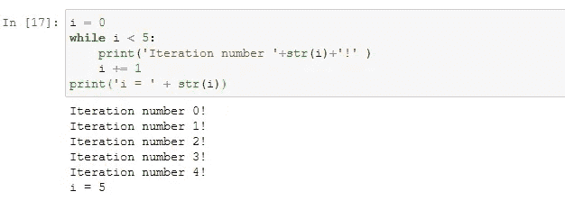
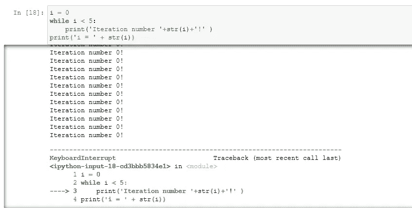
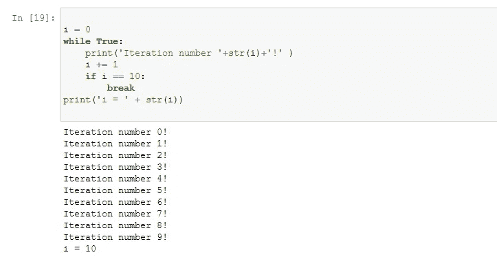
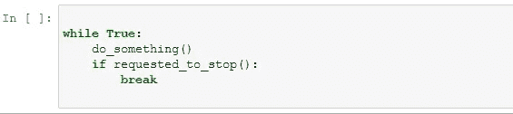
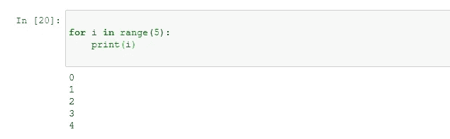
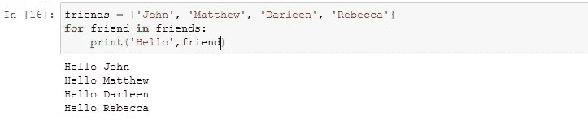
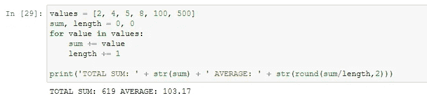
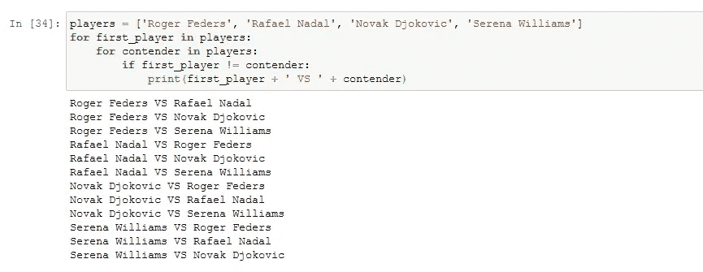
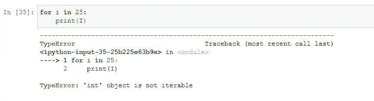
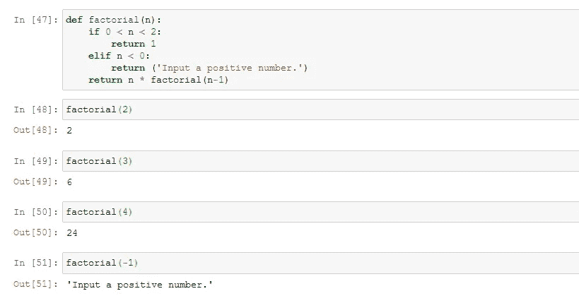

# 用一篇文章理解 Python 中的循环

> 原文：<https://towardsdatascience.com/understand-loops-in-python-with-one-article-bace2ddba789?source=collection_archive---------1----------------------->

## 读完这篇文章后，Loops 再也不会把你扔进 Loop 了

照片由 [**克里斯蒂娜·莫里洛**](https://www.pexels.com/@divinetechygirl?utm_content=attributionCopyText&utm_medium=referral&utm_source=pexels) 发自 [**像素**](https://www.pexels.com/photo/python-book-1181671/?utm_content=attributionCopyText&utm_medium=referral&utm_source=pexels)

> 计算机擅长一遍又一遍地执行重复性任务，因为它们永远不会“感到无聊”或出错。一个简单的计算请求计算机可以执行一次或一千次，第一个结果将与最后一个结果一样准确。这是人类无法保证的。

能够将日常任务的自动化委托给计算机是一项无价的技能，每个程序员都应该掌握这项技能，以提高他们的编码技能和代码准确性。

在循环的帮助下，可执行的任务数量从**将文件复制到网络上的一组计算机**、**向某些用户发送个性化电子邮件**或 ***验证进程是否仍在运行*。**

## 不管任务有多复杂，你说多少次，计算机就会执行多少次，更重要的是，这让你有更多的时间去从事更有趣的活动。

在 Python 中，循环可以通过三种方式实现:

*   ***While*循环**
*   ***为*循环**
*   **递归**

在本文中，我将解释这些技术，考虑到每一种技术采用的方法略有不同。你将学习如何编写代码，以及如何理解何时使用一种技术而不是其他技术。

# 目录:

> 1.While 循环(4 分钟读取)
> 
> 2.对于循环(4 分钟读取)
> 
> 3.递归(3 分钟读取)

# 1.While 循环

该技术指示计算机**根据条件**的值连续执行代码。它以关键字 *while、*开头，后跟要计算的比较，然后是一个冒号。下一行是要执行的代码块，向右缩进。类似于一个 *if* 语句，只有当比较结果为真时，才会执行主体中的代码。

> 然而，当循环分开时，设置*的原因是**只要评估语句为真**，代码块就会继续执行。一旦语句不再为真，循环将退出，下一行代码将被执行。*

看看下面的例子:

让我们仔细检查这个循环中的每一行代码:

1.  在第一行中，我们将值 0 赋给以单词“iteration”命名的变量**“I”**。为了给变量一个初始值，这个动作叫做“初始化”。
2.  在那之后的行中，我们开始了*而*循环。我们为这个循环设置了一个条件，即“ **i** ”必须小于 5。现在，“ **i** ”是 0，因为它刚刚被初始化，所以这个条件当前为真。
3.  在接下来的两行中，我们有一个向右缩进的块。在这里，我们可以使用 Python 函数共有的特性，这表明共享相同数量缩进空间的每一行代码都将是函数体的一部分，或者在本例中是循环。
4.  循环体中有两行。在第一行中，我们打印一条消息，后跟当前迭代，由值“ **i** ”表示。在第二行中，“ **i** 的值递增。我们通过在它的当前值上加 1 并将其赋回“ **i** ”来实现这一点。所以在第一次执行循环体之后，“ **i** ”将会是 1 而不是 0。

## 因为这是一个循环，所以计算机不会继续执行脚本中的下一行。相反，它会循环回去，重新评估 *while* 循环的条件。

因为这里的 1 仍然小于 5，所以它再次执行循环体。**计算机将继续这样做，直到条件不再为真**。在本例中，当“I”不再小于 5 时，条件将为假。一旦条件为假，循环结束，执行下一行代码。

# 避免无限循环陷阱

照片由 [Grooveland 设计](https://unsplash.com/@groovelanddesigns?utm_source=unsplash&utm_medium=referral&utm_content=creditCopyText)在 [Unsplash](https://unsplash.com/s/photos/circles?utm_source=unsplash&utm_medium=referral&utm_content=creditCopyText) 上拍摄

如前所述， *while* 循环使用条件来检查是否从循环结构中退出。 *while* 循环的主体需要确保被检查的条件将会改变。如果不改变，循环可能永远不会结束，我们会得到所谓的**无限循环**，一个不断执行且永不停止的循环。

以下面的代码为例。和前面的例子一样，我们初始化了“ **i** 变量**，但是忘记在循环中添加一个索引来在每次迭代中刷新变量**。因此，循环将一直运行，直到我们用 *CTRL+C* 命令手动中断它:

为了避免这个问题，花点时间考虑一个变量可以取的不同值是个好主意。这有助于确保循环在迭代过程中不会被卡住。

# 你应该总是试图避免无限循环吗？

虽然您需要小心无限循环，但它们并不总是坏事。

> 有时你实际上希望你的程序持续执行，直到某些外部条件被满足。

如果您在 Linux 或 macOS 系统上使用过 *ping* 实用程序，或者在 Windows 系统上使用过 *ping-t* ，您会看到一个无限循环。这个工具会一直发送数据包，并将结果打印到终端，除非你给它发送中断信号，通常是按 *Ctrl+C* 。

在 Python 中，我们通常使用关键字 *break* *，*创建带有**自动指示的循环来中断迭代，您可以在下面的代码中看到，这表示当前循环应该停止运行:**

正如您所看到的，所指示的过程是为每次迭代将变量“I”加 1，直到它达到值 10，这时它应该中断该过程。代码的逻辑应该是这样的:

# 2.对于循环

一个 *for* 循环遍历一系列值。 *for* 循环的一个非常简单的例子是迭代一系列数字，例如从 0 到 4。

注意这个结构有点类似于循环时*的结构。第一行表示*关键字的区别*，以冒号结尾。循环体向右缩进，就像在 *while* 循环、 *if* 块和函数定义中一样。这种情况下不同的是我们在*中有了关键词*。*

此外，在关键字的*和*关键字的*之间，我们有一个变量的名称，在本例中“I”代表“index”。该变量将接受循环遍历的序列中的每个值。所以在这个例子中，它将遍历使用 *range()* 函数生成的数字序列。*

> 提醒一下，在 Python 和许多其他编程语言中，默认情况下，一系列数字将以值 0 开始。此外，生成的数字列表将比给定值小 1。在这个简单的例子中，“I”取值为 0、1、2、3 和 4。

# 在本文的这一点上，你可能会疑惑:为什么有两个看起来做同样事情的循环？

for 循环的强大之处在于，我们可以用它来迭代任意类型的值序列，而不仅仅是一系列数字。例如，我们可以迭代字符串或单词列表:

循环的*迭代的序列可以包含任何类型的元素，而不仅仅是字符串。例如，我们可以迭代一系列数字来计算总和以及平均值。*

在这个例子中，我们定义了一个值列表。之后，我们初始化两个变量，一些和长度，它们将在循环的*主体中更新。在*循环的*中，我们遍历列表中的每个值，将当前值加到值的和中，然后将长度加 1，计算列表中有多少个元素。一旦我们完成了整个列表，我们就打印出总数和平均值。*

> 每当我们想要迭代任何序列的元素并对它们进行操作时，我们将在示例中继续使用 for 循环。

# 如何确定使用哪个循环？

如果你想知道什么时候应该使用*进行*循环，什么时候应该使用*而 l* 哎呀，有一种方法可以告诉你:

*   当有一个**元素序列需要迭代**时，使用*进行*循环。
*   当**想要重复一个动作直到条件改变时，使用 *while* 循环。**

如果在循环时，无论你想做什么都可以用*代替*或*来完成，就用你最喜欢的那个。*

# 提升你的循环技能:嵌套循环

基本上，**嵌套循环**是另一个循环中一个或多个 *for* 循环。例如，假设你要准备一场网球锦标赛的时间表，我们最喜欢的四名选手将互相比赛。

为了准备我们的时间表，让我们用 Python 脚本对球员进行排序，该脚本将输出所有可能的比赛配对。为此，名字的顺序很重要，因为对于每场比赛，第一个名字将是一个玩家，第二个名字将是竞争者。当然，**我们不想做的是有一个玩家和自己作对。**为此，我们需要使用一个**条件来确保我们只在名称不同时打印配对。**

如您所见，嵌套循环对于解决某些问题非常有用，例如在锦标赛中对球员进行排序。

# 循环的常见错误

1.  **遍历非序列:**正如我已经提到的， *for* 循环遍历序列。因此，Python 的解释器将**拒绝迭代单个元素**，比如整数或者不可迭代的对象。
2.  **初始化变量失败。**确保循环条件中使用的所有变量在循环前都已初始化。
3.  **意外的无限循环。**确保循环体修改了条件中使用的变量，这样循环将最终针对变量的所有可能值结束**。**
4.  **忘记了不包括范围的上限()。**

作为第一个场景的实际例子，让我们尝试迭代一个整数:

这个问题有两种解决方案，这取决于我们要做什么:

*   如果你想从 0 到 25，那么我们使用*范围*功能。
*   如果你试图迭代一个只有 25 个元素的列表，那么它必须是一个列表。

# 3.递归

递归是 Python 中除了*循环遍历一系列值的第三种机制，而*和*用于*循环。

虽然递归是软件工程中非常常见的技术，但它在自动化任务中并不常用。尽管如此，了解它还是很有价值的，因为您可能会在别人的代码中遇到它，或者更重要的是，您可能会面临递归是解决它的最佳方式的问题。

> 递归是对较小的问题重复应用相同的过程。

这些方法的一个很好的视觉例子是俄罗斯套娃:

图片来自 [**cottonbro**](https://www.pexels.com/@cottonbro?utm_content=attributionCopyText&utm_medium=referral&utm_source=pexels) 来自 [**Pexels**](https://www.pexels.com/photo/2-blue-and-yellow-ceramic-owl-figurines-4966171/?utm_content=attributionCopyText&utm_medium=referral&utm_source=pexels)

正如你可能看到的，每个娃娃里面都有一个更小的娃娃。当你打开娃娃，发现里面有一个更小的娃娃时，你继续往前走，直到你碰到那个打不开的最小的娃娃。递归让我们通过将问题简化来解决复杂的问题。

假设我们想知道总共有多少个娃娃，我们需要循环遍历每个娃娃，直到找到最后一个，然后计算我们打开了多少个娃娃。这就是递归在起作用。

> 在编程中，递归是一种通过函数调用自身来完成重复任务的方法。递归函数通常用修改后的参数调用自己，直到达到特定的条件。这种情况称为基本情况。

在俄罗斯娃娃的例子中，最小的娃娃将是*基础案例*。让我们尝试一个现实生活中的问题，其中我们将尝试编写一个计算数字阶乘的函数。在数学中，正整数 *n* 的阶乘，用 *n 表示！*，是所有小于等于 *n* 的正整数的乘积:

正如您在上面的代码中所看到的，函数 *factorial()* 调用自身来求解大于 1 的数字的阶乘。每次执行该函数时，它都用一个较小的数字调用自己，直到它到达*基例*。一旦它到达*基本情况*，它就返回值 1。这个循环将继续下去，直到第一个 *factorial()* 函数返回期望的结果。

## 您可能想知道，如果我可以只使用 for 或 while 循环，为什么我们还需要递归函数？

因为在使用递归函数时，一些特定问题的解决方案更容易编写和理解。例如，对于试图自动化任务的 IT 专家来说，递归将是检查计算机目录的有用工具，因为每个目录都包含包含文件的子目录。

*基本情况*是一个没有子目录的目录。对于这种情况，该函数将只返回文件的数量，但是对于剩余的子目录，它将调用递归函数。当操作递归结构时，使用递归函数通常比 for 或 while 循环更容易。

> 重要的是要指出，在某些语言中，你可以使用最大数量的递归调用。在 Python 中，默认情况下，可以调用递归函数 1000 次，直到达到极限。这对于子目录或类似的递归结构来说很好。

# 结论

在这篇文章中，我解释了如何告诉计算机重复做一个动作。Python 给了我们三种不同的方法来执行重复的任务: *while* 循环，*用于*循环，*递归*。

*For* 当你想要迭代一个已知的元素序列，但是当你想要在某个条件为真的情况下操作时，循环是最好的选择。

如果你喜欢这篇文章中的信息，不要犹豫，联系我分享你的想法。它激励我继续分享！

# 深入了解 Python 编程的相关文章:

## **创建股票价格模拟器:**

 [## 用 Python 创建股票价格模拟器

### 几何布朗运动过程的简单应用来模拟股票价格。

towardsdatascience.com](/create-a-stock-price-simulator-with-python-b08a184f197d) 

## 了解如何用 Python 编写令人惊叹的可视化代码:

 [## 用 Python 实现商业智能可视化

### 我准备了一份详尽的指南来展示漂亮的可视化效果，以增强度量、KPI、预测和其他…

towardsdatascience.com](/business-intelligence-visualizations-with-python-1d2d30ce8bd9) 

## 用 Python 分析纽约的数据:

 [## Airbnb 租房——使用 Python 分析纽约

### 发现最方便的租赁方式，以便继续实施具有良好可视化效果的数据分析。

towardsdatascience.com](/airbnb-rental-analysis-of-new-york-using-python-a6e1b2ecd7dc) 

感谢您花时间阅读我的文章！如果您有任何问题或想法要分享，请随时联系我的[电子邮件](http://herrera.ajulian@gmail.com)，或者您可以在以下社交网络中找到我以了解更多相关内容:

*   [**领英**](https://www.linkedin.com/in/juli%C3%A1n-alfredo-herrera-08531559/) **。**
*   [**GitHub**](https://github.com/Jotaherrer) **。**