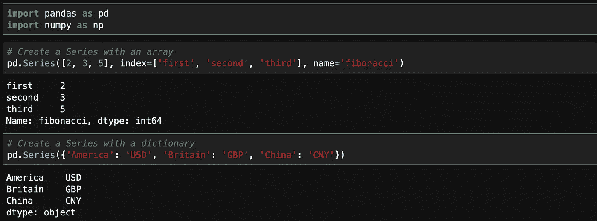
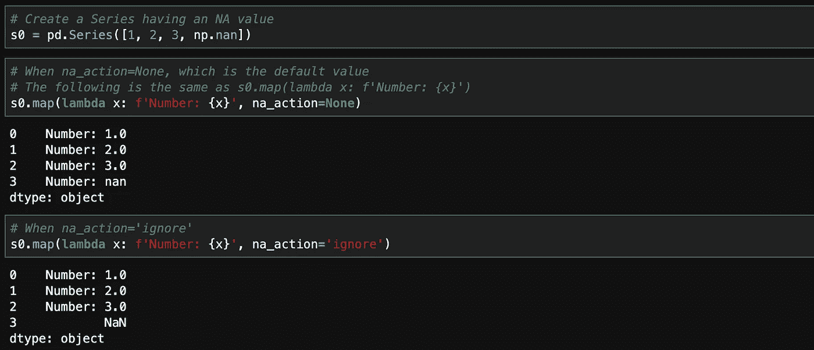
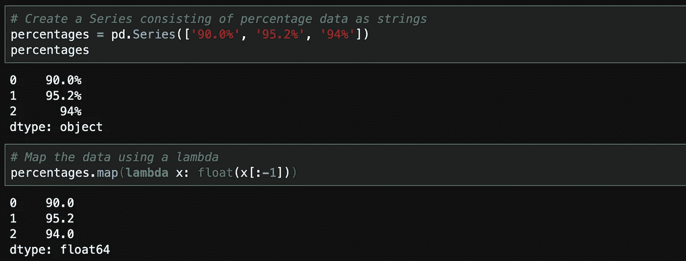
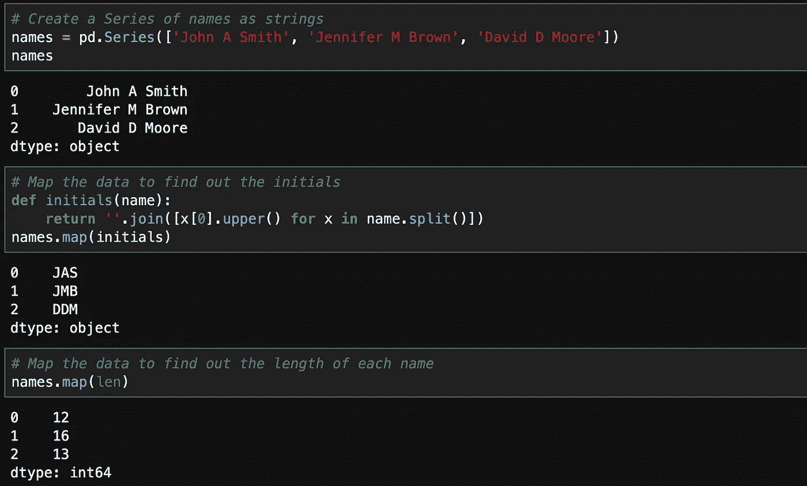
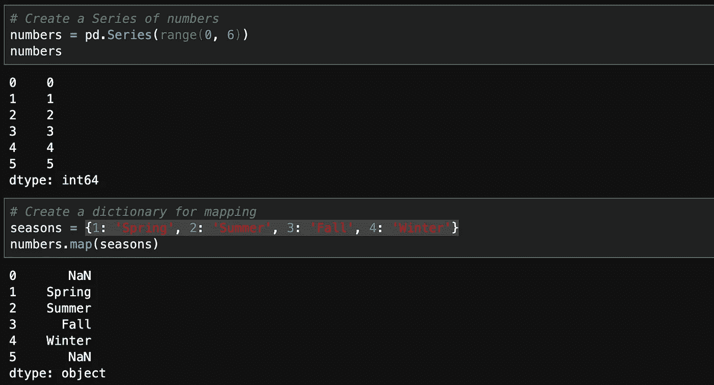
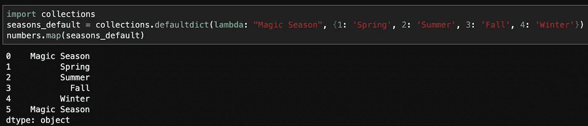

# 理解 map()函数操纵熊猫系列

> 原文：<https://towardsdatascience.com/understand-map-function-to-manipulate-pandas-series-8ac340d514f7?source=collection_archive---------3----------------------->

## 熊猫基础知识

## 了解使用 map()函数将数据转换为所需格式的基本原理

照片由[艾米丽·莫特](https://unsplash.com/@emilymorter?utm_source=medium&utm_medium=referral)在 [Unsplash](https://unsplash.com?utm_source=medium&utm_medium=referral) 上拍摄

当我们处理真实世界的数据时，数据集很少或者很可能从来没有为我们的分析目的准备好确切的格式。因此，数据处理阶段的一个重要步骤是将数据从原始的不良格式转换成便于分析的格式。

除了处理缺失数据和异常值，另一个重要的数据转换过程是数据映射。最初作为一个数学概念，映射是从一组现有值创建一组新值的过程，通常是一对一的。作为数据科学研究中最受欢迎的 Python 库之一，pandas 库为我们提供了操作*系列*数据的`map()`函数。一旦您很好地理解了`map()`函数，我们就可以在以后的文章中继续研究另一个更强大的数据操作函数`apply()`。

# 熊猫*系列*

在 pandas 中，*系列*是一个类似一维数组的对象，包含一系列值。这些值中的每一个都与一个标签相关联，该标签被称为*指数*。我们可以通过传入一个类似数组的对象(例如 list)或一个字典来创建一个序列。下面是一些常见的例子。

熊猫系列

在上图中，我们首先使用列表创建了一个系列。如果我们不设置可选的`index`参数，序列将使用从 0 开始的默认整数索引。`name`参数也是可选的。当它被指定时，它成为系列的名称。

我们还使用字典创建了一个系列，字典的值构成了系列的值。这些键自动成为系列的索引。

# map()的基本语法

`map()`函数的语法如下:`Series.map(self, arg, na_action=None)`。如你所见，这个函数的调用者是一个熊猫系列，我们可以说`map()`函数是一个系列对象的实例方法。想了解更多关于函数中`self`参数的内容，可以参考我之前的文章。

 [## 在 Python 中解开自我的 4 个秘密

### 在 Python 中使用 self

medium.com](https://medium.com/better-programming/unlock-the-4-mysteries-of-self-in-python-d1913fbb8e16) 

# `na_action`论证

`na_action`参数用于指定我们如何处理`NaN`值。该参数的默认选项是`None`，使用它将原始数据中的 NA 值传递给映射函数(即`arg`参数)。该参数的另一个选项是`‘ignore’`，使用它不会对原始数据中的 NA 值执行任何操作。

以下示例显示了这两个选项在处理序列中最后一个数据点(即安娜值)方面的差异。当`na_action`为`‘ignore’`时，映射函数不会尝试对 NA 值做任何事情，并将映射值设置为`NaN`。相反，当`na_action`为`None`时，映射函数将使用 NA 值(即`nan`)来创建映射值(即`Number: nan`)。

“无”和“忽略”的区别

# 数据转换(arg 参数)

map()函数有趣的部分主要是关于我们如何使用`arg`参数。具体来说，`arg`参数向函数给出了如何将现有数据映射到新数据的指令。该参数可以设置为函数或字典。让我们来看看它们是如何工作的。

## 使用 Lambda 函数

实际上，在上面关于`na_action`选项的例子中，您看到我们使用了 lambda 函数来映射数据。如果你不知道什么是 Python lambda 函数，请参考我之前关于这个主题的文章。

 [## Python 中 Lambdas 的 4 大误用

### 使用 Python lambdas 的最佳实践

medium.com](https://medium.com/better-programming/the-top-4-misuses-of-lambdas-in-python-e419f426b74f) 

简言之，lambda 函数被称为匿名函数，它们的基本语法是`lambda arguments: expression`。具体来说，声明由关键字`lambda`表示，后面是参数列表(0 个或更多)，以及指定对这些参数执行什么操作的表达式。

为了给你一个关于 lambda 函数的更实际的用例，让我们考虑下面的例子。在现实生活中的数据，我们可能有百分比数据表示为字符串。我们可以编写一个 lambda 函数，将字符串数据转换为数字数据，这是一种更便于分析的格式。

map()中的 Lambda 函数

在上面的例子中，我们获取原始数据的值，并使用切片技术获得一个子串。相关知识点是字符串中最后一个字符的索引为-1。所以表达式`x[:-1]`将创建一个从原始字符串的开始到最后一个字符的字符串(不包含)。

## 使用常规函数

除了使用 lambda 函数，我们还可以使用内置或自定义的函数。这些函数需要能够映射系列中的每个数据点，否则将会出现错误。

map()中的内置函数和自定义函数

在上图中，我们首先创建了一个由姓名列表组成的序列。第一项任务是为这些人创建姓名首字母。为此，我们编写了一个名为`initials()`的函数。这个函数接受序列的值。我们使用列表理解技术来创建每个名字的首字母列表，并连接这些字母来创建最终输出作为映射值。如您所见，映射后，新系列包含所有人的姓名首字母。

除了使用自定义函数，我们还可以使用一些内置函数来生成新的系列。例如，在上面的代码中，我们可以简单地使用`len()`函数，它将计算新系列中名称的长度(包括空格)。

## 使用字典

在大多数情况下，我们应该能够为`arg`参数设置一个如上的函数来满足我们的需求。然而，我们也可以使用字典作为映射函数，尽管我们不经常使用它。这是这种用法的一个简单例子。

地图中的字典()

如上所示，我们创建了一个从 0 到 4 的整数序列。然后我们创建了一个字典，它有从 1 到 4 的键，这个字典被用作`map()`函数调用的`arg`参数。

需要注意的一点是，如果在字典中没有找到这些值，那么映射的值将是`NaN`。但是，我们可以使用`defaultdict`数据类型来代替`dict`数据类型(关于`defaultdict`的更多信息，请参考我的[上一篇文章](https://levelup.gitconnected.com/dictionary-data-types-in-python-more-than-just-dict-a9ff84d38738))。在这种情况下，`NaN`值将被从`defaultdict`对象生成的默认值替换。有关此功能，请参见以下示例。

map()中的 Defaultdict

# 在你走之前

数据操作是预处理数据的重要步骤。Pandas 系列可以看作是更加灵活和强大的 DataFrame 对象的构建块。因此，了解`map()`函数的使用可以方便你对 DataFrame 数据的操作，关于这一点，我们可以在后面进行更多的讨论。

感谢阅读。用于本教程的笔记本可以在 [GitHub](https://github.com/ycui1/medium_series_map.git) 上找到。

## 关于作者

我写关于 Python 和数据处理与分析的博客。以防你错过了我之前的一些博客。以下是与本文相关的几篇文章的链接。

 [## 提升 Python 编码水平的 30 个简单技巧

### 更好的 Python

medium.com](https://medium.com/better-programming/30-simple-tricks-to-level-up-your-python-coding-5b625c15b79a)  [## 掌握 Python 中列表理解的 9 件事

### 本教程将帮助你学习 Python 中列表理解的最常见用法

medium.com](https://medium.com/better-programming/9-things-to-know-to-master-list-comprehensions-in-python-8bc0411ec2ed)  [## 为什么在做其他事情之前应该首先可视化数据的 3 个简单原因

### 我们大脑处理的 90%的信息是视觉信息，我们大脑处理视觉信息的速度比…

towardsdatascience.com](/3-simple-reasons-why-you-should-first-visualize-data-before-doing-anything-else-63ec05d86d9)