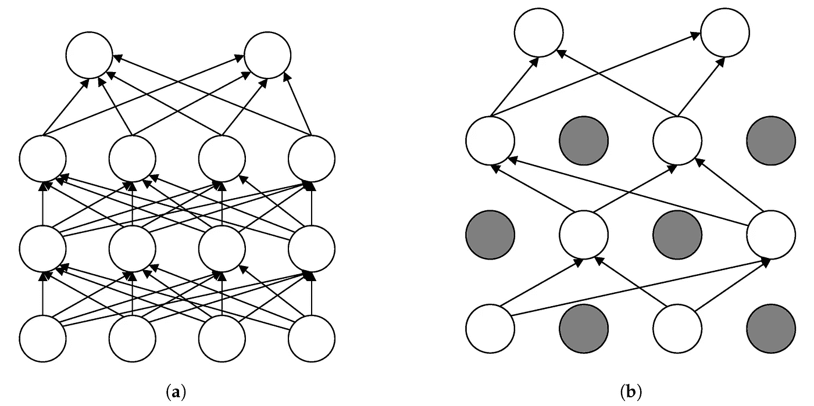
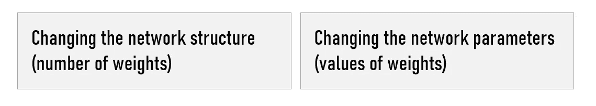
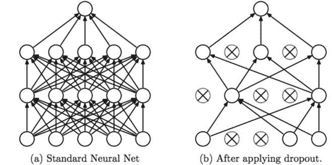
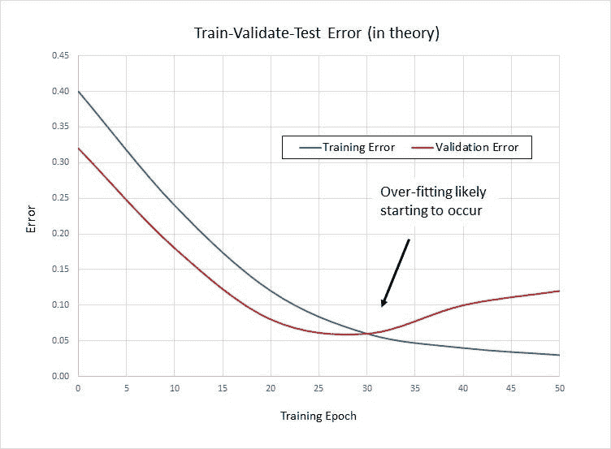
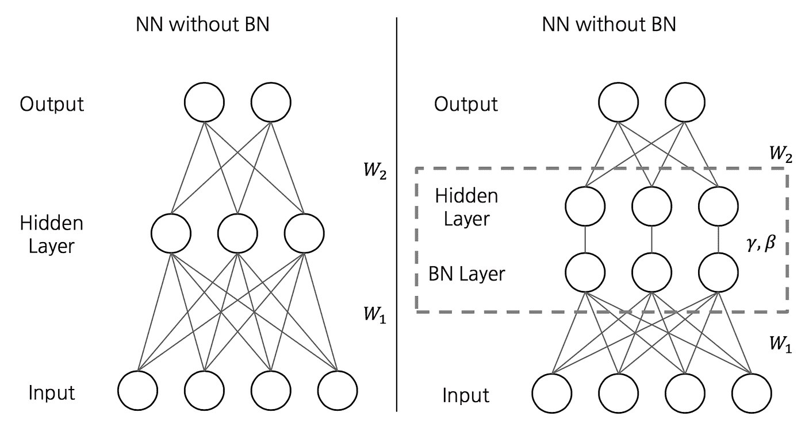
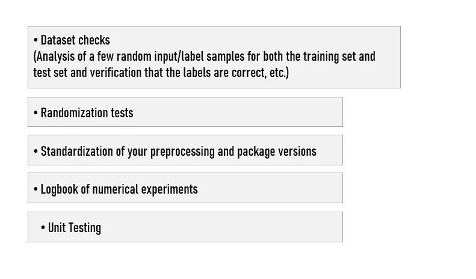

# 理解神经网络和模型泛化

> 原文：<https://towardsdatascience.com/understand-neural-networks-model-generalization-7baddf1c48ca?source=collection_archive---------16----------------------->

## 深度神经网络的模型泛化、过拟合和正则化方法的挑战

[来源](https://www.mdpi.com/1996-1073/12/6/995/htm)

在几个与神经网络相关的人工智能项目之后，我意识到模型的归纳能力是人工智能项目成功的核心。我想写这篇文章来帮助读者理解如何通过正则化方法来优化模型的性能，并更好地理解交付基于神经网络的可靠和可扩展的人工智能解决方案的复杂性。

> **泛化是一个用来描述模型对新数据做出反应的能力的术语。**

泛化是你的模型经过训练消化新数据并做出准确预测后的能力。这可能是你的人工智能项目中最重要的元素。模型的概括能力是人工智能项目成功的关键。事实上，我们担心的是，一个模型在训练数据上训练得太好了，但却无法推广。

因为这个原因，我们经常达不到生产阶段…当给定新数据时，它会做出不准确的预测，使模型无用，即使它能够对训练数据做出准确的预测。**这叫过度拟合。**

> 相反的情况也可能发生。**欠拟合**是指模型在数据上没有得到足够的训练。在拟合不足的情况下，它使模型变得毫无用处，并且它不能做出准确的预测，即使使用训练数据也是如此。

在所有人工智能项目中，我们在现有数据上建立我们的模型，并希望它们能够完美地适应(推广)新数据。在监督学习中，我们拥有过去的数据，包括所有预测值和我们希望预测的真实值。尽管定义业务问题、收集相关数据、清理和准备数据以及构建模型都具有挑战性并且非常耗时……但另一个挑战仍然存在— **如何知道模型是否会很好地预测未来？**

> **训练一个可以很好地推广到新数据的深度神经网络是一个具有挑战性的问题。**

就神经网络而言，正则化是一种对学习算法进行轻微修改的技术，以便模型更好地推广。反过来，这也提高了模型在不可见数据上的性能。

# 模型复杂性

从商业角度来看，深度神经网络的主要优势是，随着数据集越来越大，它们的性能会不断提高。当公司试图创造数据网络效果时，这是非常有趣的。

然而，一个几乎有无穷多个例子的模型最终会达到网络学习能力的极限。**适当的正则化是更好的泛化性能的关键原因，因为深度神经网络通常过参数化，并且可能遭受过拟合问题。**

我们可以通过以下方式降低神经网络的复杂性，从而减少过拟合:

减小模型的容量可以降低模型过度拟合定型数据集的可能性，使其不再过度拟合。

通过保持较小的网络权重来减少过拟合的技术被称为**正则化方法**。

> 正则化:一类添加额外信息以将不适定问题转化为更稳定的适定问题的方法。

下面，我列出了几种我们经常使用的正则化方法(**其他方法确实存在**比如权重约束或者活动正则化)。然而，减少过度拟合的最简单的方法是从本质上**限制**你的模型的容量。

根据我的经验，这种方法是迄今为止最有效的正则化技术。在网络中的两个连续层之间应用 Dropout。在每次迭代中，关键思想是从神经网络中随机删除单元(以及它们的连接)。这导致后续层依赖于**其与前一层的所有**连接。**这种方法通过防止训练数据上复杂的共同适应来帮助对抗过度适应。**

全连接(FC)层最容易过度拟合，因为它们包含的参数最多。应该对这些层应用断开(影响它们与下一层的连接)。除了标准形式的辍学，还有几种辍学的变化，旨在进一步提高泛化性能。比如自适应退学，退学率由另一个神经网络动态决定…

然而，我注意到，如果你使用 CNN，dropout 现在不太常用了。反而看到越来越多的数据科学家使用**批量归一化。**当你拥有庞大的数据集时，批量规范化比丢弃更有效。

**噪声** 一种常见的正则化类型是在训练期间注入噪声:向神经网络的隐藏单元添加或乘以噪声。通过在训练深度神经网络时允许一些不准确性，不仅可以提高训练性能，而且可以提高模型的准确性。

根据 [Jason Brownlee](https://machinelearningmastery.com/train-neural-networks-with-noise-to-reduce-overfitting/) 的说法，训练中最常见的噪声类型是将高斯噪声添加到输入变量中。添加的噪声量(如扩散或标准偏差)是一个可配置的超参数。太少的噪声没有效果，而太多的噪声使得映射函数太难学习。请确保在评估模型期间，或者在使用模型对新数据进行预测时，没有添加任何噪声源。

**提前停止**
提前停止是一种交叉验证策略，我们保留训练集的一部分作为验证集。实际上，当我们看到验证集的性能越来越差时，我们会停止对模型的训练。

换句话说，这种方法试图在开始对噪声建模之前，在估计器已经学会从数据中提取所有有意义的关系时，尽早停止估计器的训练阶段。

这是通过监控验证损失(或另一个验证度量)并在该特定度量停止改善时结束训练阶段来实现的。通过这样做，我们给了估计器足够的时间来学习有用的信息，但是没有足够的时间从噪声中学习。

[信号源](https://visualstudiomagazine.com/articles/2015/05/01/train-validate-test-stopping.aspx)

我对这种方法的问题是，不能保证在任何给定的时间点，模型不会再次开始改善。比提前停止更实际的方法是存储在验证集上实现最佳性能的模型的权重…

**迁移学习**
这种方法是通过将您的网络的权重初始化为另一个具有相同架构的网络的权重来完成的**在大型通用数据集上进行预训练**。**我们经常在计算机视觉项目中使用这种方法。**当我们的业务问题没有太多数据时，它对我们帮助很大，但我们可以找到另一个有数据的类似问题。在这种情况下，我们可以使用**迁移学习**来减少过拟合。

**批量标准化** 批量标准化(BN)是一种标准化网络输入的技术，适用于前一层的激活或直接输入。这种方法允许网络的每一层都能够独立于其他层进行学习。BN 用于通过调整和缩放激活来标准化输入层。

> 批量标准化(BN)是一种标准化深度神经网络中间层激活的技术。

除了具有正则化效果之外，批处理规范化还在其他方面帮助您的模型(允许使用更高的学习率等)。).我建议您验证各图层的权重和偏差分布看起来近似标准正态。

由于 BN 有一种正规化的效果，这也意味着你可以经常取消辍学(这是有帮助的，因为辍学通常会减慢训练)。

> 在训练期间，我们随着神经网络的权重和偏差更新批量标准化参数。对批处理规范化的一个更重要的观察是，批处理规范化作为一种规范化，因为使用小批处理显示出随机性。

> **批量** =一次正向/反向传递中训练样本的数量。批量越大，需要的内存空间就越大。

**数据增强。处理过度拟合的另一种方法是提高数据质量。你可能会想到**异常值/噪声**去除，然而，实际上，它们的效率相当有限。另一种有趣的方式(特别是在图像相关的任务中)是**数据增强**。目标是随机转换训练示例，以便在模型看来它们不同时，它们传达相同的语义信息。就我个人而言，当我看到我的模型在训练集上接近 0 损失时，我开始考虑使用数据增强。**

# 建议

我建议在考虑正则化方法之前先经历一些基本步骤。事实上，大多数时候，我们不能确定对于每个学习问题，都存在一个可学习的神经网络模型，它可以产生尽可能低的泛化误差。

## 正确的期望

首先要找到一个好的参考，它会告诉你，在你的数据集上，或者在你能找到参考的最相似的数据集上，存在一个可以达到你所寻找的泛化误差的架构。在您在自己的数据集上进行训练之前，尝试在这些参考数据集上再现这样的结果是一件有趣的事情，这是对您所有基础设施都已正确就位的测试。

## 培训程序验证

检查你的训练程序是否正确也很重要。这些检查包括以下内容:

## 超参数/架构搜索

最后，理解正则化本身并不一定意味着您的概化误差会变小，这一点很关键:模型必须具有足够大的容量才能实现良好的概化属性。**这通常意味着，在你看到正规化的好处之前，你需要一个足够深的关系网。**

如果没有其他帮助，您将不得不测试多个不同的超参数设置(贝叶斯优化可能会有所帮助)或多个不同的架构变化。

关于这个话题的更多信息，我推荐这些链接:

-
-[https://machineellingmastery . com/train-neural-networks-with-noise-to-reduce-over fitting/](https://machinelearningmastery.com/train-neural-networks-with-noise-to-reduce-overfitting/)
-[https://towardsdatascience . com/batch-normalization-in-neural-networks-1ac 91516821 c](/batch-normalization-in-neural-networks-1ac91516821c)
-[https://papers . nips . cc/paper/5032-adaptive-dropout-for-training-deep-neural-networks](https://papers.nips.cc/paper/5032-adaptive-dropout-for-training-deep-neural-networks.pdf)