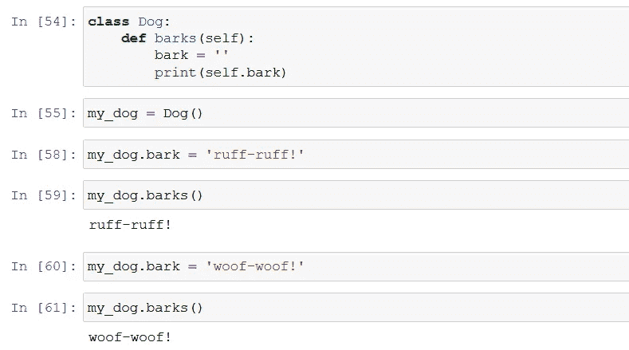

# 用一篇文章理解 Python 中的 O.O.P

> 原文：<https://towardsdatascience.com/understand-o-o-p-in-python-with-one-article-bfa76f3ba48c?source=collection_archive---------0----------------------->

## 深入面向对象编程以增长您的 Python 知识，重点关注真实世界的概念和类表示。

照片由 [**克里斯蒂娜·莫里洛**](https://www.pexels.com/@divinetechygirl?utm_content=attributionCopyText&utm_medium=referral&utm_source=pexels) 发自 [**像素**](https://www.pexels.com/photo/woman-typing-on-macbook-pro-1181281/?utm_content=attributionCopyText&utm_medium=referral&utm_source=pexels)

> 软件中的另一个技巧是通过使用已经编写好的部分来避免重写软件，这就是所谓的组件方法，这种方法的最新术语是所谓的面向对象编程。——比尔·盖茨。

比尔·盖茨的这句话说明了这篇文章的目的。理解面向对象编程允许你开发一种思考和实现代码的方式，我的目标是让它对你来说非常简单。毕竟，我们编码的主要原因之一，或者至少想学习如何编码，是为了自动化日常任务。正如微软的联合创始人所说，O.O.P .是实现这一目的的一种手段。

# 目录:

> 1.面向对象编程介绍(3 分钟阅读)
> 
> 2.定义新类别(3 分钟阅读)
> 
> 3.实例方法(1 分钟读取)
> 
> 4.定义构造函数和其他特殊方法(2 分钟阅读)
> 
> 5.代码重用(2 分钟读取)

# 1.面向对象编程简介

为了开始理解这种编程技术背后的直觉，让我们看一个初始的例子。想象一下，你必须向一个从未见过汽车的人描述一辆汽车，你会怎么做？

由 [vaea 加里多](https://unsplash.com/@vaea?utm_source=unsplash&utm_medium=referral&utm_content=creditCopyText)在 [Unsplash](https://unsplash.com/s/photos/old-mustang?utm_source=unsplash&utm_medium=referral&utm_content=creditCopyText) 上拍摄的照片

你可能想开始说它是一种用于运输的轮式机动车辆。你也可以说有几个品牌的汽车制造公司，它们生产不同类型的汽车来满足不同的需求。在一个更基本的层面上，你可能会说它有四个轮胎，在大多数情况下，它们可以承载五个人，并且它们主要用于运输人员，而不是货物。

当向计算机解释这是什么类型的物体时，用类似的方式接近它是一个好主意。计算机并不知道汽车是什么，为什么要制造汽车，或者谁在使用汽车。如果你想让你的计算机正确理解这个物体，在这个例子中是一辆汽车，你必须清楚地解释哪些是它的*属性*。

为了让计算机更容易理解这些新概念，Python 使用了一种叫做**面向对象编程**的编程模式，使用类和对象对概念进行建模。这是一个灵活、强大的范例，其中类表示和定义概念，而**对象是** **类**的实例。在汽车示例中，我们可以创建一个名为 *car* 的类，向计算机定义其特征。我们将能够创建那个类 *car* 的数千个*实例*，它们是那个类的单个对象。

面向对象编程的想法可能听起来抽象而复杂，但是如果你已经编写了任何软件，你可能已经使用了对象，甚至没有意识到这一点。**Python 中几乎所有的东西都是对象**，所有的数字、字符串、列表和字典都包含在这种类型的元素中。面向对象编程的核心概念归结为与类型相关联的**属性**和**方法**:

*   属性是与类型相关的特征。
*   **方法**是与类型相关联的函数。

在汽车示例中，颜色和品牌是与程序创建的每个实例或汽车相关联的两个属性。另一方面，方法可以是由汽车执行的动作，例如驾驶。一个更面向计算机的例子是目录中的文件，因为每个文件都有名称、大小和创建日期。

如上图所示，当我们像刚才一样使用 **type** 函数时，Python 会告诉我们值或变量属于哪个类。由于**整数**和**字符串**是类，它们有一堆与之相关的属性和方法。您可以使用 Python 中的 **dir** 函数访问类的属性和方法，如下所示:

在我之前关于字符串的文章中，我探索了 string 类的许多方法和属性。看看它，进一步了解如何处理字符串对象，在这种情况下，它将是字符串类的另一个**实例**。这意味着它们都有相同的方法，尽管字符串中的内容不同。

## 为什么会有一堆以双下划线开头和结尾的方法？

这些被称为**特殊方法**，它们通常不会被冠以那些奇怪的名字。相反，它们由一些内部 Python 函数调用。例如， **__len__** 方法由 **len** 函数调用。

如果你想知道一个特定的方法做什么，你应该使用**帮助**功能:

当我们对任何变量或值使用 **help** 函数时，我们正在访问相应类的所有文档。在这种情况下，我们正在查看 **str** 和 **int** 类的文档。

> 尽管 Python 为我们提供了许多预定义的类，但是当我们用自己的属性和方法定义自己的类时，面向对象编程的威力就显现出来了。

# 2.定义新类别

如前所述，面向对象编程的要点是以计算机理解的方式帮助定义现实世界的概念。让我们动手以汽车为例构建一个新的类:

让我们来阐明准则的具体内容:

*   在 Python 中，我们使用 **class** reserved 关键字告诉计算机我们正在开始一个新的类。我们在后面加上类名和冒号。Python 风格指南建议类名应该以大写字母**开头**。在我这里，这个类叫做*车*。
*   在带有类定义的那一行之后是类的主体，按照[循环或函数](/understand-loops-in-python-with-one-article-bace2ddba789?source=your_stories_page-------------------------------------)的模式向右缩进。
*   我们将在本文的第四部分讨论特殊方法 **init** 和 **repr** 。

我们如何扩展汽车类别的定义？它可能具有相同的属性，代表我们想要与汽车相关联的信息，如品牌和颜色。

现在，让我们继续创建 Car 类的一个实例，并将它赋给一个名为“my_car”的变量。为了创建任何类的新实例，我们调用类名，就像调用函数一样:

如您所见，我将 brand 和 color 作为参数传递，因为我已经配置了我的类，在创建该类的新对象时需要这两项。因此，我们可以调用创建的实例的属性，并接收先前分配的值:

> 用于访问属性的语法称为**点符号**，因为表达式中使用了点。点符号让你可以使用该物体可能拥有的任何能力，例如商标或颜色。

一些对象的属性和方法可以是其他对象，并且可以有自己的属性和方法。例如，我们可以使用 upper 或 capitalize 方法来修改我的实例的两个字符串属性:

到目前为止，我们已经创建了 Car 类的一个实例，并设置了它的属性。现在，我们可以创建具有不同属性的类的新实例:

# 3.实例方法

本质上，调用方法是为了让对象做一些事情。比如**上**和**大写**为弦。学习 O.O.P .中方法直觉的关键是理解**方法是对类**的特定实例的属性进行操作的函数。当我们在字符串上调用 **lower** 方法时，我们将特定字符串的内容变成小写。

让我们通过创建一个名为 **Dog** 的新类并定义我们自己的方法来更深入地了解一下。首先，我们需要定义这个类，并创建它的一个实例，就像我们之前对 Car 类所做的那样。虽然我的狗可能很棒，但只要我不为它们定义方法，它就不能执行任何动作。看一下这个例子:

如图所示，我们必须开始用 **def** 关键字定义一个方法，就像我们定义一个函数一样，并且将方法体向右缩进，就像我们定义一个函数一样。

> 该函数正在接收一个名为“self”的参数。此参数表示正在其上执行该方法的实例。

即使我的狗叫，它也总是用同样的方式。我们可以通过简单地修改代码来改变它的运行方式，以便在我们为类配置的属性和方法中获得灵活性:

# 4.定义构造函数和其他特殊方法

到目前为止创建的两个类都包含默认值作为属性和方法。这不是一个理想的场景，因为它为每个属性创建了冗余的代码，更重要的是，**因为它很容易忘记设置一个重要的值**。

因此，在编写代码时，最好在创建类时设置随实例变化的属性和方法，以确保每个实例包含相同的重要属性。为了做到这一点，**我们需要使用一个叫做构造函数**的特殊方法。

> 类的构造函数是当你调用类名时调用的方法。它总是被命名为 **init** 。

它包含关键字 self，它指的是正在创建的实例，以及在实例创建后将由程序员作为属性传递的参数，就像我们在下面的示例中所做的那样:

该类的第二个方法是 **repr** 方法，它告诉 Python 在每次调用该类的一个实例时打印一条预定的语句，如上图所示。

**想知道哪个是具体方法的功能？**参考之前介绍的**帮助**功能。由于内置的类包含了帮助用户理解每个方法或属性背后的直觉的指南，我们也可以在我们自己的类、方法和函数上这样做。我们可以通过添加一个**文档字符串**来实现。

> Docstring 是解释某事的简短文本。

一旦将文档包含到类和对象中，您将获得更多关于所创建方法的信息，这将促进代码的可重用性并帮助其他用户理解它。请记住，docstring 必须始终在它所记录的块的同一级别缩进。

# 5.代码重用

面向对象编程的另一个重要方面是**继承**。就像人有父母、祖父母等等一样，对象也有祖先。继承的原则允许程序员在概念之间建立关系，并将它们组合在一起。特别是，这允许我们通过一般化我们的代码来减少代码重复。

例如，除了我们已经创建的汽车，或者除了我的狗之外的其他宠物，我们如何定义“**其他交通工具”**的表示？这种分组特性允许我们创建共享现有类的一些属性(但不是全部属性)的其他类，以便在不重写现有代码的情况下添加其他类似的实例。

在 Python 中，我们在类声明中使用括号来显示一个**继承关系**。在上面的运输示例中，我使用 Python 的语法告诉计算机汽车和火车都继承自 MyTransports 类。因此，它们自动具有相同的构造函数，用于设置颜色和品牌属性。

通过继承技术，我们可以使用 *transportation* 类来存储适用于所有可用传输方式的信息，并将汽车或火车的特定属性保存在它们自己的类中。您可以将 MyTransports 类视为父类，将 Car 和 Train 类视为兄弟类。

与您在 IT 部门执行的任务更接近的一个例子是处理您公司员工的系统。您可能有一个名为*雇员*的类，该类可能具有诸如人员的*全名*、公司系统中使用的*用户名*、雇员所属的*组*等属性。系统还可以有一个经理类，它也是一个雇员，但是有与之相关的附加信息，比如向特定经理报告的雇员。

# 结论

在 python 这样的面向对象语言中，现实世界的概念是由类来表示的。类的实例通常被称为对象。这样的对象有用来存储关于它们的信息的属性，我们可以通过调用它们的方法使对象工作。这篇文章的目的是让您清楚地了解 O.O.P .对程序员来说有多有用，因为它允许我们对现实世界的概念进行建模。

感谢您花时间阅读我的文章！如果您有任何问题或想法要分享，请随时通过我的[电子邮件](http://herrera.ajulian@gmail.com)联系我，或者您可以在以下社交网络中找到我以了解更多相关内容:

*   [**LinkedIn**](https://www.linkedin.com/in/juli%C3%A1n-alfredo-herrera-08531559/)**。**
*   [**GitHub**](https://github.com/Jotaherrer) **。**

## 如果您对更深入了解 Python 编程的更多相关文章感兴趣，请考虑以下内容:

# 理解 Python 中的循环:

 [## 用一篇文章理解 Python 中的循环

### 读完这篇文章后，你将不再有机会被 Loops 抛出。

towardsdatascience.com](/understand-loops-in-python-with-one-article-bace2ddba789) 

# 用 Python 创建惊人的可视化效果:

 [## 用 Python 实现商业智能可视化

### 我准备了一份详尽的指南来展示漂亮的可视化效果，以增强度量、KPI、预测和其他…

towardsdatascience.com](/business-intelligence-visualizations-with-python-1d2d30ce8bd9) 

# 创建股票价格模拟器:

 [## 用 Python 创建股票价格模拟器

### 几何布朗运动过程的简单应用来模拟股票价格。

towardsdatascience.com](/create-a-stock-price-simulator-with-python-b08a184f197d) 

# 使用 Python 的电子商务数据科学:

 [## 使用 Python 的电子商务数据科学

### 我为电子商务行业准备了一份广泛的数据科学应用指南。

towardsdatascience.com](/data-science-for-e-commerce-with-python-a0a97dd7721d)