# 了解熊猫指数

> 原文：<https://towardsdatascience.com/understand-pandas-indexes-1b94f5c078c6?source=collection_archive---------28----------------------->

## 为了有效地使用 Pandas，请忽略它的文档并了解索引的真相

Damian Patkowski 在 [Unsplash](https://unsplash.com?utm_source=medium&utm_medium=referral) 上拍摄的照片

Python Pandas 库是一个很好的数据操作工具。然而，只有当你理解熊猫索引时，它才是有效的。Pandas 索引是在几秒钟而不是几分钟或几小时内访问和连接行的关键。

# 指数

像 Python 字典(或关系数据库的索引)一样，Pandas 索引提供了一种将键转化为值的快速方法。例如，我们可以创建一个索引为`alpha`的数据帧:

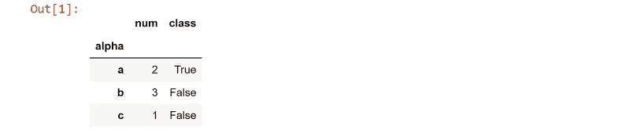

然后将键`b`转到感兴趣的行。

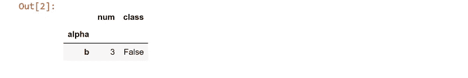

但是熊猫指数是一个什么样的东西呢？文档说索引是一个

> 不可变 n 数组实现一个有序的、可切片的**集合**(增加了*重点*)

换句话说，一种数学集合。回想一下，数学集合有两个重要属性:

*   没有重复的元素
*   元素是无序的

但是现在，看第二个例子:

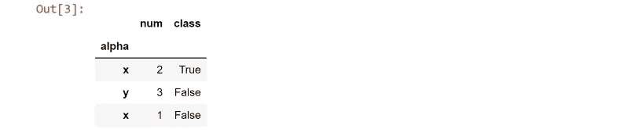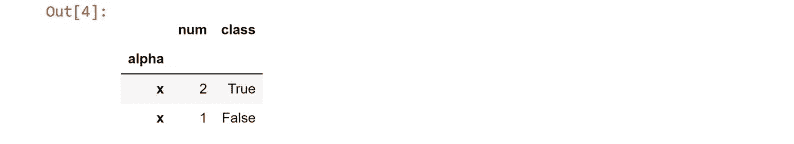

我们又把`alpha` 栏目变成了索引。然而，元素`x`出现了两次，检索到的行遵循两个`x`的顺序。

*   元素可以重复
*   元素是有序的

因此，与熊猫文献相反，熊猫指数不是一个数学集合。取而代之的是一种**列表**。具体来说，熊猫指数是

*   可散列元素的(一种)列表，其中
*   可以快速找到元素的位置。

有了这些知识，我们可以很容易地理解索引的基础，从它们的创建、删除和操作开始。

# 操纵索引

上面的例子展示了如何用`.set_index()`将一个列转换成索引。我们可以用`.reset_index()`将索引变回列:

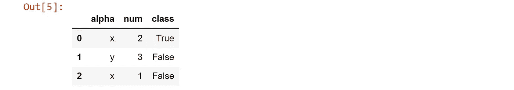

让我们把索引放回去，然后看看索引中的所有元素。属性为`.index.values`。正如所料，元素是一种列表，具体来说，是一个 NumPy 数组。

我们还希望能够快速找到对应于任何索引元素的行号。方法是`.index.get_loc()`。结果将是一个整数或布尔数组，具体取决于行数。

# 行访问

访问带有索引元素的行的主要方法是`.loc[…]`(注意方括号)，其中的输入可以是:

*   单一元素
*   元素列表
*   元素切片

行将按照它们在输入中出现的顺序输出。这个例子展示了每一种输入。

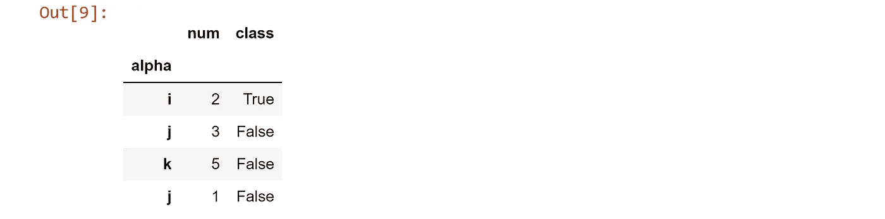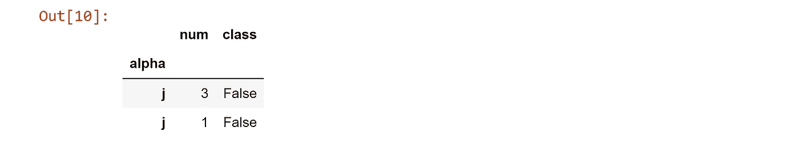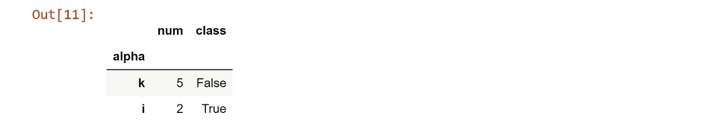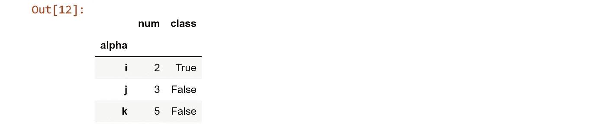

注意，与 Python 的其他部分不同， *start:stop* 片段包含了 *stop* 值。

# 连接行

最后，让我们看看连接两个数据框架。规则是:

*   左边的数据帧不需要索引，但是右边的需要。
*   在连接的`on`输入中给出感兴趣的左列。

在这个例子中，我们将使用`join`向 dataframe 添加一个“score”列。这是左边的数据框。它没有索引。

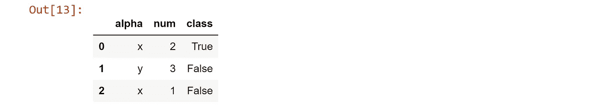

正确的数据帧需要一个索引，但它可以被命名为任何名称。在这里我们称之为`alpha2`。

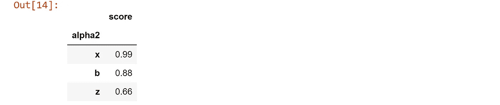

我们用左连接将两个数据帧结合起来。我们使用第一个数据帧中的列`alpha`和第二个数据帧中的索引。结果是一个带有分数列的新数据帧。

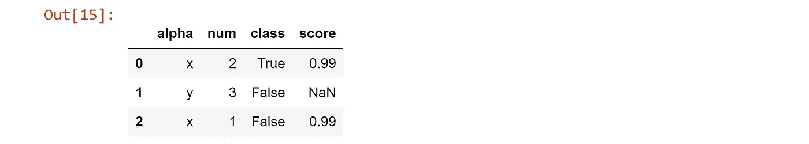

# 结论

我们已经看到，与文献相反，熊猫指数不是一个数学集合。相反，它是一种可以快速找到任何元素位置的列表。

理解了这一点，就很容易理解如何创建、删除和操作索引。然后，我们可以使用索引来快速访问和连接行。

下一步是什么？有了这个基础，接下来您应该学习从多个列创建索引，对索引应用类似集合的操作符，以及有效地删除行。(令人惊讶的是，熊猫分组排序不需要也不使用索引。)