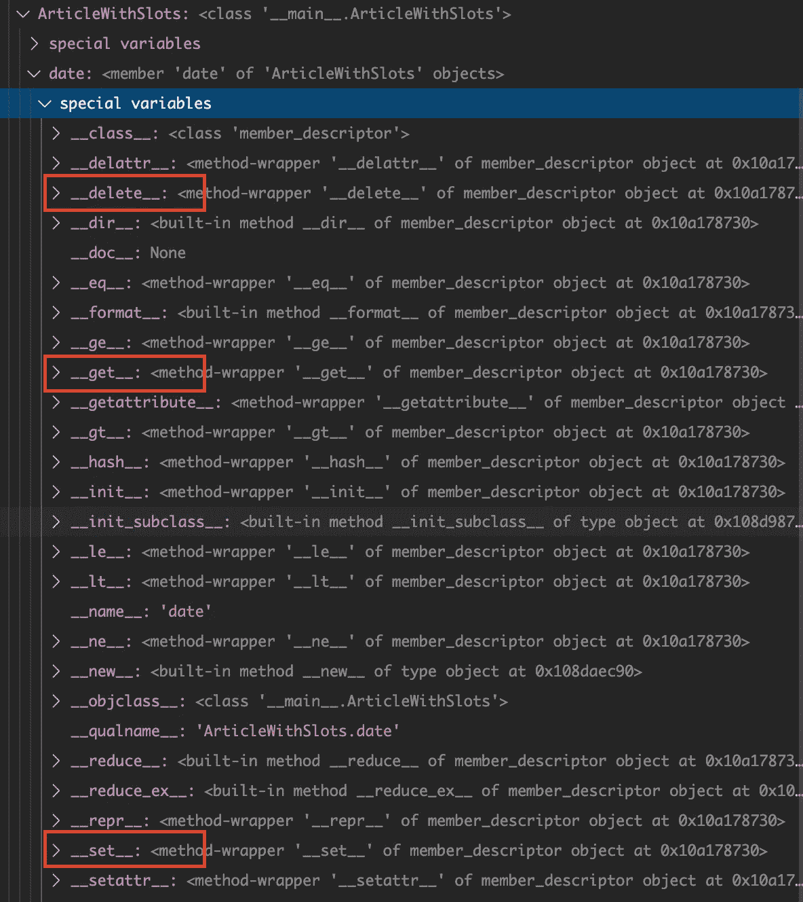
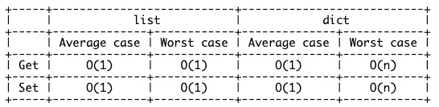

# 了解 Python 中的 __slots__。

> 原文：<https://towardsdatascience.com/understand-slots-in-python-e3081ef5196d?source=collection_archive---------4----------------------->

## 改进 Python 代码的简单方法

[m](https://unsplash.com/@ms88) 在 [Unsplash](https://unsplash.com/) 上拍照

当我们从一个类中创建一个对象时，该对象的属性将被存储在一个名为`__dict__`的字典中。我们使用这个字典来获取和设置属性。它允许我们在创建对象后动态地创建新的属性。

让我们创建一个简单的类`Article`，它最初有两个属性`date`和`writer`。如果我们打印出对象的`__dict__`，我们将得到每个属性的键和值。同时，我们也打印出以后需要的类的`__dict__`。之后，一个新的属性`reviewer`被添加到对象中，我们可以在更新后的`__dict__`中看到它。

[without_slots.py](https://gist.github.com/highsmallxu/0882068a8787e83ccf6ad9eb00bcd3a9)

## 够好吗？

在我们找到更好的解决方案之前，我们不能说这不好。Dictionary 在 Python 中非常强大，但是在创建成千上万的对象时，我们可能会面临一些问题:

1.  字典需要记忆。数百万个对象肯定会耗尽内存。
2.  字典实际上是一个哈希表。hash map 中 *get/set* 的[时间复杂度](https://wiki.python.org/moin/TimeComplexity)最坏情况为 O(n)。

## __ 插槽 _ _ 解决方案

> 来自 [Python 文档](https://docs.python.org/3.8/reference/datamodel.html#object.__slots__) : __slots__ 允许我们显式**声明数据成员**(如属性)和**拒绝 __dict__** 和 __weakref__(除非在 __slots__ 中显式声明或在父代中可用。)

那么，这和我提到的问题有什么关系呢？

让我们创建一个类`ArticleWithSlots`。两个类之间的唯一区别是额外的字段`__slots__`。

[with-slots.py](https://gist.github.com/highsmallxu/c2bdcea4352e462a0bff3b4dc5369ac7)

`__slots__`是在**类级别**上创建的，这意味着如果我们打印`ArticleWithSlots.__dict__`，我们应该能够看到它。此外，我们还看到了类级别上的两个额外属性，`date: <member 'date' ..>`和`writer: <member 'writer' ..>`，它们属于类 [member_descriptor](https://docs.python.org/3/howto/descriptor.html#id1) 。

[with_slots_dict.py](https://gist.github.com/highsmallxu/7c84804c435261e05447d5608d7a8c44)

**Python 中的描述符是什么？**

在讨论描述符之前，我们应该理解 Python 中访问属性的默认行为。当你执行`article.writer`时，Python 将调用方法`__getattribute__()`，在`__dict__`、`self.__dict__["writer"]`中进行查找并返回值。

**如果查找键是具有描述符方法之一的对象，那么默认行为将被描述符方法覆盖。**

ArticleWithSlots 类的屏幕截图

描述符方法包括`__get__()`、`__set__()`和`__delete__()`。描述符只是一个 Python 对象，它实现了至少一个描述符方法。

`__slots__`通过描述符方法的实现，自动为每个属性创建一个描述符。你可以在截图中找到它们。意味着对象将使用`__get__()`、`__set__()`和`__delete__()`与属性交互，而不是默认行为。

据[吉多·范·罗苏姆](http://python-history.blogspot.com/2010/06/inside-story-on-new-style-classes.html)，`__get__()`，`__set__()`的实现用数组代替字典，完全用 C 实现，效率高。

## __slots__ 具有更快的属性访问速度

在下面的代码中，我比较了`Article`和`ArticleWithSlots`的对象创建时间和属性访问时间。`__slots__`快 10%左右。

[比较时间. py](https://gist.github.com/highsmallxu/301d118202f34cb678a6836bb92f338a)

`__slots__`有稍微好一点的性能是因为[**的时间复杂度**](https://wiki.python.org/moin/TimeComplexity)***的 get/set* 操作在最坏的情况下比一个链表中的字典要快。由于`O(n)`只发生在最坏的情况下，我们大多数时候不会注意到差异，尤其是当你有少量数据的时候。**

数据来源:[wiki.python.org](https://wiki.python.org/moin/TimeComplexity)

## __slots__ 减少了 RAM 的使用

由于属性可以作为数据成员(比如属性)来访问，所以没有必要将它们存储在字典`__dict__`中。其实，`__slots__`根本就否定了`__dict__`的创作。所以如果打印`article_slots.__dict__`，会得到 AttributeError 异常。

这种行为减少了对象的 RAM 使用。我将使用 [pympler](https://pypi.org/project/Pympler/) 比较`article`和`article_slots`的大小。不使用`sys.getsizeof()`的原因是`getsizeof()`不包括被引用对象的大小。但是，`__dict__`是一个被引用的对象，在`getsizeof()`中将被忽略。

[getsizeof vs pympler](https://gist.github.com/highsmallxu/ecdb5a0bec2f3bb094f45c6c851458c4)

原来`article_slots` **比**节省 50%以上的内存。哇，如此惊人的进步！

[ram 使用比较. py](https://gist.github.com/highsmallxu/d5cd7231b77073e0932feb6f1b5fe840)

这么好的性能是因为`article_slots`没有`__dict__`属性，实际上节省了很多内存。

## 什么时候使用和不使用 __slots__？

到目前为止，看起来`__slots__`是一个非常好的特性。能不能每节课都加？

答案是否定的！显然，有一些权衡。

***固定属性***

使用`__dict__`的原因之一是它在创建对象后的灵活性，在这里你可以添加新的属性。然而，`__slots__`将在您创建类时修复属性。因此，以后不可能添加新的属性。

[fix_attributes.py](https://gist.github.com/highsmallxu/46410c04cfb576bdaba6ef1f6634006f)

但是…

在某些情况下，你想利用`__slots__`，也有在运行时添加新属性的灵活性。你可以通过在`__slots__`中添加`__dict__`作为属性来实现。只有新添加的属性会出现在`__dict__`中。当您的类有 10 个以上的固定属性，并且您希望以后有 1 个或 2 个动态属性时，这将非常有用。

[slots_dict.py](https://gist.github.com/highsmallxu/6d3fb9393122f88c040219131e57c445)

***继承***

如果你想继承一个包含`__slots__`的类，你不必在子类中重复这些属性。否则，子类会占用更多的空间。此外，重复的属性在父类中将是不可访问的。

[继承 _ 插槽. py](https://gist.github.com/highsmallxu/6d3fb9393122f88c040219131e57c445)

当您继承一个命名的元组时，情况也是如此。你不需要在子类中重复属性。如果你想了解更多关于 NamedTuple 的信息，你可以阅读[我的文章](/understand-how-to-use-namedtuple-and-dataclass-in-python-e82e535c3691)专门讨论这个话题。

[继承 _ 命名 _ 元组. py](https://gist.github.com/highsmallxu/a7acb19869d7867c92736f42277eb5de)

你也可以在子类中添加`__dict__`属性。或者，你不把`__slots__`放在子类中，它默认会有`__dict__`。

[继承 _ 插槽 _ 字典. py](https://gist.github.com/highsmallxu/e1b606f4528639d52d53a75768ce19c9)

如果你继承了一个没有`__slots__`的类，那么子类将包含`__dict__`。

[继承 _ 字典. py](https://gist.github.com/highsmallxu/a4c568a423bace0ed24c0bc694dfb253)

## 结论

希望你已经理解了什么是`__slots__`以及实现的一些细节。在文章的最后，我想分享来自我自己的经验和互联网的利弊(链接在参考资料中)。

*优点*

当您对内存使用有压力时,`__slots__`绝对有用。只需一行代码就可以非常容易地添加或删除。在`__slots__`中将`__dict__`作为一个属性的可能性给了开发人员更多的灵活性来管理属性，同时兼顾性能。

*缺点*

你需要清楚你在做什么，你想用`__slots__`实现什么，特别是当用它继承一个类的时候。继承的顺序、属性名称会对性能产生巨大的影响。

不能用非空的`__slots__`继承`int`、`bytes`、`tuple`等内置类型。此外，你不能给`__slots__`中的属性赋予默认值。这是因为这些属性应该是描述符。相反，您可以在`__init__()`中指定默认值。

[slots_error.py](https://gist.github.com/highsmallxu/f03ef70361b9abd9cbe625a3fb547f25)

我希望你喜欢这篇文章！如果你有任何想法，请在下面留下你的评论。

## 参考

 [## __slots__ 的用法？

### 特殊属性 __slots__ 允许您显式地声明您希望对象具有哪些实例属性…

stackoverflow.com](https://stackoverflow.com/questions/472000/usage-of-slots)  [## 新型课堂的内幕

### 警告，这篇文章很长，而且非常专业。]从表面上看，新型的类看起来非常类似于…

python-history.blogspot.com](http://python-history.blogspot.com/2010/06/inside-story-on-new-style-classes.html)  [## 时间复杂性- Python Wiki

### 本页记录了当前 CPython 中各种操作的时间复杂度(也称为“Big O”或“Big Oh”)。其他…

wiki.python.org](https://wiki.python.org/moin/TimeComplexity)  [## 3.数据模型- Python 3.8.3 文档

### 对象是 Python 对数据的抽象。Python 程序中的所有数据都由对象或关系来表示…

docs.python.org](https://docs.python.org/3/reference/datamodel.html#slots)