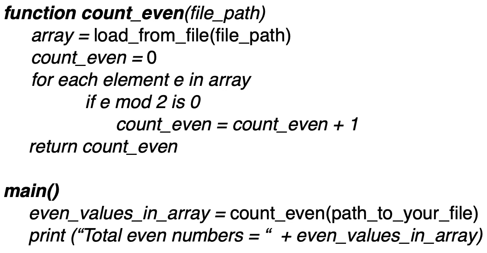
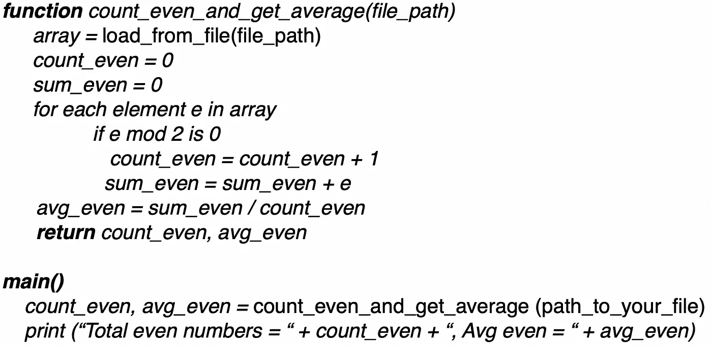
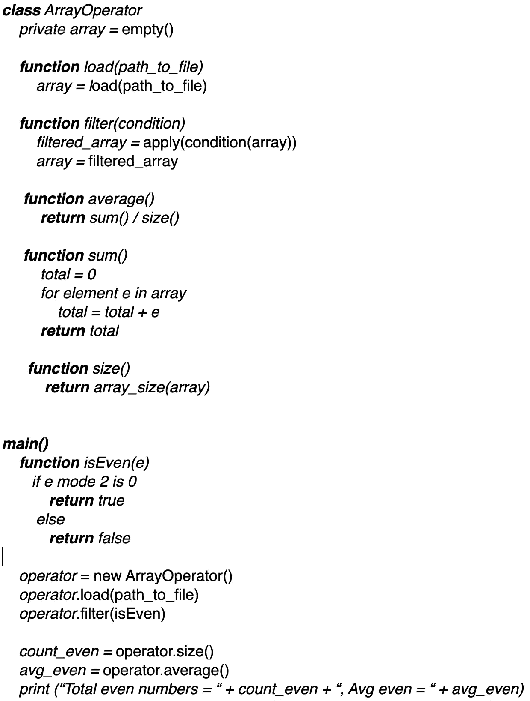
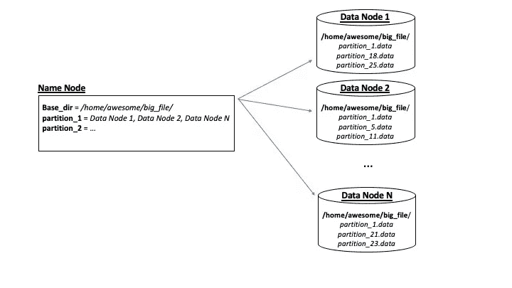
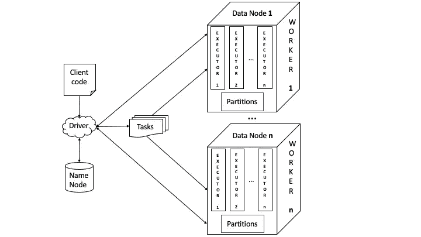
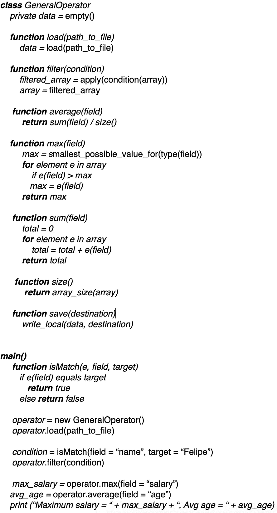
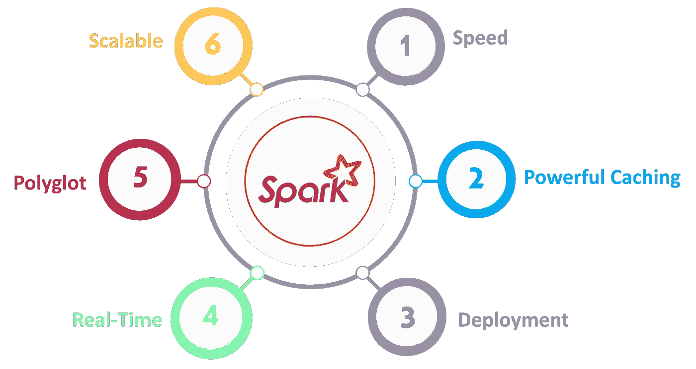

# 理解火花，就好像是你设计的一样

> 原文：<https://towardsdatascience.com/understand-spark-as-if-you-had-designed-it-c9c13db6ac4b?source=collection_archive---------15----------------------->

## 从简单的功能到灵活的分布式框架。

**为什么关心星火？**

在当前数据领域可用的框架中，就采用和交付而言，只有少数几个达到了 Spark 的地位。框架已经成为明显的赢家之一，特别是在数据工程领域。

如果你正在看这篇文章，说明你已经明白了前一段背后的原因，所以我们直接跳到正题。

**为什么关心 Spark 内部？**

有人可能会说，我们不必为了驾驶汽车而去理解发动机是如何工作的，这是事实。然而，有人可能会说，了解发动机会让你成为一名更好的飞行员，因为你能够了解整辆车的能力、局限性和最终问题。

根据同样的原理，您不必理解 Spark 的内部机制就可以使用它的 API。但是，如果您这样做了，从低性能到隐藏的 bug 的许多痛苦将会减轻。此外，你将掌握贯穿整个分布式系统领域的概念。

**进场**

在我看来，学习有两种方式:知识和技术。前者与正规的知识获取有关，通过书本、结构化课程等。它更关注于*什么。*后者与工艺有关，而“边做边学”则更侧重于*如何。这就是我们现在要走的路。*

我们将从一个简单的问题开始，每个初学者都可以解决这个问题，并对其进行改进，以证明 Spark 的架构设计是正确的。在这个过程中，我们还将了解 **HDFS** (部分称为 Hadoop)，因为它是一个与 Spark 配合得非常好的平台。

我们将是语言不可知的，所以所有的代码实际上都是伪代码。

**问题**

你被录用了，并被分配了一个简单的任务:*数一数你的数组中有多少个偶数。*

您将从本地文件系统中存储的 CSV 文件中读取该数组。不用想太多，你可能会得到下面的一大块:

**新要求 1**

你的客户对之前解决方案的巨大成功感到高兴，人们现在认为他们可以把每个问题都扔给你，所以他们要求你也计算这些偶数的平均值。

你肯定知道坚实的原则，特别是单一责任原则，它说一个类或方法应该只有一个改变的理由。然而，你决定打破规则，只是实现如下:

**新要求 2**

既然你这么快，人们又提出了另一个要求:*还要返回所有偶数的和。*

这时，你不仅开始考虑 T2 坚实的原则，也开始考虑事情的发展方式。你知道，通常，当一件事情发生一次并不意味着它会发生两次，但如果它发生两次，第三次就在眼前。所以你开始考虑实现一些更容易扩展的东西，你还记得*面向对象编程*中的封装概念。

此外，如果您捕获了适当的抽象，那么当另一个需求出现时，您甚至不必更改您的实现。

**一组抽象来管理它们**

你首先考虑到，如果他们让你数偶数，他们很可能会进一步问你奇数，或者低于或高于某个值，或者在某个范围内，等等。因此，即使你是应用 *YAGNI* ( *你不会需要它*)的专家，你也决定实现一些支持所有这些情况的东西。

最后，您得出结论，所有这些操作都与从数组中过滤值有关，因此，您没有对每个可能的过滤器进行编码，而是决定提供一个接受过滤条件的过滤函数。

此外，为了简化设计，您决定在每次对对象调用操作时更改对象的状态。

**迎接新的挑战**

你做到了。现在，您不仅实现了所有的需求，还摆脱了涉及从数组中过滤值的新需求。如果您的客户现在想要奇数，而不是偶数，他们唯一要做的就是向 *filter* 方法传递一个新条件，这样就完成了。太神奇了！但是，您等待的新需求刚刚到来:*他们现在需要您处理一个 3 TB 的阵列*。

你考虑放弃。你自己的硬盘只有 500 GB 大，所以你需要 6 台像你一样的机器专门用来存储那个文件。但你的客户喜欢你，也很有说服力，在理所应当的加薪后，他们还承诺为你提供不是 6 台而是 30 台新机器来解决问题。

**划分**

有了 30 台新机器，你开始考虑如何解决这个问题。一台机器不可能包含整个文件，所以你必须把它分割成更小的块，以适应每个新的硬盘。此外，您考虑到既然您有足够的资源，那么您也可以将同一个片存储在多台机器上，作为备份。也许每个切片有两份拷贝，这意味着你可以在三个不同的地方找到那个切片。

您格式化硬盘并开始复制文件，在此过程中，您认为将所有切片保存在每台机器的同一规范父文件夹中是一个好主意，并且为每个切片添加一个标识符前缀，该标识符与它属于更大文件的哪个部分相关。您还认为在至少两台计算机中有另一个目录也是一个好主意，该目录包含元数据，这些元数据说明哪些目录包含存储片，哪些计算机包含每个存储片 id 的备份。

因为你的一些机器只包含数据，一些只包含给事物指明方向和名称的元数据，你决定把前一个称为数据机器，后一个称为机器。但是因为您实际上是在创建一个网络，所以将机器称为节点更合适，所以您将数据机器命名为**数据节点**，将元数据机器命名为**名称节点**。

在给事物命名的过程中，你会意识到 slice 与蛋糕和奶酪的关联要大于与数据块的关联。你觉得很有灵感和创造力，所以你决定给这些切片取一个更好的名字:**分区**。所以，无论你的程序最终变成什么，它都会处理被分成分区的整个文件。

在所有这些命名和决定之后，您会得到这样的结果:

您的第一个分布式文件系统

**征服**

现在，您已经将文件划分为跨越一组节点的分区(从现在开始，我们将创造性地称之为**集群**)，备份和元数据帮助您的程序找到每个分区及其备份。既然移动分区没有任何意义，那么问题就变成了:*在每台机器上执行同一段代码并得到一个结果？*

每次需要运行程序时，是否应该将整个程序发送到每台机器上？或者你应该有一些已经存在的片段，这样你只需要发送你的客户写的部分？后者听起来更好，所以你跟着它走。在这个过程中，第一个要求是让您的 *ArrayOperator* 类在每台机器上都可用，并且只发送由 *main* 方法指定的部分。

您还希望在尽可能靠近数据的地方运行代码，因此您的数据节点也必须运行您的程序。从这个角度来看，节点不仅存储数据，还执行实际工作，因此您决定将它们称为 **workers** 。

代码的某些部分也可以并行运行。例如，对于上面的程序，您可以并行执行 *average()、*、sum() 和 *size()* ，因为它们彼此独立。为了实现这一点，您的工作人员需要支持独立的执行行，因此您决定将每个工作人员转换为某种守护进程，该守护进程将产生独立执行任务的新进程(同时，您意识到 **task** 是一个通用名称，足以指代可以独立执行的每个单元)。既然你仍然受到启发，你决定创造性地将执行任务的过程称为**执行者**。

现在，您所要做的就是设计您的 main 方法——它可以访问您的客户端代码——使它能够将您的客户端代码分离成将组成作业的任务，然后询问 name 节点哪些数据节点包含文件的每个分区，然后将任务并行发送到 worker 机器，worker 机器将准备启动将执行任务并返回结果的执行器。因为这段代码将驱动整个事情，你，仍然被同样的创造力所祝福，决定称它为**驱动**。

你的司机也需要知道如何把所有的结果放在一起。在这种情况下，它需要将从每个工人那里收到的所有总和加起来。但考虑到目前为止的进展，这只是小菜一碟。

总的来说，你的司机将会协调完成任务。这又是你的想象。哪个名称比**作业**更适合描述一组任务？

你美丽的工程作品

**造破**

几个晚上之后，你终于可以让所有的部分一起运行了。多么令人印象深刻的壮举！你测试它，一切都像预期的那样工作。你渴望看到一个演示，而你的客户在投入大量资金后，也同样渴望看到这个演示。

你通过表扬自己开始演示，这是应该的，然后继续解释架构。你的客户会更加兴奋。你运行程序。一切都崩溃了，因为你的 5 台机器离线了，2 台是因为内核崩溃，2 台是因为硬盘故障，还有 1 台是因为一个未测试的特性导致了一个错误。每个人都开始哭泣，除了你。你的客户失去了信心，但你的信心却坚如磐石。你实际上再次表扬了自己，因为你已经想通了所有的事情。这些备份并非出于巧合。

你保证一周后会有新的演示。你的客户离开的时候很生气，有点悲伤，但是你保持冷静。

**“少就是少，不是多”，***2020 年前后备份*

你猜对了。由于每个分区包含两个其他副本，并且您有 28 台机器(请记住，您为名称节点保留了 2 台)，如果 5 台机器的故障导致整个集群停机，您将非常不幸。

但是如何利用冗余呢？你可以确定的一件事是，它应该从驱动程序端开始，因为这是与所有节点通信的部分。如果您有一个失败的节点，它将首先被驱动程序注意到。由于在作业开始时，驱动程序已经与名称节点取得联系，以查找分区的位置，因此它可能还会向名称节点询问故障 worker/data 节点中所有副本的位置。有了这些信息，它只需重新发送要在副本上执行的任务，您就大功告成了！

使用前面的方法，您可以用一种**弹性**的方式让**分布式**处理分布式**数据**。

你去争取吧。

**重新开始**

你打电话给你的客户，要求一个新的演示。他们假装仍然很沮丧，但几乎无法掩饰他们的兴奋。他们来看你，进入这个地方说一些关于上次的笑话。你只看到“蓝屏”，却不太关心笑点。

在开始之前，您做了一些令人震惊的事情:您要求他们随机关闭两个工作人员/数据节点。他们看起来很惊讶，但进入了状态(看到他们带着奸诈的微笑随机选择机器，试图比你更聪明，这很有趣)。

少了两个节点，您就可以开始演示了，效果非常好。他们哭了，但这一次的眼泪不一样。他们让你振作起来，为不相信而道歉，给你加薪，当然，还带来了新的要求:*数组现在将包含具有多种属性的对象，而不是数字*。更具体地说，记录将包含姓名、年龄和工资，他们想知道被称为费利佩的人的平均年龄和最高工资是多少。他们还想保存结果，以便以后可以访问而无需重新处理。

你一点都不惊讶。

**蛋糕上的樱桃**

这个时候你不用多想。你一直在玩抽象，所以现在只需要再向上移动一级。

您偏离了之前的设计，并像这样进行了更改:

有了新的设计，您现在可以处理任何类型的记录(这就是为什么您将其名称改为 *GeneralOperator* )。

这真是太神奇了！想想吧。你有一个系统，可以以分布式和弹性的方式读取、写入和处理任何类型的数据集。更自由地说，你可以宣称你有一个支持处理任何种类的**弹性**和**分布式** **数据集**的框架。

你感觉到了掌握在你手中的力量，但是你认为你的魔法的核心 *GeneralOperator* 没有一个足够吸引人的名字。或者至少它不是非常自明的。但是你没有更好的想法，所以你决定称它为*弹性和分布式数据集读取器、写入器和处理器*。但是那太大了。所以可能是首字母缩写，比如 RDDRWP？哎哟，更惨。那只有 RDD 的**呢？容易发音和发音，以防有人请你翻译。听起来不错，你完成了。**

**TLDR；**

以下是您所做的工作:

1.您已经设计了一个以分布式方式存储复制数据的基础设施**分区**，它由保存数据的**数据节点**和包含元数据的**名称节点**组成(这一对难道不应该有自己的名称吗？那么 HDFS 呢？)

2.您创建了一个名为**弹性分布式数据集**(简称 **RDD** )的结构，可以读取、写入和处理存储在 Hadoop 集群中的数据。

3.您已经构建了一个基础架构，通过控制给定节点上的执行的**工作器**和实际执行任务的**执行器**，在分布式分区上并行执行**任务**。

4.您设计了一个**驱动程序**应用程序，它将客户提供的**作业**分解成多个**任务**，与命名节点对话以找出分区的位置，并将任务发送给远程工作人员。

伙计，你真棒！但是你的创造难道不应该有一个好听的名字吗？有太多的想法，一个接一个的火花。耶，**火花**！听起来像个名字！

你可以这样推销它

**按比例放大**

你创造的这个东西当然有很大的价值，但也许它有一个有点陡峭的学习曲线。另一方面，长期以来(可能太久了)，处理数据的语言选择是**结构化查询语言**，或者 **SQL** 。把这种能力带入你的火花怎么样？

让我们与客户聊天。

**重要的**

以上是 Spark 组件的一个非常简化的视图，其主要目的是提供对 Spark 架构的一个总体把握。与催化剂、调度、转换类型、洗牌、计划、资源分配、专门的 API 方法等相关的元素被有意省略，以使文本更简单。他们将在以后的作品中接触。

**进一步阅读**

关于 Spark:[https://data-flair . training/blogs/Apache-Spark-ecosystem-components/](https://data-flair.training/blogs/apache-spark-ecosystem-components/)

关于 rdd:[https://spark . Apache . org/docs/latest/rdd-programming-guide . html](https://spark.apache.org/docs/latest/rdd-programming-guide.html)

在 OOP 上:https://en.wikipedia.org/wiki/Object-oriented_programming

关于 S.O.L.I.D 原则:[https://scotch . io/bar-talk/S-o-l-I-d-first-first-five-principles of-object-oriented-design](https://scotch.io/bar-talk/s-o-l-i-d-the-first-five-principles-of-object-oriented-design)

https://martinfowler.com/bliki/Yagni.html[YAGNI](https://martinfowler.com/bliki/Yagni.html)