# 使用 Python 中的单变量和多变量图表和绘图理解数据

> 原文：<https://towardsdatascience.com/understand-the-data-with-univariate-and-multivariate-charts-and-plots-in-python-3b9fcd68cd8?source=collection_archive---------13----------------------->

## 学习一些使用 python 中的医疗数据来理解和可视化数据的技术

单变量数据分析是最简单的数据分析形式。顾名思义，它处理一个变量。它没有发现变量之间的因果或关系。单变量数据分析的目的是总结和描述一个数据或一个变量。如果包含两个变量，它就变成了二元变量。在本文中，我们将使用单变量和双变量数据分析来理解和可视化一些数据。在一些实践中，我们也将包括三个变量。所有的信息只适用于本文中使用的特定数据集。

## 了解数据集

我们将使用来自 [Kaggle](https://www.kaggle.com/johnsmith88/heart-disease-dataset) 的心脏数据集。首先导入包和数据集。

```
%matplotlib inline
import matplotlib.pyplot as plt
import seaborn as sns
import pandas as pd
from statsmodels import api as sm
import numpy as npdf = pd.read_csv("Heart.csv")
```

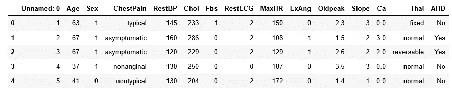

让我们清楚地看到列名:

```
df.columns
#Output:
Index(['Unnamed: 0', 'Age', 'Sex', 'ChestPain', 'RestBP', 'Chol', 'Fbs',        'RestECG', 'MaxHR', 'ExAng', 'Oldpeak', 'Slope', 'Ca', 'Thal', 'AHD'],       dtype='object')
```

你现在可能不明白每一列是什么意思。在这篇文章中，我将只使用几个列，并且我将继续解释列名的含义。

## 解决一些问题

1.  找出不同类型血液疾病的人口比例。

我们会在“Thal”栏中找到。在这里，“地中海贫血”是指一种叫做地中海贫血的血液疾病。Pandas 中有一个名为“value_counts”的函数，用于计算一个系列中每个类别的值。

```
x = df.Thal.value_counts()
x
```

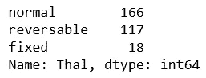

这些是患有正常、可逆和固定疾病的人数。现在，将它们分别除以总人口，得出人口比例。

```
x / x.sum()
```

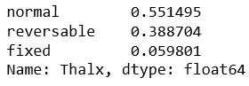

如果你注意到，这些比例加起来不等于 1。在这次计算中，我们漏掉了一件事。可能会有一些值。用“缺失”填充这些空格，然后再次计算比例。

```
df["Thal"] = df.Thal.fillna("Missing")
x = df.Thal.value_counts()
x / x.sum()
```

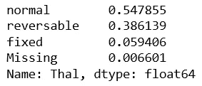

所以，有一些缺失的值。在这个数据集中，54.79%的人患有正常地中海贫血。下一个大的是 38.16%，他们有可逆的地中海贫血。

2.找出胆固醇数据的最小值、最大值、平均值和标准偏差。

有一个功能叫做‘描述’。让我们利用这一点。我们将获得我们需要的所有信息以及一些其他有用的参数，这些参数将帮助我们更好地理解数据。

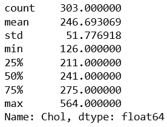

所以，我们得到了一些额外的有用参数。人口总数是 303。我们不打算在本文中使用它。但它在统计分析中很重要。尤其是在推断统计学中。“describe”函数还返回 25%、50%和 75%的百分比数据，这些数据提供了数据分布的概念。

3.绘制胆固醇数据的分布图。

```
sns.distplot(df.Chol.dropna())
```

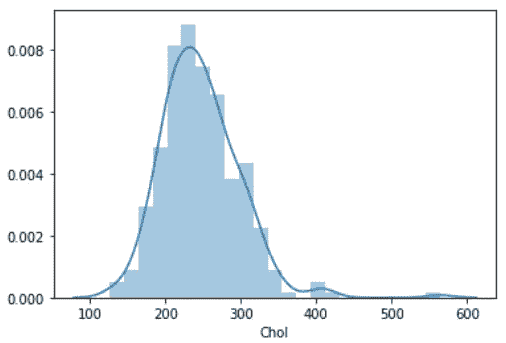

分布稍微向右倾斜，有一些异常值。

4.求 RestBP(静息血压)的平均值。然后，计算 RestBP 高于平均 RestBP 的人口比例。

```
mean_rbp = df.RestBP.dropna().mean()
```

平均 RestBP 为 131.69。首先，找到 RestBP 大于均值 RestBP 的数据集。除以总数据集的长度。

```
len(df[df["RestBP"] > mean_rbp])/len(df)
```

结果是 0.44 或 44%。

5.绘制胆固醇数据与年龄组对比图，观察不同年龄组人群中胆固醇水平的差异。

这是解决方案。在数据集中创建一个新列，该列将返回不同年龄组的人数。

```
df["agegrp"]=pd.cut(df.Age, [29,40,50,60,70,80])
```

现在，制作方框图。将年龄组放在 x 轴上，胆固醇水平放在 y 轴上。

```
plt.figure(figsize=(12,5))
sns.boxplot(x = "agegrp", y = "Chol", data=df)
```

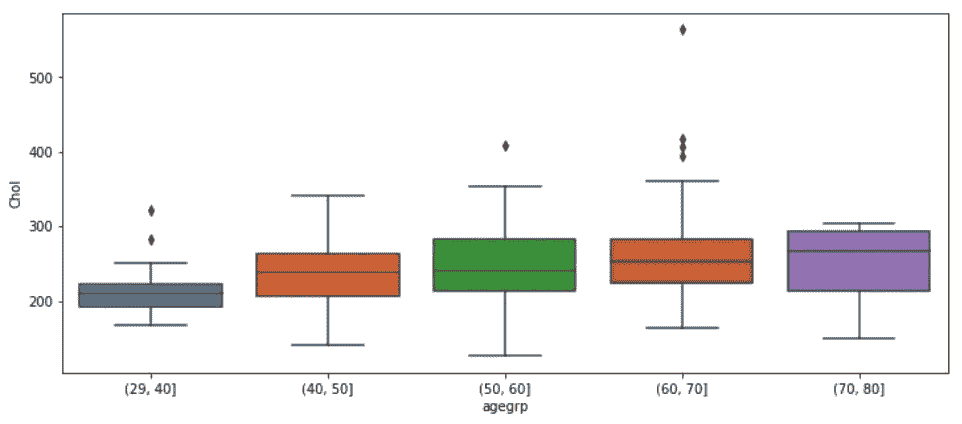

箱线图显示胆固醇随着年龄的增加而增加。检查性别是否起作用是一个好主意。如果不同性别的人胆固醇水平不同。在我们的性别专栏中，数字 0 和 1 分别代表女性和男性。我们将创建一个新列，用“男性”和“女性”替换 0 或 1。

```
df["Sex1"] = df.Sex.replace({1: "Male", 0: "Female"})
plt.figure(figsize=(12, 4))
sns.boxplot(x = "agegrp", y = "Chol", hue = "Sex1", data=df)
```

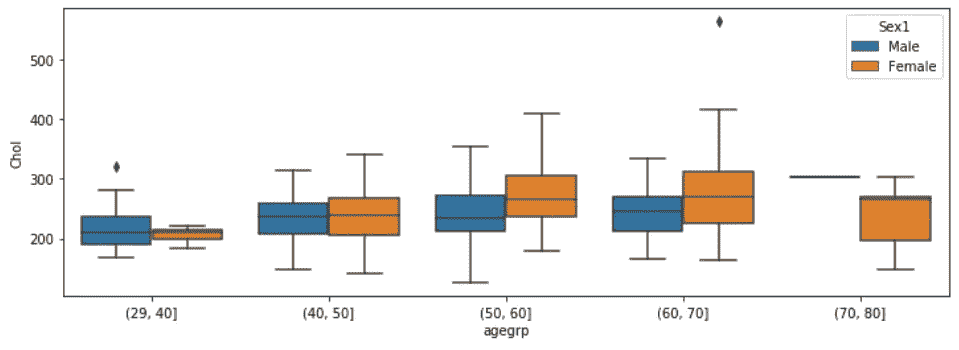

总体而言，该数据集中的女性人群胆固醇水平较高。在 29 岁到 40 岁的年龄组，情况就不同了。在 70 至 80 岁的年龄组中，胆固醇水平仅见于女性人口中。这并不意味着该年龄段的男性没有胆固醇。在我们的数据集中，该年龄组的男性人口不足。如果我们按年龄绘制男性和女性人口图，将有助于理解。

```
sns.boxplot(x = "Sex1", y = "Age", data=df)
```

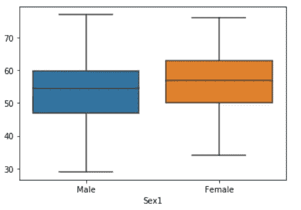

6.制作一个图表，显示每个年龄组中患有各种类型胸痛的人数。

```
df.groupby('agegrp')["ChestPain"].value_counts().unstack()
```

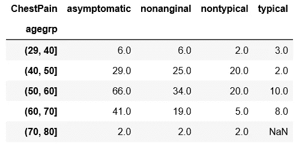

对于每种类型的胸痛，最大值出现在 50 至 60 岁的年龄段。可能是因为我们的数据集中该年龄组的人数最多。看上面的图片。

7.制作与之前练习相同的图表，并添加性别变量。按性别区分数字。

```
dx = df.dropna().groupby(["agegrp", "Sex1"])["ChestPain"].value_counts().unstack()
```

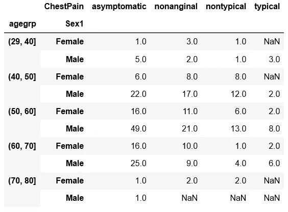

8.在前一张图表中，列出同一组中每种类型胸痛的人群比例。

```
dx = dx.apply(lambda x: x/x.sum(), axis=1)
```

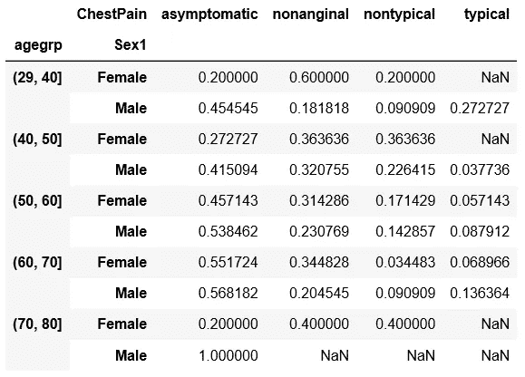

那是最后一次练习。这些是制作单变量和多变量图表和绘图的一些技巧。我希望这有所帮助。在这里，我有一些相关文章的链接:

1.  [通过直方图和箱线图](/understanding-the-data-using-histogram-and-boxplot-with-example-425a52b5b8a6)了解数据

2.[置信区间、计算及特征](/confidence-interval-calculation-and-characteristics-1a60fd724e1d)

3.[蟒蛇种群比例及差异的置信区间](/confidence-intervals-of-population-proportion-and-the-difference-in-python-6ab7faa0f255)

4.[如何计算均值的置信区间和均值的差值](/how-to-calculate-confidence-interval-of-mean-and-the-difference-of-mean-993bfec0c968)

5.[如何制定好数据分析的研究问题](/how-to-formulate-good-research-question-for-data-analysis-7bbb88bd546a)