# 用 ML 解释器理解机器学习黑盒

> 原文：<https://towardsdatascience.com/understand-the-machine-learning-blackbox-with-ml-interpreter-7b0f9a2d8e9f?source=collection_archive---------28----------------------->

## 一个自动解释 XGBoost 等算法决策的 web 应用程序

让模型来管理这个世界并做出从雇佣到刑事司法的决策是有危险的。虽然拥有既可解释又准确的模型是理想的，但许多流行且强大的算法仍然是黑盒。

其中有高性能的树集成模型，如 lightGBM，XGBoost，random forest。了解他们的内部运作会带来很多好处，包括透明、信任、合规和公平。否则，人们可能不得不求助于更易解释的原始模型。

为了让解释更容易，我构建了一个 web 应用 [**ML-interpreter**](http://ml-interpret.herokuapp.com) 。

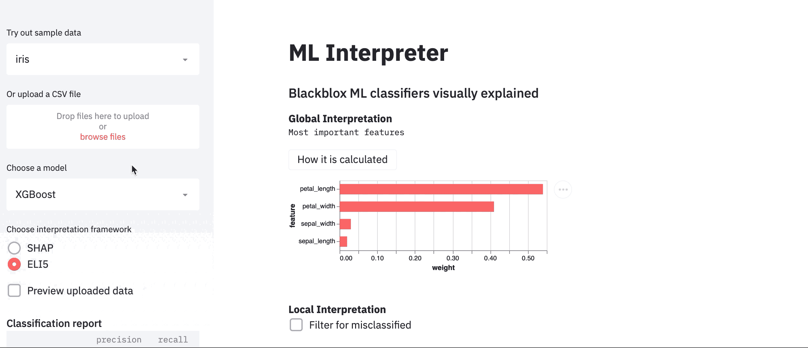

**查看此处******。****

**在深入详细的功能之前，这里有一个关于可解释性的初级读本。**

# **解释框架的简要概述**

**现在有很多可解释性框架，包括 Python 包 [LIME](https://lime-ml.readthedocs.io/en/latest/) 、 [SHAP](https://github.com/slundberg/shap) 、 [ELI5](https://github.com/TeamHG-Memex/eli5) 、 [Skater](https://pypi.org/project/skater/) ，以及不太知名的如 [ALIBI](https://pypi.org/project/alibi/) 、R 包 [Dalex](http://uc-r.github.io/dalex) 以及 SHAP 和 LIME 的 R 包装器。一开始，处理许多不同框架的机制、语法和用法可能会令人不知所措，这促使我开发了这个应用程序。以下是一些关键概念。**

****冲击与方向****

**为了解释一个模型，我们通常想知道(1)特性对结果的影响和(2)影响的方向。**

**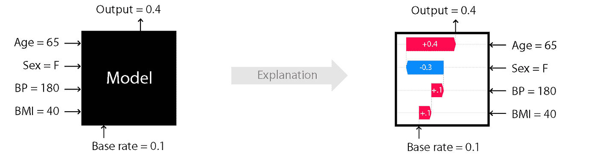**

**图片来源: [SHAP](https://github.com/slundberg/shap)**

****全球对本地****

**我们还想知道:**

*   **哪些功能总体影响最大(全局解释)**
*   **如何批准每个决策点(当地解释)**

**大多数框架既可以进行全局解释，也可以进行局部解释，有些侧重于局部层次，比如 LIME。**

****与型号无关与与型号相关****

**像 SHAP 这样的框架是模型不可知的。其他人专门研究特定的模型，如 ELI5，它主要涵盖基于树的模型，但也可以用于解释 sklearn 线性模型和文本/图像用例。**

# **这些框架是如何工作的**

****排列重要性****

**对于全局重要性，一种常用的方法是排列重要性。通过改变特定特性的值并观察它对模型性能的影响程度，可以推断出该特性的重要性。这种方法被认为比某些包中默认的特征重要性度量更一致。你可以在这里阅读更多关于为什么[的内容](https://explained.ai/rf-importance/)。**

**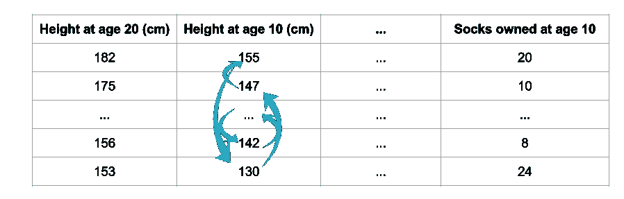**

**图片来源:[ML Kaggle 的可解释性](https://www.kaggle.com/dansbecker/permutation-importance)**

****代理模型****

**对于局部解释，可以训练简单的可解释模型(如决策树)作为代理，然后使用该代理模型将原始数据与作为解释目标的黑盒模型的预测进行拟合，并使用该简单模型进行解释。**

****博弈论****

**另一种方法是基于博弈论的沙普利值。单个特征的影响可以加起来解释为什么预测与基线不同。你可以在这篇博客[帖子](/one-feature-attribution-method-to-supposedly-rule-them-all-shapley-values-f3e04534983d)或这篇 arXiv [论文](https://arxiv.org/abs/1802.03888)中了解更多关于 SHAP 的树解释器是如何工作的。**

**接下来，我们将使用 app 进行一些解读。**

# **ML 解释程序**

**该应用程序由 4 个主要部分组成:用户选择、分类报告、每个决策点的全局解释和局部解释。**

**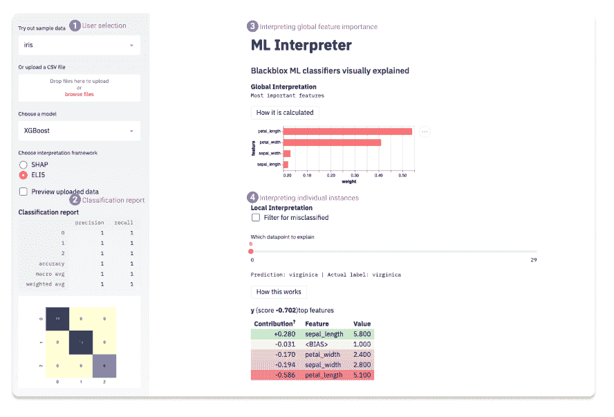**

**[ML 解释器应用](http://ml-interpret.herokuapp.com)**

**人们可以选择一个演示数据或更新一个小的表格 csv，运行一个分类器(randomforest，XGBoost，lightGBM)，并在可解释性框架之间进行选择。treeSHAP 和 ELI5，因为它们覆盖了全局和局部解释，并且很好地处理了树集合模型。**

****示例****

**现在，我们将在 UCI 的成人收入数据集(包含在应用程序的演示数据中)上测试它，该数据集根据人口普查预测个人年收入超过 5 万美元的概率。首先我们可以选择一个内置模型(比如 lightGBM)，选择一个框架(SHAP)。**

****视察模特表演****

**我们可以从查看**分类报告**和混淆矩阵开始。请注意，这是没有任何数据清理或特征工程的输出。因此，如果预先对数据进行预处理，比如删除零方差或 id 列(如果有的话)，结果可能会更好。**

**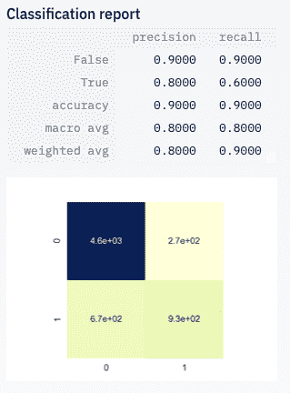**

****理解全局解释****

**当我们对模型的结果满意后，我们可以检查**最重要的特征**并发现关系、教育和年龄对收入的影响最大。**

**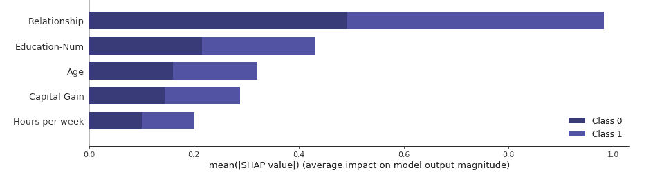**

**全局解释**

****放大局部解释****

**然后，为了检查这些特征如何影响收入，我们可以使用滑块放大到**单个数据点**。你可以在应用中阅读更多关于如何阅读这个情节的信息，或者点击[这里](https://github.com/slundberg/shap)。**

**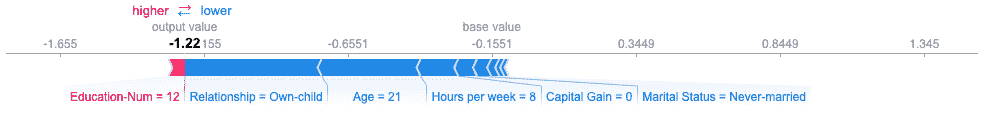**

**示例 1**

**在这个例子 1 中，这个人是一个 21 岁的人，每周只工作 8 个小时，他被正确地归入低收入类别。**

**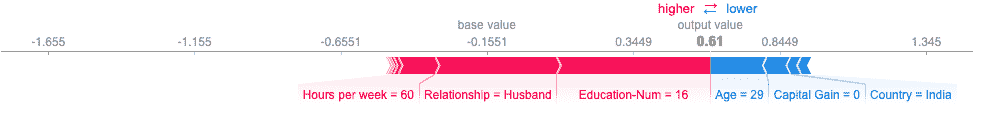**

**示例 2**

**在另一个例子 2 中，被归类为高收入预算的人工作了相当长的时间，已婚并具有高学历，但是位置似乎降低了机会。**

**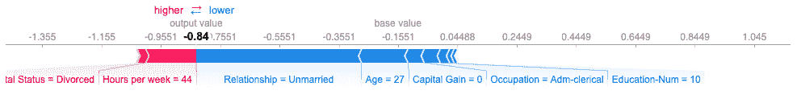**

**示例 3**

**在最后一个例子中，这个人工作了相当长的时间，但是许多因素都有负面影响。人们可以从最长的箭头看到最重要的因素。如果这个因素不合理，就应该重新处理数据，找到混淆因素或者进行调试。**

**如果我们转而使用 ELI5 框架，我们可以以表格形式查看不同的视图，总结出对个人决策影响最大的因素。**

**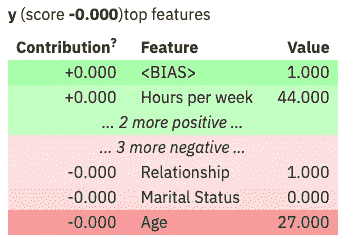**

**这是一个自动解释的应用程序，它运行一个选择的算法，显示模型的性能，并指出是什么使模型进行预测。**

**如果你对如何改进它有任何想法/建议，这里有一个[反馈](https://docs.google.com/forms/d/e/1FAIpQLSdTXKpMPC0-TmWf2ngU9A0sokH5Z0m-QazSPBIZyZ2AbXIBug/viewform)表格和到演示[应用](http://ml-interpret.herokuapp.com)和 [Github](https://github.com/yanhann10/ml_interpret) 的链接。**

## **一路上的挑战**

1.  **速度**

**构建这一框架的主要挑战是可解释性框架会变得计算密集型。像 SHAP 这样的软件包有 C++加速，而其他的需要更长的计算时间。一些分类器也比其他分类器花费更长的时间，数据大小加剧了这种情况，尽管人们可以首先尝试数据的样本。**

**最初，我将 PDPbox 中的 PDP/ICE 图作为图之一，显示每个特性如何随结果变化，但在其他计算之上呈现之前计算 20 秒的图表并不理想，所以最终我将它作为可选图表移动，可以通过选择复选框按需查看。**

**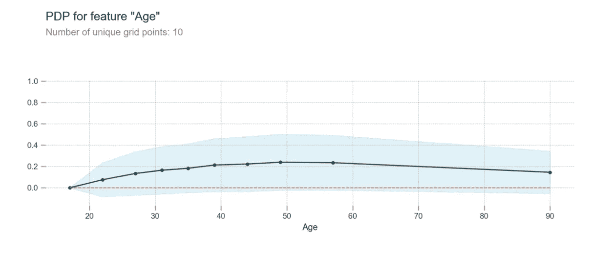**

**另一个选择是 [ALEplot](https://christophm.github.io/interpretable-ml-book/ale.html) (最初是一个 R 包)，它应该更快更好(可以处理 PDP 不能处理的相关特性)，当其羽翼未丰的 python [版本](https://github.com/blent-ai/ALEPython)稳定下来时，这可能会很方便。SHAP 也有自己版本的部分相关图，显示散点图中的每个数据点，但有时数据点只是相互遮挡(尽管其局部解释图超级棒)。**

**2.翻译口译员**

**另一个挑战是这些框架没有一个是完全不言自明的。感谢几位 ML/DS 人员的反馈，他们友好地帮助了初始测试，我在每个部分添加了*操作*按钮和链接来详细解释输出。**

## **学习**

*   **我开始理解不同可解释性框架的复杂性。虽然重点是用树集成模型进行分类，但这些框架中的许多可以应用于更广泛的用例，包括回归、文本和图像。拥有黑盒中的可解释性可以为我们提供许多见解，但它可能不是万灵药，仍然需要谨慎使用。**
*   **通过这个项目，我使用了 Atair 进行绘图，并发现它的声明性语法非常简洁，这让我想起了 ggplot2 中的图形语法。现在为了保持功能简单，我没有用图表过载它。**
*   **使用[构建和部署 ML 应用程序简化了](https://www.streamlit.io)。我最近在这里和这里写了详细的操作方法[。](https://dev.to/hannahyan/getting-started-in-building-and-deploying-interactive-data-science-apps-with-streamlit-6ab)**

# **后续步骤**

****口译组****

**与重要特性的俯视图相比，理解单个决策点是相当大的进步。然而，更有趣和实用的是了解模型对特定群体的预测，基于输入要素或输出类别进行聚类，而交互式应用程序是实现这一点的好方法。我还没有找到一个适合解释集群的框架。这对于评估模型的公平性也有积极的意义。**

# **反光**

**在学习这些框架时，我注意到它们在架构和实现上有多么不同。例如，Eli5 以(1)表格数据框格式和(2)图表两种形式提供结果，尽管它们的图表也是彩色的 HTML 表格。SHAP 的方法相当不同——它直接生成高度紧凑的可视化。但是，您可以运行一些脚本来获得数据框格式的输出。**

**所有这些框架都可以归结为两个部分——解释算法(T0)和视觉表现(T2)两部分。他们的大多数图表都有相同的目标，比如特性重要性或部分相关性，但他们都使用不同的图表来呈现相同的见解。对于新用户来说，在解释释义时转换齿轮并不那么容易。我开始想，将解释算法和它们的视觉表示分离开来，并拥有一种**通用设计语言**用于机器学习解释是否会更好，这种语言与框架无关，并且可以使交流更容易。**

# ****资源****

**我参考了这些文章/书籍，发现它们信息量很大:**

**[机器学习的可解释性](https://www.kaggle.com/learn/machine-learning-explainability)由 Kaggle**

**[关于解释机器学习的想法](https://www.oreilly.com/radar/ideas-on-interpreting-machine-learning/)奥赖利**

**[克里斯托弗·莫尔纳尔*撰写的可解释的 ML 书*](https://christophm.github.io/interpretable-ml-book/)**

**[机器学习可解释性介绍](https://www.h2o.ai/wp-content/uploads/2019/08/An-Introduction-to-Machine-Learning-Interpretability-Second-Edition.pdf)作者 Patrick Hall 和 Navdeep Gill 在 H2o**

**如果你喜欢这篇文章，请分享。建议或反馈总是受欢迎的。**