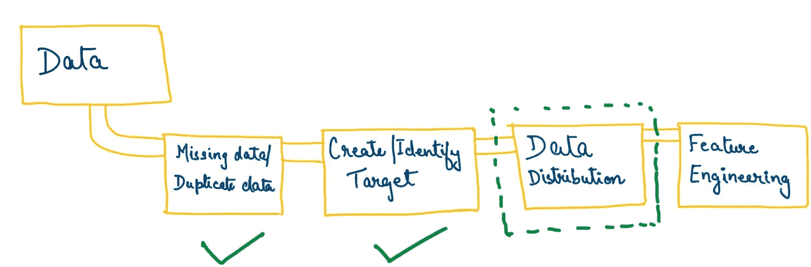

# 理解数据中的模式

> 原文：<https://towardsdatascience.com/understand-the-patterns-in-the-data-f454a79ae51c?source=collection_archive---------24----------------------->

## 导入数据后的下一步

威廉·艾文在 [Unsplash](https://unsplash.com?utm_source=medium&utm_medium=referral) 上的照片

在我之前的[博客](/whats-inside-the-data-aadbb28ba8cd)中，我简单解释了如何清理数据、执行 EDA(探索性数据分析)以及什么是基本特征工程。

比如说，你做了一个“read_csv”并导入了数据。现在，接下来呢？接下来要谈的重要事情是，我们如何理解和分析数据集中的各种模式。这将帮助我们解决几个问题:

**a.** 它将帮助我们了解当前数据中有多少**个缺失值/重复值**(这是我们未来模型的一个问题)——[*在前一篇文章*](/whats-inside-the-data-aadbb28ba8cd) 中解释过

**b.** 确定**自变量**(特征/属性)和**因变量**(目标)？如果没有目标(在大多数真实情况下)，了解如何创建一个。这将基于你正在做的问题陈述，我将在以后的博客中用一些例子来讨论。

**c.** 了解每个特征/属性相对于我们的目标列以及相对于彼此的**总体分布**。

**d.** 有没有可以去掉的**特征**因为它们最终解释的是同一个东西！(将在下一篇博客中解决这个问题)

来源:作者

# 数据分布分析

要了解数据分布和关系，有很多 python 库(seaborn，plotly，matplotlib，sweetviz 等。)，这样会让你的工作更轻松。在此阶段需要记住的一些事情是:

1.  确定你的数字和分类变量。如果您认为 zipcode 的一列是数字型的，因为它有数字，那么您可能想回头详细阅读一下分类和数字属性！出于本文的目的，**分类特征是那些包含有限数量的类别的特征，而数字属性是那些包含连续实数的特征**。我发现[这个链接](https://www.scribbr.com/methodology/types-of-variables/)同样非常有用！这一部分看起来很小，但在机器学习建模的后期起着重要的作用。
2.  一旦你成功地识别了不同类型的变量，就该看看它们的模式和分布了。对于不同类型的变量，您可能希望使用不同的图表/解释来更好地理解它们。
3.  **分类特征** —这里有一些有用的基本统计数据——统计每个特征中的唯一值、每个特征中的频率分布、每个类别与目标列的关系等。你可以在这里使用很多图表，我使用饼状图(用于较小的类别)，条形图用于更多的类别，或者有时只是一个普通的表格来进行快速分析。这完全取决于是什么让发行版更容易让你理解！
4.  **数值型特征**—工资、年龄、温度等数值型属性。，为他们创建一个直方图，了解他们的分布。我的首选代码行是 df[' <列> ']。[形容()](https://pandas.pydata.org/pandas-docs/stable/reference/api/pandas.DataFrame.describe.html)。这让我可以快速分析一个属性的最小值-最大值-平均值等，而无需在编码上投入大量时间。这里有很多图表，你也可以用来分析数字特征！
5.  为了**分析目标列**，查看数据分布—分类问题中 1&0 的条形图/饼图，或回归问题(连续数)的直方图/散点图。

需要记住的一点是，EDA(以及整个数据科学)非常直观。

> 你可能认为这个过程看起来像导入数据-> EDA ->特征工程->建模->结果，但实际上，**这个过程是一个循环**，一切都是相互连接的。

因此，即使您到达了建模阶段(在跨越了数据预处理阶段的所有障碍之后)，您也必须回来分析更多的模式，创建/删除更多的特性，并再次进行建模！耐心是关键:)

> 有很多库提供了很多“奇特的”交互式图形，但是除了好看的图形，您应该选择一个有助于您很好地理解数据，并且易于向他人解释的图形。

现在你已经在文章末尾了，感谢你的阅读！如果有什么想让我补充/更改/地址的，请留言回复！:)