# 理解转置卷积

> 原文：<https://towardsdatascience.com/understand-transposed-convolutions-and-build-your-own-transposed-convolution-layer-from-scratch-4f5d97b2967?source=collection_archive---------4----------------------->

## 了解转置卷积的概念，从头开始构建自己的转置卷积层

图片来自 [NeONBRAND](https://unsplash.com/@neonbrand) 的 [Unsplash](https://unsplash.com/)

生成对抗网络(GAN)是用于新数据生成的最先进的人工神经网络之一。它广泛应用于[照片生成、照片编辑、人脸老化等](https://machinelearningmastery.com/impressive-applications-of-generative-adversarial-networks/)领域。GAN 的核心是发生器和鉴别器。他们两个玩一个对抗性的游戏，在这个游戏中，生成器正在学习通过制作看起来非常像真实图像的假图像来欺骗鉴别器，而鉴别器正在学习更好地检测假图像。在理想情况下，在训练结束时，生成器可以生成看起来与真实图像完全一样的假图像，但鉴别器仍然可以发现它们是假的。

虽然卷积层在鉴别器中起着重要作用，但转置卷积层是生成器的主要构建模块。多亏了 TensorFlow API — Keras，构建 GAN 变成了一个非常方便的过程。然而，为参数设置正确的值，比如内核大小、步长和填充，需要我们理解转置卷积是如何工作的。**在这本笔记本里，我想分享一些我个人对转置卷积的理解，希望能帮助你揭开其中的奥秘。在整个笔记本中，我将使用卷积作为比较，以更好地解释转置卷积。我还将向您展示我如何实现这些理解来构建我自己的卷积和转置卷积层，它们的行为就像 Keras 的 Conv2D 和 Conv2DTranspose 层的简单版本。**笔记本由三部分组成:****

1.  **什么是转置卷积？**
2.  **Keras conv 2d transpose 中有哪些参数(内核大小、步幅、填充)？**
3.  **从头开始构建我自己的 Conv2D 和 Conv2DTranspose 图层**

# 第一节:什么是转置卷积？

我把转置卷积理解为卷积的反义词。在卷积层中，我们使用一种称为互相关的特殊操作(在机器学习中，该操作通常被称为卷积，因此这些层被称为“卷积层”)来计算输出值。该操作将输入层中所有相邻的数字加在一起，由一个[卷积矩阵](https://en.wikipedia.org/wiki/Kernel_(image_processing)#:~:text=In%20image%20processing%2C%20a%20kernel,a%20kernel%20and%20an%20image.)(内核)加权。例如，在下图中，输出值 **55** 通过输入层的 3x3 部分和 3x3 内核之间的元素乘法计算得出，并将所有结果相加:

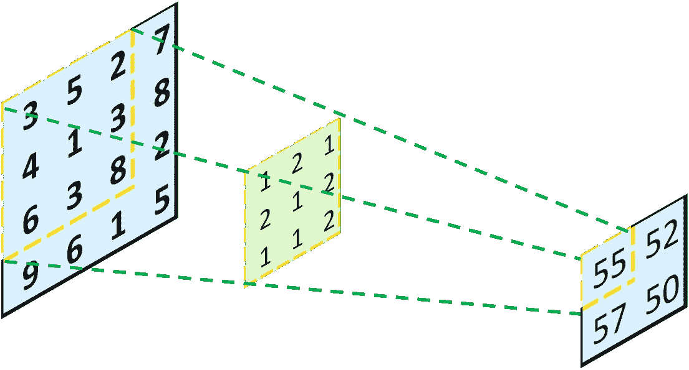

对输入图层的 3x3 部分和 3x3 内核进行一次卷积运算(图片由作者提供)

没有任何填充，该操作将 4x4 矩阵转换为 2x2 矩阵。这看起来像有人从左向右投射光线，并通过一个孔(3x3 内核)投射一个对象(4x4 矩阵)，产生一个更小的对象(2x2 矩阵)。**现在，我们的问题是:如果我们想从 2x2 矩阵倒退到 4x4 矩阵呢？**好吧，直观的方法是，我们只要把光向后投！在数学上，我们可以将输入层中的每个值乘以 3x3 内核，而不是乘以两个 3x3 矩阵，从而得到一个 3x3 矩阵。然后，我们根据输入层中的初始位置将它们组合在一起，并将重叠的值相加:

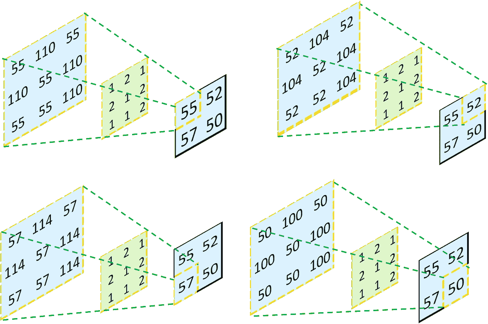

将输入层中的每个元素乘以内核中的每个值

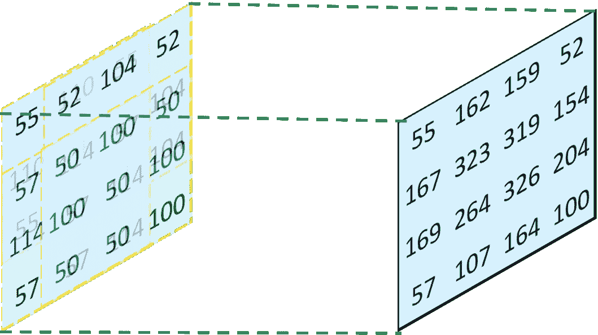

将所有四个结果层组合在一起，并将重叠值相加(图片由作者提供)

这样，总是可以确定转置卷积运算的输出可以与前一个卷积运算的输入具有完全相同的形状，因为我们只是进行了完全相反的操作。**但是，您可能会注意到号码没有恢复。因此，必须使用完全不同的核来恢复初始输入矩阵，并且该核可以通过训练来确定。**

为了证明我的结果不仅仅是一些随机数，我通过 Keras 使用上述条件建立了卷积神经网络。从下面的代码可以看出，输出完全相同。

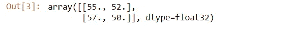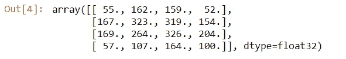

## 为什么“换位”？

现在你可能想知道:嘿，这看起来就像一个反向卷积。为什么命名为“转置”卷积？

说实话，我也不知道自己为什么要纠结这个问题，但是我做到了。我相信它被命名为“转置”卷积是有原因的。为了回答这个问题，我看了很多关于转置卷积的网上资源。一篇名为[“转置卷积上采样”](https://medium.com/activating-robotic-minds/up-sampling-with-transposed-convolution-9ae4f2df52d0)的文章帮了我大忙。在这篇文章中，作者 Naoki Shibuya 使用**一个零填充卷积矩阵来表示卷积运算，而不是普通的方形卷积矩阵**。本质上，在执行卷积变换时，我们可以将其表示为 4x16 矩阵，而不是将上述核表示为 3x3 矩阵。除了将上述输入表示为 4x4 矩阵，我们还可以将其表示为 16x1 向量:

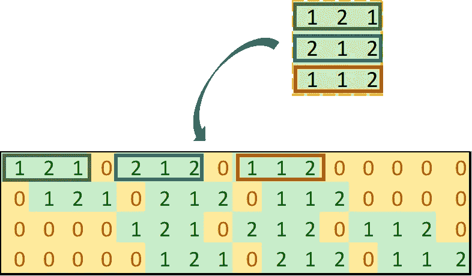

将 3x3 内核表示为 4x16 补零卷积矩阵(图片由作者提供)

采用 4x16 矩阵的原因是:

*   4 行:总共，我们可以通过将一个 4x4 的输入矩阵拆分成四个 3x3 的矩阵来执行四次卷积；
*   16 列:输入矩阵将被转换成 16x1 的向量。为了执行矩阵乘法，它必须是 16 列。

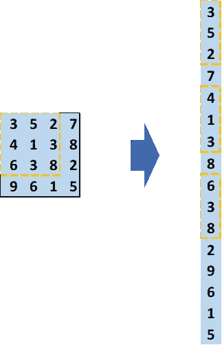

将 4x4 输入矩阵表示为 16x1 向量(图片由作者提供)

这样，我们可以直接执行矩阵乘法来得到一个输出层。整形后的输出图层将与通过常规卷积运算得到的图层完全相同。

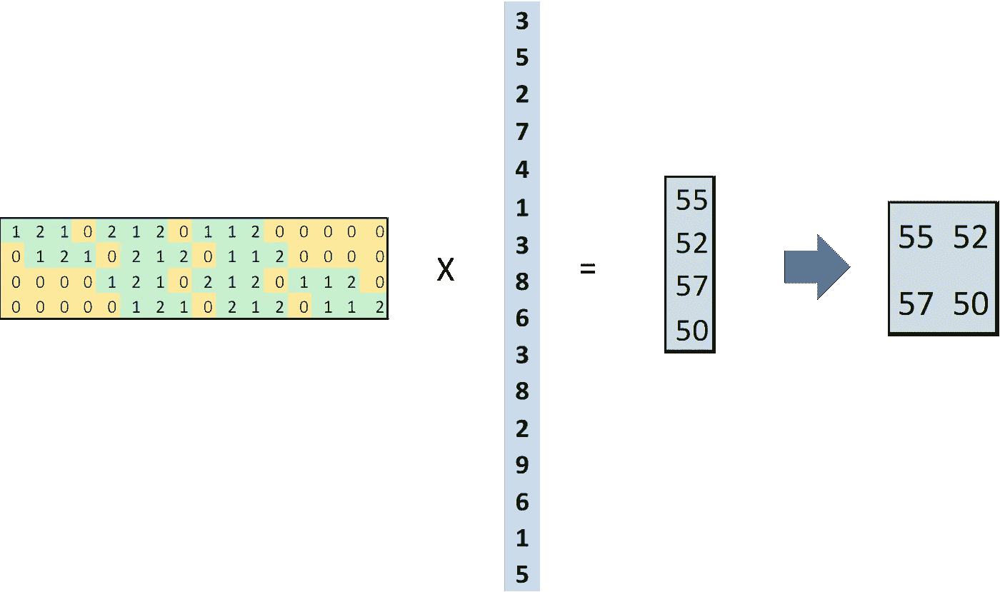

4x16 卷积矩阵和 16x1 输入向量之间的矩阵乘法(图片由作者提供)

**最有趣的部分来了！**当我们执行转置卷积运算时，我们只是简单地转置补零卷积矩阵，并将其乘以输入向量(这是卷积层的输出)。在下图中，中间阶段的四个彩色向量代表矩阵乘法的中间步骤:

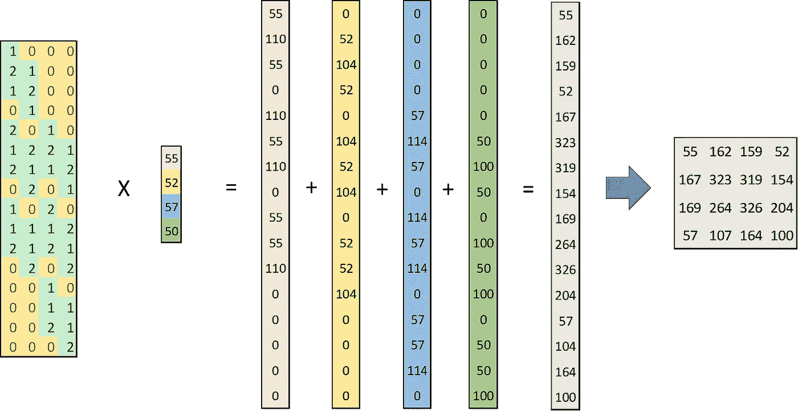

16x4 转置卷积矩阵和 4x1 输入向量之间的矩阵乘法(图片由作者提供)

如果我们在中间阶段重新排列四个向量，我们将获得四个 4x4 矩阵，其数量与我们通过将 3x3 内核与输入层中的每个单独元素相乘而获得的 3x3 矩阵完全相同，多余的槽用零填充。这四个矩阵还可以进一步组合，以获得最终的 4x4 输出矩阵:

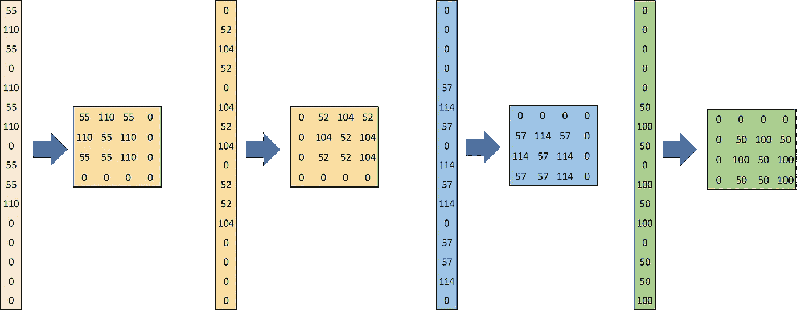

将 16×1 的中间向量重新排列成 4×4 的中间矩阵(图片由作者提供)

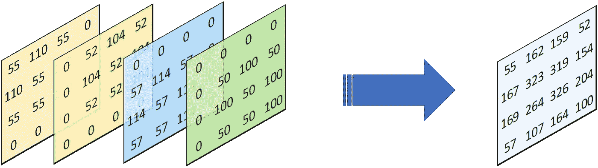

将所有四个中间矩阵组合在一起，产生最终结果(图片由作者提供)

因此，该操作被称为“转置”卷积，因为我们执行了完全相同的操作，只是我们转置了卷积矩阵！

# 第二节:**Keras conv 2d transpose 中的参数(内核大小、步幅、填充)有哪些？**

## 1.内核大小

**在卷积**中，内核大小影响着你在输入层中“投射”多少个数字以在输出层中形成一个数字。内核越大，使用的数字就越多，因此输出层中的每个数字都是输入层的更广泛的表示，并携带来自输入层的更多信息。但同时，使用更大的内核会给你一个更小的输出。例如，具有 3x3 内核的 4x4 输入矩阵将产生 2x2 输出矩阵，而具有 2x2 内核的 4x 4 输入矩阵将产生 3x3 输出矩阵(如果没有添加填充):

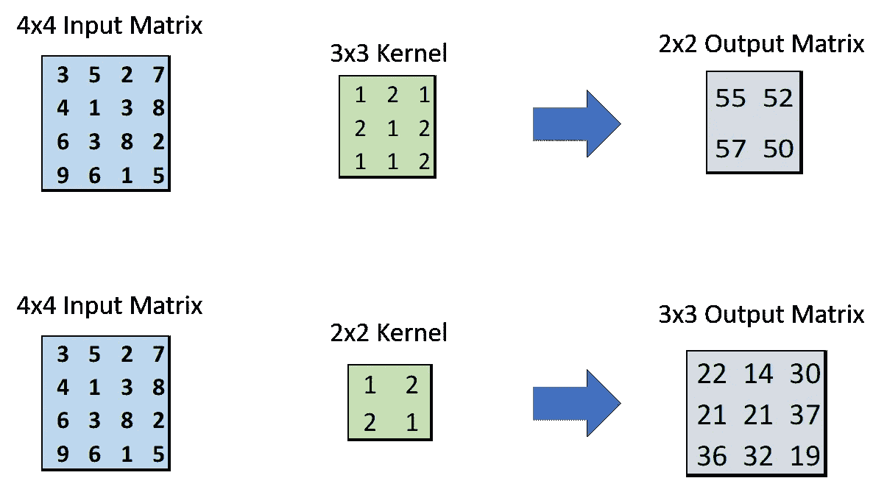

(图片由作者提供)

**在转置卷积**中，当内核变大时，我们将输入层的每个数字“分散”到更大的区域。因此，内核越大，输出矩阵也越大(如果不添加填充):

(图片由作者提供)

## 2.大步

**在卷积**中，步长参数表示内核在**输入层**上沿行和列移动的速度。如果步幅为(1，1)，则内核每走一步移动一行/一列；如果步幅是(2，2)，则内核每走一步移动两行/列。因此，步幅越大，到达行/列末尾的速度越快，因此输出矩阵越小(如果没有添加填充)。设置更大的步幅也可以减少相同数字的重复使用。

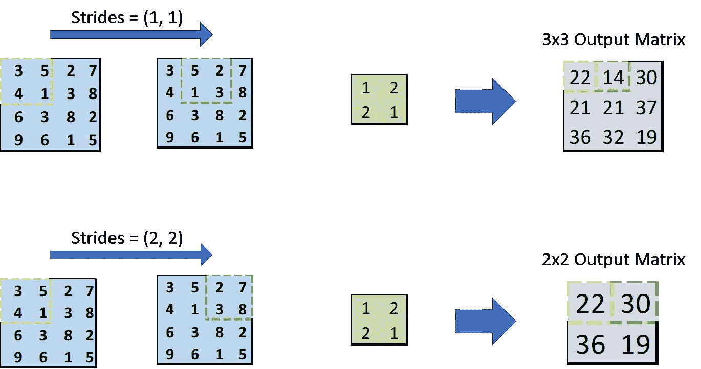

(图片由作者提供)

**在转置卷积**中，步长参数表示内核在**输出层**上移动的速度，如下图所示。注意，内核总是在输入层一次只移动一个数字。因此，步幅越大，输出矩阵就越大(如果没有填充)。

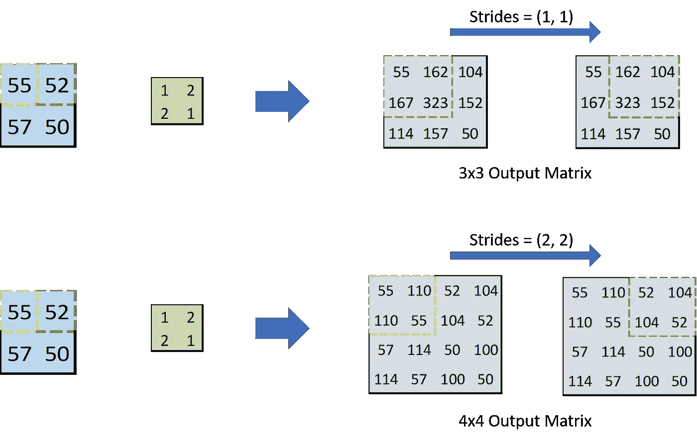

(图片由作者提供)

## 3.填料

**在卷积**中，我们经常想要保持输入层的形状，我们通过零填充来实现。在 Keras 中，填充参数可以是两个字符串之一:“valid”或“same”。当填充为“有效”时，意味着不实现零填充。当填充“相同”时，输入层以某种方式被填充，使得输出层具有输入形状除以步幅的形状。当跨距等于 1 时，输出形状与输入形状相同。

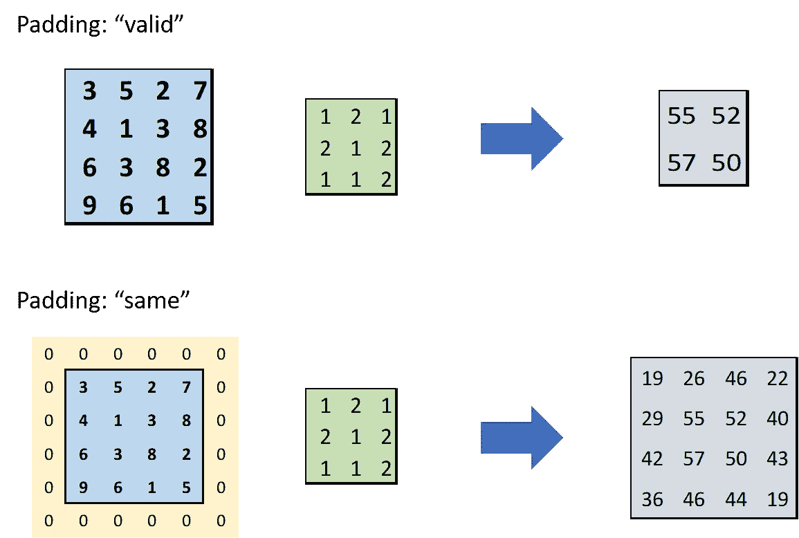

(图片由作者提供)

**在转置卷积**中，填充参数也可以是两个字符串:“valid”和“same”。但是，由于我们在转置卷积中扩展输入层，如果选择“有效”，输出形状将大于输入形状。如果使用“相同”,则输出形状被强制变成输入形状乘以步幅。如果此输出形状小于原始输出形状，则仅保留输出的中间部分。

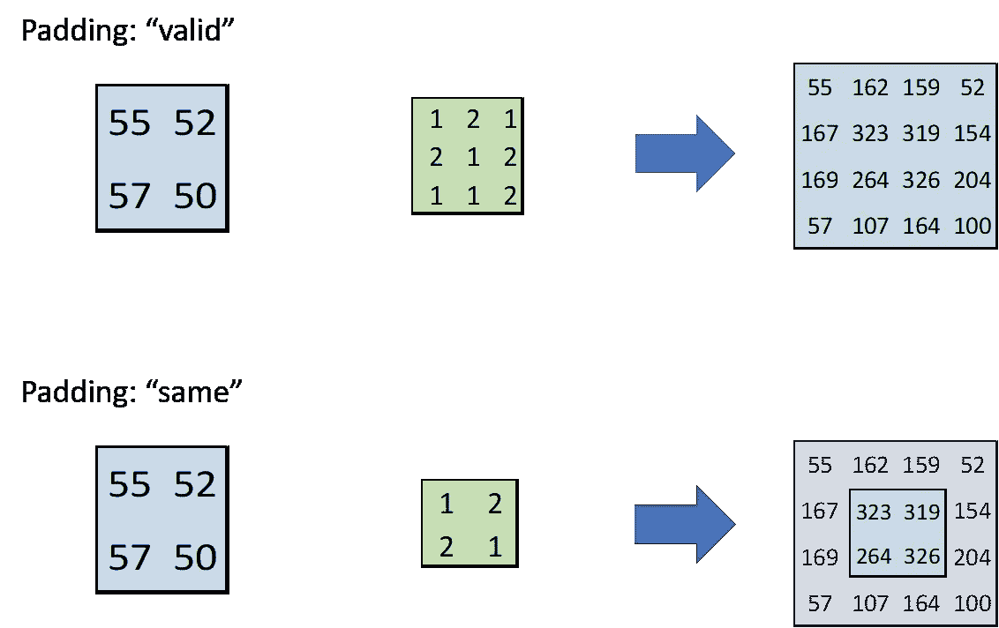

(图片由作者提供)

记住卷积和转置卷积中的“有效”和“相同”的一种更简单的方法是:

*   “有效”:不执行额外的操作。输出保持其应有的状态。
*   “相同”:输出形状是输入形状除以步幅(卷积)或乘以步幅(转置卷积)。当跨距等于 1 时，输出形状总是与输入形状相同。

# 从头开始构建我自己的 Conv2D 和 conv 2d 转置层

到目前为止，我已经解释了所有关于转置卷积层的概念及其重要参数。对你来说，它们可能仍然非常抽象，我完全理解你，因为我也很难理解转置卷积层是如何工作的。但是不要担心，现在我们可以使用我们所学的概念来构建我们自己的卷积和转置卷积层——这一定会揭示转置卷积层的奥秘！

**我们先从 Conv2D 开始:**

让我们来看看我自制的 Conv2D 层:

*   首先，我定义了需要添加的零填充的数量。如果填充是“有效的”，那么我不需要添加任何填充。如果填充“相同”，我将根据以下公式计算输入层每一侧的填充数:

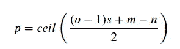

其中:
- *o* 为输出大小
- *s* 为步长
- *m* 为内核大小
- *n* 为输入大小
- *p* 为原输入层每边的填充数

此公式由计算输出形状的公式导出:

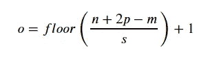

输出形状为 *o = n/s.*

*   然后，我通过构造一个用零填充的大矩阵来填充输入，并将原始输入放在中间。
*   之后，我使用卷积运算计算输出。在核 W 和输入 X_sub 的子集(其具有与核相同的形状)之间执行卷积运算。输出索引 *i，j* 的范围从 0 到最后一个适合内核的索引。例如，如果 X_padded 的形状为 4x4，而内核的形状为 3x3，那么可以装入内核的最后一个索引是 1(可以从索引 1 到索引 4 装入内核)。下面是该过程的图解说明:

使用 4x4 输入矩阵和 3X3 内核计算输出。输出中每步更新的数字以粗体显示(图片由作者提供)

我还比较了使用我的 Conv2D 和 Keras Conv2D 的结果。结果是一样的！

*   “有效”填充

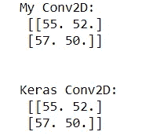

*   “相同”填充

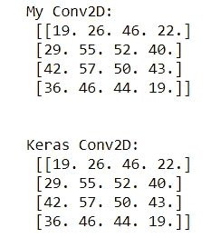

**现在让我们建立转置卷积层:**

让我们反对拆分代码:

*   输出形状首先由下面的公式定义:

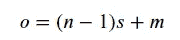

如果与计算 Conv2D 输出形状的公式进行比较，您会注意到在 Conv2DTranspose 中，步长和内核大小对输出形状的影响相反。

*   为了计算输出，我使用了两对指数: *i，j* 沿着输入移动， *i_prime，j_prime* 沿着输出移动。当 *i，j* 变化时， *i_prime，j_prime* 以给定步幅的步长变化。举个例子，如果 *i* 从 0 变到 1，strides = (2，2)，那么 *i_prime* 从 0 变到 2。输入矩阵中的每个值乘以内核中的所有值，结果记录在输出矩阵中。
*   然后，我定义了填充的长度。同样，如果填充是“有效的”，我不需要修改任何东西。如果填充“相同”，则输出形状必须是输入形状乘以步幅。那就是:

填充必须将原始输出形状转换为所需的输出形状:

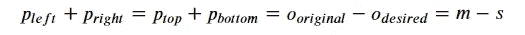

因此，设置填充值的简单方法是:

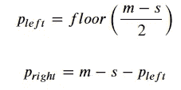

*   最后，通过只选择与输入矩阵形状相同的中间矩阵来填充输出。

计算输出过程的图解说明如下所示:

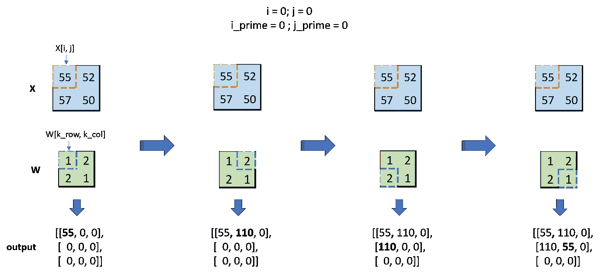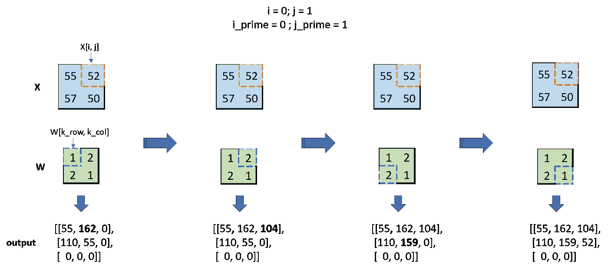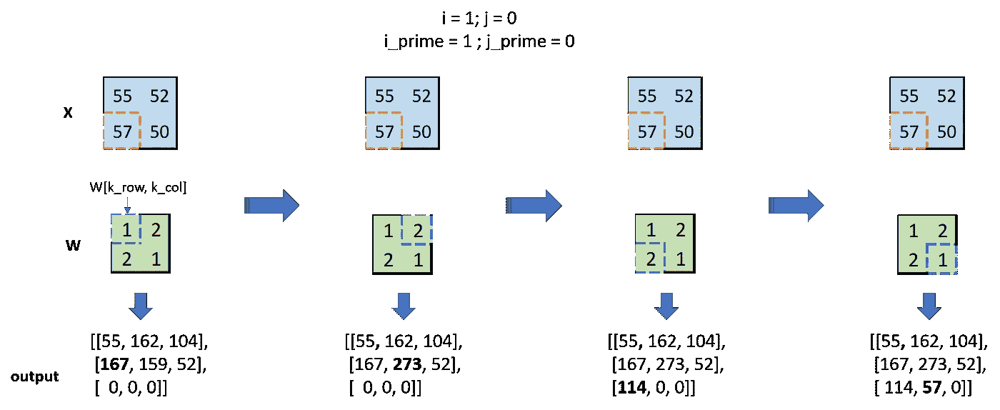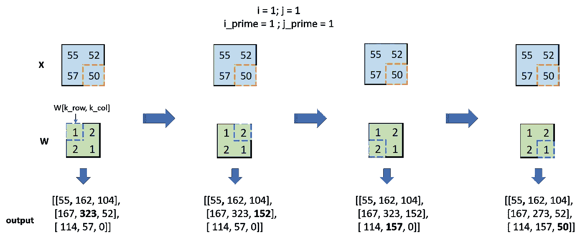

(图片由作者提供)

现在，我们可以通过将结果与 Keras 中的 Conv2DTranspose 进行比较来验证 Conv2DTranspose 函数:

*   “有效”填充:

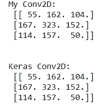

*   “相同”填充:

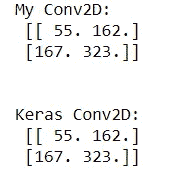

结果完全一样！

# 结论

恭喜你，你成功了！如前所述，这个笔记本是基于我个人的理解，我实际上是在 GAN 和其他所有机器学习知识上自学的。因此，如果你发现任何错误，我会很高兴知道！