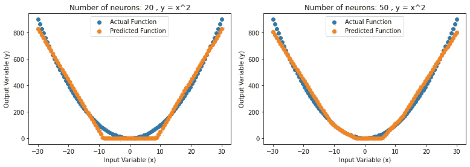
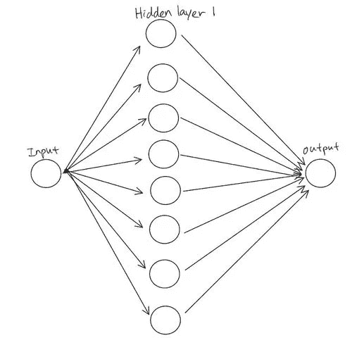
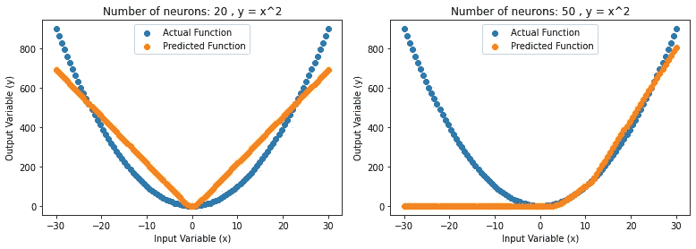
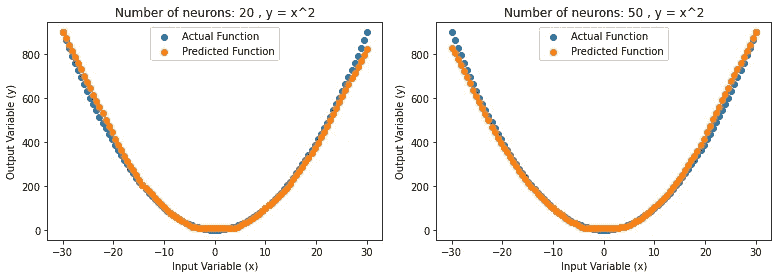
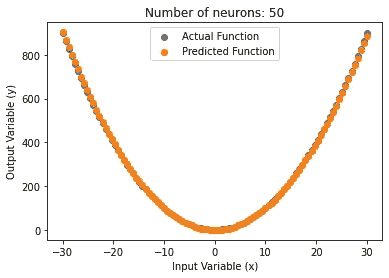

# 用代码理解通用逼近定理

> 原文：<https://towardsdatascience.com/understand-universal-approximation-theorem-with-code-774dcef55731?source=collection_archive---------35----------------------->

通用逼近定理声称，具有包含有限个隐藏神经元的单个隐藏层的标准多层前馈网络能够通过使用任意激活函数来逼近连续函数。([来源)](https://citeseerx.ist.psu.edu/viewdoc/download?doi=10.1.1.101.2647&rep=rep1&type=pdf)

然而，神经网络逼近将输入映射到输出目标的任何连续函数的能力受到神经元数量、隐藏层和在网络训练过程中使用的许多技术的限制。直觉上，你可以认为这是关于是否可能有足够的计算单元和操作来近似一个连续的函数，该函数可以正确地将输入映射到输出。近似的能力也高度依赖于我们使用的优化程序和损失函数的效率。

**建议:下载脚本，自己运行，围绕参数玩。回购是(** [**此处**](https://github.com/timothylimyl/UAT) **)。如果你已经忘记了神经网络，那就来看看吧(** [**此处**](https://medium.com/dataseries/understand-neural-networks-with-code-39945d4e39c5) **)。**

这些决定神经网络的设置和训练的参数通常被称为超参数。

我们可以在代码中调整的超参数示例:

1.  网络结构。(隐藏层数，神经元数)

```
 model = nn.Sequential( 
 nn.Linear(1, n_neurons),
 nn.ReLU(),
 #nn.Linear(n_neurons,n_neurons),
 #nn.ReLU(), 
 nn.Linear(n_neurons,1),
 nn.ReLU()
 ) 
```

2.历元数(我们浏览所有数据的次数)，第 57 行

3.损失函数和优化器，有这么多可用的优化器，查看一下[ [此处](https://pytorch.org/docs/stable/optim.html) ]:

```
 optimizer = optim.RMSprop(model.parameters(), lr=learning_rate) # define optimizer
#optimizer = optim.SGD(model.parameters(), lr=learning_rate)criterion = nn.MSELoss() # define loss function
```

# 代码实验

我们可以在代码中运行一些实验来更好地理解近似的概念。假设我们试图逼近的函数具有 y=x 的关系，我们可以运行一些实验来测量单个隐藏层需要多少个神经元来拟合 y = x 曲线，并调整超参数以搜索最佳结果。



图 1:具有单一隐藏层的前馈神经网络(调整一段时间后)

从上图(图 1)中，我们可以看到在单个隐藏层中有 20 个神经元，神经网络仅通过训练输出值就能够很好地逼近函数。在单个隐藏层中增加到 50 个神经元为我们提供了更好的结果。

简要回顾一下，如果您忘记了，这是一个具有 8 个神经元的单隐层前馈网络架构的简单图示:



图 2:单隐层前馈神经网络的结构

理论上，通用逼近定理意味着当给定适当的组合值时，神经网络可以很好地逼近各种各样的函数。然而，由于在搜索这些值时训练网络时的限制/挑战，学会用适当的值构建网络并不总是可能的。



图 3:具有单一隐藏层的前馈神经网络。超参数的不良调整导致不良训练。

从上图(图 3)来看，同一个架构的单隐层，网络近似的很差。这是因为训练神经网络并不总是为我们提供精确/完美的值。因此，我们必须意识到，尽管理论上神经网络可以逼近非常精确的连续函数映射，但它可能无法逼近预期的连续函数，因为神经网络的训练过程有其自身的挑战。



图 4:具有两个隐藏层的前馈神经网络。超参数的不良调整会导致不好的训练，但结果仍然很好。

运行另一个实验，我们用 20 个神经元和 50 个神经元连接另一个隐藏层，结果可以在上图中看到(图 4)。可以观察到，预测函数的近似更好，而不需要花费太多时间来调整预期的训练参数。在寻找更好的近似时增加神经元和连接是一个很好的启发，但我们必须记住，在训练神经元的过程中也存在一些挑战，这些挑战可能会阻止神经网络学习近似函数所需的最佳值，即使理论上有足够多的节点可用。



图 5:具有单一隐藏层的前馈神经网络。超参数的出色调整带来良好的训练。

实验的另一个重要收获是，通过花更多时间调整神经网络的超参数，我们实际上可以获得一个近乎完美的近似，具有相同的 1 个隐藏层和 50 个神经元的架构，如上图所示(图 5)。可以观察到，结果甚至比使用具有不良超参数的 2 个隐藏层更好。如果我们花更多的时间调整超参数，使用两个隐藏层的实验肯定可以逼近得更好。这表明优化程序和某些超参数对训练网络是多么重要。有了 2 层和更多的神经元，不需要太多的调整就可以得到好的结果，因为有更多的连接和节点可以使用。然而，随着我们添加更多的节点和层，计算成本会变得更高。

最后，如果关系太复杂，那么 1 个具有 50 个神经元的隐藏层甚至可能在理论上不能首先足够好地近似输入到输出的映射。y=x 是一个相对容易近似的关系，但我们可以考虑图像等输入的关系。图像像素值与图像分类之间的关系极其复杂，即使是最好的数学家也不可能找到合适的函数。但是，我们可以通过添加更多的隐藏层和神经元，使用神经网络来近似这种复杂的关系。这催生了深度学习领域，它是机器学习的一个子集，专注于利用具有许多层的神经网络(例如:深度神经网络、深度卷积网络)来学习非常复杂的函数映射。

# 建议

请尝试其他函数，如`sin(x)` 或`cos(x)`，看看您是否能很好地近似这个关系。您可能会一直失败，直到您得到正确的超参数，但是它会让您对优化超参数有一个很好的了解。我建议，如果函数太难近似，继续添加更多的层和神经元！尝试不同的优化器，如 SGD 和 ADAM，比较结果。