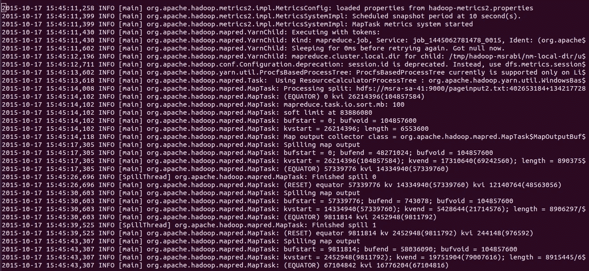
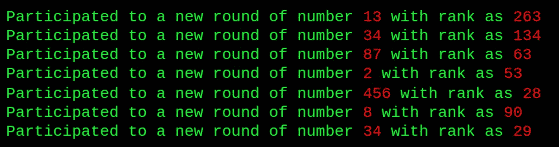
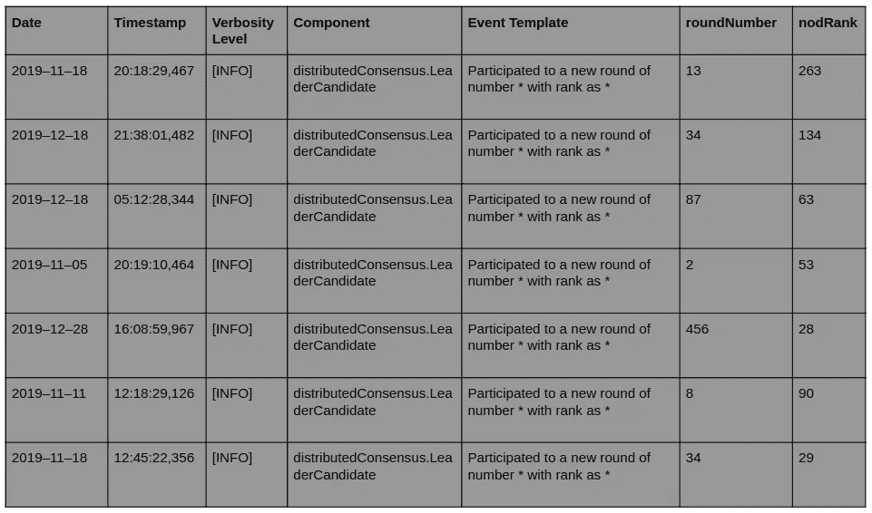

# 使用日志了解您的计算机系统📃

> 原文：<https://towardsdatascience.com/understand-your-computer-system-using-logs-98139d0b5de1?source=collection_archive---------35----------------------->

> *System.out.println("到此为止的作品")；*

作为一个程序员，你可能已经写了上面的代码段来弄清楚你的代码是怎么回事(这里是 Java)。通常，当我们试图调试代码时，我们会使用这种技巧。我们这样做是为了理解代码、执行流程并识别代码中的错误。记录和理解计算机系统执行的系统方法是系统日志。系统日志不仅仅用于调试。它们用于更具挑战性的计算机系统相关用例。其中包括系统监控、工作流建模、性能调查和异常检测。让我们看看如何使用系统日志来了解我们的计算机系统，以及当它被用作大数据时有多强大。

# 什么是日志数据？

计算机系统生成由系统运行时信息组成的系统日志。通常，日志文件包含一系列日志行，代表系统中发生的不同事件。系统日志是使用描述系统当前运行时信息的单独代码段写入文件的输出。以下是阿帕奇 [SLF4J](http://www.slf4j.org/) 登录 Java 的方式。

```
LOGGER.info(“Participated to a new round of number” + roundNumber + “with rank as “ + nodeRank);
```

下面给出了可能的原始日志行，它将通过执行上述代码段写入日志文件。

```
2019–11–18 20:18:29,467 [INFO] distributedConsensus.LeaderCandidate Participated to a new round of number 13 with rank as 263
```

一个日志文件可能包含成百上千个类似于上面例子的日志，描述你的计算机系统的故事。这些日志行可以是*错误*消息、*警告、调试*级别消息或一般*信息*消息或其他类型的日志消息。为了使日志记录变得简单和一致，在 Java 编程中使用了像 [SLF4J](http://www.slf4j.org/) 、[日志回溯](http://logback.qos.ch/)这样的日志记录框架。 [Log4js](https://www.npmjs.com/package/log4js) 和 [Winston](https://www.npmjs.com/package/winston) 是 Node.Js 中常用的日志记录工具，这些日志记录框架为您提供了一套 API 来实现简单、一致和健壮的日志记录体验。可以将它们配置为在日志消息中嵌入附加信息，如日期、时间、详细级别和当前运行的进程(如示例所示)，而无需在日志消息中明确指定。



日志文件中的原始日志行(取自 [loghub](https://github.com/logpai/loghub) 中的 Hadoop 数据集)

# 原木线上的鸟瞰图

生成的日志行可能包含不同的标题字段(取决于所使用的日志框架、配置和程序员希望与日志一起存储的信息)以及用自然语言编写的日志消息，该日志消息包含程序员希望记录的系统事件的详细信息。

在上面的例子中，`2019–11–18 20:18:29,467 [INFO] distributedConsensus.LeaderCandidate`可以被识别为由空格分隔的标题字段的集合。这些字段被嵌入到日志行中，因为程序员已经配置了日志框架来这样做。`Participated to a new round of number 13 with rank as 263` 是自然语言日志消息，包含程序员想要记录的系统事件信息。这部分的内容完全取决于程序员记录的系统事件和他们使用的(英语)语言。要获得日志数据的真正优势，重要的是日志数据中提到的信息能够被人类容易地理解。

# 了解日志数据

日志数据可以被视为大数据的半结构化形式之一，因为原始日志行由结构化的标题和非结构化的日志消息组成。尽管我们有大量的日志数据来描述我们系统的整个故事，但是通过阅读日志来理解日志数据是非常困难的。这主要是因为日志消息部分是由人类使用(主要)英语编写的。识别日志行的标题字段并不困难，因为日志行的这一部分具有由日志框架定义的结构。在上面的例子中，我们很容易理解，`2019–11–18` 是日期，`20:18:29,467`是时间戳，`[INFO]`是详细级别，`distributedConsensus.LeaderCandidate`是执行该事件的进程或组件。

理解日志数据真正困难的部分是理解自然语言日志消息，其中包含关于所记录的系统事件的最重要信息。因此，主要关注自然语言日志消息的结构化。通过观察上面生成日志行的代码段，我们可以理解程序员记录了一个与“参与一轮”相关的事件。我们还可以看到，事件可能在不同的情况下发生，因此，代码中指定的参数值(roundNumber，nodeRank)可能会因日志行的不同而不同。这是因为它们是特定事件的动态决定信息。



同一事件的一组日志消息

在日志分析研究领域中，`Participated to a new round of number ..... with rank as .....`部分被识别为日志消息的**恒定部分**或**固定部分**，因为它可以在“参与一轮”类型事件的任何日志消息事件中找到。日志消息的这个**常量部分**完全取决于记录系统事件的程序员所使用的文字和语言。日志消息的这个常量部分的实际用途是，它是“参与一轮”类型事件的所有日志消息的一般代表。也就是说，根据日志代码语句中给变量( *roundNumber* 和 *nodeRank* 的值)的不同，同一事件的日志消息会有所不同。因此，出现在日志代码中该变量位置的值(上例中的 13 和 263、34 和 134 …)被标识为**可变部分**或**可变部分**。大多数情况下，这些可变部分由数值组成，但并非所有情况都是如此。日志消息的**可变部分**携带系统的动态运行时信息，因此是非常有价值的信息源。

如果我们能够将日志文件中的日志消息的**常量部分**与**变量部分**分开会怎么样？如果可能的话，我们可以生成一个结构良好、比原始日志文件更容易理解的日志报告。这种结构化日志报告可以表示为一个表，该表具有描述日志行的标识符字段的不同列和表示每个日志行实例的行。



更易于理解的结构化日志报告

这种日志报告比原始日志文件更容易理解。这就是为什么许多技术和方法被建议从日志文件生成结构化日志报告。当前日志分析系统中使用的一些技术是频繁模式挖掘方法、日志数据聚类、捕捉日志行中模式的基于启发的方法等。关于日志结构方法的更多细节将在以后的文章中描述。

快乐阅读…！