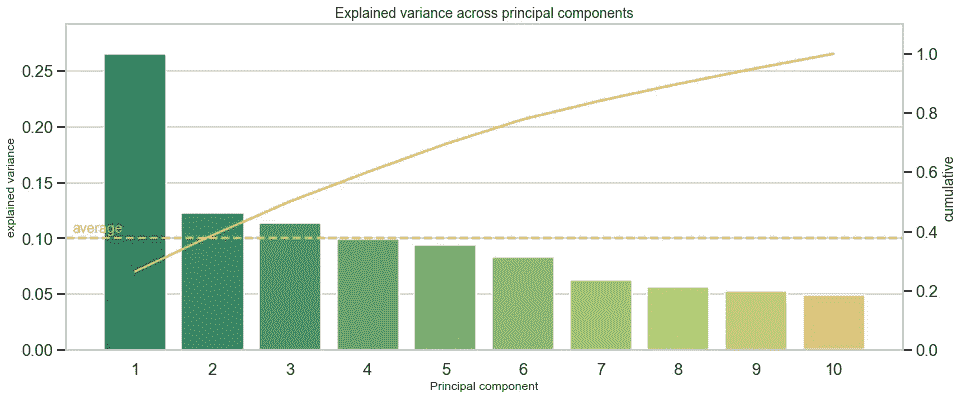
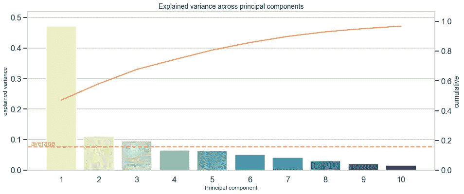
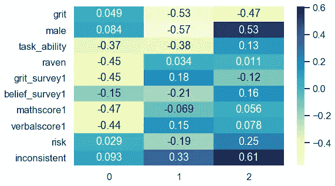

# 使用主成分分析(PCA)了解您的数据，并发现潜在模式

> 原文：<https://towardsdatascience.com/understand-your-data-with-principle-component-analysis-pca-and-discover-underlying-patterns-d6cadb020939?source=collection_archive---------7----------------------->

## 超越描述的增强型数据探索

超越均值、分布和相关性的数据探索节省时间、资源并保持健康:利用主成分分析透视变量的表面。它节省了时间和资源，因为它在一个小时的模型训练之前发现了数据问题，并且对程序员的健康有好处，因为她用更愉快的事情来换取对数据的担忧。例如，一个经过充分验证的机器学习模型可能会失败，因为一维数据的方差不足或其他相关问题。PCA 提供了有价值的见解，使您对数据属性及其隐藏的维度充满信心。

本文展示了如何利用 PCA 来理解数据集的关键属性，从而节省时间和资源，最终带来更快乐、更充实的编码生活。我希望这篇文章有助于以一致的方式应用 PCA 并理解其结果。


乔纳森·博尔巴拍摄的照片

# TL；速度三角形定位法(dead reckoning)

PCA 提供了超越描述性统计的有价值的见解，并有助于发现潜在的模式。两个 PCA 度量表示 1。有多少个分量获得了方差的最大份额(*解释方差*)，以及 2。，哪些特性与最重要的组件相关(*因子加载*)。**这些指标交叉检查项目工作流程**中的先前步骤，例如数据收集，然后可以对其进行调整**。**作为一个快捷易用的工具，我在[本笔记本](https://github.com/philippschmalen/Code-snippets/blob/master/PCA_workflow.ipynb)或[本脚本](https://github.com/philippschmalen/Code-snippets/blob/master/helper_pca.py)中提供了函数`do_pca()`，它对准备好的数据集进行 PCA，以在几秒钟内检查其结果。

# 作为安全网的数据探索

当项目结构类似于下面的结构时，准备好的数据集在 4。一步一步看描述性统计。其中最常见的是所有观察值或子组的平均值、分布和相关性。

**常见项目结构**

1.  收集:收集、检索或加载数据
2.  处理:格式化原始数据，处理缺失条目
3.  工程:构建和选择特征
4.  **探索:检查描述符、属性**
5.  建模:训练、验证和测试模型
6.  评估:检查结果，比较模型

当经过几个小时的工作后拥有一个干净的数据集的时刻到来时，许多人已经开始关注将模型应用于数据这一激动人心的步骤。在这个阶段，如果数据没有从天上掉下来，清理和处理，大约 80–90%的项目工作量已经完成。当然，对于建模的渴望是强烈的，但是这里有两个充分的数据探索可以节省时间的原因:

1.  **捕捉编码错误** →修改特征工程(步骤 3)
2.  **识别潜在属性** →重新思考数据收集(步骤 1)、预处理(步骤 2)或特征工程(步骤 3)

在几个小时的训练、验证和测试后，担心由于潜在的数据问题而表现不佳的模型就像一个摄影师在片场，不知道他们的模型可能会是什么样子。因此，关键信息是将**数据探索视为了解您的数据**的机会，了解其优势和劣势。

描述性统计常常揭示编码错误。然而，检测潜在问题可能需要更多。PCA 等分解方法有助于识别这些问题，并能够修正之前的步骤。这确保了向模型构建的平稳过渡。


照片由[哈里森·海因斯](https://www.pexels.com/@harrisonhaines?utm_content=attributionCopyText&utm_medium=referral&utm_source=pexels)从 [Pexels](https://www.pexels.com/photo/professional-photographer-during-photo-shoot-in-studio-3800848/?utm_content=attributionCopyText&utm_medium=referral&utm_source=pexels) 拍摄

# 用 PCA 看表面之下

无论如何，大型数据集通常需要 PCA 来降低维数。这种方法可以捕捉要素间的最大可能方差，并将观测值投影到互不相关的向量(称为分量)上。尽管如此，主成分分析除了降维还有其他用途。它还有助于发现跨特性的潜在模式。

为了专注于 Python 中的实现而不是方法论，我将跳过描述 PCA 的工作方式。有许多关于它的很棒的资源，我引用它们来代替:

*   展示常设仲裁法院运作的动画:[https://setosa.io/ev/principal-component-analysis/](https://setosa.io/ev/principal-component-analysis/)
*   PCA 在一次家庭谈话中解释道:[https://stats.stackexchange.com/a/140579](https://stats.stackexchange.com/a/140579)
*   史密斯[2]。主成分分析教程:[此处可访问](https://ourarchive.otago.ac.nz/bitstream/handle/10523/7534/OUCS-2002-12.pdf)。

两个指标对于理解数据探索的 PCA 至关重要:

> ***1。解释方差*** *衡量一个模型能在多大程度上反映整个数据的方差。主成分试图捕捉尽可能多的差异，这一措施表明，在多大程度上他们可以做到这一点。它有助于看到组件按解释的方差排序，第一个得分最高，所有组件的总和最多为 1。*
> 
> ***2。因子加载*** *表示一个变量与一个组件的相关程度。每个组成部分都由变量的线性组合构成，其中一些变量可能比其他变量更重要。因子载荷以相关系数的形式表示，范围从-1 到 1，并使成分可以解释。*

接下来的章节将 PCA 应用于来自行为领域实验的激动人心的数据，并指导使用这些指标来增强数据探索。

# 负荷数据:对砂砾的随机教育干预(Alan 等人，2019 年)

iris 数据集很好地充当了几种 PCA 的典型例子。为了多样化并使用来自实地研究的新数据，我依赖于 Alan 等人[1]的复制数据。我希望这是值得赞赏的。
它包括来自土耳其学校行为实验的数据，10 岁的孩子参加了一个课程，以提高一种叫做毅力的非认知技能，这种技能被定义为坚持不懈地追求一项任务。作者对个体特征进行了采样，并进行了行为实验，以测量接受项目(`grit == 1`)和参加控制治疗(`grit == 0`)的人之间的潜在治疗效果。

下面的代码从一个 URL 加载数据，并将其存储为 pandas dataframe。

```
# To load data from Harvard Dataverse
import io 
import requests# load exciting data from URL (at least something else than Iris)
url = ‘[https://dataverse.harvard.edu/api/access/datafile/3352340?gbrecs=false'](https://dataverse.harvard.edu/api/access/datafile/3352340?gbrecs=false')
s = requests.get(url).content# store as dataframe
df_raw = pd.read_csv(io.StringIO(s.decode(‘utf-8’)), sep=’\t’)
```


照片由 [cottonbro](https://www.pexels.com/@cottonbro?utm_content=attributionCopyText&utm_medium=referral&utm_source=pexels) 从 [Pexels](https://www.pexels.com/photo/kid-on-white-table-painting-3662630/?utm_content=attributionCopyText&utm_medium=referral&utm_source=pexels) 拍摄

# 预处理和特征工程

为了使 PCA 发挥作用，数据必须是数字的、无遗漏的和标准化的。我将所有步骤放入一个函数(`clean_data`)中，该函数返回一个具有标准化特征的数据帧。并执行项目工作流程的步骤 1 至 3(收集、处理和工程)。首先，导入必要的模块和包。

```
import pandas as pd
import numpy as np# sklearn module
from sklearn.decomposition import PCA# plots
import matplotlib.pyplot as plt
import seaborn as sns
# seaborn settings
sns.set_style("whitegrid")
sns.set_context("talk")# imports for function
from sklearn.preprocessing import StandardScaler
from sklearn.impute import SimpleImputer
```

接下来，定义`clean_data()`函数。它提供了一种将原始数据转换为准备好的数据集的快捷方式，该数据集具有(I)选定的要素，(ii)漏项由列表示代替，以及(iii。)标准化变量。

*关于所选功能的说明:*我在(iv)中选择了功能。)根据他们的复制脚本，可在 [Harvard Dataverse](https://dataverse.harvard.edu/dataset.xhtml?persistentId=doi:10.7910/DVN/SAVGAL) 上访问，并且仅使用样品 2(公开访问的[工作文件](https://www.povertyactionlab.org/sites/default/files/research-paper/5555_Ever-Falied-Try-Again--Succeed-Better_Alan-Ertac-Boneva_March2016.pdf)中的“样品 B”)。为简明起见，请参考论文中的相关描述(第 30 页，表 2)。

准备数据需要一行代码(v)。

```
def clean_data(data, select_X=None, impute=False, std=False): 
    """Returns dataframe with selected, imputed 
       and standardized features

    Input
          data: dataframe
          select_X: list of feature names to be selected (string)
          impute: If True impute np.nan with mean
          std: If True standardize data

    Return
        dataframe: data with selected, imputed 
                   and standardized features    
    """

    # (i.) select features
    if select_X is not None:
        data = data.filter(select_X, axis='columns')
        print("\t>>> Selected features: {}".format(select_X))
    else:
        # store column names
        select_X = list(data.columns)

    # (ii.) impute with mean 
    if impute:
        imp = SimpleImputer()
        data = imp.fit_transform(data)
        print("\t>>> Imputed missings")

    # (iii.) standardize 
    if std:
        std_scaler = StandardScaler()
        data = std_scaler.fit_transform(data)
        print("\t>>> Standardized data")

    return pd.DataFrame(data, columns=select_X)#  (iv.) select relevant features in line with Alan et al. (2019)
selected_features = ['grit', 'male', 'task_ability', 'raven', 'grit_survey1', 'belief_survey1', 'mathscore1', 'verbalscore1', 'risk', 'inconsistent']# (v.) select features, impute missings and standardize
X_std = clean_data(df_raw, selected_features, impute=True, std=True)
```

现在，数据已准备好供探索。

# Scree 图和因子载荷:解释 PCA 结果

PCA 产生与数据探索相关的两个度量:首先，每个分量解释了多少方差(scree plot)，其次，变量与分量有多少相关性(因子加载)。以下部分提供了一个实际示例，并通过 PCA 输出提供了一个解释方差的 scree 图和一个因子负荷热图。

# 解释方差显示变量的维数

如今，数据非常丰富，数据集的规模也在持续增长。数据科学家通常要处理数百个变量。然而，这些变量值得他们记忆吗？换句话说:一个变量捕捉独特的模式还是测量其他变量已经反映的相似属性？

主成分分析可以通过每个成分的解释方差来回答这个问题。它详细说明了观察到最大差异的基础维度的数量。

下面的代码从 sklearn 初始化一个 PCA 对象，并沿着计算出的分量(I .)转换原始数据。此后，检索关于解释的差异的信息(ii。)和印刷(iii。).

```
# (i.) initialize and compute pca
pca = PCA()
X_pca = pca.fit_transform(X_std)# (ii.) get basic info
n_components = len(pca.explained_variance_ratio_)
explained_variance = pca.explained_variance_ratio_
cum_explained_variance = np.cumsum(explained_variance)
idx = np.arange(n_components)+1df_explained_variance = pd.DataFrame([explained_variance, cum_explained_variance], 
                                     index=['explained variance', 'cumulative'], 
                                     columns=idx).Tmean_explained_variance = df_explained_variance.iloc[:,0].mean() # calculate mean explained variance# (iii.) Print explained variance as plain text
print('PCA Overview')
print('='*40)
print("Total: {} components".format(n_components))
print('-'*40)
print('Mean explained variance:', round(mean_explained_variance,3))
print('-'*40)
print(df_explained_variance.head(20))
print('-'*40)PCA Overview 
======================================== 
Total: 10 components 
---------------------------------------- 
Mean explained variance: 0.1 
---------------------------------------- 
explained variance cumulative 
1 0.265261 0.265261 
2 0.122700 0.387962 
3 0.113990 0.501951 
4 0.099139 0.601090 
5 0.094357 0.695447 
6 0.083412 0.778859 
7 0.063117 0.841976 
8 0.056386 0.898362 
9 0.052588 0.950950 
10 0.049050 1.000000 
----------------------------------------
```

**解释:**第一个成分约占解释方差的 27%。与其他数据集相比，这相对较低，但没关系。它只是表明大部分观察值(100%–27% = 73%)分布在不止一个维度上。接近输出的另一种方法是问:需要多少组件来覆盖超过 X%的方差？例如，我想降低数据的维数，并保留原始数据至少 90%的方差。那么我将不得不包括 9 个组成部分，以达到至少 90%，甚至在这种情况下有 95%的解释方差。在原始数据集中总共有 10 个变量的情况下，降低维度的范围是有限的。此外，这表明 10 个原始变量中的每一个都增加了一些独特的模式，并有限地重复了来自其他变量的信息。


来自 [Pexels](https://www.pexels.com/photo/brown-wooden-barrels-in-a-wine-cellar-3953808/?utm_content=attributionCopyText&utm_medium=referral&utm_source=pexels) 的[利奥·沃斯纳](https://www.pexels.com/@leo-woessner-2278256?utm_content=attributionCopyText&utm_medium=referral&utm_source=pexels)的照片

再举一个例子，我列出了“the”[葡萄酒数据集](https://archive.ics.uci.edu/ml/datasets/wine)的解释方差:

```
PCA Overview: Wine dataset 
======================================== 
Total: 13 components 
---------------------------------------- 
Mean explained variance: 0.077 
---------------------------------------- 
explained variance cumulative 
1 0.361988 0.361988 
2 0.192075 0.554063 
3 0.111236 0.665300 
4 0.070690 0.735990 
5 0.065633 0.801623 
6 0.049358 0.850981 
7 0.042387 0.893368 
8 0.026807 0.920175 
9 0.022222 0.942397 
10 0.019300 0.961697 
11 0.017368 0.979066 
12 0.012982 0.992048 
13 0.007952 1.000000 
----------------------------------------
```

这里，13 个成分中的 8 个足以捕获至少 90%的原始方差。因此，降维的空间更大。此外，它表明一些变量对数据中的方差贡献不大。

一个 **scree plot** 代替了纯文本，可视化了跨组件的解释方差，并告知每个组件的单独和累积解释方差。下一个代码块创建了这样一个 scree plot，并包括一个选项，当处理大型数据集的数百个组件时，可以将注意力集中在前 X 个组件上。

```
#limit plot to x PC
limit = int(input("Limit scree plot to nth component (0 for all) > "))
if limit > 0:
    limit_df = limit
else:
    limit_df = n_componentsdf_explained_variance_limited = df_explained_variance.iloc[:limit_df,:]#make scree plot
fig, ax1 = plt.subplots(figsize=(15,6))ax1.set_title('Explained variance across principal components', fontsize=14)
ax1.set_xlabel('Principal component', fontsize=12)
ax1.set_ylabel('Explained variance', fontsize=12)ax2 = sns.barplot(x=idx[:limit_df], y='explained variance', data=df_explained_variance_limited, palette='summer')
ax2 = ax1.twinx()
ax2.grid(False)ax2.set_ylabel('Cumulative', fontsize=14)
ax2 = sns.lineplot(x=idx[:limit_df]-1, y='cumulative', data=df_explained_variance_limited, color='#fc8d59')ax1.axhline(mean_explained_variance, ls='--', color='#fc8d59') #plot mean
ax1.text(-.8, mean_explained_variance+(mean_explained_variance*.05), "average", color='#fc8d59', fontsize=14) #label y axismax_y1 = max(df_explained_variance_limited.iloc[:,0])
max_y2 = max(df_explained_variance_limited.iloc[:,1])
ax1.set(ylim=(0, max_y1+max_y1*.1))
ax2.set(ylim=(0, max_y2+max_y2*.1))plt.show()
```



scree 图可能显示从一个组件到另一个组件的明显跳跃。例如，当第一个组成部分比其他部分不成比例地获得更多的方差时，这可能是一个迹象，表明变量提供了相同的潜在因素，或者没有增加额外的维度，但从稍微不同的角度说了相同的事情。

为了给出一个直接的例子，并感受一下跳跃看起来有多明显，我提供了[波士顿房价数据集](https://www.cs.toronto.edu/~delve/data/boston/bostonDetail.html)的 scree 图:



## PCA 节省时间的两个原因

> 假设你有数百个变量，应用主成分分析，你会发现前几个成分已经包含了大部分解释的方差。这可能暗示底层维度的数量比变量的数量少得多。最有可能的是，减少几百个变量导致**培训、验证和测试**的性能提升**。与等待模型本身发现几个变量背后缺乏方差相比，选择一个合适的模型并对其进行改进会有更多的时间。**
> 
> 除此之外，想象数据是由自己构建的，例如通过 web 抓取，并且抓取器从网页中提取预先指定的信息。在这种情况下，**检索到的信息可能是一维的**，此时 scraper 的开发人员脑子里只有几个相关的项目，但却忘记了包括揭示问题设置的其他方面的项目。在这个阶段，回到工作流程的第一步并**调整数据收集**可能是值得的。

# 发现特性和组件之间相互关联的潜在因素

除了解释方差之外，PCA 还提供了另一个有价值的统计量:每个主成分和一个变量之间的相关性，也称为因子负载。这种统计有助于掌握组件背后的维度。例如，数据集包括关于个人的信息，如数学成绩、反应时间和保持时间。最重要的维度是认知技能，与这些变量密切相关的部分可以被解释为认知技能维度。同样，当数据具有自信、耐心或责任心等特征时，另一个维度可能是非认知技能和个性。捕捉该区域的组件与那些特征高度相关。

以下代码创建了一个热图来检查这些相关性，也称为因素加载矩阵。

```
# adjust y-axis size dynamically
size_yaxis = round(X_std.shape[1] * 0.5)
fig, ax = plt.subplots(figsize=(8,size_yaxis))# plot the first top_pc components
top_pc = 3
sns.heatmap(df_c.iloc[:,:top_pc], annot=True, cmap="YlGnBu", ax=ax)
plt.show()
```



第一个因素与任务能力、推理分数( *raven* )、数学分数、语言分数强烈负相关，并与坚韧不拔的信念( *grit_survey1* )积极相关。将此归纳为一个共同的潜在因素是主观的，需要领域知识。在我看来，第一个组成部分主要是捕捉认知技能。

第二个因素与接受治疗(*勇气*)、性别(*男性*)负相关，与不一致正相关。解释这个维度不那么清晰，也更具挑战性。然而，它解释了 12%的变异，而不是像第一个组成部分那样解释了 27%，这导致了更难解释的维度，因为它稍微跨越了几个主题领域。接下来的所有组件可能同样难以解释。

变量获取相似维度的证据可能是均匀分布的因子载荷。启发我写这篇文章的一个例子是关于我的项目的[，在那里我依靠谷歌趋势数据和关于公司可持续性的自建关键词。第一个主成分的第 15 个最高因子载荷列表显示载荷范围从最高值 0.12 到最低值 0.11。因子载荷的这种均匀分布可能是一个问题。当数据是自己收集的，并且有人预先选择了要收集的内容时，这一点尤其适用。调整此选择可能会增加数据的维数，最终可能会提高模型性能。](https://philippschmalen.github.io/posts/esg_scores_pytorch_googletrends)

## PCA 节省时间的另一个原因是

> *如果数据是自行构建的，则因子加载显示每个特征如何影响基础维度，这有助于提出关于数据收集的* ***额外观点*** *以及哪些特征或维度可以增加有价值的差异。不是盲目猜测要添加哪些功能，因素加载导致* ***明智的数据收集决策*** *。它们甚至可能是寻找更高级功能的灵感。*

# 结论

总之，PCA 是数据探索工具箱中的一个灵活工具。其主要目的是降低大型数据集的复杂性。但它也有助于观察变量的表面，发现潜在的维度，并将变量与这些维度联系起来，使它们变得可以解释。要考虑的关键指标是**解释方差**和**因子加载**。

本文展示了如何利用这些指标进行超出平均值、分布和相关性的数据探索，并建立对数据底层属性的理解。识别跨变量的模式对于重新思考项目工作流程中的先前步骤是有价值的，例如数据收集、处理或特征工程。

> 感谢阅读！我希望你会发现它和我写这个指南一样有用。我很想知道你对这件事的想法。如果您有任何反馈，我非常感谢您的反馈，并期待收到您的[消息](https://philippschmalen.github.io/)。

# 附录

# 访问 Jupyter 笔记本

我使用`do_pca()`将主成分分析应用于更典型的数据集，如波士顿房地产市场、葡萄酒和虹膜。它展示了小数据集的 PCA 输出。随意下载[我的笔记本](https://github.com/philippschmalen/Code-snippets/blob/master/PCA_workflow.ipynb)或者[剧本](https://github.com/philippschmalen/Code-snippets/blob/master/helper_pca.py)。

# 关于因子分析与主成分分析的说明

这里有一个经验法则陈述:如果你想把你的相关观察变量减少到一个更小的不相关变量集，使用主成分分析来测试观察变量的潜在因素模型。

尽管这种区分在科学上是正确的，但在实际应用中却变得不那么相关了。PCA 与因子分析密切相关，因子分析通常会得出与我们所关心的数据属性相似的结论。因此，对于数据探索，区别可以放宽。[本帖](https://stats.stackexchange.com/a/133806)给出了一个应用环境中的示例，另一个带有因子分析实际操作代码的示例附在[笔记本](https://github.com/philippschmalen/Code-snippets/blob/master/PCA_workflow.ipynb)中。

最后，对于那些对因子分析和 PCA 之间的差异感兴趣的人，请参考[这篇文章](https://stats.stackexchange.com/questions/123063/is-there-any-good-reason-to-use-pca-instead-of-efa-also-can-pca-be-a-substitut)。请注意，在整篇文章中，为了准确起见，我从未使用过术语*潜在因素*。

# 参考

[1]艾伦，s .，博内瓦，t .，&厄塔克，S. (2019)。曾经失败，再试一次，更成功:一项关于毅力的随机教育干预的结果。经济学季刊，134(3)，1121–1162。

[2]史密斯，L. I. (2002 年)。主成分分析教程。