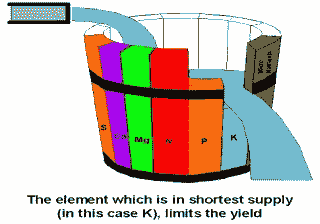

# 理解 zip()—Python 中隐藏的瑰宝

> 原文：<https://towardsdatascience.com/understand-zip-a-hidden-gem-in-python-9488a255f45d?source=collection_archive---------35----------------------->

## 有效地合并未知数量的列表


由 [Fabrizio Verrecchia](https://unsplash.com/@fabrizioverrecchia) 在 [Unsplash](https://unsplash.com/) 上拍摄的照片

在 Python 中，有几种方法可以合并 2 个列表/元组/集/字典。我所说的“合并”不仅仅是将一个元素附加到另一个元素上，而是将具有相同索引的元素分组。如果你在面试中，面试官要求你实现以下逻辑，你的第一个“蛮力”回答会是什么？


作者:高

大概你会想出这样的东西。程序遍历`city`的长度，每次都从具有相同索引的`country`和`city`中获取值，然后将它们放入一个元组中。这绝对是一个可行的解决方案，但不是你的面试官所期待的。

[蛮干. py](https://gist.github.com/highsmallxu/762de9e7fa30f88435b8840acb3fe8c9)

稍微改进一下，可以用`enumerate`迭代`city`。`enumerate`返回列表中每个元素的索引和值。所以我们可以用`ci`代替`city[i]`。但这仍然不是理想的答案。

[enumerate.py](https://gist.github.com/highsmallxu/4dd01295a240982a981088471c7b219f)

## zip()内置函数

Python 有许多隐藏的宝石，而`zip()`就是其中之一。它能够以更干净的方式解决同样的问题。我们都喜欢干净的代码，不是吗？

> 根据官方 Python 文档，`zip(*iterables)`创建了一个迭代器，它聚集了来自每个迭代器的元素。

**向拆包操作员重述(*)**

单个星号(*)意味着它解包迭代器。例如，如果您有两个列表`list1=["a1","a2"]`和`list2=["b1","b2"]`，您不必创建一个新的参数列表并将其传递给类似`zip([list1,list2])`的函数，相反，您可以只做`zip(list1, list2)`。

当您不知道函数的参数个数时，可以使用解包运算符(*)。比如你可以计算一个未知数量的自变量之和。

[拆包. py](https://gist.github.com/highsmallxu/6d8d028521bfbd9e89ad1540fe8ff2dc)

另一个拆包操作符是(**)。两个星号代表字典。这意味着每个参数必须有一个键，这就是为什么你通常把`**kwargs`(关键字参数)作为输入名。明确一下，你可以给它取任何名字，比如`**nums`。

[kwargs.py](https://gist.github.com/highsmallxu/78564cc88601f946edac6eecfc334235)

如果你想了解更多关于`*args`和`**kwargs`的知识，我推荐你阅读 [*Python args 和 kwargs:来自真实 Python 的去神秘化*](https://realpython.com/python-kwargs-and-args/) 。

[](https://realpython.com/python-kwargs-and-args/) [## Python 参数和 kwargs:去神秘化——真正的 Python

### 在这个循序渐进的教程中，您将学习如何在 Python 中使用 args 和 kwargs 来为您的…

realpython.com](https://realpython.com/python-kwargs-and-args/) 

`**zip()**`**vs**`**zip_longest()**`

再来说说`zip()`。我们知道`zip(*iterables)`的输入是一些迭代器。迭代器可以是一个*字符串*、*列表*、*元组、集合或字典。*在内部，`zip()`对所有迭代器进行多轮循环。在每一轮中，它对每个迭代器调用`next()`函数，并将值放入一个元组中，在这一轮结束时**产生**元组。然后继续下一轮。**如果任何迭代器用尽，循环将结束**。也许看代码更容易。Python 文档给出了下面的代码来帮助读者理解`zip()`是如何工作的。

[zip_implementation.py](https://gist.github.com/highsmallxu/1a387695ece6b04456f0691f5f8dcd56) (来源: [python doc](https://docs.python.org/3.3/library/functions.html#zip) )

那我们用`zip()`来解决前面的问题吧。每次都会产生一个元组。使用 yield 的一个优点是节省 RAM 的使用，因为我们不需要将整个结果序列存储在内存中。

[zip-example.py](https://gist.github.com/highsmallxu/09de348916edfd389d1b6472903cbb31)

默认的`zip()`遵循*坎尼金定律*，这意味着合并结果的长度取决于最短的输入迭代。这就是为什么在前面的例子中，您在输出中看不到国家`X`。



*康尼金定律(*来源:[博客](http://keropokleko.blogspot.com/2015/06/effects.html))

但是，如果希望合并后的结果与最长的**输入迭代器对齐，可以使用`[itertools.zip_longest](https://docs.python.org/3.3/library/itertools.html#itertools.zip_longest)`。在这种情况下，缺少的值将由用户定义的`fillvalue`填充。**

[zip-longest.py](https://gist.github.com/highsmallxu/ec88ae0684c7da1c78abf2a8d56243fb)

**拉开**

既然我们可以“压缩”2 个迭代器，我们也必须能够“解压缩”它。逻辑是`unzipped = zip(*zip(*iterables))`。在示例代码中，`zipped`和`unzipped`对象都有类`zip`，它们是不可读的。我们可以将它们转换成一个*列表*或一个*元组*。

[unzip.py](https://gist.github.com/highsmallxu/d0c2fac18cb52506c7aded18b22dff49)

**边缘案例**

对输入迭代器的数量没有限制。它可以是 0、1 或更多。拥有 0 个或 1 个输入迭代器的情况并不常见，但这仍然是可能的。

[zip-edge-cases.py](https://gist.github.com/highsmallxu/58b44a60e2a8f77883a49d4e1d0efd37)

**字典中的** `**zip()**`

以下代码的结果会是什么？在进一步阅读之前思考一下。

[zip-dictionary.py](https://gist.github.com/highsmallxu/d210af80c179ae60cc9d58970a33bfb4)

答案是`("city", "city", "city")`和`(“country”, “country”, “country”)`。为什么我们只有钥匙？

根据我们之前看到的，在内部`zip()`对每个输入参数执行`iter()`。所以问题是`iter(nl)`的产量是多少？如果我们执行`print(iter(nl))`，我们将得到`<dict_keyiterator object at 0x10e1e3f50>`。这就是为什么我们在结果中只接收键。

更好的方法是使用`nl.items()`作为输入。在这种情况下，我们能够在循环中接收键和值。

[zip-dictionary-2.py](https://gist.github.com/highsmallxu/ba9fb892fdef9548d5b332e58217ac31)

中的**混合型`**zip()**`**

迭代器的类型也没有限制。在下面的代码中，我们使用混合类型作为输入参数。结果会怎样？想一想。这个例子只是出于教育目的。它不应该是你见过的最好的代码。🙂

好吧，答案是:

```
('w', 'Amsterdam', ('key1', 'Netherlands'))
('o', 'Berlin', ('key2', 'Germany'))
('r', 'Chongqing', ('key3', 'China'))
```

每个`ele`是来自 3 个输入参数的 3 个元素的元组。`string`的长度应该考虑为 5，而不是 1。每个循环将返回 1 个字符。程序总共循环 3 次，因为输入的最短长度是 3。

如果你能回答这个问题并解释背后的原因，那么你已经掌握了这一章。

## 结论

`zip()`给了我们用干净的代码合并未知数量的迭代器的便利。当我们有许多大小相同的迭代器时，效果最好。`zip()`创建一个生成器，因此它能够处理长输入并节省 RAM 的使用。

同时，我们应该注意`zip()`的一些行为:

*   `zip()`遵循*康尼金定律。它不断产生元组，直到所有迭代器都用完为止。如果迭代器的长度不匹配，它不会抛出异常。*
*   `itertools.zip_longest`通过用用户自定义的`fillvalue`填充缺失值，解决了“长度”问题。
*   使用`zip()`中的`str`和`dict`时要小心。你需要很好地理解`iter`如何与`str`和`dict`一起工作。

我希望你喜欢这篇文章！如果你有任何想法，请在下面留下你的评论。

## 参考

 [## 2.内置函数- Python 3.3.7 文档

### Python 解释器内置了许多始终可用的函数和类型。它们被列出…

docs.python.org](https://docs.python.org/3.3/library/functions.html#zip) [](https://appdividend.com/2019/04/09/python-zip-example-python-zip-function-tutorial/) [## Python zip 示例|用于迭代的 Python zip()函数

### Python zip()是一个返回 zip 对象的内置函数，该对象是元组的迭代器，其中第一项…

appdividend.com](https://appdividend.com/2019/04/09/python-zip-example-python-zip-function-tutorial/)