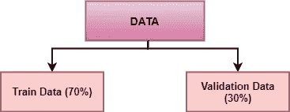

# 了解 8 种交叉验证

> 原文：<https://towardsdatascience.com/understanding-8-types-of-cross-validation-80c935a4976d?source=collection_archive---------3----------------------->

## 交叉验证及其类型的深入解释

图片由[穆罕默德·哈桑](https://pixabay.com/users/mohamed_hassan-5229782/?utm_source=link-attribution&amp;utm_medium=referral&amp;utm_campaign=image&amp;utm_content=4028234)来自 [Pixabay](https://pixabay.com/?utm_source=link-attribution&amp;utm_medium=referral&amp;utm_campaign=image&amp;utm_content=4028234)

**交叉验证**也被称为**抽样外技术**是数据科学项目的一个基本要素。这是一个重采样过程，用于评估机器学习模型，并评估该模型在独立测试数据集上的表现。

在这篇文章中，你可以读到 8 种不同的交叉验证技术，它们各有利弊，如下所列:

1.  ***留 p 不交叉验证***
2.  ***漏项交叉验证***
3.  ***维持交叉验证***
4.  ***重复随机子采样验证***
5.  ***k 倍交叉验证***
6.  ***分层 k 倍交叉验证***
7.  ***时间序列交叉验证***
8.  ***嵌套交叉验证***

在讨论交叉验证技术之前，让我们了解一下为什么要在数据科学项目中使用交叉验证。

## 为什么交叉验证很重要？

我们经常将数据集随机分为训练数据和测试数据，以开发机器学习模型。训练数据用于训练 ML 模型，并且在独立的测试数据上测试相同的模型，以评估模型的性能。

随着分裂的随机状态的改变，模型的精度也改变，因此我们不能实现模型的固定精度。测试数据应该独立于训练数据，这样就不会发生数据泄漏。在使用训练数据开发 ML 模型期间，需要评估模型性能。这就是交叉验证数据的重要性。

数据需要分成:

*   **训练数据:**用于模型开发
*   **验证数据:**用于验证同一型号的性能

(图片由作者提供)，验证分割

简单来说，交叉验证使我们能够更好地利用我们的数据。你可以进一步阅读、工作和实施 7 种类型的交叉验证技术。

# 1.留下 p-out 交叉验证:

保留 p-out 交叉验证(LpOCV)是一种详尽的交叉验证技术，它使用 p-观察值作为验证数据，其余数据用于训练模型。以各种方式重复这一过程，以在一组 *p* 观察值和一组训练集上切割原始样本。

p=2 的 LpOCV 的一种变体称为留对交叉验证，已被推荐为一种近乎无偏的方法，用于估计二元分类器的 [ROC 曲线](https://en.wikipedia.org/wiki/ROC_curve)下的面积。

# 2.留一交叉验证:

留一法交叉验证(LOOCV)是一种详尽的交叉验证技术。这是一个 p=1 的 LpOCV 范畴。

([来源](https://en.wikipedia.org/wiki/File:LOOCV.gif))，LOOCV 运营部

对于具有 n 行的数据集，选择第一行进行验证，其余(n-1)行用于训练模型。对于下一次迭代，选择第 2 行进行验证，其余的用于训练模型。类似地，重复该过程，直到 n 个步骤或期望的操作次数。

以上两种交叉验证技术都是穷举交叉验证的类型。穷举交叉验证方法是以所有可能的方式学习和测试的交叉验证方法。它们具有相同的优点和缺点，讨论如下:

## 优点:

1.  简单、易于理解和实施。

## 缺点:

1.  该模型可能导致较低的偏差。
2.  所需的计算时间很长。

# 3.维持交叉验证:

维持技术是一种彻底的交叉验证方法，它根据数据分析将数据集随机拆分为定型数据和测试数据。

(图片由作者提供)，70:30 将数据分别拆分为训练数据和验证数据

在维持交叉验证的情况下，数据集被随机分为定型数据和验证数据。一般来说，训练数据的分裂多于测试数据。训练数据用于归纳模型，验证数据用于评估模型的性能。

用于训练模型的数据越多，模型就越好。对于维持交叉验证方法，大量数据是从训练中分离出来的。

## 优点:

1.  和以前一样。

## 缺点:

1.  不适合不平衡的数据集。
2.  许多数据是从训练模型中分离出来的。

# 4.k 倍交叉验证:

在 k 折叠交叉验证中，原始数据集被均等地划分成 k 个子部分或折叠。对于每次迭代，从 k 个折叠或组中选择一个组作为验证数据，并且选择剩余的(k-1)个组作为训练数据。

([来源](https://en.wikipedia.org/wiki/File:KfoldCV.gif))，k 倍交叉验证

该过程重复 k 次，直到每组被视为有效，并作为训练数据保留。

(图片由作者提供)，k 倍交叉验证

通过取 k-模型验证数据的平均精度来计算模型的最终精度。

> LOOCV 是 k 倍交叉验证的变体，其中 k=n

## 优点:

1.  该模型具有较低的偏差
2.  低时间复杂度
3.  整个数据集用于训练和验证。

## 缺点:

1.  不适合不平衡的数据集。

# 5.重复随机子采样验证:

重复随机子采样验证也称为蒙特卡罗交叉验证，它将数据集随机分为训练和验证。不太可能将数据集 k 倍交叉验证拆分为非分组或折叠，但在这种情况下是随机拆分。

迭代的次数不是固定的，而是由分析决定的。然后对分割的结果进行平均。

(图片由作者提供)，重复随机子采样验证

## 优点:

1.  训练和验证分割的比例不依赖于迭代或分区的数量。

## 缺点:

1.  一些样本可能不会被选择用于训练或验证。
2.  不适合不平衡的数据集。

# 6.分层 k 倍交叉验证:

对于上面讨论的所有交叉验证技术，它们可能不适用于不平衡的数据集。分层 k-fold 交叉验证解决了不平衡数据集的问题。

在分层 k 折叠交叉验证中，数据集被划分成 k 个组或折叠，使得验证数据具有相同数量的目标类标签实例。这确保了一个特定的类不会过度出现在验证或训练数据中，尤其是当数据集不平衡时。

(图片由作者提供)，分层 k-fold 交叉验证，每个 fold 都有相同的目标类实例

通过取每个折叠得分的平均值来计算最终得分。

## 优点:

1.  适用于不平衡的数据集。

## 缺点:

1.  现在适用于时间序列数据集。

# 7.时间序列交叉验证:

数据的顺序对于时间序列相关问题非常重要。对于时间相关数据集，将数据随机分割或 k 倍分割成训练和验证可能不会产生好的结果。

对于时间序列数据集，根据时间将数据拆分为训练和验证，也称为**正向链接法**或**滚动交叉验证**。对于特定的迭代，训练数据的下一个实例可以被视为验证数据。

(图片由作者提供)，时间序列交叉验证

如上图所示，对于第一次迭代，前 3 行被视为训练数据，下一个实例 T4 是验证数据。训练和验证数据选择机会被转发用于进一步的迭代。

# 8.嵌套交叉验证:

在 k-fold 和分层 k-fold 交叉验证的情况下，我们在训练和测试数据中得到一个差的误差估计。在早期的方法中，超参数调整是单独进行的。当交叉验证同时用于调整超参数和推广误差估计时，需要嵌套交叉验证。

嵌套交叉验证可适用于 k 倍和分层 k 倍变异。阅读下面的文章，了解更多关于嵌套交叉验证及其实现的信息:

 [## 使用 Python 进行机器学习的嵌套交叉验证——机器学习掌握

### k-fold 交叉验证程序用于评估机器学习模型的性能。

machinelearningmastery.com](https://machinelearningmastery.com/nested-cross-validation-for-machine-learning-with-python/) 

# 结论:

交叉验证用于比较和评估 ML 模型的性能。在本文中，我们讨论了 8 种交叉验证技术及其优缺点。k-fold 和分层 k-fold 交叉验证是最常用的技术。时间序列交叉验证最适用于与时间序列相关的问题。

这些交叉验证的实现可以在 sklearn 包中找到。阅读[该 sklearn 文档](https://scikit-learn.org/stable/modules/cross_validation.html)了解更多详情。

# 参考资料:

[1]维基百科:[https://en . Wikipedia . org/wiki/Cross-validation _(statistics)](https://en.wikipedia.org/wiki/Cross-validation_(statistics))

> 感谢您的阅读