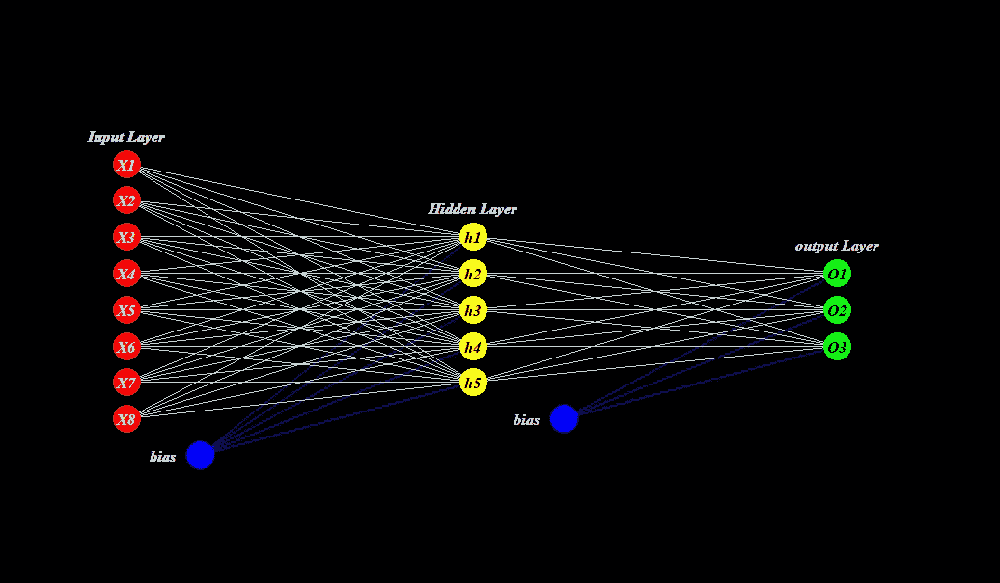
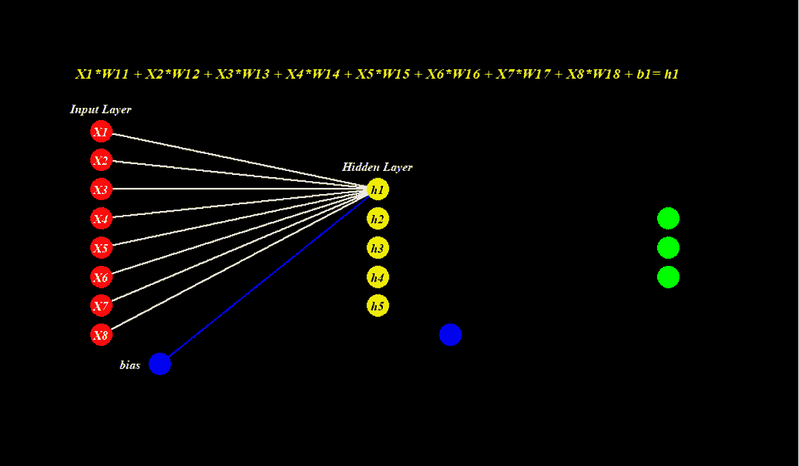
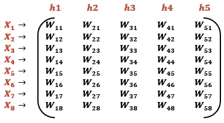
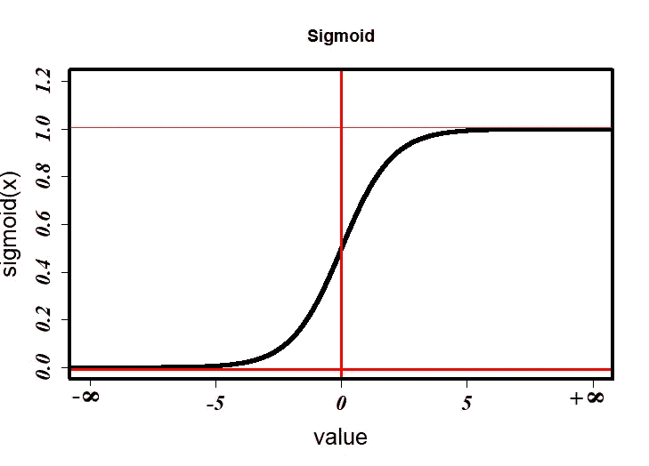
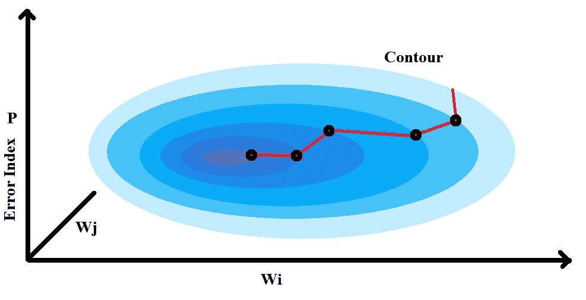
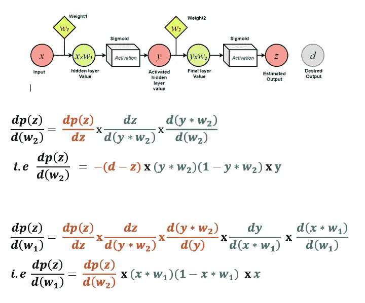
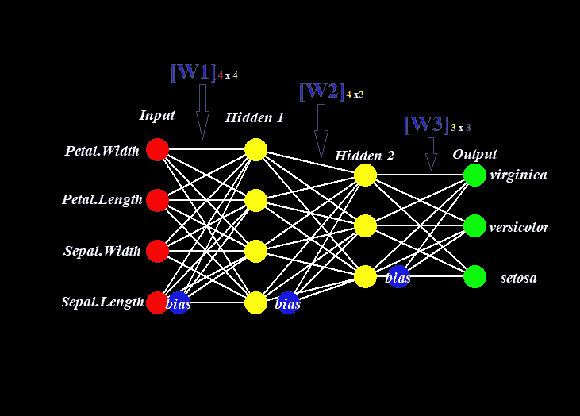
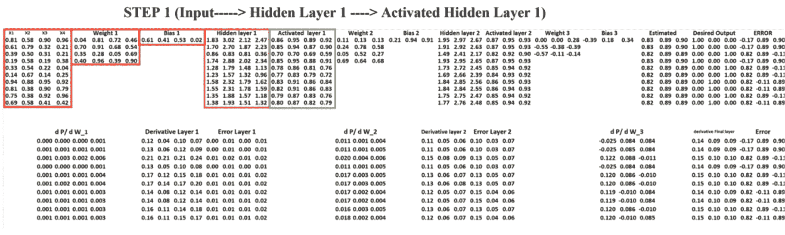
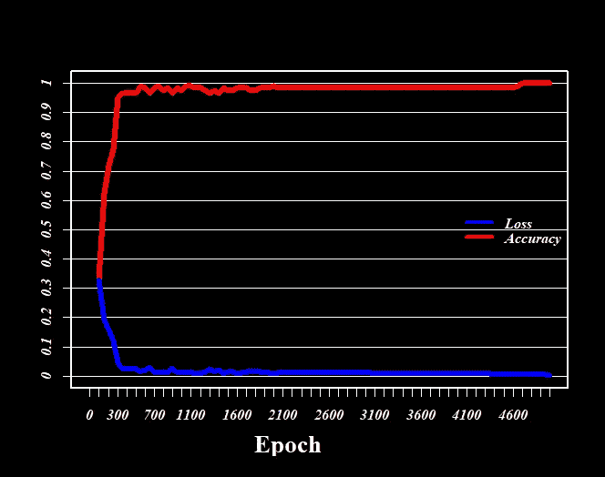

# 通过 R 中的划痕编码的神经网络；新手向导

> 原文：<https://towardsdatascience.com/understanding-a-neural-network-through-scratch-coding-in-r-a-novice-guide-a81e5777274b?source=collection_archive---------47----------------------->

## 动手香草建模第二部分


作者图片

如果你曾经深入研究过数据科学的世界，那么我认为你现在肯定在探索机器学习和人工智能或一般数据科学的旅程中的某个时候，在某个地方遇到过术语 ***【神经网络*** ，这并不荒谬。



图一。只有一个隐藏层的神经网络(图片由作者提供)

最被认可的神经网络(NN)定义是*它是一种受大脑启发的计算机架构，包含各种功能的网络拓扑，其中节点以特定的方式相互连接，通过迭代地遵循一系列算法来揭示数据集中的潜在模式(图 1)。*也许，只要有一点数学上的成熟和一点最优化理论的知识，把神经网络称为函数逼近器或回归器就简单得犯罪了。从我以前的文章中，我们通过一个实际的例子看到了 Keras 和 Tensorflow 等高级 API 如何使构建和训练神经网络变得非常简单。然而，Keras 和 Tesnsorflow 所提供的简单性困扰着一个具有顽强依赖性的初学者，并使新手真正难以理解 ***学习*** (前馈-反向传播)过程背后的实际底层数学和推理。从我的文章中，你可能会发现我是一个非常视觉化的人，当谈到学习时，我认为引人入胜的视觉效果有助于更深层次的理解。在这里，我将尝试稍微揭开这个黑匣子，我们将温和地深入到包含**梯度下降优化器**的**神经网络**的数学形式中，并全面尝试构建我们自己的网络。如果你对初等线性代数和微分方程不太熟悉，不要担心，因为视觉效果足以让这个概念在你的大脑控制台中滚动。同样，如果你对这些数学前提感到满意，那么你一定会意识到这个模型是多么的夸张。

现在，我们开始吧！！

## 神经网络 ***架构***

带有一个隐藏层的简单神经网络架构如图 2 所示。第一层叫做 ***输入层*** 。数据集的每个特征充当单个 ***神经元/节点*** (红色)。给定一组 ***权重*** ，这些节点的线性组合连同*(蓝色)生成下一个顺向层的单个节点，称为 ***隐藏层*** (黄色)。注意，输入层的 **iᵗʰ** 节点在形成隐藏层值 **hⱼ** 的 **jᵗʰ** 节点中的贡献是 iᵗʰ节点值 **Xᵢ** 和 jᵗʰ权重元组即 wⱼᵢ.的 iᵗʰ元素的乘积然后对隐藏层和输出层重复类似的方案。*

**

*图二。阐释神经网络(图片由作者提供)*

*在这一点上，我建议您尝试将权重元组可视化为列向量，组合形成一个矩阵 **W** 行等于当前层中的节点数，列等于后续层中的节点数。因此，对于动画中的给定网络，对应于输入层和隐藏层的权重矩阵 **W** 将为:*

**

*这种对权重的矩阵理解对于理解即将到来的基础数学很重要。*

*因为我们都知道神经网络的概念化是受大脑功能的启发，在这一点上，提到脑细胞/神经元的突触末端及其与神经网络的类比是很重要的。由上述操作产生的每个神经元值都类似于脑细胞携带的刺激，并且应该将其传递给下一个连接的神经元。轴突的突触末端有一种机制，决定刺激是否足够强大，可以传递到下一个神经元的树突。类似地，该激活由 NN 中的**激活功能**执行。因此，准确地说，每个生成的节点值都通过一个激活函数传递，该函数决定是否传递激励以及传递多少激励。*

**

*图 3。范围从-inf 到+inf 的 sigmoid 函数(图片由作者提供)*

*最常用的激活函数有 **Sigmoid** 、 **ReLU、Tanh、**和 **Softmax** (广义的 Sigmoid)。虽然 ReLU 函数只允许传递正值，但是 sigmoid 激活函数， ***S(x)*** 唯一地将任意实数 *x* 映射到范围(0，1)中图 3。数学上，***s(x)=1/(1+eˣ)***。有趣的是，*的微分即 ***dS(x)/dx*** 等于 ***S(x)(1-S(x))*** 。这在计算梯度时带来了极大的数学便利，也是为什么 sigmoid 是最著名的激活函数的原因。这个从一层到另一层的信息转换过程叫做**前馈**。**

**一旦估计了最终输出层，则使用误差指数函数 ***P*** 来评估性能。数学上，***P =*ll*d—z*ll*/2，*** 其中 ***d*** 是实际/期望输出， ***z*** 是估计输出。优化目标是最小化 ***P.*** 实践中有许多优化器，如牛顿下降法、ADAM 等。这里我们将重点介绍最流行、应用最广泛的**梯度下降**法。**

**既然 ***P*** 是 ***z*** 的函数，而后者又是权重*W*b .所以要尽量减少 ***P、*** 权重、***的变化*******

****

**图 4(作者图片)**

**现在让我们看看如何计算这些所需的梯度。因此，如果我们用图 2 中的实例映射这个前奏，这个过程看起来就像下图(图 5)。注意，为了计算性能指数相对于权重的梯度，即 ***dP/dW*** ₁和 ***dP/dW*** ₂，我们从过程的右端开始应用链式法则，向后传播。(回想一下，性能指标是***P =*ll*d—z*ll*/2。*** )。这个过程被称为**反向传播。****

****

**图 5。反向传播中的链式法则(图片由作者提供)**

**梯度**▽*p =σdpᵢ******/dwᵢ***对于 i = 1，2，3…，k+1 其中 k 为建筑深度。一旦 **▽ *P*** 被评估，权重和偏差分别升级为:**

*****W _ new = W _ current****—****【η*(*【P】*******b _ new = b _ current****—****【η*(*【P)******

*其中值 ***η*** 为学习率。这两个方程非常重要，我们会经常用到它们。有了这些笔记，我们现在将一步一步地制作我们的模型*

# ***逐步建模***

*为了建模一个简单的基于神经网络的分类模型，我将使用 Iris 数据集，该数据集具有四个特征和一个包含三个不同类别的标签向量。我们的模型将包含两个大小为 4 和 3 神经元的隐藏层。该模型如图 6 所示。*

**

*图 6。我们的模型(图片由作者提供)*

## *一个热编码*

*一个热编码，这是类**编码的**标签被移除并且为每个唯一标签值添加新的二进制变量{0，1}的地方。*

```
*set.seed(123)
data<-as.matrix(iris) #iris datasetclasses<-unique(data[,5])# retreive unique classes###########ONE HOT ENCODING###########
#Initializing an empty matrix
hot_encode<-matrix(0, ncol=length(unique(classes)), byrow = T,
                   nrow= nrow(data), 
                   dimnames = list(NULL, c(unique(classes))))#Imputing 1 at respective classfor(i in 1:nrow(data)){
  for(j in 1:3){
    if(data[i,5] == classes[j]){hot_encode[i,j]<-1} 
    else next
  }
}# Combining the data and encoded labels
data<-as.matrix(cbind(iris[,1:4], hot_encode))
data<-data[sample(1:nrow(data)), ]set.seed(123)
seq<-sample(1:nrow(data)) # preserving the shuffle orderhead(data)*
```

## ***定义功能***

*我们将需要一个 Sigmoid 激活函数***【S(x)】***及其导数函数***【S(x)【1-S(x)】***。此外，我们需要规范化的输入数据，即我们的虹膜数据集的特征列。*

```
*############ Sigmoid Activation Function######
activation<-function(x){ 
 y<- 1/(1+exp(-x)) #Sigmaod function
 return(y)
}###########Derivative of Sigmoid Function#####
derivative_activation<-function(x){
 y<-x*(1-x) #derivative of sigmoid function
 return(y)
}###########Normalization Function############
normalize<-function(x){
 for(i in 1:ncol(x)){
 x[,i]<-(max(x[,i])-x[,i])/(max(x[,i])-min(x[,i]))
 }
 return(x)
}#Normalizing the input before feeding to an NN is a good practice###
data[, 1:4]<-normalize(data[, 1:4])*
```

## *定义模型的结构并初始化权重矩阵*

```
*neuron_input<- 4 #Define number of neurons in Input layer
neuron_layer1<- 4 #Define number of neurons in first hidden layer
neuron_layer2<- 3 #Define number of neurons in second hidden layer
neuron_output<- 3 #Define number of neurons in the output layer#initalizing weight W1 and bias b1
set_weight_1<-matrix(runif(4*4, 0,1), 
 ncol= neuron_layer1, nrow= neuron_input)
bias_1<-runif(neuron_layer1, 0,1)#initalizing weight W2 and bias b2
set_weight_2<-matrix(runif(4*3, 0,1), 
 ncol= neuron_layer2, nrow= neuron_layer1)
bias_2<-runif(neuron_layer2, 0,1)#initalizing weight W3 and bias b3
set_weight_3<-matrix(runif(3*3, 0,1), 
 ncol= neuron_output, nrow= neuron_layer2)
bias_3<-runif(neuron_output, 0,1)################# TRAINING SET #################
input_layer<-data[1:120, 1:4]
label<-data[1:120, 5:7]################# TEST SET #####################
test<-data[121:150, 1:4]
test_label<-as.integer(iris$Species[seq[121:150]])#--------------------------------------------------------#
lr=0.1 # Learning Rate
er<-NA  # The performance function value
itr<-1  # Iteration/epoch
accuracy<-NA #Training Accuracy
t.accuracy<-NA #Test Accuracy
loss<-NA #loss vector containing the error value at current epoch*
```

# *模型拟合*

*从这里开始，逐步实现模型拟合。参考图 7，它通过仅显示前 10 个实例来说明梯度是如何计算的。*

```
*while(itr <= 5000){

  print(paste("epoch =", itr)) #print the current epoch
  itr<-itr+1 #Update the iteration number
  ###############FORWARD FEED##################################
  #-----------------------STEP 1-----------------------------#
  hidden_layer_1<-t(t(input_layer %*% set_weight_1) + bias_1) 
  activated_hidden_layer_1<-activation(hidden_layer_1)

  #-----------------------STEP 2-----------------------------#
  hidden_layer_2<-t(t(activated_hidden_layer_1 %*% set_weight_2) + bias_2)
  activated_hidden_layer_2<-activation(hidden_layer_2)
  #-----------------------STEP3------------------------------#
  final_layer<-activation(t(t(activated_hidden_layer_2 %*% set_weight_3) + bias_3))
  #-----------------------STEP4------------------------------#
  er<-sum(((label-final_layer)^2)/2)/120 
  error<- -(label-final_layer)
  loss[itr]<-er
  ###################BACKPROPOGATION#################################
  #-------------------------STEP5-----------------------------#
  derivation_final_layer<-derivative_activation(final_layer)
  delta_final_layer<- derivation_final_layer * error
  #-------------------------STEP6-----------------------------#
  derivative_hidden_layer_2<-derivative_activation(activated_hidden_layer_2)
  error_layer_2<-delta_final_layer%*%t(set_weight_3)
  delta_layer_2<- derivative_hidden_layer_2 * error_layer_2
  #-------------------------STEP7------------------------------#
  derivative_hidden_layer_1<-derivative_activation(activated_hidden_layer_1) 
  error_layer_1<- delta_layer_2 %*% t(set_weight_2)
  delta_layer_1<- derivative_hidden_layer_1 * error_layer_1

  #####################UPDATE##################################
  #-------------------------STEP8-----------------------------#
  set_weight_3 <-set_weight_3 -
    lr*t(activated_hidden_layer_2)%*%delta_final_layer

  #---------------------------STEP9--------------------------#
  set_weight_2 <-set_weight_2 -
    lr*t(activated_hidden_layer_1)%*%delta_layer_2

  #--------------------------STEP10--------------------------#
  set_weight_1 <-set_weight_1 -
    lr*t(input_layer)%*%delta_layer_1

  #--------------------------STEP11--------------------------#
  bias_3 <- bias_3 - lr* colSums(delta_final_layer)
  bias_2 <- bias_2 - lr* colSums(delta_layer_2)
  bias_1 <- bias_1 - lr* colSums(delta_layer_1)

  #---Storing the accuracy acheived at current epoch-------------#

  prediction<-NA
  for(i in 1:nrow(final_layer)){
    # Among the three values the maximum value indicates the     
    # instance's corrsponding class 
    prediction[i]<-(which(final_layer[i,]== max(final_layer[i,])))
  }
  actual<-as.integer(iris$Species[seq[1:120]])

  result<-table(prediction, actual) #Confusion Matrix
  accuracy[itr]<- sum(diag(result))/sum(result)
}#--------------------------------------------------------------#
#--------------------------------------------------------------#
#--Prediction function to classify the future test sets--------#predict<-function(test, label){
#Dont Worry, this is just a single forwardfeed using the final #learned weights t.hidden_layer_1<-t(t(test %*% set_weight_1) + bias_1)
  t.activated_hidden_layer_1<-activation(t.hidden_layer_1) t.hidden_layer_2<-t(t(t.activated_hidden_layer_1 %*% set_weight_2) + bias_2)
  t.activated_hidden_layer_2<-activation(t.hidden_layer_2)

  t.final_layer<-activation(t(t(t.activated_hidden_layer_2 %*% set_weight_3) + bias_3)) t.prediction<-NA
  for(i in 1:nrow(t.final_layer)){
    t.prediction[i]<-(which(t.final_layer[i,]== max(t.final_layer[i,])))
  }
  t.actual<-label
  t.result<-table(t.prediction, t.actual)
  colnames(t.result)<-unique(iris$Species)
  t.accuracy<- sum(diag(t.result))/sum(t.result)
  result<-list(t.result, t.accuracy)
  names(result)<- c("Confusion Matrix", "Result")

  return(result)
}* 
```

**

*图 7。前馈-反馈传播(图片由作者提供)*

# *是时候测试我们的模型了*

```
*predict(test,test_label)*
```

*对于我们的玩具模型来说，性能相当不错:)。这个模型只给出了一个错误的预测。测试集上的准确率为 0.966。*

**

*我们还可以绘制损耗曲线和精度曲线。你可以在这里得到完整的代码。*

**

*图 8。训练损失 vs 我们模型的训练精度**(作者图片)***

*唷…*

*我希望这个神经网络的快速概述能帮助你理解这个非常革命性的算法。我总是乐于接受任何有助于提高本文质量的建议，所以如果你遇到任何错误，请告诉我。谢谢你的阅读和快乐的 R-ing。*

# *其他著名读物*

*虽然互联网上充斥着关于神经网络的信息，但我仍然会参考一些非常简明扼要的文章。*

> *[训练神经网络的 5 种算法](https://www.neuraldesigner.com/blog/5_algorithms_to_train_a_neural_network)*
> 
> *[神经网络简介](/introduction-to-neural-networks-ead8ec1dc4dd)*
> 
> *[神经网络入门](https://medium.com/@purnasaigudikandula/a-beginner-intro-to-neural-networks-543267bda3c8)*