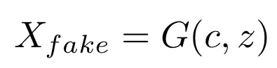
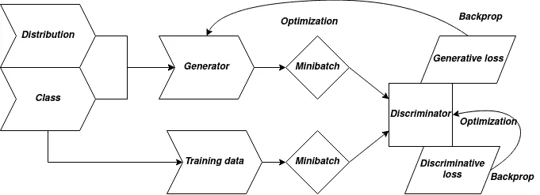
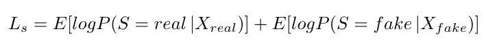
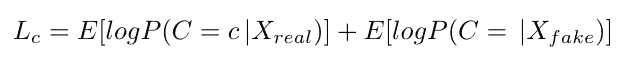
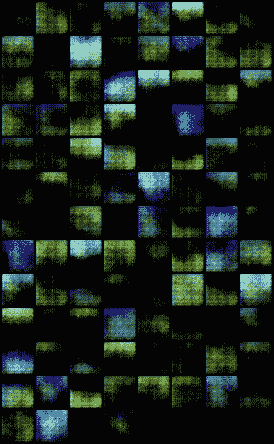
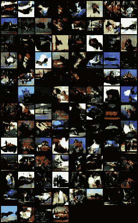

# 用代码理解 acgan[py torch]

> 原文：<https://towardsdatascience.com/understanding-acgans-with-code-pytorch-2de35e05d3e4?source=collection_archive---------15----------------------->

## Python-PyTorch

## 使用 PyTorch 库和 Python 构建 ACGAN 模型并了解更多信息

法比安·格罗斯在 [Unsplash](https://unsplash.com?utm_source=medium&utm_medium=referral) 上拍摄的照片

ACGAN 代表辅助分类器生成对抗网络。该网络由谷歌大脑的一组研究人员开发，并在澳大利亚悉尼举行的第 34 届国际机器学习会议上展示。本文简要描述了论文中所阐述的研究工作以及使用 PyTorch 实现的研究工作。

## 为什么是 ACGAN？

ACGAN 是一种特殊的 GAN，可以在图像合成方面创造奇迹。你告诉它类别标签，它就能生成图像——全部来自*完全噪声*！ACGAN 的另一个重要特点是，与以前的方法相比，它生成的图像分辨率相当高。但是任何图像都可以用双线性插值来调整大小，并且它的大小可以增加。没错，它们可以，但它们仍然是低分辨率图像的模糊版本，不会比它们更难以分辨。ACGAN 是第一个提出使用预先训练的初始网络来检查图像可辨性的想法。

[注意—此处构建的 PyTorch 模型是 ACGAN 论文的实现，仅包含生成器和鉴别器。自己动手对照预先训练好的初始网络来检查模型。请在评论中告诉我结果:)

## 体系结构

与任何 GAN 网络一样，ACGAN 由一个发生器和一个鉴别器组成。然而，在 ACGAN 中，除了噪声 *z 之外，每个生成的样本都有相应的类别标签 c ~ *C* (可用类别)，该类别标签帮助模型基于传递的标签来合成图像。生成器 G 使用类别标签和噪声 z 来生成图像。生成的图像可以表示为—*

生成的图像( ***假*** 因为它必须被鉴别器标记为假)

发电机架构非常简单。它由一系列反卷积层组成，也称为转置卷积层。迷惑？让我来给你解释一下—

> 转置卷积层与卷积层相同，但在原始输入中添加了填充。因此，当应用步长为 1 且无填充的卷积时，输出的高度和宽度大于输入的高度和宽度。步长为 2 时，我们可以对转置卷积层执行上采样，就像对步长为 2 的卷积层执行下采样一样。

发生器的转置卷积层由 ReLU 非线性支持。

鉴别器包含一组具有 leaky-ReLU 非线性的 2d 卷积模块，后面是线性层，以及用于其每个输出的 softmax 和 sigmoid 函数，用于检测模型的类别和来源。整个模型可以画为—

ACGAN 模型

既然我们已经通过它们的架构模型定义了发生器和鉴别器，我们将得到损失函数。

## 损失函数

ACGAN 的损失函数分为两部分

1.  被检查源的对数可能性—

源损耗

2.被检查类别的对数可能性—

阶级损失

从上面的损失函数可以明显看出，发生器和鉴别器在这个损失函数上“斗争”。生成器和鉴别器都试图最大化类损失。然而，源损耗是一个极小极大问题。发生器试图*最小化*源损耗并欺骗鉴别器。另一方面，鉴别器试图*最大化*源损耗，并试图阻止发电机占上风。

## 模特[PyTorch]

由于我们已经完成了对 ACGAN 论文的分析，现在我们将使用 CIFAR10 数据集构建模型。你可以从[这里](https://www.cs.toronto.edu/~kriz/cifar-10-python.tar.gz)下载数据集。事实上，我会将下载合并到培训本身，以摆脱麻烦！该数据集包含 60，000 张 32x32 尺寸的图像。有 10 个类，每个类有 6000 个图像。

发电机，写成一个模块—

ACGAN 的发生器模块

注意，在生成器中，卷积网络已经仔细选择了参数，使得输出张量与来自训练集的张量具有相同的维数。这是必要的，因为两者都进入鉴别器进行评估

鉴别器，也写成一个模块—

鉴别器模型

现在，让我们开始训练！

为了进行训练，我将 epochs 的数量设置为 100。学习率设置为 0.0002，批量设置为 100。

理想情况下，为了正确的图像合成，历元的数量应该更多。例如，我已经将它设置为 100

培训模式

## 结果！

让我们来看看这个小实验的结果

第一个时期的图像(噪声)

第一历元图像

上一个时代的图像—

第 100 代图像

很大的进步，是吧？甘斯的妙处在于，你可以通过影像看到模特的训练。随着模型慢慢了解分布情况，您可以看到跨时代的结构正在形成！你还在等什么？为模型编写自己的代码；用你自己的方式解决问题。如果可以的话，即兴创作解决方案——我们会看看是否能以你的名字命名；)

如果你卡住了，请在评论中告诉我！来帮忙了:)

查看我的博客以获得更快的更新，不要忘记订阅更多高质量的内容:D

[https://www.theconvolvedblog.vision/](https://www.theconvolvedblog.vision/)