# 了解用于决策树的 AdaBoost

> 原文：<https://towardsdatascience.com/understanding-adaboost-for-decision-tree-ff8f07d2851?source=collection_archive---------12----------------------->

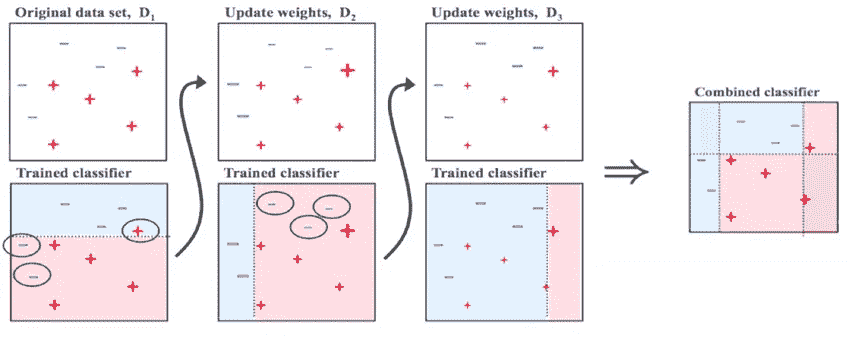

## 用 R 实现

[决策树](https://medium.com/analytics-vidhya/visualizing-decision-tree-with-r-774f58ac23c)是流行的机器学习算法，用于回归和分类任务。它们之所以受欢迎，主要是因为它们的可解释性和可表达性，因为它们模仿了人脑做出决策的方式。

在我以前的[文章](https://medium.com/analytics-vidhya/ensemble-methods-for-decision-trees-f4a658af754d)中，我已经介绍了一些决策树的集成方法，其目的是将一堆弱分类器转换成一个更强的分类器。在这里，我将详细阐述 Boosting 方法，这是算法在每次迭代中从错误中“学习”的一种方法。更具体地说，我将一步一步地解释 Adaboost 背后的思想以及如何用 r 实现它。

## Adaboost 背后的理念

Adaboost 和 bagging 方法(包括随机森林)之间的主要区别在于，在过程结束时，当迭代期间构建的所有分类器都被要求为新观察的目标投票时，将会有比其他树投票更重的树。这些是在所有迭代中表现最好的树(因此，它们表现出很少的错误分类)。比方说，在一天结束的时候，有些树会比其他树说得更多。这种“发言权的重要性”在整个迭代过程中被测量(和更新)。

除此之外，Adaboost 的其他重要特性，如预期的那样，是它从过去的错误中学习的能力，因为在每次迭代中，下一个分类器是基于过去的错误分类错误建立的。

现在让我们看看算法是如何具体工作的。

## 该算法

假设我们有一个数据集，有 N 个观察值，P 个协变量和一个二元目标变量 y=1，-1。这将是我们的火车布景。

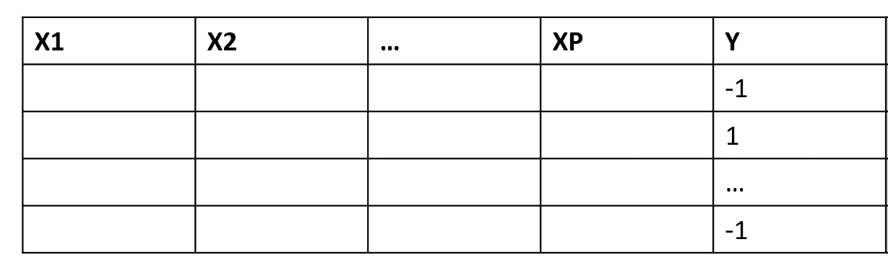

你可以用这个框架设计任何你感兴趣的任务(即，一封电子邮件是否是垃圾邮件，明天的天气是否晴朗……)。

*   我们要做的第一件事是给每一行分配一个权重，这表明该观察值被很好地分类有多重要。我们将这些权重初始化为 1/N，这样在第一次迭代时，当训练第一个分类器时，它们不会产生差异。

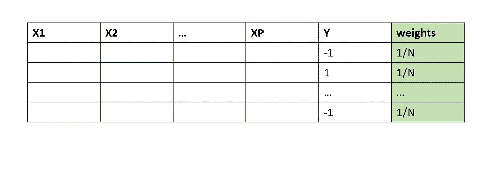

*   现在，我们在数据集上训练我们的第一个分类器 G(x ),然后检查哪些是错误分类的观察值，因为我们想要计算总误差，它不同于标准的错误分类误差，因为它是加权求和:

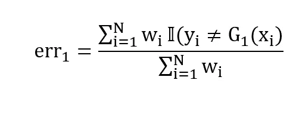

如您所见，我们有一个自标准化的加权误差总和(当目标与拟合值不同时)。请注意，由于其构建方式，总误差将始终介于 0 和 1 之间。有了这个量，我们就可以计算出我们所说的‘话语权的重要性’:

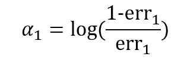

如你所见，误差越大，最后那棵树的投票就越不重要。我们也可以形象化地描述它:

```
error = seq(0,1,0.001)
alpha = log((1-error)/error)
plot(error,alpha, type='line')
```

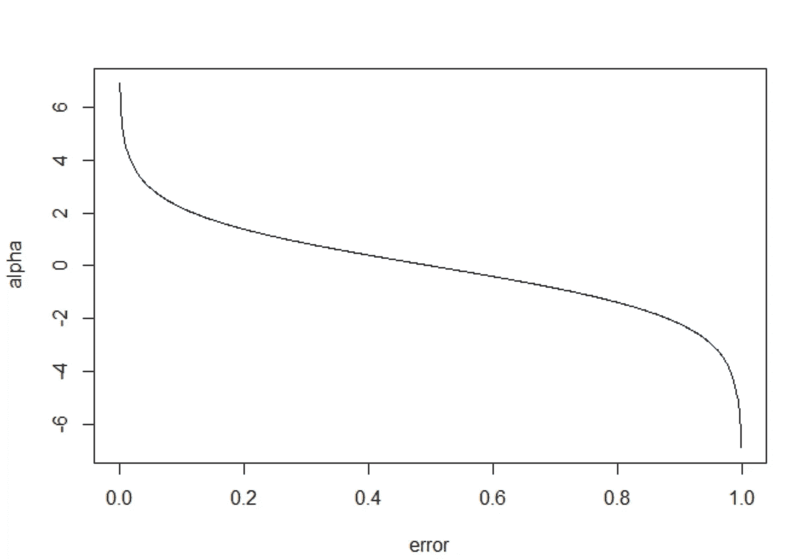

*   有了这个度量α，我们现在可以更新权重，使得对应于错误分类的观察值的权重在下一次迭代中将更高。通过这样做，当我们将在新的加权数据集上拟合下一棵树时，错误分类这些观察值的成本将会更高，并且树将会非常小心地不再错误分类它们(因为这将意味着更高的成本)。因此，对于所有的观察值，i=1，2，..，N，我们更新第 I 个权重如下。

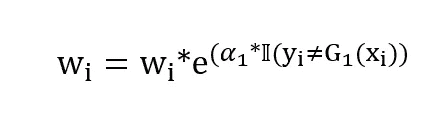

*   如果我们重复这个过程 M 次迭代，在一天结束时，我们将有 M 个分类器，每个分类器有一个加权投票，并且，如果我们想要预测新观察 x*的目标，公式是:

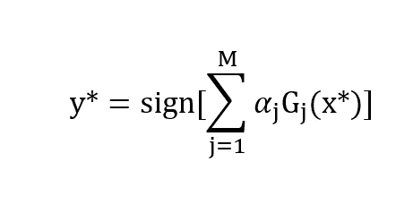

因此，将会有一些树的输出在最终决策中具有很大的决定性(-1 或 1)，而其他的树则可以忽略不计。

现在让我们来看看这个过程其余部分的一个非常简短的实现:

```
data = data.frame( X=c(rnorm(100,0,1),rnorm(100,1,1)), Y=c(rep(0,100),rep(1,100) ) )data$Y =factor(data$Y)
model =adaboost(Y~X, data, 10)
pred =predict( model ,newdata=data)
```

我们来看看模型的总结和它的预测误差(等于训练集中的误分类误差):

```
print(pred$error)
print(model)
```

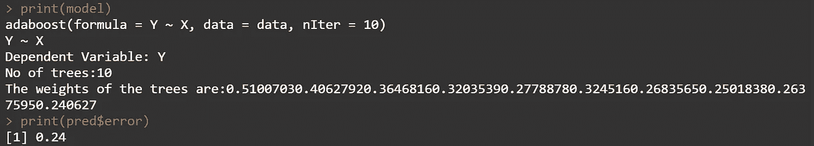

我们还可以检索最终的“重要性”权重:

```
model$weights
```

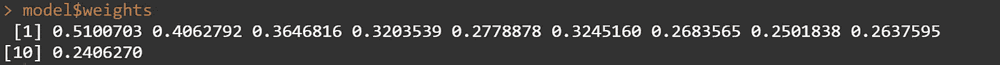

如你所见，有一些树(像第一棵树)的最终投票非常重要，而其他树(像最后一棵树)则不那么重要。

最后，我们可以将其误差与单棵树的误差进行比较:

```
single_model=tree(Y∼X, data)
summary(single_model)
```

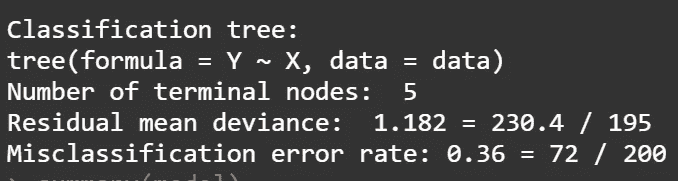

如你所见，我们的提升分类器比单一的树分类器更强。

## 结论

集成方法是强大的技术，可以大大提高决策树的预测准确性。然而，这些方法的警告是，它们使得呈现和解释最终结果变得不太容易。事实上，正如我们在开始时所说的，决策树最显著的特征是它们的可解释性和易于理解性，在一个看起来像“黑盒”的算法世界中，这是一个重要的价值。尽管如此，还是有一些视觉上的选择，如果集合多个树能提高那么多的准确性，那肯定是值得的。