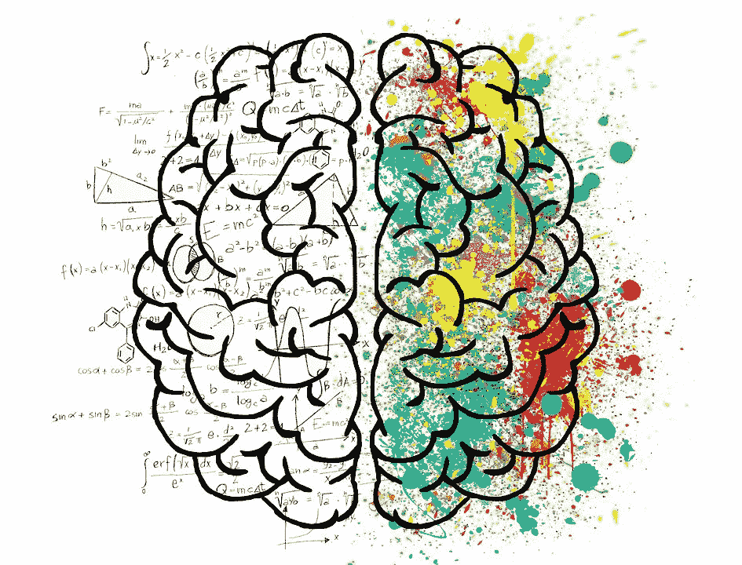
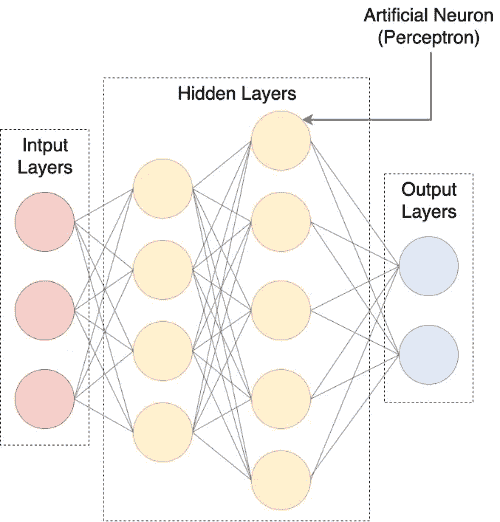
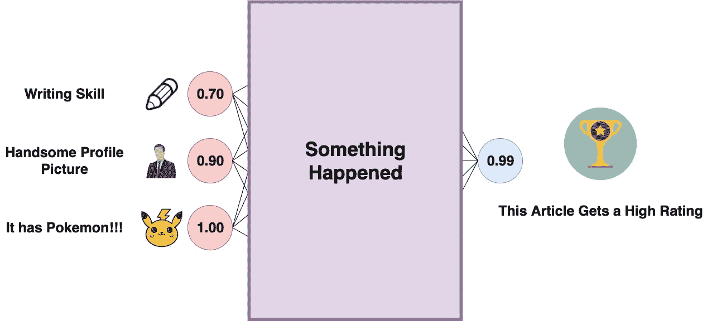
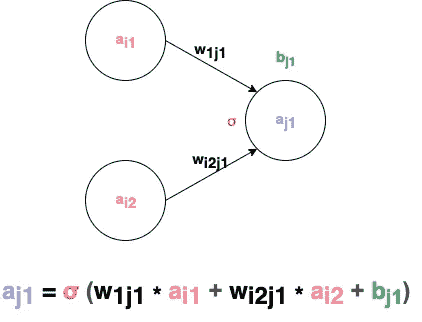
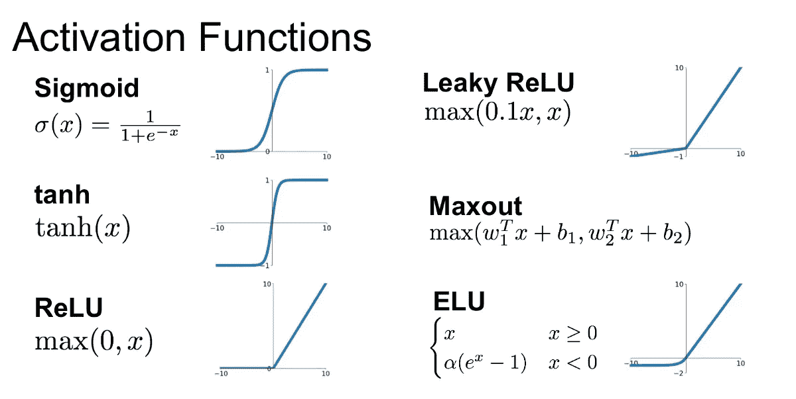
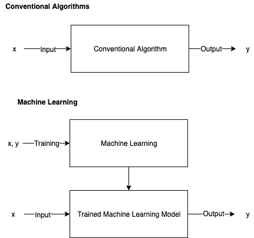
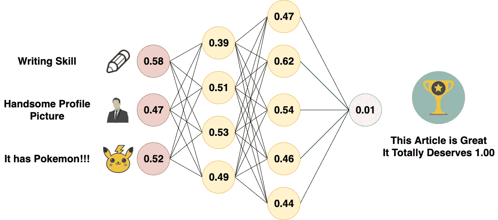
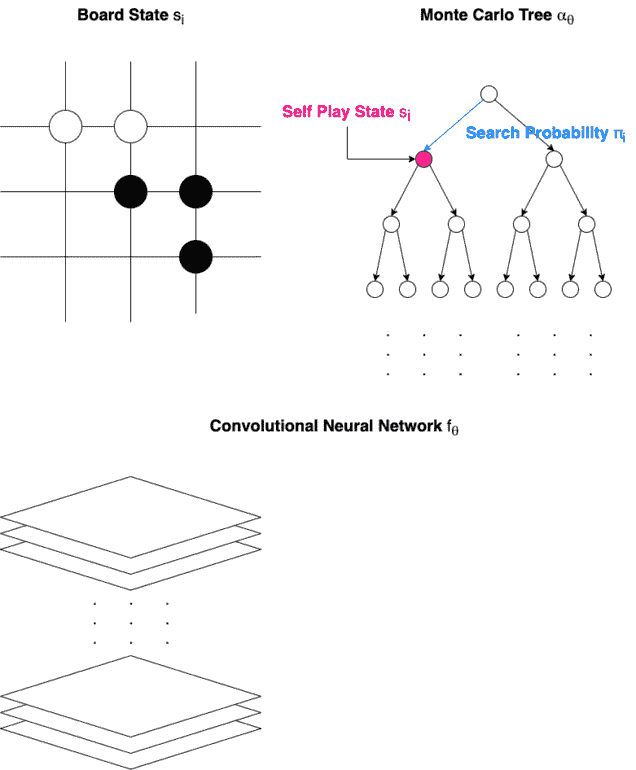

# 理解 AlphaGo:人工智能如何思考和学习(高级)

> 原文：<https://towardsdatascience.com/understanding-alphago-how-ai-thinks-and-learns-advanced-d70780744dae?source=collection_archive---------6----------------------->

## 是时候了解卷积神经网络、深度学习以及我们的现代人工智能如何赢得顶级围棋选手的比赛了…

> “作为一名技术专家，我看到人工智能和第四次工业革命将如何影响人们生活的方方面面。”
> 
> 费-李非

本文将从深度学习开始，深入到 DeepMind AI 的架构，就像 Alpha Go 一样。到文章结束的时候，我们应该能看懂很多人工智能领域最前沿的论文了，像 Alpha Go Zero 的[原论文](https://www.nature.com/articles/nature24270.epdf?author_access_token=VJXbVjaSHxFoctQQ4p2k4tRgN0jAjWel9jnR3ZoTv0PVW4gB86EEpGqTRDtpIz-2rmo8-KG06gqVobU5NSCFeHILHcVFUeMsbvwS-lxjqQGg98faovwjxeTUgZAUMnRQ)。蒙特卡罗树搜索(MCTS)和卷积神经网络是我们在理解 Alpha Go 如何工作之前应该熟悉的两个基本概念。如果你有兴趣了解更多，决策树、状态机、强化学习和蒙特卡罗树搜索等概念在[了解 alpha go:AI 如何思考和学习(基础)](/understanding-alphago-how-ai-think-and-learn-1-2-da07d3ec5278)中有解释。

这篇文章的目的是让人们了解 Alpha Go 是如何工作的，但它也可能会提高人们对人工智能领域的兴趣，因为人工智能领域的信息太多，无法包含在一篇中型文章中。我们将要学习更高级的材料，所以要准备好一些可能更难理解的东西。我会尽我所能，用最简单的方式解释这些概念。

我们开始吧！

深度神经网络的灵感来自我们大脑的理论，图片来自 [Pixabay](https://pixabay.com/illustrations/artificial-neural-network-ann-3501528/)

# 受数学和神经科学启发的深度神经网络

> “这是最糟糕的时候，其他人都在做不同的事情。”
> 
> ——本吉奥，CIFAR 项目的联合主任

## 神经网络简史

1943 年，神经生理学家沃伦·麦卡洛克和数学家沃尔特·皮茨基于称为[阈值逻辑单元(TLU)](https://en.wikipedia.org/wiki/Artificial_neuron) 的数学算法创建了计算模型，以描述神经元可能如何工作。在 20 世纪 50 年代计算机变得更加先进之前，模拟神经网络是可能的。

在 2000 年之前，这被认为是最糟糕的研究领域之一。LeCun 和 Hinton 以不同的方式提到了在这一时期他们的论文是如何由于他们的主题是神经网络而被拒绝发表的。人工神经元被认为是无用的，因为它的单个神经元甚至不能解决 [XOR](https://www.quora.com/What-is-XOR-problem-in-neural-networks) 逻辑。

这项研究由加拿大高级研究所资助。在该领域所有研究人员的不断努力下，Krizhevsky、Sutskever 和 Hinton 凭借卷积神经网络(CNN)赢得了 2012 年的 ImageNet 竞赛，卷积神经网络是 Yann LeCun 在 1998 年首次创建的模型。此后，深度神经网络几乎出现在每一篇论文中。

神经网络之所以在诞生后的很长一段时间里如此成功，还有其他原因。首先，这些模型严重依赖于计算能力，随着这些年来我们的计算机变得越来越先进，它们最终变得更加可行。更重要的是，为了充分训练这种先进的模型，需要大量的数据。在互联网与社交媒体、电子商务和移动设备一起受到消费者欢迎后，每天都会产生大量数据，这为每个人创造大量数字数据增加了更多机会。这些新技术也创造了对计算机视觉(CV)和自然语言处理(NLP)应用的需求。

在人工智能领域有两种对立的信念——**连接主义和**象征主义。联结主义认为认知科学的方法希望解释智能行为。另一方面，象征主义依赖于基于数学和逻辑运算的推理。虽然许多数学模型成功地完成了给定的任务，但也有足够多的研究表明，基于认知科学的方法确实加速了人工神经网络的学习过程。

连接主义与象征主义，图片来自 [Pixabay](https://pixabay.com/illustrations/brain-mind-psychology-idea-drawing-2062057/)

## 人工神经网络

术语“深度学习”是一个涉及深度神经网络的领域，意思是具有一个或多个隐藏层的人工神经网络。人工神经网络是一个[有向无环图(DAG)](https://en.wikipedia.org/wiki/Directed_acyclic_graph) 由人工神经元的连接层组成。这些人工神经元也被称为“感知器”，因此人工神经网络有时被称为多层感知器(MLP)。这些值将被输入到输入层，这是网络的第一层，结果将从输出层出来，这是最后一层。

人工神经网络(ANN)，有时也称为多层感知器(MLP)

我们可以将多层感知器视为一种投票方案，为了得出一个决定，输入层的每个感知器向下一层的感知器发送一个加权投票，再下一层……直到投票在输出层的感知器中完成。激活函数通常在中间很陡，以确保激活值位于两端，从而接近二进制判决值。[这里](https://playground.tensorflow.org/#activation=tanh&batchSize=10&dataset=circle&regDataset=reg-plane&learningRate=0.03&regularizationRate=0&noise=0&networkShape=4,2&seed=0.66045&showTestData=false&discretize=false&percTrainData=50&x=true&y=true&xTimesY=false&xSquared=false&ySquared=false&cosX=false&sinX=false&cosY=false&sinY=false&collectStats=false&problem=classification&initZero=false&hideText=false)是我们可以可视化人工神经网络如何分类数据的地方。

人工神经网络如何工作

**正向传播&激活函数**

在每一层中，有许多相互连接的感知器。感知器之间的机制可以由以下术语定义:

*   **激活( *a* )** :感知器的激活是通过对前一层感知器的激活求和，加上一个偏差，然后通过激活函数进行转换来计算的。
*   **Bias ( *b* )** :每次感知器接收到一个值，就会对该值应用一个 Bias。
*   **权重( *w* )** :感知器的激活值将被乘以一个权重并相加。
*   **激活函数( *σ* )** :从激活函数计算每个感知器的激活值。

感知器背后的数学

有几种类型的激活功能。Sigmoid 函数(σ)，经常与[学习曲线](https://en.wikipedia.org/wiki/Sigmoid_function)有关，是最基本的一个。每个激活功能都有其特点。整流线性单元(ReLU)是最受欢迎的一种。

[不同的激活函数及其图形](https://medium.com/@shrutijadon10104776/survey-on-activation-functions-for-deep-learning-9689331ba092)

每个感知器会将其值传播到前进层的感知器中，最终到达输出层。这个过程被称为**正向传播**。

人工神经网络的前向传播

**反向传播&成本函数**

前向传播基于权重、偏差和激活函数，但是是什么决定了这些值呢？激活函数是预先选择的，但是对于大型神经网络，不可能手动选择适当的权重和偏差。

在机器学习领域，模型应该自己从数据中“学习”，这个学习过程也称为“训练”。通常，数据被分成 2 个不同的集合——训练集合**和测试集合**。训练集用于将模型“训练”到更成熟的状态，然后性能将由测试集进行评估。****

****

**传统算法与机器学习的比较**

**有许多不同的方法来“训练”一个人工神经网络，但最流行的方法是使用**反向传播**。**

**在反向传播之前，神经网络的权重和偏差通常以正态分布随机初始化。然后，神经网络将执行前向传播。由于权重和偏差是随机初始化的，所以第一次正向传播的结果通常会相差很远。然后使用**成本函数**来计算预期结果和神经网络输出之间的差异。计算出差异后，它将用于调整前一层的权重和偏差。该过程在层中向后传播，因此它被称为“反向传播”。**

****

**人工神经网络的反向传播**

**这里有一个关于反向传播的更正式的教程，因为它需要一些高等数学来解释。神经网络的解释和代码示例可以在[这里](http://neuralnetworksanddeeplearning.com/)找到，这里作者使用矩阵运算来模拟 Python 中的神经网络。**

**反向传播解释**

## **卷积神经网络(CNN)**

**为了以更好的效率处理图形数据，Yann LeCun 在 1989 年发明了卷积神经网络。该网络计算 2D 阵列的空间信息。卷积神经网络也非常适合分析其他空间信息重要的 2D 数据，包括棋盘。**

**卷积神经网络由 3 种类型的层构成——卷积层、池层和全连接层。这些具有不同形状和大小的层在不同的主题上会有不同的表现。对卷积神经网络的研究通常涉及调整这些层及其组成，以优化目标数据集的性能。**

****

**[卷积神经网络的示例架构](https://machinelearningmastery.com/review-of-architectural-innovations-for-convolutional-neural-networks-for-image-classification/)**

****卷积层(conv)****

**卷积层通常作为卷积神经网络的第一层出现。这些类型的图层将使用过滤器扫描源图层，并将总和放入目标图层。一些滤波器擅长检测边缘，一些擅长其他任务，更多关于不同类型卷积滤波器的细节及其在计算机视觉中的应用可以在[这里](https://www.saama.com/blog/different-kinds-convolutional-filters/)找到。**

****

**卷积层(3x3)**

****池层(pool)****

**池层遍历源层，并在有界区域内选择一个特定的值。该值通常是该区域内的最大值、最小值和平均值。将信息缩小也称为“缩减采样”。**

****

**池层(2x2 最大池)**

****全连接层(fc)****

**全连接层本质上是一个多层感知器，它有时被称为“softmax”，本质上做一些被称为“加权和”的事情。**

****

**全连接层只是一个人工神经网络**

**卷积神经网络最常用于计算机视觉领域，它影响了许多领域，如电子商务、金融科技、游戏人工智能、癌症检测、整形外科、精神病学、野火检测等。这里有一篇关于[计算机视觉如何影响电子商务](https://medium.com/swlh/how-computer-vision-is-revolutionizing-ecommerce-d05e0ca11765)的文章和另一篇关于计算机视觉中一些很酷的前端框架的文章。**

# **Alpha Go Zero，用机器学习掌握围棋游戏**

> **“太完美了，简直完美无瑕，毫不留情。…我想我这辈子也追不上它了。”**
> 
> **—柯洁(围棋世界冠军)在输给 Alpha Go Zero 三局后**

**恭喜你！！！我们已经到了这篇文章的目的所在。现在我们将准备好了解传说中的国际象棋和围棋人工智能是如何从头到脚工作的。**

****设计 Alpha Go Zero 的架构****

**Alpha Go Zero 由卷积神经网络和蒙特卡罗树组成。它通过强化学习算法进行自我游戏训练。**

****

**阿尔法如何归零转弯**

**有几个术语我们应该熟悉一下。由于 Medium 不支持大多数字母的下标，所以下标由“_”后括号内的字母表示，类似于 LaTeX。**

*   ****状态(s)** :游戏的状态用 s(T)表示，从 s(0)到 s(T)，其中 s(T)为终止状态。**
*   ****蒙特卡罗树(α)** :蒙特卡罗树α_(θ)用于决定游戏的下一个状态。**
*   ****Move (a)** :每个状态 s_(t)的移动 a_(t)由搜索概率π_(t)决定。**
*   ****搜索概率(π)** :搜索概率π_(t)用于确定在状态 s_(t)下移动 a_(t)。**
*   ****卷积神经网络(f)** :卷积神经网络 f_(θ)用于通过分析棋盘输出价值向量 v 和策略向量 p。**
*   ****值向量(v)** :值向量 v_(t)表示当前玩家在位置 s_(t)获胜的概率**
*   ****策略标量(p)** :策略标量 p_(t)表示移动的概率分布。**
*   ****赢家(z)** :赢家 z 被传播回去训练模型。**

**Alpha Go Zero 完全通过自我对弈进行训练，仅使用 1 个卷积神经网络，不同于原始 Alpha Go 需要 2 个卷积神经网络，并借用专业人类对弈的信息。**

**Alpha Go Zero 将游戏棋盘作为卷积神经网络的原始输入。然后网络输出一个矢量 **v** 和一个标量 **p** 。然后，蒙特卡罗树用于计算搜索概率π，该概率用于确定游戏下一阶段的移动。最后，根据游戏规则确定一个获胜者 z，并使用它通过强化学习来训练模型。**

**到现在为止，我们已经知道了 Alpha Go Zero 是如何工作的！！！更重要的是，我们已经步入了人工智能的世界。**

# **人工智能的现在和未来**

> **“记住我的话——人工智能比核武器危险得多”**
> 
> **—特斯拉& Space X 首席执行官、OpenAI 联合创始人埃隆·马斯克(Elon Musk)等等……**

**我们在人工智能方面的研究处于一种有趣的状态。在机器学习之前，所有的人工智能都是硬编码的，以我们期望的方式表现。机器学习允许人工智能独立地改进自己，有时会产生意想不到的行为。研究人员观察到，通过将人工智能主体放入环境中，并以一定的规则奖励它们，人工智能主体的智能行为逐渐增加。这可能是迷人的，但想想也很可怕。**

**[开启 AI 多智能体捉迷藏](https://openai.com/blog/emergent-tool-use/)，智能体，学会了在进化算法下的智能行为**

**游戏环境中的研究就像数学和物理。就其本身而言，这种研究可能只是好奇想知道和尝试的乐趣，但缺乏任何坚实的价值。然而，它们将为其他更具应用性的科学和工程提供必要的基础。未来掌握在你我手中，我们一起将明天变得更加美好。**

# **作者的笔记**

**我花了相当多的时间才完成文章的第二部分。我忙于学业和找工作。我是人机交互(HCI)专业的硕士生，但我对许多不同的领域都感兴趣。人工智能就是其中之一。我希望这篇文章对你有所帮助。另外，我非常需要一份工作，所以如果你有适合我的工作，请告诉我。写作也是我的爱好，因为我喜欢把事情弄清楚并与他人分享，所以如果你在 Medium 上跟随我，你会看到更多这样的事情。**

> **“未来掌握在你我手中，我们一起将明天变得更加美好。”**
> 
> **—黄慎，本文作者**