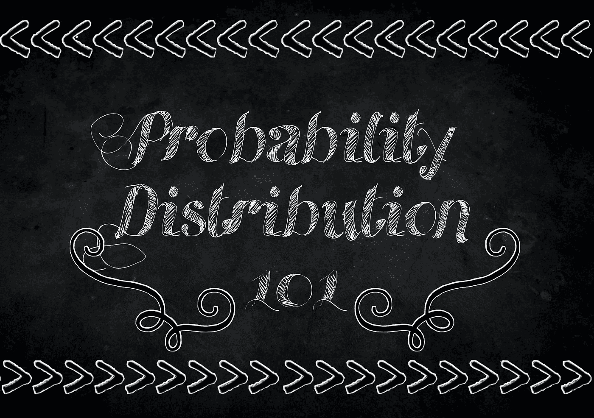
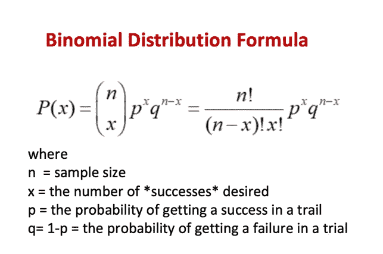
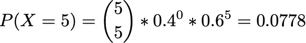
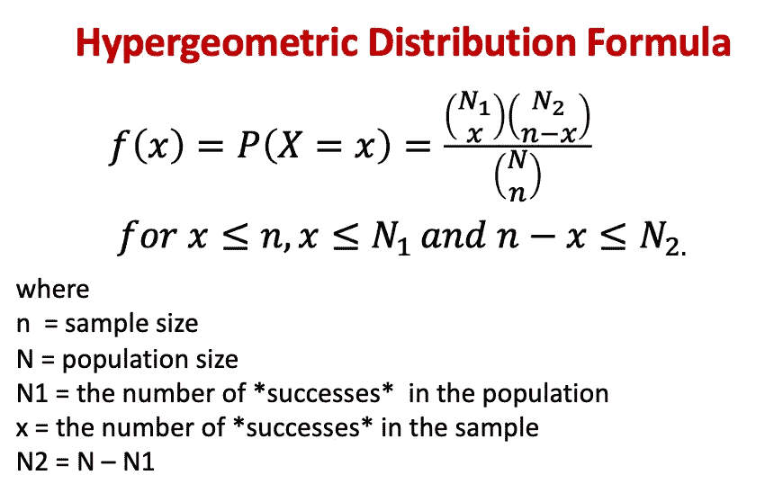
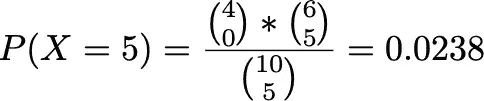
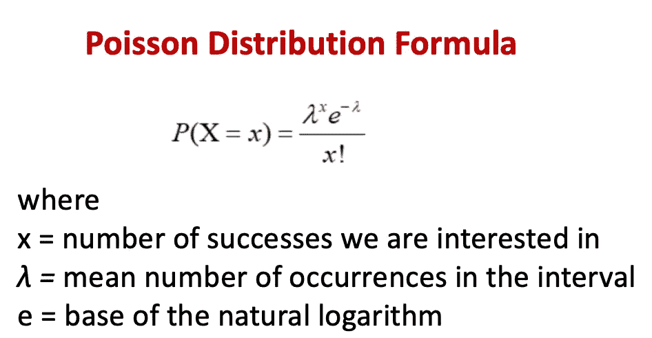
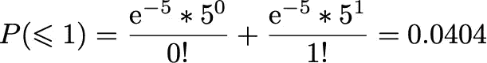
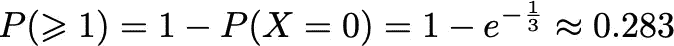
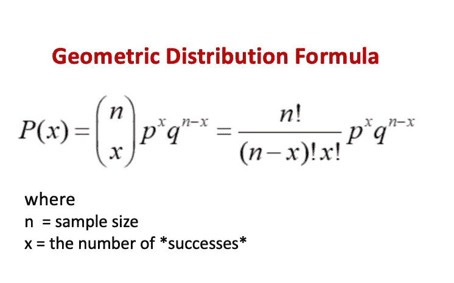
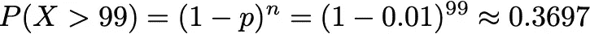

# 用例子理解和选择正确的概率分布

> 原文：<https://towardsdatascience.com/understanding-and-choosing-the-right-probability-distributions-with-examples-5051b59b5211?source=collection_archive---------8----------------------->

## 概率与统计

## 举例说明最常见的离散概率分布

作者图片

# 概率分布

概率分布是一种数学函数，它描述了获取事件可能值的可能性。概率分布可以是离散的，也可以是连续的。在离散分布中，数据只能取某些值，而在连续分布中，数据可以取指定范围(可以是无限的)内的任何值。

有各种各样的离散概率分布。离散概率分布的使用取决于数据的属性。例如，使用:

*   二项式分布，用于计算一个过程的概率，在该过程中，每次试验只可能出现两种可能结果中的一种，例如掷硬币。
*   超几何分布，以寻找在没有替换的情况下 n 次抽奖中 k 次成功的概率。
*   泊松分布，用于衡量给定时间段内给定数量的事件发生的概率，例如图书馆每小时的图书借阅次数。
*   几何分布，用于确定在第一次成功之前进行指定次数试验的概率。

# 二项分布

二项分布可能是所有离散分布中最广为人知的。这种分配有两种可能的结果。使用二项分布的一个典型例子是抛硬币。抛硬币只有两种可能的结果:正面或反面，每种结果都有相同的 1/2 概率。我们来看看二项分布什么时候可以用！

## 二项分布的主要特征:

*   这个实验包括 n 次相同的试验。
*   每次试验只有两种可能的结果，即成功或失败。
*   这些试验是相互独立的。
*   用 p 表示成功的概率，它在两次试验之间保持不变，用 q = (1 — p)表示在任何试验中失败的概率。

作者图片

## 例子

**问:**某仓库发运十台印刷机，其中四台对某公司有缺陷。这家公司随机挑选了五台机器，如果五台机器都没有缺陷，就接受发货。

在抽样替换时，找出公司接受货物的概率。

我要用上面的公式:
试验次数(n)为 5，得到有缺陷机器的概率(p)为 4/10，所以 q 为 6/10，x = 5。

作者图片

# 超几何分布

超几何分布是一种非常类似于二项式分布的概率分布。超几何分布和二项式分布都描述了一个事件在固定数量的试验中发生的次数。对于二项分布，每次试验的概率保持不变。相比之下，在超几何分布中，每次试验都会改变后续试验的概率，因为没有替代。

## 超几何分布的主要特征:

*   考虑一组 N= N1 + N2 的相似物体，其中 N1 属于两个二分类之一，而 N2 属于第二类。
*   从这 *N* 个对象中随机选择的 *n* 个对象的集合，并且没有替换。

作者图片

## 例子

**问:**让我们稍微改变一下之前的问题。如果我们现在不更换样品，公司接受货物的可能性有多大？

我们知道，印刷机的总数 N 是 10，随机选择进行测试的机器数 N 是 5。让我们定义 N1 是无缺陷的，N2 是有缺陷的，那么 N1 =6，N2= 10，N1 =4。为了让公司接受这批货，我们不能有任何有缺陷的机器。选择所有无缺陷机的方式数为 6C5，选择 0 缺陷机的方式数为 4C0。

作者图片

# 泊松分布

泊松分布帮助我们预测特定事件在某一时间间隔内发生的概率。

## 泊松分布的主要特征:

*   在不重叠的时间间隔内发生变化的次数是独立的。
*   在长度为 h 的足够短的间隔内恰好发生一次变化的概率约为λh，其中λ>0。
*   在足够短的时间间隔内发生两次或两次以上变化的概率基本为零。

作者图片

*请注意，泊松分布是二项式分布的一种极限形式。对于大的 n，我们有 p=λ/n.*

## 例子

**问:**假设某种流感疫苗出现副作用的概率为 0.005。如果 1000 人接种，求最多一人患病的大概概率。

由于 n=1000 是一个很大的数，我们可以用泊松近似二项分布来求解，其中λ =pn = 0.005 * 1000 =5。

P(x≤1) = P(x=0)+P(x=1)

作者图片

**问:**电话在某住所接听为泊松过程，参数λ= 2/小时。如果黛安洗了 10 分钟的澡，电话在这段时间内响起的概率是多少？

假设每 60 分钟有两次通话，我们首先计算每 10 分钟我们期望的通话次数，λ=2 * 10 / 60 = 1/3。现在我们要计算在这 10 分钟内至少接到一个电话的概率，所以本质上我们要计算 P(X≥1)，可以写成 1 — P(X=0)。

作者图片

# 几何分布

几何分布表示在第一次成功之前进行指定次数试验的概率。遵循几何分布的一个典型问题是确定一枚硬币在第一次正面朝上之前正面朝上的次数。

## 几何分布的主要特征:

1.  考虑一系列独立的试验，每个试验都有两种可能的结果，成功或失败。设 p 为成功的概率。定义随机变量 X 为第一次成功的试验。
2.  理论上，试验的次数可能会永远持续下去。必须至少有一次审判。

作者图片

## 例子

**问:**一台机器生产一件次品的概率是 0.01。每件产品在生产时都经过检查。假设这些是独立的试验，并计算必须检查至少 100 个项目才能找到一个有缺陷的项目的概率。

使用上面的公式，P(X≥100) → P(X>99)

作者图片

# 结论

概率分布是统计学的基础，就像数据结构对于计算机科学一样。在本文中，我总结了几种最常见的离散概率分布的用例。这只是概率分布旅程的开始。要了解更多关于不同概率分布的信息，请看这张令人难以置信的[所有单变量分布的详细地图](http://www.math.wm.edu/~leemis/chart/UDR/UDR.html)！

# 参考

1.  概率与统计推断(第 9 版)
2.  【https://www.statisticshowto.com/probability-and-statistics/ 
3.  [https://www.onlinemathlearning.com/math-probability.html](https://www.onlinemathlearning.com/math-probability.html)

如果你喜欢我的内容，请关注我❤️，看看我最近的博客:

 [## 作为分析师如何准备商业案例面试？

### 作为数据分析师或数据科学家，我们不仅需要知道概率和统计，机器学习算法…

towardsdatascience.com](/how-to-prepare-for-business-case-interview-as-an-analyst-6e9d68ce2fd8)  [## 构建电子商务产品推荐系统:第二部分——模型构建

### 这个博客是我之前工作的延续，在我之前的工作中，我谈到了我是如何收集产品评论和…

medium.com](https://medium.com/@kessiezhang/building-a-product-recommendation-system-for-e-commerce-part-ii-model-building-8b23a9b3ac27)  [## 为电子商务建立一个产品推荐系统:第一部分——网络搜集

### 今天，如果我们想到机器学习在商业中最成功和最广泛的应用，推荐者…

medium.com](https://medium.com/@kessiezhang/building-a-product-recommendation-system-for-e-commerce-part-i-web-scraping-798b6251ab51)  [## 如何将 Jupyter 笔记本转换成 PDF

### 用几行代码将 Jupyter 笔记本转换为 pdf(调试“500:内部服务器错误”)

towardsdatascience.com](/how-to-convert-jupyter-notebooks-into-pdf-5accaef3758)