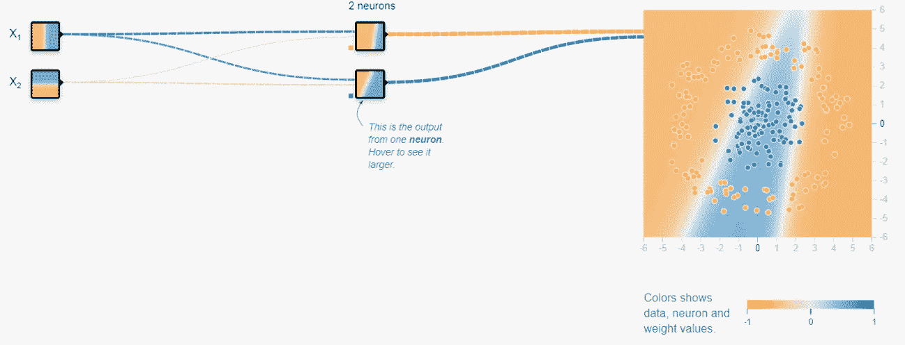
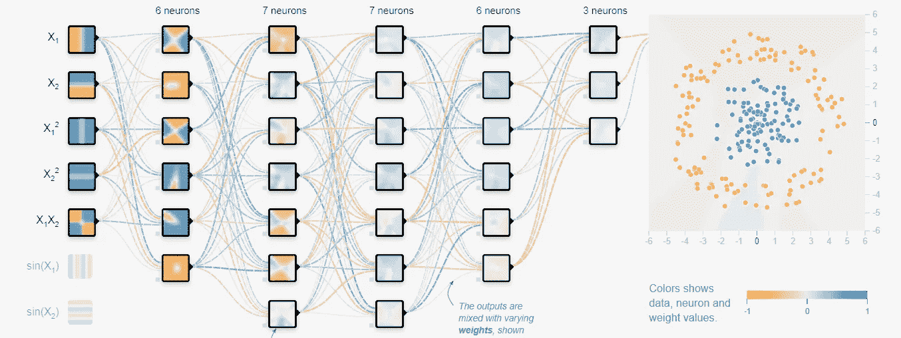
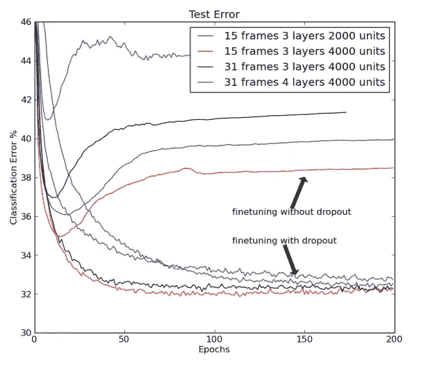

# 在 TensorFlow 和 Keras 中理解和实现辍学

> 原文：<https://towardsdatascience.com/understanding-and-implementing-dropout-in-tensorflow-and-keras-a8a3a02c1bfa?source=collection_archive---------14----------------------->

## 技术的

## Dropout 是一种常见的正则化技术，在计算机视觉任务(如姿态估计、对象检测或语义分割)的最新解决方案中得到利用。


约翰·马特丘克在 [Unsplash](https://unsplash.com/s/photos/stop?utm_source=unsplash&utm_medium=referral&utm_content=creditCopyText) 上拍摄的照片

# 介绍

本文介绍了 dropout 技术的概念，这是一种在深度神经网络(如递归神经网络和卷积神经网络)中使用的技术。

丢弃技术包括在每个训练步骤中从神经网络中省略充当特征检测器的神经元。每个神经元的排除是随机确定的。

G.E Hinton 在 2012 年发表的论文中提出了这个简单的技术:“ [*通过防止特征检测器*](https://arxiv.org/pdf/1207.0580.pdf)*的共同适应来改善神经网络。*

***在本文中，我们将深入揭示辍学的概念，并了解如何使用 TensorFlow 和 Keras 在神经网络中实施这一技术。***

# *了解辍学技巧*

*神经网络在其输入和输出层之间有隐藏层，这些隐藏层中嵌入了神经元，神经元内的权重以及神经元之间的互连使神经网络系统能够模拟类似学习的过程。*

**

*使用[https://playground.tensorflow.org/](https://playground.tensorflow.org/)构建简单的神经网络*

*一般的想法是，神经网络架构中的神经元和层越多，其代表能力就越强。这种表示能力的提高意味着神经网络可以拟合更复杂的函数，并很好地概括训练数据。*

*简单地说，在神经网络层中，神经元之间的互连有更多的配置。*

**

*使用[https://playground.tensorflow.org/](https://playground.tensorflow.org/)构建的复杂神经网络*

*利用更深层次的神经网络的缺点是它们非常容易过度拟合。*

*过度拟合是一个常见的问题，它被定义为经过训练的机器学习模型无法很好地推广到看不见的数据，但同一模型在它接受训练的数据上表现良好。*

*退出的主要目的是最小化训练网络中过度拟合的影响。*

***Dropout 技术通过随机减少神经网络中互连神经元的数量来工作。在每一个训练步骤中，每个神经元都有可能被遗漏，或者更确切地说，从连接的神经元的整理贡献中被遗漏。***

*这种技术最小化了过度拟合，因为每个神经元变得独立地足够，在某种意义上，层内的神经元学习不基于其相邻神经元的合作的权重值。*

*因此，我们减少了对大量互连神经元的依赖，以从训练好的神经网络中产生像样的表示能力。*

*假设你训练了 7，000 个不同的神经网络架构，要选择最好的一个，你只需取所有 7，000 个训练过的神经网络的平均值。*

*辍学技术实际上模拟了这个场景。*

*如果神经元在训练步骤中被遗漏的概率被设置为 0.5；我们实际上是在每个训练步骤中训练各种不同的网络，因为在任何两个训练步骤中排除相同的神经元是非常不可能的。因此，利用退出技术训练的神经网络是在每个训练步骤中出现的所有不同神经元连接组合的平均值。*

# *实际场景*

*在实际场景中，或者当测试利用了对看不见的数据的丢弃的已训练神经网络的性能时，需要考虑某些项目。*

*第一个事实是**剔除技术实际上并没有在神经网络**的每一层上实现；它通常在网络最后几层的神经元中被利用。*

*在已发表的[论文](https://arxiv.org/pdf/1207.0580.pdf)中进行的实验中，有报道称，在 [CIFAR-10 数据集](https://en.wikipedia.org/wiki/CIFAR-10)上测试时，在最后一个隐藏层使用 dropout 时有 15.6%的错误率。这比在相同的卷积神经网络上测试相同的数据集时报告的 16.6%的错误率有所改善，但是在任何层中都没有包括丢弃技术。*

**

*[TIMIT 基准测试中有脱落模型和无脱落模型的错误率比较](https://arxiv.org/pdf/1207.0580.pdf)*

*第二点是，在实际场景中，当评估一个训练好的神经网络时，并不使用丢失。由于在评估或测试阶段没有使用丢弃，因此实现了神经网络的全部潜力。这意味着网络中的所有神经元都是活跃的，每个神经元的输入连接都比训练时多。*

*因此，期望将神经元的权重除以 1，减去丢失超参数值(*训练期间使用的丢失率*)。因此，如果训练期间的辍学率为 0.5，那么在测试时间内，每个神经元的权重结果减半。*

# *实施辍学技术*

*使用 TensorFlow 和 Keras，我们配备了工具来实现一个神经网络，该网络通过在神经网络架构中包含脱落层来利用脱落技术。*

*我们只需要添加一行来在更广泛的神经网络体系结构中包括一个脱落层。Dropout 类有几个参数，但是现在，我们只关心“rate”参数。辍学率是一个超参数，表示在训练步骤中神经元激活被设置为零的可能性。rate 参数可以取 0 到 1 之间的值。*

```
*keras.layers.Dropout(rate=0.2)*
```

*从这一点开始，我们将逐步实现、训练和评估一个神经网络。*

1.  *利用加载工具和库， [Keras](https://keras.io/) 和 [TensorFlow](https://www.tensorflow.org/)*

```
*import tensorflow as tf
from tensorflow import keras*
```

*2.加载 FashionMNIST 数据集，归一化图像并将数据集划分为测试、训练和验证数据。*

```
*(train_images, train_labels),(test_images, test_labels) = keras.datasets.fashion_mnist.load_data()
train_images = train_images /  255.0
test_images = test_images / 255.0
validation_images = train_images[:5000]
validation_labels = train_labels[:5000]*
```

*3.使用 Keras 模型类 API 创建一个包含 dropout 层的自定义模型。*

```
*class CustomModel(keras.Model):
    def __init__(self, **kwargs):
        super().__init__(**kwargs)
        self.input_layer = keras.layers.Flatten(input_shape=(28,28))
        self.hidden1 = keras.layers.Dense(200, activation='relu')
        self.hidden2 = keras.layers.Dense(100, activation='relu')
        self.hidden3 = keras.layers.Dense(60, activation='relu')
        self.output_layer = keras.layers.Dense(10, activation='softmax')
        self.dropout_layer = keras.layers.Dropout(rate=0.2)

    def call(self, input, training=None):
        input_layer = self.input_layer(input)
        input_layer = self.dropout_layer(input_layer)
        hidden1 = self.hidden1(input_layer)
        hidden1 = self.dropout_layer(hidden1, training=training)
        hidden2 = self.hidden2(hidden1)
        hidden2 = self.dropout_layer(hidden2, training=training)
        hidden3 = self.hidden3(hidden2)
        hidden3 = self.dropout_layer(hidden3, training=training)
        output_layer = self.output_layer(hidden3)
        return output_layer*
```

*4.加载实现的模型并初始化优化器和超参数。*

```
*model = CustomModel()
sgd = keras.optimizers.SGD(lr=0.01)
model.compile(loss="sparse_categorical_crossentropy", optimizer=sgd, metrics=["accuracy"])*
```

*5.训练总共 60 个时期的模型*

```
*model.fit(train_images, train_labels, epochs=60, validation_data=(validation_images, validation_labels))*
```

*6.在测试数据集上评估模型*

```
*model.evaluate(test_images, test_labels)*
```

*评估结果将类似于下面的评估结果示例:*

```
*10000/10000 [==============================] - 0s 34us/sample - loss: 0.3230 - accuracy: 0.8812[0.32301584649085996, 0.8812]*
```

*评估结果示例中显示的准确性对应于我们的模型的 88%的准确性。*

*通过一些微调和使用更重要的历元数进行训练，精确度可以提高几个百分点。*

*[这里有一个 GitHub 存储库，用于存储本文中介绍的代码。](https://github.com/RichmondAlake/tensorflow_2_tutorials/blob/master/10_dropout.ipynb)*

*Dropout 是一种常见的正则化技术，在计算机视觉任务(如姿态估计、对象检测或语义分割)的最新解决方案中得到利用。该概念易于理解，并且通过将其包含在 PyTorch、TensorFlow 和 Keras 等许多标准机器/深度学习库中而更容易实现。*

*如果您对其他正则化技术以及它们是如何实现的感兴趣，请阅读下面的文章。*

*感谢阅读。*

*[](/how-to-implement-custom-regularization-in-tensorflow-keras-4e77be082918) [## 如何在 TensorFlow(Keras)中实现自定义正则化

### 了解如何使用 TensorFlow 和 Keras 相对轻松地实现自定义神经网络正则化技术。

towardsdatascience.com](/how-to-implement-custom-regularization-in-tensorflow-keras-4e77be082918) [](/batch-normalization-in-neural-networks-code-d7c9b88da9f5) [## 神经网络中的批量标准化(代码)

### 通过 TensorFlow (Keras)实施

towardsdatascience.com](/batch-normalization-in-neural-networks-code-d7c9b88da9f5)*