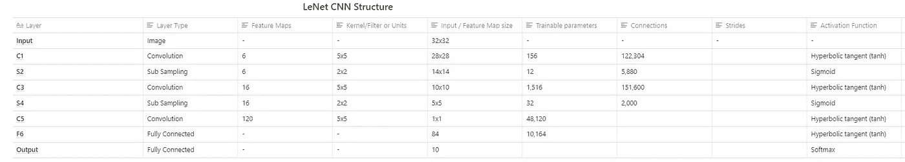

# 理解和实现 LeNet-5 CNN 架构(深度学习)

> 原文：<https://towardsdatascience.com/understanding-and-implementing-lenet-5-cnn-architecture-deep-learning-a2d531ebc342?source=collection_archive---------3----------------------->

## 技术和代码

## 在本文中，我们使用定制实现的 LeNet-5 神经网络架构在 MNIST 数据集上执行图像分类。

> [**在我主持的这个现场培训环节，用 TensorFlow 和 Keras 学习 AI 和深度学习的基础知识。**](https://www.oreilly.com/live-events/practical-introduction-to-the-world-of-computer-vision-and-deep-learning-with-tensorflow-keras/0636920060577/0636920061406/)

# 介绍

L eNet 是由 [Yann LeCun](http://yann.lecun.com/) 、 [Leon Bottou](https://leon.bottou.org/start) 、 [Yoshua Bengio](https://yoshuabengio.org/) 和 [Patrick Haffner](https://www.linkedin.com/in/patrick-haffner-bbb386/) 在 1998 年的研究论文[中提出的。该论文的许多列出的作者继续为深度学习领域提供了几项重要的学术贡献。](http://vision.stanford.edu/cs598_spring07/papers/Lecun98.pdf)


[**扬·勒昆**](http://yann.lecun.com/)**[**莱昂·博图**](https://leon.bottou.org/start)**[**帕特里克·哈夫纳**](https://www.linkedin.com/in/patrick-haffner-bbb386/) **，以及** [**约华·本吉奥**](https://yoshuabengio.org/)****

****本文将介绍原始论文中描述的 LeNet-5 CNN 架构，以及使用 TensorFlow 2.0 实现该架构。****

****本文最后将利用实现的 LeNet-5 CNN 对来自 MNIST 数据集的图像进行分类。****

## ****这篇文章的内容:****

*   *******了解卷积神经网络内的组件*******
*   *******深度学习和机器学习常用术语的关键定义*******
*   *******原研究论文*** 中提出的对 LeNet-5 的理解****
*   *******用 TensorFlow 和 Keras 实现神经网络*******

> ****本文中的内容是为各种水平的深度学习和机器学习学生编写的。****

****对于那些渴望获得编码的人，向下滚动到' *LeNet-5 TensorFlow 实现'*部分。****

# ****卷积神经网络****

****卷积神经网络是用于解决与图像相关联的任务的神经网络架构的标准形式。针对对象检测、人脸检测、姿态估计等任务的解决方案都有 CNN 架构变体。****

****CNN 架构的一些特征使得它们在一些计算机视觉任务中更有利。我以前写过深入研究每个特征的文章。****

*   ****[*局部感受野*](/understand-local-receptive-fields-in-convolutional-neural-networks-f26d700be16c)****
*   ****[*子采样*](/you-should-understand-sub-sampling-layers-within-deep-learning-b51016acd551)****
*   ****[*重量分担*](/understanding-parameter-sharing-or-weights-replication-within-convolutional-neural-networks-cc26db7b645a)****

# ****LeNet-5****

****LeNet-5 CNN 架构由 7 层组成。层组成包括 3 个卷积层、2 个子采样层和 2 个全连接层。****

********

****[LeNet-5 架构](http://vision.stanford.edu/cs598_spring07/papers/Lecun98.pdf)****

****上图显示了 LeNet-5 架构的描述，如[原始论文](http://vision.stanford.edu/cs598_spring07/papers/Lecun98.pdf)中所示。****

****第一层是输入层——这通常不被认为是网络的一层，因为在这一层什么也学不到。输入层的构建是为了接收 *32x32，*这些是传递到下一层的图像的尺寸。熟悉 MNIST 数据集的人会知道，MNIST 数据集图像的尺寸为 *28x28。为了*得到满足输入层要求的 MNIST 图像尺寸，对 *28x28* 图像进行了填充。****

****研究论文中使用的灰度图像的像素值从 0 到 255 归一化到-0.1 到 1.175 之间。归一化的原因是为了确保该批图像的平均值为 0，标准偏差为 1，这样做的好处是减少了训练时间。在下面的 LeNet-5 图像分类示例中，我们将归一化图像的像素值，使其取 0 到 1 之间的值。****

****LeNet-5 架构利用了两种重要的层结构:卷积层和子采样层。****

*   ****[*卷积层*](https://machinelearningmastery.com/convolutional-layers-for-deep-learning-neural-networks/)****
*   ****[*子采样层*](/you-should-understand-sub-sampling-layers-within-deep-learning-b51016acd551)****

****在研究论文和下图中，卷积层用' *Cx'* 标识，子采样层用' *Sx'* 标识，其中' *x'* 是层在架构中的顺序位置。 *Fx'* 用于识别完全连接的层。这种层识别的方法可以在上图中看到。****

****官方的第一层卷积层 *C1* 产生 6 个特征图作为输出，并且具有 *5x5 的核大小。*内核/过滤器是窗口的名称，该窗口包含在权重值与输入值的卷积过程中使用的权重值。 *5x5* 也表示卷积层内每个单元或神经元的局部感受野大小。第一卷积层产生的六个特征图的尺寸是 *28x28。*****

****一个子采样层' *S2'* '跟在' *C1'* 层'之后。“*S2”*层将它从前一层接收的特征地图的维度减半；这就是通常所说的下采样。****

****‘*S2’*层也产生 6 个特征图，每个对应于从前一层作为输入传递的特征图。此[链接](/you-should-understand-sub-sampling-layers-within-deep-learning-b51016acd551)包含更多关于子采样层的信息。****

****有关 LeNet-5 其余层的更多信息，请参见实现部分。****

*******下表总结了每一层的主要特性:*******

********

****LeNet-5 架构特性(按作者)****

# ****LeNet-5 张量流实现****

****我们从导入我们将使用的库开始实施:****

*   ****[***tensor flow***](https://www.tensorflow.org/)*:机器学习模型的实现、训练、部署的开源平台。*****
*   ****[***Keras***](https://keras.io/)*:一个开源库，用于实现在 CPU 和 GPU 上同时运行的神经网络架构。*****
*   ****[***Numpy***](https://numpy.org/)*:一个用 n 维数组进行数值计算的库。*****

```
**import tensorflow as tf
from tensorflow import keras
import numpy as np**
```

****接下来，我们使用 Keras 库加载 [MNIST](https://www.tensorflow.org/api_docs/python/tf/keras/datasets/mnist/load_data) 数据集。Keras 图书馆有一套易于使用的数据集。****

****我们还需要将数据集划分为测试、验证和训练。下面是每个分区类别的一些快速描述。****

*   *******训练数据集*** *:这是我们用来直接训练神经网络的一组数据集。训练数据是指在训练期间暴露给神经网络的数据集分区。*****
*   *******验证数据集*** *:这组数据集在训练期间被用来评估网络在各种迭代中的性能。*****
*   *******测试数据集*** *:数据集的这个分区在训练阶段完成后评估我们网络的性能。*****

****还需要将数据集中图像的像素强度从 0–255 到 0–1 的值范围进行归一化。****

```
**(train_x, train_y), (test_x, test_y) = keras.datasets.mnist.load_data()
train_x = train_x / 255.0
test_x = test_x / 255.0train_x = tf.expand_dims(train_x, 3)
test_x = tf.expand_dims(test_x, 3)val_x = train_x[:5000]
val_y = train_y[:5000]**
```

****在上面的代码片段中，我们扩展了训练和数据集的维度。我们这样做的原因是，在训练和评估阶段，网络期望图像成批呈现；额外的维度代表一批图像的数量。****

## ****下面的代码是我们实现实际的基于 LeNet-5 的神经网络的主要部分。****

****Keras 提供了实现分类模型所需的工具。Keras 提出了一种顺序 API，用于将神经网络的层堆叠在彼此之上。****

```
**lenet_5_model = keras.models.Sequential([
    keras.layers.Conv2D(6, kernel_size=5, strides=1,  activation='tanh', input_shape=train_x[0].shape, padding='same'), #C1
    keras.layers.AveragePooling2D(), #S2
    keras.layers.Conv2D(16, kernel_size=5, strides=1, activation='tanh', padding='valid'), #C3
    keras.layers.AveragePooling2D(), #S4
    keras.layers.Conv2D(120, kernel_size=5, strides=1, activation='tanh', padding='valid'), #C5
    keras.layers.Flatten(), #Flatten    
    keras.layers.Dense(84, activation='tanh'), #F6
    keras.layers.Dense(10, activation='softmax') #Output layer
])**
```

****我们首先将变量'`lenet_5_model'`赋给 [tf.keras.Sequential](https://www.tensorflow.org/api_docs/python/tf/keras/Sequential) 类构造函数的一个实例。****

****在类构造函数中，我们接着定义模型中的层。****

****C1 层由线`keras.layers.Conv2D(6, kernel_size=5, strides=1, activation='tanh', input_shape=train_x[0].shape, padding='same')`定义。我们使用 [tf.keras.layers.Conv2D](https://www.tensorflow.org/api_docs/python/tf/keras/layers/Conv2D) 类来构建网络中的卷积层。我们传递几个论点，在这里描述为。****

*   *******激活函数*** *:将神经元的结果或信号转化为归一化输出的数学运算。激活函数是在网络中引入非线性的神经网络的组成部分。激活函数的引入使得神经网络具有更强的表达能力和解决复杂的函数。*****

****其余的卷积层遵循与 C *1* 相同的层定义，只是为参数输入了一些不同的值。****

****在介绍 LeNet-5 架构的[原始论文](http://vision.stanford.edu/cs598_spring07/papers/Lecun98.pdf)中，使用了子采样层。在子采样层内，取落在 2x2 池窗口内的像素值的平均值，之后，该值乘以系数值。最终结果中会添加一个偏差，所有这些都是在值通过激活函数之前完成的。****

****但是在我们实现的 LeNet-5 神经网络中，我们使用了[TF . keras . layers . average pooling 2d](https://www.tensorflow.org/api_docs/python/tf/keras/layers/AveragePooling2D)构造函数。我们不向构造函数传递任何参数，因为在调用构造函数时，必需参数的一些默认值已经初始化。请记住，网络中的池化图层的作用是在要素地图穿过网络时对其进行缩减采样。****

****网络中还有两种类型的图层，平坦图层和密集图层。****

****展平层是用类构造器[TF . keras . layers . flatten](https://www.tensorflow.org/api_docs/python/tf/keras/layers/Flatten)创建的。****

****该层的目的是将其输入转换为一维数组，该数组可以输入到后续的密集层中。****

****密集层每层都有特定数量的单元或神经元，F6 有 84 个，而输出层有 10 个单元。****

****最后一个密集图层有十个单元，对应于 MNIST 数据集中的类的数量。输出层的激活函数是 softmax 激活函数。****

*   ******Softmax** :激活函数，用于导出输入向量中一组数字的概率分布。softmax 激活函数的输出是一个向量，其中它的一组值表示一个类/事件发生的概率。向量中的值加起来都是 1。****

******现在我们可以编译和构建模型了。******

```
**lenet_5_model.compile(optimizer=’adam’, loss=keras.losses.sparse_categorical_crossentropy, metrics=[‘accuracy’])**
```

****Keras 通过我们之前实例化的模型对象提供了'*编译'*方法。compile 函数支持我们在幕后实现的模型的实际构建，该模型具有一些额外的特征，如损失函数、优化器和指标。****

****为了训练网络，我们利用损失函数来计算网络提供的预测值和训练数据的实际值之间的差异。****

****伴随着优化算法( [Adam](https://www.tensorflow.org/api_docs/python/tf/keras/optimizers/Adam) )的损失值有助于对网络内的权重进行多次改变。支持因素，如动量和学习率时间表，通过使损失值尽可能接近零，提供了使网络训练收敛的理想环境。****

****在训练过程中，我们还将在每个时期后使用之前创建的评估数据集分区来验证我们的模型****

```
**lenet_5_model.fit(train_x, train_y, epochs=5, validation_data=(val_x, val_y))**
```

****训练之后，您会注意到您的模型达到了 90%以上的验证准确率。但是，为了更明确地验证模型在未知数据集上的性能，我们将在之前创建的测试数据集分区上评估经过训练的模型。****

```
**lenet_5_model.evaluate(test_x, test_y)
>> [0.04592850968674757, 0.9859]**
```

****在训练了我的模型之后，我能够在测试数据集上达到 98%的准确率，这对于这样一个简单的网络来说相当有用。****

****下面是本文代码的 GitHub 链接:****

****[](https://github.com/RichmondAlake/tensorflow_2_tutorials/blob/master/13_lenet-5.ipynb) [## Richmond alake/tensor flow _ 2 _ 教程

### permalink dissolve GitHub 是超过 5000 万开发人员的家园，他们一起工作来托管和审查代码，管理…

github.com。](https://github.com/RichmondAlake/tensorflow_2_tutorials/blob/master/13_lenet-5.ipynb)**** 

# ****我希望这篇文章对你有用。****

****要联系我或找到更多类似本文的内容，请执行以下操作:****

1.  ****订阅我的 [**YouTube 频道**](https://www.youtube.com/channel/UCNNYpuGCrihz_YsEpZjo8TA) 即将发布的视频内容 [**这里**](https://www.youtube.com/channel/UCNNYpuGCrihz_YsEpZjo8TA)****
2.  ****跟着我上 [**中**](https://medium.com/@richmond.alake)****
3.  ****在 [**LinkedIn**](https://www.linkedin.com/in/richmondalake/) 上连接并联系我****