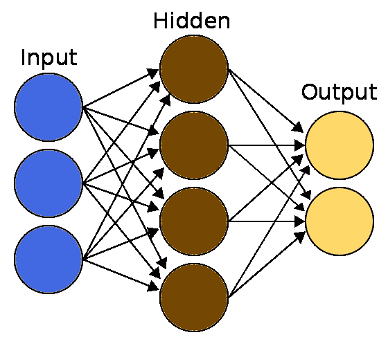
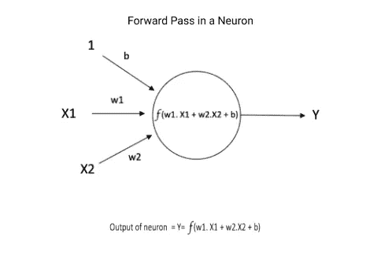
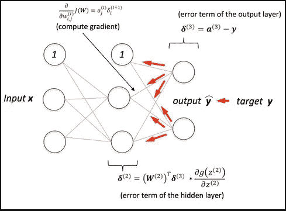
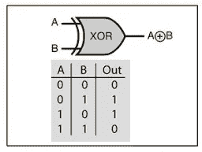
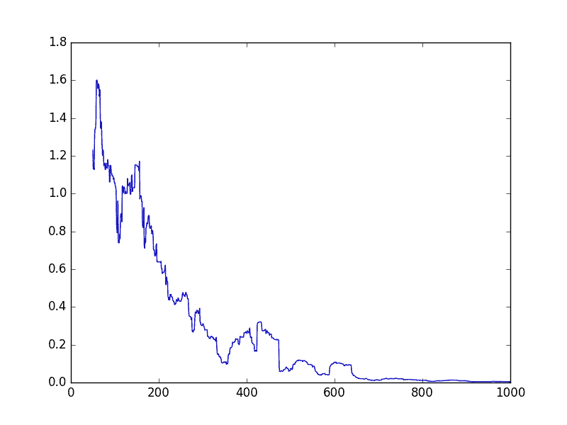

# 从头开始用 Java 理解和实现神经网络💻

> 原文：<https://towardsdatascience.com/understanding-and-implementing-neural-networks-in-java-from-scratch-61421bb6352c?source=collection_archive---------2----------------------->

## 学习最流行的概念💪有史以来的强类型语言。

虽然听起来有点吓人，但我们将从头开始用 JAVA 创建一个人工智能程序，我会解释所有的概念，你也可以边阅读边编码，建议编写程序而不是 Ctrl+C 和 Ctrl+V。



简单神经网络(图片由作者提供)

神经网络是一种以较小的方式代表人脑的计算系统。黄色的点叫做 **"** [**神经元**](https://en.wikipedia.org/wiki/Neuron) ，连接它们的线叫做 **"** [**突触**](https://en.wikipedia.org/wiki/Synapse) ，这些概念取自🧠.系统通过**[**反向传播**](https://en.wikipedia.org/wiki/Backpropagation) 的过程调整突触的**【权值】来模拟大脑的学习过程。****

**创建这个系统的第一步是制作我们自己的矩阵库，因为矩阵是神经网络的基本数据结构。**

**我已经创建了一个开源库，与本文中解释的概念相同，如果感兴趣，你可以贡献出来🙌**

**[](https://github.com/SuyashSonawane/JavaNet) [## SuyashSonawane/JavaNet

### 从头开始用 Java 理解和实现神经网络💻学习最流行的概念…

github.com](https://github.com/SuyashSonawane/JavaNet) 

# 1.矩阵库

我们将创建一个矩阵类，并为其添加必要的功能，如矩阵的加法、减法、转置和乘法

```
class Matrix
{
   double [][]data;
   int rows,cols;
}
```

我们的矩阵类包含 3 个对象变量。数据是一个 2d 双数组来保存矩阵
2 的内容。保存矩阵行数的行
3。您可能已经注意到，这些列包含列！！

```
public Matrix(int rows,int cols)
 {
        data= new double[rows][cols];
        this.rows=rows;
        this.cols=cols;
        for(int i=0;i<rows;i++)
        {
            for(int j=0;j<cols;j++)
            {
                data[i][j]=Math.random()*2-1;
            }
        }
    }
```

这里，我们创建了一个构造函数，通过将行和列作为参数传递，用-1 和 1 之间的随机值初始化矩阵对象。

```
public void add(double scaler)
{
    for(int i=0;i<rows;i++)
    {
        for(int j=0;j<cols;j++)
        {
            this.data[i][j]+=scaler;
        }

    }
}public void add(Matrix m)
{
    if(cols!=m.cols || rows!=m.rows) {
        System.out.println("Shape Mismatch");
        return;
    }

    for(int i=0;i<rows;i++)
    {
        for(int j=0;j<cols;j++)
        {
            this.data[i][j]+=m.data[i][j];
        }
    }
}
```

这里，我们创建了一个“add”函数，它重载了两个参数，一个 double 和一个矩阵对象，该对象执行元素相加。

```
public static Matrix subtract(Matrix a, Matrix b) {
        Matrix temp=new Matrix(a.rows,a.cols);
        for(int i=0;i<a.rows;i++)
        {
            for(int j=0;j<a.cols;j++)
            {
                temp.data[i][j]=a.data[i][j]-b.data[i][j];
            }
        }
        return temp;
    }public static Matrix transpose(Matrix a) {
        Matrix temp=new Matrix(a.cols,a.rows);
        for(int i=0;i<a.rows;i++)
        {
            for(int j=0;j<a.cols;j++)
            {
                temp.data[j][i]=a.data[i][j];
            }
        }
        return temp;
    }
```

这是两个函数，用于计算矩阵的减法和转置，作为参数发送给类静态函数。这些函数返回新的矩阵对象。

```
public static Matrix multiply(Matrix a, Matrix b) {
        Matrix temp=new Matrix(a.rows,b.cols);
        for(int i=0;i<temp.rows;i++)
        {
            for(int j=0;j<temp.cols;j++)
            {
                double sum=0;
                for(int k=0;k<a.cols;k++)
                {
                    sum+=a.data[i][k]*b.data[k][j];
                }
                temp.data[i][j]=sum;
            }
        }
        return temp;
    }

    public void multiply(Matrix a) {
        for(int i=0;i<a.rows;i++)
        {
            for(int j=0;j<a.cols;j++)
            {
                this.data[i][j]*=a.data[i][j];
            }
        }

    }

    public void multiply(double a) {
        for(int i=0;i<rows;i++)
        {
            for(int j=0;j<cols;j++)
            {
                this.data[i][j]*=a;
            }
        }

    }
```

好吧！这里发生了很多事情🤯第一个乘法函数接受 2 个矩阵对象，并对各个矩阵执行点积运算，然后返回一个新的矩阵对象，第二个函数执行矩阵的逐元素乘法，最后一个函数通过缩放器对整个矩阵进行缩放或相乘。

```
public void sigmoid() {
        for(int i=0;i<rows;i++)
        {
            for(int j=0;j<cols;j++)
                this.data[i][j] = 1/(1+Math.exp(-this.data[i][j])); 
        }

    }

    public Matrix dsigmoid() {
        Matrix temp=new Matrix(rows,cols);
        for(int i=0;i<rows;i++)
        {
            for(int j=0;j<cols;j++)
                temp.data[i][j] = this.data[i][j] * (1-this.data[i][j]);
        }
        return temp;

    }
```

对于这个例子，我们为我们的人工智能🧠.使用了 [Sigmoid](https://en.wikipedia.org/wiki/Sigmoid_function) 激活函数这两个函数将 sigmoid 和 sigmoid 的导数应用于矩阵的元素。计算反向传播的梯度时需要 Sigmoid 的导数。

```
public static Matrix fromArray(double[]x)
    {
        Matrix temp = new Matrix(x.length,1);
        for(int i =0;i<x.length;i++)
            temp.data[i][0]=x[i];
        return temp;

    }

    public List<Double> toArray() {
        List<Double> temp= new ArrayList<Double>()  ;

        for(int i=0;i<rows;i++)
        {
            for(int j=0;j<cols;j++)
            {
                temp.add(data[i][j]);
            }
        }
        return temp;
   }
```

这些是在矩阵对象和数组之间进行转换的辅助函数。

现在，✌，我们有了一个运行良好且易于调试的，我们自己的——矩阵库！！


由[布鲁克·卡吉尔](https://unsplash.com/@brookecagle?utm_source=medium&utm_medium=referral)在 [Unsplash](https://unsplash.com?utm_source=medium&utm_medium=referral) 拍摄的照片** 

# **2.构建神经网络**

**现在，神经网络的真正有趣和令人生畏的概念来了，但不要害怕，我们将通过编码来学习这些概念，你肯定会发现它们非常直观。**

```
public class NeuralNetwork {    
    Matrix weights_ih , weights_ho , bias_h , bias_o;    
    double l_rate=0.01;
}
```

**这里我们有一个包含许多变量的 NeuralNetwork 类，让我们逐个定义它们。
1。重量 _ih👉输入和隐藏层的权重矩阵。
2。权重 _ho👉隐藏层和输出层的权重矩阵。
3。bias_h👉隐藏层的偏差矩阵。
4。bias_o👉输出图层的偏差矩阵。
5。低利率👉学习率是一个超参数，用于控制权重优化过程中的学习步骤。**

```
public NeuralNetwork(int i,int h,int o) {
        weights_ih = new Matrix(h,i);
        weights_ho = new Matrix(o,h);

        bias_h= new Matrix(h,1);
        bias_o= new Matrix(o,1);

    }
```

**这里，我们让构造函数在传递给构造函数的输入、隐藏和输出形状的帮助下初始化所有变量。
检查矩阵的形状很重要，因为点积仅适用于兼容矩阵。有关点积的更多信息，请遵循[此](https://en.wikipedia.org/wiki/Dot_product)**

```
public List<Double> predict(double[] X)
    {
        Matrix input = Matrix.fromArray(X);
        Matrix hidden = Matrix.multiply(weights_ih, input);
        hidden.add(bias_h);
        hidden.sigmoid();

        Matrix output = Matrix.multiply(weights_ho,hidden);
        output.add(bias_o);
        output.sigmoid();

        return output.toArray();
    }
```

**这里我们有预测函数，它在神经网络上进行前向传递或前向传播**

> **前向传播是神经网络中的一个计算步骤，其中输入(矩阵)与隐藏层的权重(矩阵)相乘，然后偏差(列矩阵)与前一步骤的点积相加。最后，结果由激活函数按元素处理。这是在每一层上执行的，前一层的结果作为下一层的输入。**
> 
> **这一步也称为前向传递，用于从网络生成预测。**

****

**单个神经元的正向传递(图片由作者提供)**

**该函数接受输入的双数组，然后通过我们的帮助函数将它们转换为列矩阵。然后在两个层上计算向前传递，然后通过另一个帮助函数将输出展平到一个列表中。**

```
public void train(double [] X,double [] Y)
    {
        Matrix input = Matrix.fromArray(X);
        Matrix hidden = Matrix.multiply(weights_ih, input);
        hidden.add(bias_h);
        hidden.sigmoid();

        Matrix output = Matrix.multiply(weights_ho,hidden);
        output.add(bias_o);
        output.sigmoid();

        Matrix target = Matrix.fromArray(Y);

        Matrix error = Matrix.subtract(target, output);
        Matrix gradient = output.dsigmoid();
        gradient.multiply(error);
        gradient.multiply(l_rate);

        Matrix hidden_T = Matrix.transpose(hidden);
        Matrix who_delta =  Matrix.multiply(gradient, hidden_T);

        weights_ho.add(who_delta);
        bias_o.add(gradient);

        Matrix who_T = Matrix.transpose(weights_ho);
        Matrix hidden_errors = Matrix.multiply(who_T, error);

        Matrix h_gradient = hidden.dsigmoid();
        h_gradient.multiply(hidden_errors);
        h_gradient.multiply(l_rate);

        Matrix i_T = Matrix.transpose(input);
        Matrix wih_delta = Matrix.multiply(h_gradient, i_T);

        weights_ih.add(wih_delta);
        bias_h.add(h_gradient);

    }
```

**现在，在上面的训练函数中，我们将 X 和 Y 作为双数组，我们将它们转换为矩阵，从矩阵形式的目标 Y 中减去前向传递的输出。相减的结果是当前传递的样本的误差。该误差用于计算反向传播的梯度。sigmoid 函数的导数按元素应用于输出矩阵，输出矩阵返回梯度矩阵，然后乘以输出误差和决定学习步骤的学习速率。**

> **反向传播正好与正向传递相反，在正向传递中，我们对权重矩阵进行转置，然后将它们乘以根据误差计算的梯度，这又返回用于调整当前层中权重的增量。使用梯度更新偏差。**

****

**神经网络中的反向传播(图片由[sebastianraschka.com](http://sebastianraschka.com)提供)**

**当反向支持从输出层运行到输入层时，我们对网络中的前几层重复相同的步骤。
最后，我们已经更新了当前样本的所有层的权重，这完成了数据集上的 1 个步骤。**

```
public void fit(double[][]X,double[][]Y,int epochs)
    {
        for(int i=0;i<epochs;i++)
        {    
            int sampleN =  (int)(Math.random() * X.length );
            this.train(X[sampleN], Y[sampleN]);
        }
    }
```

**fit 函数接受 2 个 2d 数组，即 X 和 Y，以及历元数，即我们需要在数据集上迭代多少次。在这里，我们使用数据集中的随机数据点重复调用 train 函数，以便我们可以在数据集上概化网络。
这完成了我们的神经网络类🥳，现在我们可以在一个简单的数据集上测试我们的程序。**

**[](https://suyashsonawane.me/) [## 作品集| Suyash Sonawane

### 嗨，我是苏亚士·索纳瓦尼👋这是我的网络作品集

suyashsonawane.me](https://suyashsonawane.me/) 

# 3.测试我们的程序

我们将利用 XOR 逻辑门的数据制作一个简单的 2d 双数组。



XOR 逻辑门(图片由作者提供)

```
static double [][] X= {
            {0,0},
            {1,0},
            {0,1},
            {1,1}
    };
static double [][] Y= {
            {0},{1},{1},{0}
    };
```

现在，我们将创建一个神经网络对象，并在数据集上进行训练

```
NeuralNetwork nn = new NeuralNetwork(2,10,1);
nn.fit(X, Y, 50000);
```

我们使用 50000 个历元，因为数据集非常小，只包含 4 个样本。



跨时代的损失(作者图片)

```
double [][] input ={{0,0},{0,1},{1,0},{1,1}};
for(double d[]:input)
{
    output = nn.predict(d);
    System.out.println(output.toString());
}//Output
[0.09822298990353093]
[0.8757877124658147]
[0.8621529792837699]
[0.16860984858200806]
```

现在我们用双数组形式的输入来测试神经网络。输出看起来很棒，因为大于 0.5 的值类似于 1 输出，而另一个类似于 0 输出。


照片由 [Aw 创意](https://unsplash.com/@awcreativeut?utm_source=medium&utm_medium=referral)在 [Unsplash](https://unsplash.com?utm_source=medium&utm_medium=referral) 上拍摄

下面给出了所有的源代码** 

# **结论**

**因此，我们已经成功地从零开始创建了一个神经网络，我们还创建了自己的矩阵库，可以无缝地处理所有的矩阵运算。我们还在一个小的 XOR 数据集上测试了它，得到了非常好的结果。**

**作为一名 Python 程序员，我对 Java 编程不是很熟悉，因为它需要太多的注意力在数据类型和类型转换上。😓分号；如果你发现了任何不必要或多余的代码，请在评论中分享，如果你有任何建议，请在下面评论。🤗**

# ****这就是所有的乡亲们****

**跟我来:**

**作品集:[https://suyashsonawane.me/](https://suyashsonawane.me/)
推特:[苏亚什·索纳万(@ SuyashSonawane)/推特](https://twitter.com/SuyashYSonawane)
LinkedIn: [苏亚什·索纳万| LinkedIn](https://www.linkedin.com/in/suyash-sonawane-44661417b/)
Github: [苏亚什·索纳万(Suyash Sonawane)](https://github.com/SuyashSonawane)**