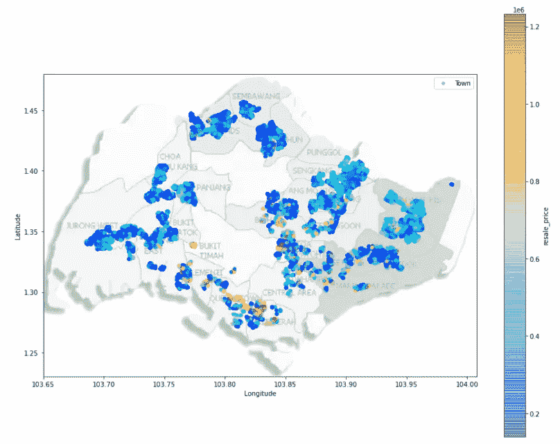

# 了解和预测新加坡转售 HDB 公寓价格

> 原文：<https://towardsdatascience.com/understanding-and-predicting-resale-hdb-flat-prices-in-singapore-1853ec7069b0?source=collection_archive---------10----------------------->

## 一个简短的案例研究，涉及数据收集，探索，可视化和机器学习，以了解在新加坡转售 HDB 单位价格

# **简介**

超过 80%的新加坡居民居住在住房发展局(HDB)的公寓里，这些公寓是新加坡政府于 1960 年设计的，旨在解决城市综合住房的需求。由于新加坡土地稀缺，HDB 的公寓通常建在高层建筑中，以有效利用空间。对大多数新加坡人来说，结婚后就能拥有一套 HDB 公寓。HDB 公寓的一个独特之处是与之相关的 99 年租约:公寓的租约期限为 99 年，从公寓完工开始计算，到期后土地归还政府。这意味着在新加坡购买 HDB 公寓并不意味着拥有传统意义上的公寓，而是在剩余租约的特定期限内从政府手中租赁该公寓。

尽管如此，这并不意味着新加坡人必须在他们拥有的 HDB 公寓里度过余生。HDB 的公寓可以出售(尽管如果公寓是全新购买的话，要在 5 年后)，这就是这个迷你项目的核心——HDB 公寓转售市场。作为一个年轻的成年人，也许很快就会想拥有一套 HDB 公寓，了解 HDB 转售公寓背后的价格并预测它们似乎是一个有趣的工作项目。

# 特征工程

原始数据集从 https://data.gov.sg/dataset/resale-flat-prices 的[获得。该数据集提供了 2017 年至 2020 年 HDB 所有转售公寓交易的信息。](https://data.gov.sg/dataset/resale-flat-prices)

从 data.gov.sg 提取的原始数据的数据框架

该数据集中的显著特征如下:
i) **城镇**:关联 HDB 公寓的城镇
ii) **公寓 _ 类型**:关联 HDB 公寓的公寓类型。在新加坡，有 1 室公寓到 5 室公寓，还有比 5 室公寓稍大的行政公寓。(剩下的公寓类型:多代同堂的公寓，少之又少)。
iii) **block** :关联 HDB 公寓的 block
iv)**street**:关联 HDB 公寓的 street
v)**storey _ range**:关联 HDB 公寓的楼层范围。在该数据集中，给定的楼层范围在 3 的范围内(例如，10 到 12，这意味着公寓基于第 10 到 12 层)。
vi) **楼层 _ 面积 _ 平方米**:关联 HDB 单位的建筑面积平方米
vii) **剩余 _ 租约**:关联 HDB 单位的剩余租约年月
viii) **转售 _ 价格**:关联 HDB 单位的转售价格

在假设可能影响 HDB 转售公寓价格的因素时，我想到了三个突出的因素。**到最近的捷运/LRT 的距离**——这是 HDB 公寓与铁路网连接程度的一个指标。
2。距离最近的购物中心的距离——新加坡的购物中心是一切(购物、食品、杂货、服务)的一站式目的地。
3。**到最近的小学的距离** —附近有一所小学对父母来说是非常方便的，因为他们的孩子可以选择放学后步行回家，而不是选择其他交通安排。

捷运/轻轨、购物中心和小学的详细列表是从维基百科获得的。为了获得以下特征，使用 Onemaps API 获得了所有独特的 HDB 转售街区、MRT/lrt、购物中心和小学的纬度和经度。

For-loops 用于计算每个独特的 HDB 转售街区与所有 MRT/lrt、购物中心和小学之间的距离(使用哈弗森公式)。最近的捷运/LRT、购物中心和小学，以及它们到每个独特 HDB 街区的 HDB 公寓的相关距离(以 km 为单位)存储在数据帧中，如下所示。

显示每个独特的转售 HDB 区块及其相关的最近设施的数据框架。

需要注意的是，在 8836 个唯一 HDB 块中，405 个搜索地址返回了多个邮政编码差异很大的结果。结果，这 405 个地址被丢弃，因为它的纬度和经度无法从 Onemaps API 中准确识别。

接下来，变量 **flat_type** 、 **storey_range** 和 **remaining_lease** 被整数编码。此外，使用[https://mrt.sg/fare](https://mrt.sg/fare)，变量 **time_to_raffles_place** 通过从最近的 MRT/LRT 到 Raffles Place MRT 的时间创建，将其添加到从 HDB 到最近的 MRT/LRT 的步行时间(假设步行速度为 15 分钟/公里)。这一点意义重大，因为莱佛士广场地铁站是新加坡中央商务区的心脏，这里有许多新加坡劳动力的办公室。

最后，两个分类变量， **MRT？**和**到期遗产？**之所以被添加，是因为人们认为，与轻轨相比，更靠近轻轨的公寓可能存在价格溢价，到目前为止，其他列对此未作解释。同样，相对于非成熟屋而言，位于成熟屋的单位可能有溢价。

将 8431 个独特的 HDB 块与包含 77，895 个数据点的初始数据集合并。产生 NAs 的行(从先前删除的 405 行中)被删除，产生如下所示的最终数据集。

数据清理和特征工程后的最终数据集

最后，使用 describe()函数，可以对数据进行感觉检查，并找出特征工程中是否有错误。例如，到购物中心的最小距离输出为 0.000 公里。经过调查，发现出现这种情况是因为购物中心位于德惠里 137 号楼的正下方。

该图说明了为什么到购物中心的最小距离为 0.000 公里

经过几次类似的调查，发现工程特征的极限是令人满意的。

# 探索性数据分析和数据可视化

使用 describe()函数，观察到的汇总统计信息如下:

1.  转售价格——公寓价格从 14 万美元(Toh Payoh)到 123.2 万美元(Pinnacle@Duxton)不等，平均价格为 44 万美元
2.  楼层面积——公寓的面积从 31 平方米到 249 平方米不等，平均面积为 98 平方米
3.  租赁——公寓的剩余租赁期从 45 年到 98 年不等，平均为 75 年
4.  楼层-整数编码的楼层范围从 1 到 17(从 1 楼到 51 楼)，平均值为 3(7 楼到 9 楼)
5.  城镇——42%的转售公寓属于成熟地产；剩余的 58%属于未到期的遗产
6.  最近的购物中心——从公寓到最近的购物中心的距离在 0.00 公里到 3.21 公里之间，平均值为 0.66 公里
7.  最近的小学——从公寓到最近的小学的距离在 0.05 公里到 3.31 公里之间，平均为 0.40 公里
8.  最近的地铁站/LRT——公寓到最近的火车站的距离在 0.002 公里到 3.50 公里之间，平均为 0.66 公里。此外，80%的转售公寓比 LRT 更靠近地铁站。
9.  到莱佛士广场的旅行时间——从公寓到莱佛士广场的旅行时间在 11 分钟到 1 小时 36 分钟之间，平均 45 分钟

接下来，使用相关矩阵来理解每个预测因子之间的相关性。

预测值之间的相关矩阵

可以看出，转售价格的最大预测因素是**楼层面积平方米**，以及**户型编码**。还可以注意到，这两个相同的预测值具有 0.93 的高成对相关性，这是可以预期的，因为公寓类型越大(即房间数量越多)，公寓的预期地板面积就越大。

转售价格相关条形图

观察相关性的符号，注意到符号与最初的假设一致:也就是说，与预期一致的是，距离预测值以及到莱佛士广场的时间与转售价格负相关(因为你离某些设施越远，公寓就越不值钱)。

还构建了地理价格热图，以了解整个新加坡转售公寓的位置和价格分布。

转售单位的地理价格热图

图右侧的色标有助于理解热图。可以观察到，黄色的平面倾向于位于中心区域附近。尽管如此，可以观察到东北部地区以及 Pasir Ris 的公寓比其他一些街区的颜色更浅。也许这是因为这些社区的 1-2 室公寓较少，价格最便宜。

箱线图也被用来了解公寓类型和转售价格之间的关系。

相对于转售价格的扁平型箱线图

可以看出，有相当多的异常值，尤其是在 3 室、4 室和 5 室公寓中。经过调查，发现其中一些 3 室公寓实际上是 6 室公寓，即两个相邻的 3 室公寓合并成一个新的单一单元。虽然 **flat_type** 仍然将这些公寓反映为三居室公寓，但 **floor_area_sqm** 反映了新合并单元增加的建筑面积。

据认为，其他预测因素可以帮助解释支付额外保费的原因，这些额外保费与从该箱线图中观察到的异常值有关。

# 利用机器学习预测 HDB 二手房的价格

**设置训练&测试集**
数据集有 74459 行。前 59649 行数据(~80%)用作训练集，其余 14810 行数据(~20%)用作测试集。train_test_split 不用于随机分配训练和测试数据，因为数据集遵循时间顺序，并且使用过去的数据来预测未来的数据更有意义。

包含在 x_train 中的特征是上述相关矩阵中的所有特征，不包括 **flat_type_coded** ，因为它与 **floor_area_sqm** 高度相关。

**实施&评估机器学习模型** 三种不同的机器学习回归模型被用于预测 HDB 公寓的转售价格:线性回归、决策树回归以及随机森林回归。

用于评估这些模型的三个标准是 r 平方(r2)、均方误差(MSE)以及均方对数误差(MSLE)，结果如下所示。一篇非常有用的文章展示了 MSE 和 MSLE 之间的差异，可以在这里找到。

机器学习模型的评估标准

可以看出，随机森林回归模型表现最好，这是所有三个指标都同意的。它具有最高的 r2，以及最低的 MSE 和 MSLE 值。可以理解的是，由于它采用了使用决策树模型作为其基础模型的集成学习，因此预期它比决策树回归表现得更好。

下图显示了基于所选随机森林回归模型的要素重要性。可以看出，该模型定义的三个最重要的特征是其建筑面积、前往莱佛士广场的时间以及其剩余的租约。

基于随机森林回归模型的特征重要性

**了解随机森林回归模型对城镇的影响** 计算了 HDB 公寓实际转售价格与随机森林回归模型预测价格之间的差异。正的差异可能意味着公寓价格过高，而相反的差异可能意味着公寓价格过低(表明购买很划算)。

使用 groupby 和 pivot_table 函数，可以了解 **town** 和 **flat_type** 的预测值与实际值的平均差异。

实际值的平均差异-按城镇和平面类型预测

一室多代的大量 0 背后的原因是因为在测试集中没有这样的公寓可用于预测；这些公寓在 HDB 所有公寓中只占很小的比例。

通过观察，我们可以看到一些城镇，如 Kallang/Whompoa 和 Pasir Ris，在不同的公寓类型中显示出持续的负平均差异，这可能意味着这些城镇的房地产被低估了。

假设我现在正在新加坡寻找一套四居室公寓:下面的条形图描绘了新加坡各城镇四居室转售公寓的实际价格和预测价格之间的平均差异。

按城镇划分的 4 室转售 HDB 公寓的实际预测差异

从这个柱状图来看，Tampines、Pasir Ris、Jurong East 和 Ang Mo Kio 的 4 室公寓似乎很划算，我可能会考虑购买其他城镇的 4 室公寓。

# 局限性和结论

**计算距离**这可能不是最准确的函数，因为在某些情况下，到某个设施点的位移可能很短，但由于障碍物(例如中间的高速公路)，到达该处的实际行程时间可能很长。这可以通过使用付费 API(例如 Google Maps API)来了解两个位置之间的行程时间，而不是简单地依赖位移来改善。

**未说明的预测因子**
虽然这个项目试图整合各种预测因子，但可以理解的是，它并不是一个详尽的列表。影响房价的不仅仅是这个项目中的预测因素。例如，转售公寓是走廊公寓(私密性较低)还是角落公寓(私密性较高)也会产生价格差异。靠近捷运/LRT，虽然是与公共交通可达性相关的一个因素，但不是公共交通可达性的决定性因素，因为公共汽车服务也存在，这在模型中没有说明。此外，随着新加坡的不断升级，价格也可能受到公寓附近未来发展的影响(例如，一条新的捷运线，或政府为提高房地产成熟度而进行的周边基础设施建设)。

**结论**
本文以一个问题陈述开始，并从特征工程着手。然后，它转移到数据探索和可视化。然后，机器学习被用来预测转售价格，以及它对寻求购买转售 HDB 公寓的新加坡人的影响。最后，本文以一些局限性结束。我希望这是一篇有益的阅读，它丰富了您对如何使用数据来解决问题的理解(这是我关于介质的第一篇文章)！

感谢李·任杰、李·肖辉和塞缪尔·蔡对本项目的投入和贡献。