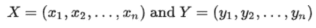
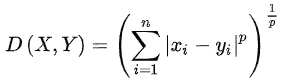
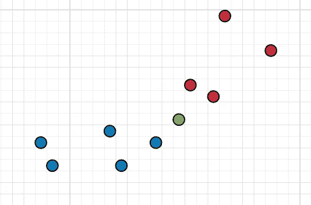
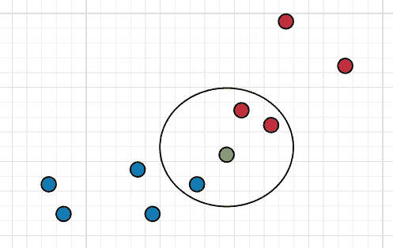
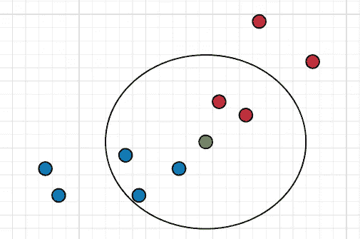
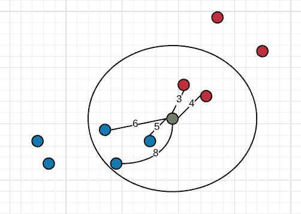
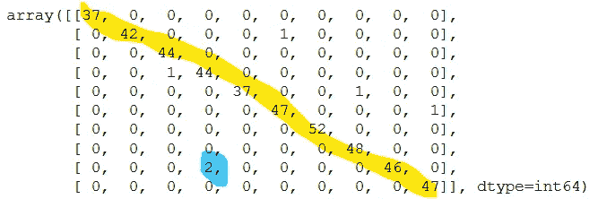
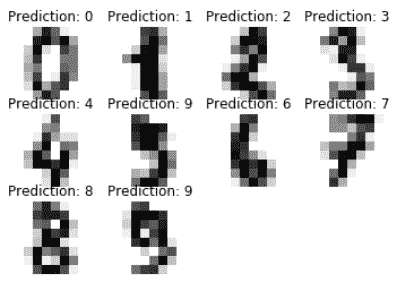

# 理解和使用 k-最近邻(kNN)进行数字分类

> 原文：<https://towardsdatascience.com/understanding-and-using-k-nearest-neighbours-aka-knn-for-classification-of-digits-a55e00cc746f?source=collection_archive---------27----------------------->

# **什么是分类？**

在机器学习和统计学中，分类是使用新观察的特征/变量来发现新观察的类别的任务。这种分类是使用基于训练数据训练的分类器来完成的。训练数据是许多观察值的集合，这些观察值用适当的类名正确标记。监督学习涉及用正确标记的观察值进行训练，因此分类被认为是监督学习。

分类示例:

*   使用电子邮件的文字、图像和附件等电子邮件特征将电子邮件标记为“垃圾邮件”或非垃圾邮件。
*   使用患者的特征，如性别、年龄、体重、血压和观察到的症状，将患者标记为“健康”或“患病”。

有许多模型可以用于机器学习中的分类任务，但我们将使用 k 近邻，因为它使用简单但功能强大。

# **k 近邻:**

这是一种基于新数据点与其他数据点组的接近程度对其进行分类的算法。来自一个组的新数据点的接近度越高，它被分类到该组的可能性就越高。

数据点之间的距离通过距离度量来测量，如欧几里德距离、曼哈顿距离、闵可夫斯基距离、马哈拉诺比斯距离、切向距离、余弦距离等等。

对于具有 n 个特征的数据点 X 和 Y:



闵可夫斯基距离公式是:



闵可夫斯基距离当 p = 1 时是曼哈顿距离，当 p =2 时是欧几里德距离，当 p = ∞时是切比雪夫距离。闵可夫斯基距离是欧几里得距离的推广形式。

使用距离度量，我们创建新数据点的 n 个最近邻居的邻域。

为了获得新数据点的类别，我们查看在所创建的邻域中具有更多数据点的类别组，以及与邻域中的其他组相比更接近我们的新数据点的类别组。基于这两个因素，我们确定新数据点的类别。

让我们通过一个例子来更好地理解这一点。

**举例:**

考虑将顾客分为快乐和不快乐两类的任务。您可能希望事先知道哪些客户不满意，以便通过提供折扣来防止他们转向竞争对手的服务。

在图中，红色代表不满意的客户，他们已经转向另一家竞争对手，而蓝色代表对我们满意的客户，他们仍在使用我们的服务。

现在，我们有一个用绿色圆圈表示的新客户，我们想知道他对我们使用 kNN 算法的服务是满意还是不满意。



蓝色:快乐的顾客，红色:悲伤的顾客，绿色:新顾客

如果我们使用 3 个邻居，并且我们对每个数据点使用相等的权重，那么我们在邻居中有 2 个红色点和 1 个蓝色点，绿色点，即新的数据点被分类为红色。



具有统一权重的 3-最近邻示例

如果我们使用 5 个邻居，并且我们对每个数据点使用相等的权重，那么我们在邻居中有 3 个蓝点和 2 个红点，并且绿点被分类为蓝色。



具有统一权重的 3-最近邻示例

如果我们使用 5 个邻居，并且我们使用欧几里德距离来计算每个数据点的权重，那么我们在邻居中有 3 个蓝点和 2 个红点。数据点之间的欧几里德距离用线表示。



使用欧几里德距离度量的权重的 5-最近邻示例

为了使用欧几里得距离计算权重，我们将取距离的倒数，以便更近的点具有更高的权重。对于每个类，我们将计算权重的总和，具有较高总和权重的类成为预测类。

红色等级的权重总和:

1/3 + 1/4 = 0.5833

蓝色等级的权重总和:

1/5 + 1/8 + 1/6 = 0.4912

因为红色类别具有较高的权重，所以我们对新数据点的预测类别是红色类别。

# 使用 Scikit 的 kNN-learn:

## kNN 超参数:

在机器学习中，在我们可以使用任何算法之前，我们需要为该模型选择超参数的值。在 kNN 的情况下，重要的超参数是:

*   邻居的数量。
*   `weights`:如果设置为`uniform`，每个邻域中的所有点对预测类的影响相等，即预测类是邻域中点数最高的类。如果设置为`distance`，较近的邻居将比较远的邻居具有更大的影响，即具有更多靠近新数据点的点的类成为预测类，为此，我们在计算权重时取距离的倒数，以便较近的点具有更高的权重。
*   `metric`:当`weights`设置为`distance`时使用的距离度量。默认值为`minkowski`，这是计算两个数据点之间距离的一种方法。我们可以更改默认值以使用其他[距离度量](https://scikit-learn.org/stable/modules/generated/sklearn.neighbors.DistanceMetric.html)。
*   `p`:是`minkowski`度量的功率参数。如果 p=1，那么距离度量是`manhattan_distance`。如果 p=2，那么距离度量是`euclidean_distance`。如果愿意，我们可以试验更高的 p 值。

```
# kNN hyper-parametrs
sklearn.neighbors.KNeighborsClassifier(n_neighbors, weights, metric, p)
```

通过交叉验证尝试不同的超参数值可以帮助您为最终模型选择正确的超参数。

## **kNN 分类器:**

我们将建立一个分类器，将手写数字从 0 到 9 分类。我们将使用的数据来自 MNIST 数据库，这是一组 60，000 个 28×28 像素的黑白图像，包含 0 到 9 之间的手写数字。

导入库:

```
# To load MNIST image data
from sklearn.datasets import load_digits# kNN Classifier
from sklearn.neighbors import KNeighborsClassifier# Confusion matrix to check model performance
from sklearn.metrics import confusion_matrix# To split data into training and testing set
from sklearn.model_selection import train_test_split# For plotting digit
import matplotlib.pyplot as plt
```

正在加载数字的 MNIST 数据:

```
digits = load_digits()
```

转换数据以用于 kNN 分类器:

```
# Number of images
n_samples = len(digits.images)# Changing shape from 28x28 pixel values to a sequence of values
X = digits.images.reshape((n_samples, -1))# Getting the already known targets for each image
y = digits.target
```

创建我们的培训和测试集:

```
# Splitting data to train and test sets
X_train, X_test, y_train, y_test = train_test_split(X, y, random_state=0)
```

创建和培训模型:

```
# Creating model
clf = KNeighborsClassifier(n_neighbors=3)# Training model
clf.fit(X_train, y_train)
```

获得测试数据的预测:

```
# Predictions for test data
predicted = clf.predict(X_test)
```

使用混淆矩阵比较实际目标值和预测目标值:

```
# Print confusion matrix
confusion_matrix(y_test, predicted)
```



分类数字混淆矩阵

在矩阵中，行代表实际目标值，其中第一行代表 0 标签，第二行代表 1 标签，依此类推。同样，列表示预测，其中第一列表示 0 标签，第二列表示 1 标签，依此类推。

以黄色突出显示的矩阵对角线上的值是预测正确的值。

考虑在第 4 列第 9 行用蓝色突出显示的值。这是一个错误。我们的模型将3 误分类为 8。

总的来说，我们的模型在将数字分类为误分类方面做得很好，即除对角线以外的值大多为零或小于 2。

查看前 10 幅图像和预测:

```
# Zip image with prediction
image_with_prediction = list(zip(digits.images, clf.predict(X)))# for first 10 images
for pos, (image, prediction) in enumerate(image_with_prediction[:10]):
    plt.subplot(3, 4, pos+1) # Create 3x4 grid
    plt.axis('off') # no axis
    plt.imshow(image, cmap=plt.cm.gray_r) # show image in gray scale
    plt.title("Prediction: %i" % prediction) # set title to predicted value
plt.show() # show plot
```



所有的预测看起来都不错，除了第 6 张看起来更像 5，但我们的模型认为它是 9。

# **结论:**

当在你自己的问题上使用 kNN 时，确保每个特征的距离根据该特征的重要性进行缩放。如果出现房价问题，我们的特征年龄和房价将具有非常不同的比例，您必须缩小房价特征的比例以提高模型性能。

如果您的数据具有大量维度，则您可能希望通过使用要素缩减和要素工程技术来缩减要素，因为维度越高，数据的准确性越低。

kNN 在 MNIST 数据集上工作得很好，因为它是一个受控的数据集，即数字的位置在所有图像上都是一致的。此外，所有图像的像素值具有相似的颜色梯度。当处理具有大量空间信息的图像的分类问题时，即图像中物体位置的变化和颜色梯度的变化，您可能希望使用专门为此类任务构建的卷积神经网络。

kNN 也可用作回归算法，即，代替预测离散类，它也可用于预测连续数字，如房价。

希望这有助于你理解 kNN。

感谢阅读。