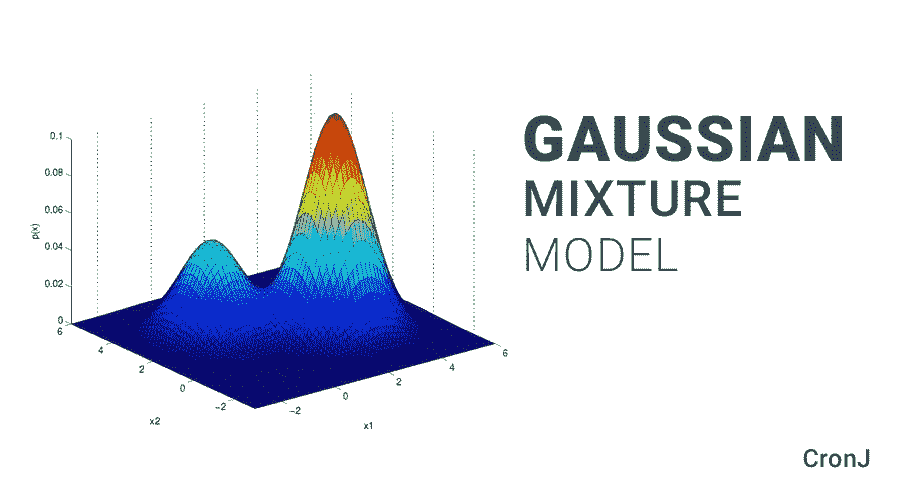
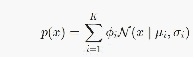
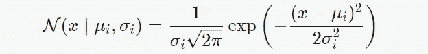
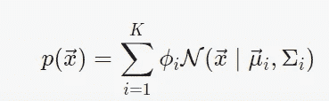
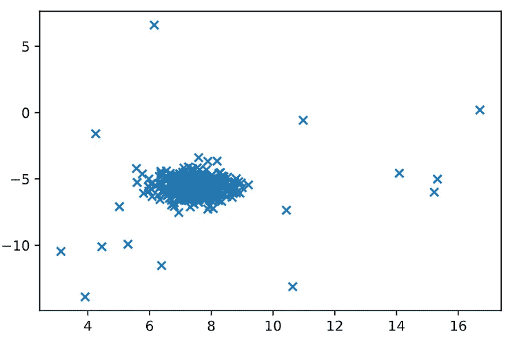
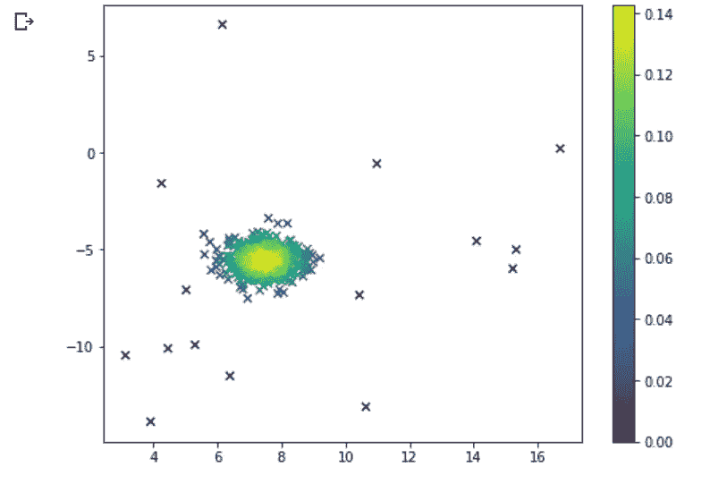
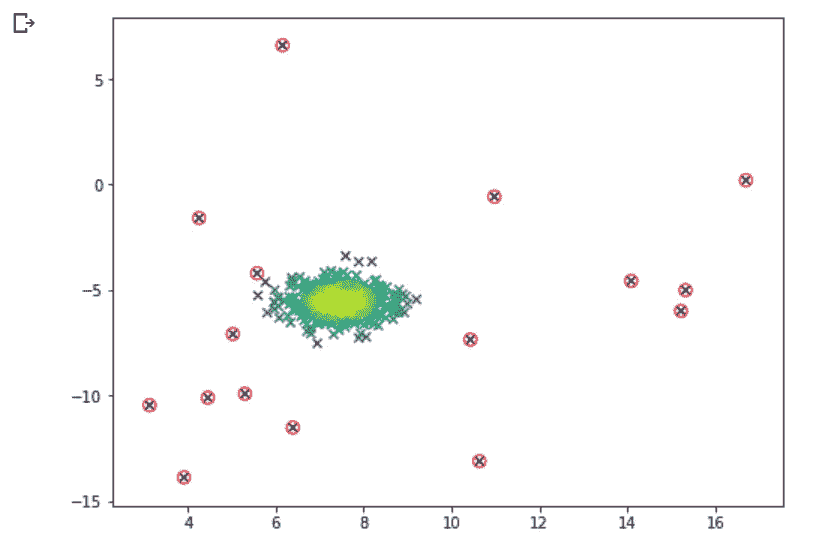
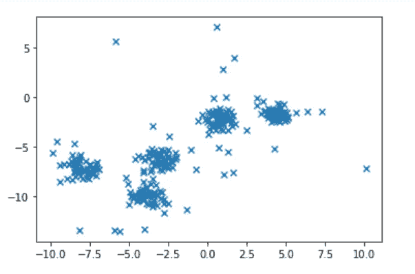
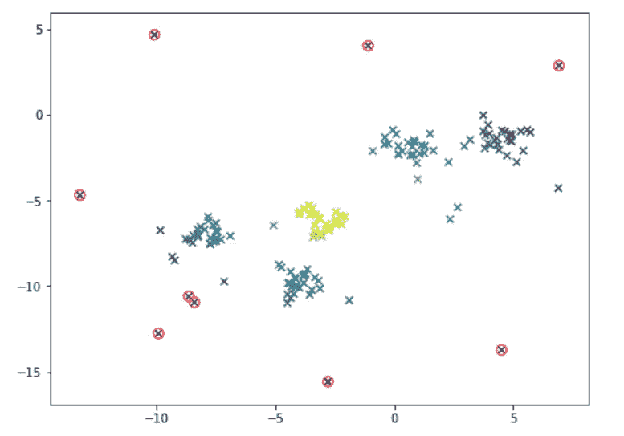
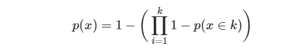

# 基于高斯混合模型的 Python 异常检测。

> 原文：<https://towardsdatascience.com/understanding-anomaly-detection-in-python-using-gaussian-mixture-model-e26e5d06094b?source=collection_archive---------3----------------------->

## 这里我们将通过一个例子来学习如何用高斯混合模型实现异常检测。

首先，我们需要理解数据集中什么算异常。异常可以被视为数据集中罕见或不寻常的观察结果。例如，在信用卡交易数据集中，欺诈交易是异常的，因为与大型数据集中的正常交易相比，欺诈案例的数量非常少。

在异常检测中，我们试图识别在统计上不同于其余观察的观察。

今天我们来看看高斯混合模型，这是一种无监督聚类方法。在这种方法中，与 K-Means 不同，我们对数据进行“K”高斯拟合。然后，我们找到高斯分布参数，如每个聚类的均值和方差以及聚类的权重。最后，对于每个数据点，我们计算属于每个聚类的概率。

在数学上，我们可以用如下两种方式编写高斯模型:

1]单变量情况:一维模型

单变量高斯模型

和

其中 *μk* =平均值&T2σk=第 k 个分量的方差。 *ϕk* =聚类‘k’的权重。

2]多元案例:多维模型

其中*μ*k= mean&σ*k*=第 k 个分量的协方差矩阵。 *ϕk* =聚类‘k’的权重。

总之，该方程描述了 K 高斯分布的加权平均值。

该算法在这 K 个集群上训练。因此，给定一个新的数据点，算法找到它与每个分布的距离&从而得到该点属于每个聚类的概率。因此，如果对于特定的聚类，如果概率非常低，则表明数据点是异常的。

所以让我们从实际实现开始吧。

首先，我们将导入所有必要的模块并创建一个数据集。

Import.py

这里我们使用来自 scikit-learn 的 **make_blobs** 来生成用于聚类的高斯 blob。可以在此处找到详细参数的完整文档:

 [## sk learn . datasets . make _ blobs-sci kit-learn 0.22 文档

### sci kit-learn:Python 中的机器学习

scikit-learn.org](http://scikit-learn.org/stable/modules/generated/sklearn.datasets.make_blobs.html) 

您得到的输出是一个数据集，其中有些点是主分布的异常值。

在上面的数据集中，我们可以用眼睛发现异常值，但我们应该如何让机器做同样的事情呢？

这就是高斯估计器的用处。由于我们的数据集只有一个中心，我们将使用单个高斯。如上所述，我们将使用第一个等式来计算数据集的均值和方差。为了做到这一点，我定义了函数，它返回输入分布的均值和方差。

均值 _ 方差. py

在上面的函数中输入我们的数据集后，

现在我们有了基本的参数，我们将计算每个点，由我们的分布产生的概率。因此，属于同一聚类的点将具有高概率&离群点将具有低概率。

为此，我们有一个函数。我用的代码是标准代码。这很容易理解。我们使用 Numpy 线性代数模块来实现上面提到的 **N( *x* ∣ *μi* ， *σi* )** 方程。

高斯. py

为了可视化这些概率，我们可以用它们的概率绘制相同的数据集，如下所示。

plot_prob.py

我们可以看到，同一个集群中的点有很高的概率&当我们向外走时，即离群值，概率趋于零。

现在，我们可以选择概率的阈值，将它们标记为异常值。这里我选择它为 0.02 &再次绘制数据。该值将根据分布和随机状态而变化。

mark_outliers.py

太好了！我们的模型在单个集群上表现得相当好。但是，我们可以对多个集群使用相同的策略吗？只有一个方法可以知道:)

这里，我使用了与上面生成单个集群相同的代码。唯一的区别是，这里不是 1 个集群，而是生成 5 个。

mixture_data.py

现在，让我们使用与之前相同的方法，看看它的性能如何。代码将是类似的。尝试不同的阈值并观察。这里我将使用一个固定值。

plot_mixture.py

我们可以看到，我们的模型在多个集群上表现糟糕。它没有认识到异常值。这就是为什么现在我们将转移到高斯混合。这里我们使用了**sk learn . mixture . Gaussian mixture .**你可以在这里看到文档。

 [## sk learn . mixture . Gaussian mixture-sci kit-learn 0 . 22 . 1 文档

### class sk learn . mixture . Gaussian mixture(n _ components = 1，协方差 _type='full '，tol=0.001，reg_covar=1e-06…

scikit-learn.org](https://scikit-learn.org/stable/modules/generated/sklearn.mixture.GaussianMixture.html#sklearn.mixture.GaussianMixture) 

高斯 _ 混合物. py

如果您遵循文档，您将看到 **predict_proba()** 方法。我们将使用相同的方法来找出每个点属于五个聚类中任何一个的概率。

混合物 _ 预测 _ 概率

我们可以看到，该模型将点分类到 K 个聚类 *&* 之一，这有助于我们识别离群点。我们可以通过找到任何集群都不希望自己拥有的点来做到这一点。

此公式返回数据点由我们适合的任何一个高斯随机产生的概率。因此，我们想要从上面的公式中过滤掉任何具有低概率的数据点。

如果你觉得这篇文章有用，请为它鼓掌，它会有很大的帮助！！

关注我的 [**中的**](https://medium.com/@agastidukare) 获取更多此类教程&文章。

如果您想联系，请在[**LinkedIn**T3 上添加我。](https://www.linkedin.com/in/agastidukare/)

如果您有任何疑问或发现代码/概念中的任何错误，请随时在评论中写下。这是我的第一个博客，试图与世界分享我在数据科学领域所知道的一切！