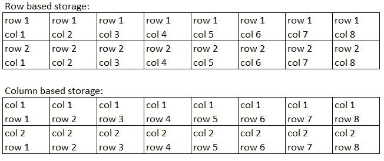
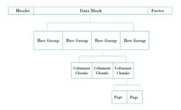
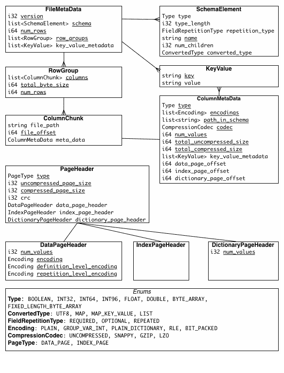

# 了解 Apache 拼花地板

> 原文：<https://towardsdatascience.com/understanding-apache-parquet-7197ba6462a9?source=collection_archive---------3----------------------->

## 数据仓库|数据湖|拼花地板

## 理解为什么拼花地板应该用于仓库/湖边储物

> Apache Parquet 是一种[列存储](http://en.wikipedia.org/wiki/Column-oriented_DBMS)格式，适用于任何项目[…]，无论选择的是数据处理框架、数据模型还是编程语言。
> ——[https://parquet.apache.org/](https://parquet.apache.org/)

这个描述很好地总结了这种格式。这篇文章将讨论这种格式的特性，以及为什么它有利于数据仓库或 lake 中的分析数据查询。

数据一行接一行地存储，每行包含所有列/字段

[https://www.ellicium.com/parquet-file-format-structure/](https://www.ellicium.com/parquet-file-format-structure/)

第一个特征是格式的列存储特性。这仅仅意味着数据是按列而不是按行编码和存储的。该模式允许分析查询为所有行选择列的子集。Parquet 将列存储为块，还可以在每个块中进一步拆分文件。这允许将磁盘 i/o 操作限制到最低限度。

要提到的第二个特性是数据模式和类型。Parquet 是一种二进制格式，允许编码数据类型。与某些格式不同，可以用特定类型的布尔、数字(int32、int64、int96、float、double)和字节数组来存储数据。这使得客户端在读取和写入 parquet 格式的数据时，可以轻松高效地序列化和反序列化数据。

除了数据类型之外，Parquet 规范还存储元数据，这些元数据在三个层次上记录模式；文件、块(列)和页眉。每个文件的页脚包含文件元数据。这记录了以下内容:

*   版本(拼花格式)
*   数据模式
*   列元数据(类型、值的数量、位置、编码)
*   行组数
*   附加键值对

拼花元数据[https://parquet.apache.org/documentation/latest/](https://parquet.apache.org/documentation/latest/)

元数据总是写在文件的页脚，因为这允许单遍写入。简单地说，首先写入数据，然后知道写入数据的所有位置、大小和编码，就可以准确地写入元数据。许多格式将它们的元数据写在头中。但是，这需要多次传递，因为数据是在标题之后写入的。Parquet 使得读取元数据和数据本身非常有效。另一个优点是文件可以以任何期望的大小分割。例如，如果您将它与 Spark 或 Amazon Redshift 一起使用，您可以指定写入 1GB 大小的文件以提高加载效率。

单独的元数据文件是规范的一部分，允许引用多个拼花文件。因此数据集可以任意大小，以适合单个文件或多个文件。当在数据湖中处理千兆字节或兆兆字节的数据时，这尤其有利。今天的大多数应用程序和仓库都允许并行读取。多个文件意味着可以并行读取数据以加快执行速度。

将模式和元数据与可拆分文件相结合，使拼花成为一种灵活的格式。该模式可以随着时间的推移而发展。一个例子是，如果一个字段/列被添加到数据集，这只是在新的块和文件中编码。元数据文件被更新以记录只有某些文件和行组包括新块。因此，模式演化和合并很容易发生。如果文件不包含新字段，它们只会导致该字段不存在。如果读取多个文件，其中一些文件包含字段，而其他文件不包含字段，`null`值用于表示缺失的列值。

最后，该格式本身支持文件内的压缩。这意味着当数据按列为中低基数时，可以有效地压缩数据。当数据基数较高时，可以在不同的文件中对这些列分别执行压缩。这允许不同字段和数据类型的编码和压缩的可变性。当以高吞吐量高效读取数据时，这是另一个优势。

总的来说，Parquet 以列格式存储数据以及模式和类型化数据的特性允许高效地用于分析目的。它通过压缩、编码和可拆分格式为并行和高吞吐量读取提供了更多好处。元数据支持所有这些，同时提供存储和模式演化的灵活性。Parquet 已经成为分析数据湖和数据仓库的事实上的格式。许多工具和框架都支持这一点，如 Hadoop、Spark、AWS Redshift 和 Databricks 平台。Databricks 还为 Parquet 提供了一种新的风格，允许数据版本化和使用 Delta Lake 格式进行“时间旅行”。(预告:可能会有*即将发布的关于 Delta 格式的帖子。)*