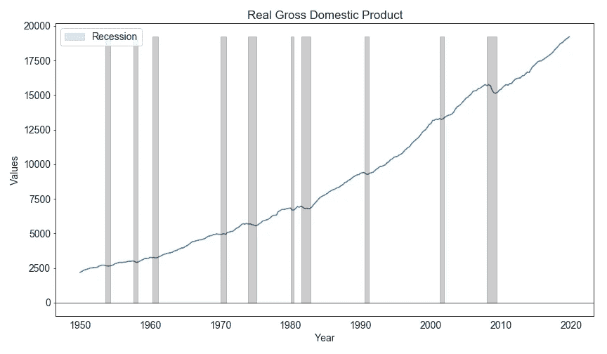
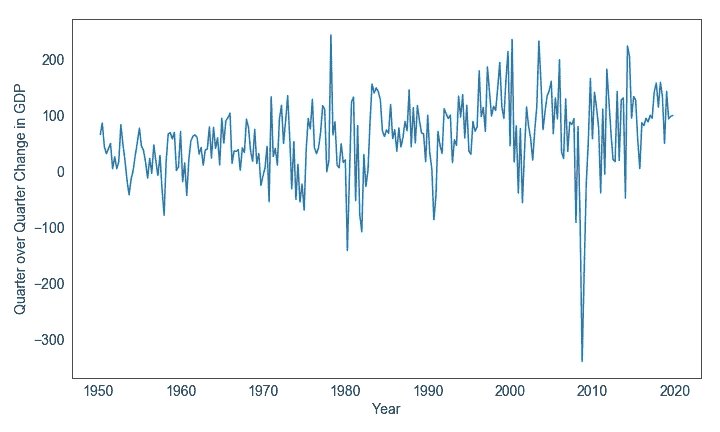
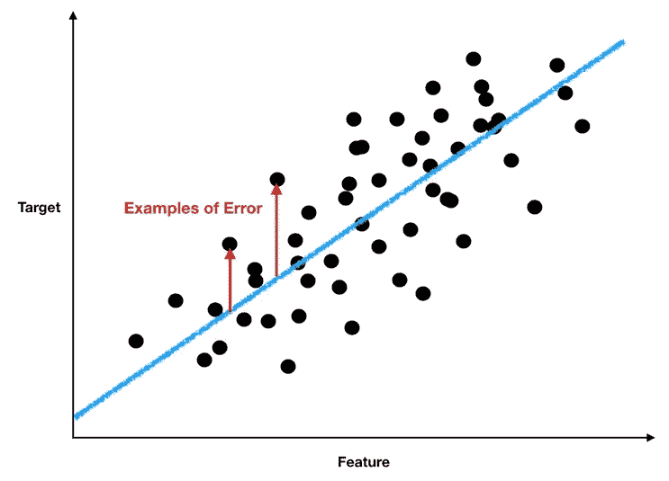
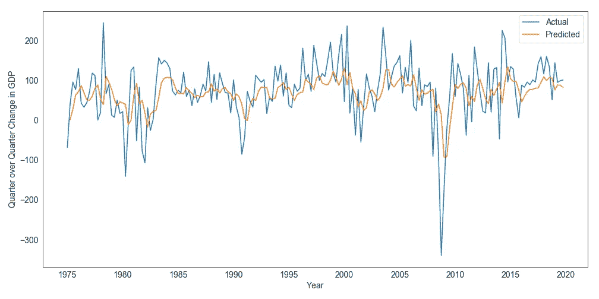
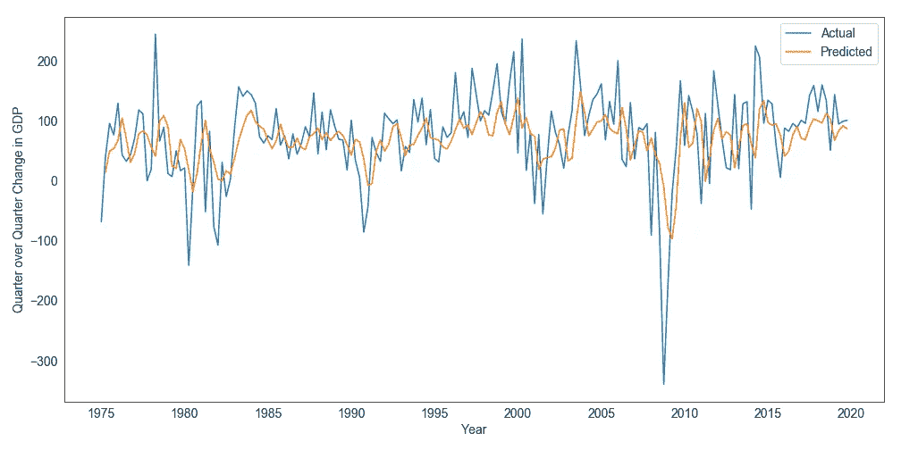

# 了解 ARIMA(时间序列建模)

> 原文：<https://towardsdatascience.com/understanding-arima-time-series-modeling-d99cd11be3f8?source=collection_archive---------5----------------------->


杰克·希尔斯在 [Unsplash](https://unsplash.com?utm_source=medium&utm_medium=referral) 上的照片

## 利用过去来预测未来

那句老马克·吐温的名言是什么来着？"历史不会重演，但它经常会重复。"

我喜欢分析时间序列。所以当我说我认为马克·吐温是对的时，我可能是有偏见的。我们绝对应该以怀疑的态度对待所有的预测——未来本质上是不确定的，无论多少计算或数据都无法改变这一事实。但是通过观察和分析历史趋势，我们至少可以解开一小部分的不确定性。

**ARIMA 模型是线性回归模型的一个子集，它试图使用目标变量的过去观察值来预测其未来值。ARIMA 模型的一个关键方面是，在其基本形式中，它们不考虑外生变量。更确切地说，预测纯粹是用目标变量的过去值(或从那些过去值精心制作的特征)做出的。**

**ARIMA 代表自回归综合移动平均线。让我们浏览一下 ARIMA 模型的每一部分，以便充分理解它。**

# AR:自回归

这是最简单的部分。**自回归意味着我们对目标变量自身的过去值进行回归。**也就是说，我们使用目标变量的滞后值作为 X 变量:

```
Y = B0 + B1*Y_lag1 + B2*Y_lag2 + ... + B***n****Y_lag***n***
```

这很简单。这个等式说的是 Y 的当前观察值是它过去的 ***n*** 值的某个线性函数(其中 ***n*** 是我们选择的一个参数；以及 B0、B1 等。是我们在训练模型时适合的回归 betas)。前面的等式通常被称为 AR( ***n*** )模型，其中 ***n*** 表示滞后的数量。通过稍微改变符号，我们可以很容易地预测未来:

```
Y_forward1 = B0 + B1*Y + B2*Y_lag1 + B3*Y_lag3 + ... B***n******Y_lag***(n-1)***
```

现在，我们使用当前值及其过去的滞后值来预测未来值(提前 1 个时间步)。

# I:集成

**集成表示我们对数据应用差分步骤。也就是说，不是像下面这样运行回归:**

```
Y_forward1 = B0 + B1*Y + B2*Y_lag1 + ...
```

我们这样做:

```
Y_forward1 - Y = B0 + B1*(Y - Y_lag1) + B2*(Y_lag1 - Y_lag2) + ...
```

第二个方程的意思是，Y 的未来变化是 Y 的过去变化的线性函数，为什么要用差分呢？原因是差异通常比原始的无差异值更稳定。当我们做时间序列建模时，我们希望我们的 Y 变量是**均值方差平稳**。这意味着一个模型的主要统计特性不会因为取样时间的不同而改变。建立在静态数据上的模型通常更稳健。

以真实 GDP(真实意味着它已经被通货膨胀调整)为例。从图中可以明显看出，原始 GDP 数据不是稳定的。它的上升使得图表前半部分的平均 GDP 比后半部分的低很多。



美国实际国内生产总值(来源:圣路易斯美联储银行)

如果我们对这些数据求差，就会得到下面的曲线图。请注意，它现在明显更加稳定(多年来平均值和方差大致一致)。



实际国内生产总值的变化更加平稳

# 马:移动平均线

当我第一次研究时间序列时，我假设移动平均只是 Y 变量的移动平均(例如，200 天的移动平均)。尽管它们在精神上有些相似，但它们是不同的数学实体。

移动平均模型由以下等式总结:

```
Y = B0 + B1*E_lag1 + B2*E_lag2 + ... + B***n****E_lag***n***
```

类似于 AR 部分，我们在这里用历史值做一些事情，因此所有的滞后。但是这个 E 是什么？在对 MA 模型的大多数解释中，e 通常被称为误差，它表示模型和目标变量之间的随机剩余偏差(如果您问我们在拟合模型之前怎么可能会有误差，请稍等片刻)。

基本回归模型的完整等式是:

```
Y = B0 + B1*X + E
```



我们需要方程中的 E 来表明回归输出 B0 + B1*X 仅仅是 y 的近似值。左边的图说明了我的意思。黑点是我们试图预测的，蓝线是我们的预测。虽然我们成功地捕捉到了总体趋势，但总会有一些无法捕捉的特殊变化。E 项说明了这个未被捕获的部分——换句话说， **E 代表精确答案和我们的模型提供的近似正确答案之间的差异。**

因此，如果你一直在仔细阅读，你可能会问，“难道我们不需要先有一个模型，然后才会有模型错误吗？”你完全正确。e 是我们所说的不可观测的参数。与 Y(我们的目标变量)或外生 X 变量的滞后值不同，E 不可直接观察到。另一方面，这也意味着我们不能用 OLS 来拟合 ARIMA 模型(因为我们有不可观测的参数)。相反，我们需要像 [MLE(最大似然估计)](/understanding-maximum-likelihood-estimation-mle-7e184d3444bd)这样的迭代估计方法，它可以同时估计β参数和残差(以及残差项上的β)。

> 所以 MA 模型使用模型过去的误差来预测 Y(类似于 AR 模型，我们告诉它我们希望它考虑多少过去的误差)。

让我们花一点时间来思考一下为什么会这样。考虑以下简化的 MA(1)模型:

```
Y = u + B1*E_lag1where u = the mean of YE = Y - predicted
```

**第一项，u，意味着我们的模型围绕 Y** 的均值进行预测(就像说不知道别的，我就猜均值)。第二项 B1*E_lag1 是误差所在。让我们假设现在我们估计 B1 是 0.2。**而误差(E)被定义为 Y 的实际值减去模型的预测值。**

**这意味着如果最近的误差(E_lag1)为正(意味着实际误差大于我们的预测)，我们将把预测误差上调 1/5。**这具有使模型的错误稍微减少的效果(因为第二项 B1*E_lag1 将模型的预测稍微推向正确答案)。

那么，如果模型知道自己的错误，那么为什么它不经常过度拟合(换句话说，为什么我们不通过不公平地给它一些答案来偏置我们的模型)？除了过度拟合，MA 模型没有固有的偏差，因为模型误差是独立的，并且近似正态分布(误差是一个随机变量)。因为它们是随机变量，误差(E_lag1)可以根据它们被观察的时间步长而呈现出非常不同的值。误差中的这种固有噪声意味着，仅用一个β(B1)来拟合，几乎不可能找到一个 B1 来完美地调整每个误差，以便他们的产品完美地填补实际和预测 Ys 之间的每个漏洞。换句话说，**MA(1)模型只能利用它对误差的了解，非常近似地将自己推回到正确的方向。**

当然，像任何其他模型一样，我们可以通过允许更多的特征来过度拟合 MA 模型，在这种情况下，将会有越来越多的滞后误差(这意味着拟合更多的 betas)。但是这样一个过度拟合的模型在样本之外会表现得很糟糕。

# ARIMA 实际国内生产总值预测

让我们通过建立一个 ARIMA 模型来预测实际 GDP，从而将所有这些放在一起。我们将使用 ARIMA 的 statsmodel 实现。我从 FRED(圣路易斯美联储银行的数据仓库)中提取了真实 GDP 的数据。

statsmodel 中的 ARIMA 函数至少需要两个参数:

1.  数据——在这种情况下，我们给它一个熊猫系列的原始实际 GDP 值(我们不需要提前求差，因为 ARIMA 算法会为我们做)。
2.  第二个参数 order 告诉 ARIMA 函数，在下面的序列中要考虑每种模型类型的多少个组件— (AR 滞后，差值之间的时间步长，MA 滞后)。

让我们看看 AR(4)模型是什么样子的(没有 MA)。我们采用 1 个时间步长差值，使数据保持稳定:

```
from statsmodels.tsa.arima_model import ARIMAmod = ARIMA(master_df['GDP'], order=(4,1,0))
mod.fit()
predictions = mod.fit().predict()
```

我们的预测绘制在下图中。如果你仔细观察，橙色线(我们的预测)落后于蓝色线(实际)。这很糟糕。这意味着我们的预测总是落后于现实；因此，如果我们遵循这种模式，我们将永远落后几步。但这是 AR 模型的预期，AR 模型试图通过推断最近的过去来预测未来(如果有那么简单就好了)。



AR(4)模型

同样重要的是要注意，在这个演示中，我并没有将一个训练集和一个测试集分开；我使用整个数据集来拟合我的参数(而不是扩展窗口)。在实践中，我们希望对模型的样本外预测能力进行更加稳健的测试。因此，我们希望使用时间点数据(而不是修正后的 GDP 数据)和扩展窗口回归，以便在每个时间点，我们仅使用历史上该时间点的可用数据来估计参数。

现在，让我们将 2 MA 元件添加到模型中:

```
mod = ARIMA(master_df['GDP'], order=(4,1,2))
mod.fit()
predictions = mod.fit().predict()
```

我们已经通过允许模型考虑其误差的大小和方向，赋予了模型稍微修正航向的能力。这是以更长的模型估计过程为代价的——最大似然估计需要一些时间来收敛，而 OLS 则非常快。让我们看看我们的新预测是什么样的:



具有 4 个 AR 滞后和 2 个 MA 滞后的 ARIMA

也好不到哪里去。但是我们不应该期望仅仅通过增加几个 MA 组件就能获得巨大的改进。AR 和 MA 分量都来自目标变量的过去值，因此它们都是通过外推过去来预测未来的尝试。你可能会认为这在平静时期行得通，但在试图预测转折点时会遭遇惨败。

# **结论**

因此，在经历了这一切之后，我们最终得到了一个乏善可陈的模型。但是不要绝望。ARIMA 模型并不意味着是一个完美的预测工具。相反，这是第一步。从我们的目标变量的过去值导出的特征意味着是外生变量的补充而不是替代。因此，在现实中，我们的 GDP 模型不仅包括 AR 和 MA 组件，还包括与 GDP 密切相关的外生组件，如通货膨胀、股票回报、利率等。

此外，拟合的测试版本身也常常令人感兴趣。例如，如果我们正在构建实际 GDP 的模拟，那么我们需要测量 GDP 的自相关性(自相关性是指 GDP 的当前变化与其过去值之间的相关性)。因为如果存在自相关，那么我们肯定不想建立一个 GDP 模型，在这个模型中，我们模拟每个季度的 GDP 变化，而不考虑其他因素。那将是错误的，我们的模型将产生脱离现实的结果。因此，分析 ARIMA 模型的贝塔系数有助于我们更好地理解感兴趣的目标变量的统计特性。

[***如果你总体上喜欢这篇文章和我的写作，请考虑通过我在这里的推荐链接注册 Medium 来支持我的写作。谢谢！***](https://tonester524.medium.com/membership)