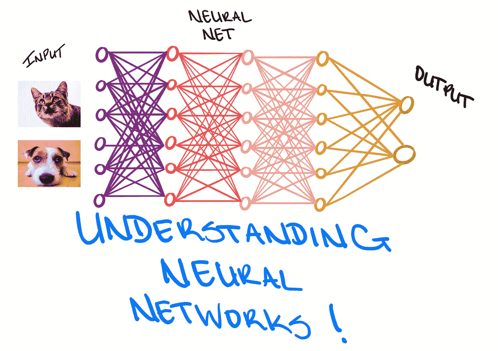
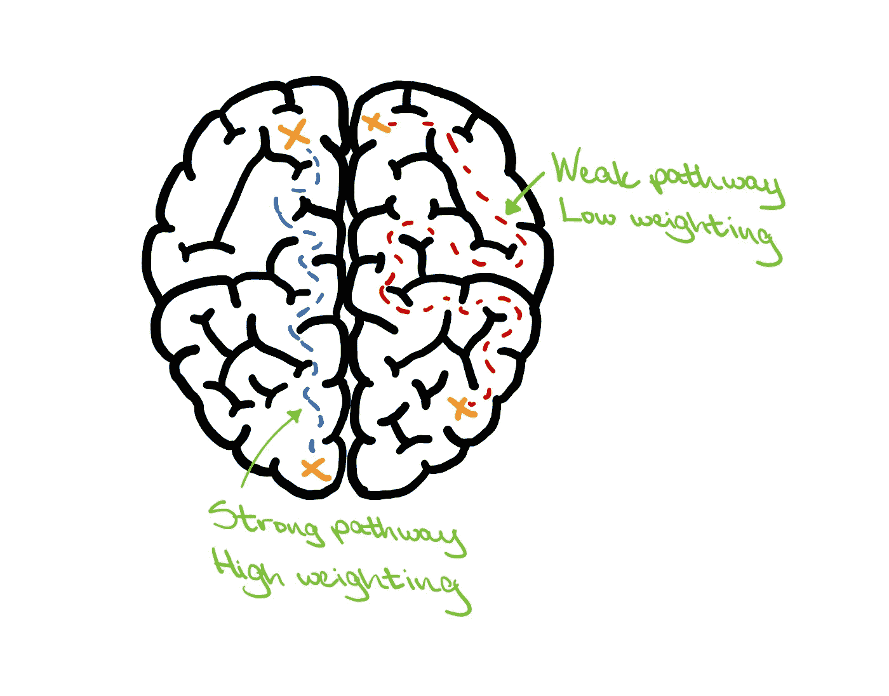
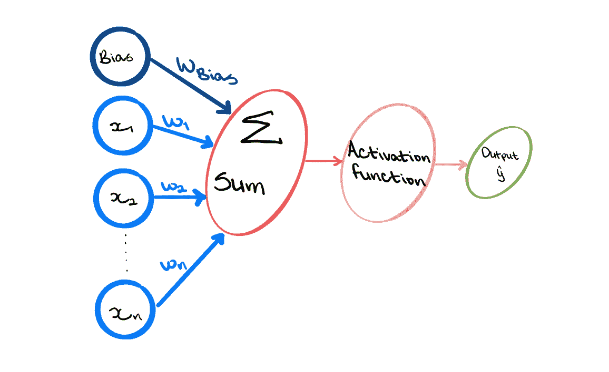
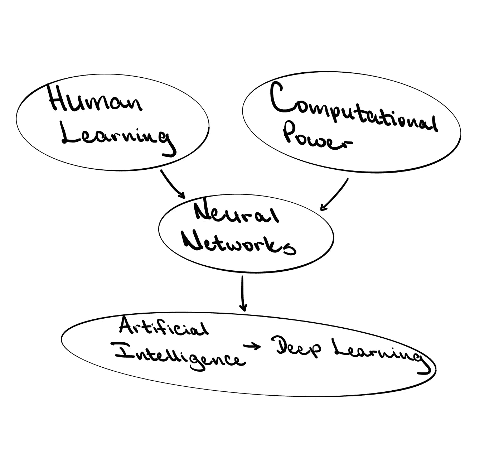

# 理解人工神经网络

> 原文：<https://towardsdatascience.com/understanding-artificial-neural-networks-3fc3cbcd397d?source=collection_archive---------22----------------------->

## 检查深度学习模型和神经网络的基础

图片作者:特里斯特·约瑟夫

大约从 2013 年 11 月开始，“深度学习”一词开始流行起来，尤其是在数据科学界。这一趋势出现在 2010 年“大数据”热潮和 2011 年“数据科学”热潮之后不久。兴趣的上升并不令人惊讶，因为公司现在意识到，他们需要能够从目前的信息海啸中解读洞察力的个人。

随着数据科学现在被称为“几乎所有与数据有关的事物”，数据利用的过程已经超越了数据收集和分析。现在，可以使用大型数据集来精确地模拟事件和创建数据应用程序。这种激增使得训练计算机和机器执行各种任务成为可能，其中一些可能被视为今天的标准做法。

现在，当一项复杂的任务需要建模时，深度学习几乎是首选方法。这是一个强大的过程，通过自动提取未来决策所需的最有用的信息，使计算机能够模仿人类行为。它是人工智能(AI)和机器学习(ML)的一个分支，深度学习的目标是使用计算方法，允许机器直接从数据中理解信息，而不依赖于预先确定的方程作为模型。

图片作者:特里斯特·约瑟夫

ML 模型和深度学习模型都希望从数据中学习一些东西，这些数据可以用来帮助通知未来的决策。然而，深度学习模型比 ML 更进了一步。其思想是，典型的 ML 算法试图在数据中定义一组规则，这些规则通常是手工设计的。因此，当置于开发环境之外时，ML 模型可能表现不佳。另一方面，深度学习模型直接从原始数据中学习复杂的特征，不一定需要一套手工设计的规则。

深度学习模型建立在“神经网络”的思想之上，这就是允许模型从原始数据中学习的东西。回想一下，这类模型的目标是以某种方式让机器模仿人类行为。因此，想想类似于人脑的深度学习模型中的神经网络。大脑由数十亿个被称为神经元的细胞组成。每个神经元都有多个连接向它传递信息，一个连接向它传递信息。

随着这些神经连接的建立，大脑开始发育，人类通过一个叫做神经可塑性的过程进行学习。这是大脑中的神经网络通过生长和重组来改变的能力。当重组发生时，神经元之间的新路径得到发展，大脑可以删除不再必要的连接或加强发现更重要的连接。本质上，大脑会给每条路径分配一个权重，其中被认为更重要的连接会比那些被认为不重要的连接获得更高的权重。因此，一组输入沿着具有特定权重的路径被馈送到神经元，信息被处理，然后输出以执行一些任务。

图片作者:特里斯特·约瑟夫

类似地，人工神经网络(ANN)包含一组沿加权路径输入的输入，然后对这些输入进行处理，并产生一个输出来执行某些任务。与神经可塑性一样，如果发现神经网络中的路径在模型中更重要，则它们可以具有更高的权重。

这个想法有助于建立神经网络的基础；也就是**感知器**(或者单个神经元)。通过具有一组输入 *x* ，信息通过该系统向前传播，并且每个输入具有相应的权重 *w* 。输入还应包括独立于 *x* 的“偏置项”。给定手边的问题，偏差项用于相应地移动所使用的函数。然后将每个对应的输入和权重相乘，并计算乘积之和。然后，该和通过非线性激活函数，并且产生输出 *y，*。

非线性激活函数可以采取多种形式。然而，常见的一种是 **sigmoid 函数**。这是一条介于 0 和 1 之间的 S 形曲线，其中负输入值被指定为小于 0.5 的输出，正输入值被指定为大于 0.5 的输出。激活函数的选择很大程度上取决于手头的情况，尤其是因为不同的函数包含不同的属性。这个函数的重要性在于它的非线性。在“现实世界”的问题中，大部分数据是非线性的。将线性形式应用于非线性问题无疑会导致较差的性能。

图片作者:特里斯特·约瑟夫

现在我们了解了感知器是如何工作的，一个深度神经网络本质上是由多个连接的感知器组成的。如果所有输入都密集连接到所有输出，这些层被称为**密集层**。但是，与感知器不同，深度神经网络可以包含多个隐藏层。

隐藏层基本上是神经网络的输入和输出之间的点，在那里激活函数对输入的信息进行转换。它被称为隐藏层，因为它不能从系统的输入和输出直接观察到。只有一个隐含层的神经网络称为**单层神经网络**，而具有更多隐含层的神经网络称为深度神经网络。神经网络越深入，网络就越能从数据中识别。

必须注意的是，尽管从数据中学习尽可能多的东西是目标，但深度学习模型也可能会遭受过度拟合。当模型从训练数据中学习了太多内容(包括随机噪声)时，就会出现这种情况。然后，模型能够确定数据中非常复杂的模式，但这会对新数据的性能产生负面影响。训练数据中拾取的噪声不适用于新的或看不见的数据，并且该模型不能概括所发现的模式。像感知器一样，非线性在深度学习模型中非常重要。虽然模型将从多个隐藏层中学到很多，但是将线性形式应用于非线性问题仍然会导致较差的性能。

图片作者:特里斯特·约瑟夫

深度学习的重要性(以及 ANN 的延伸)植根于这样一种理念，即通过从数据中了解更多信息，可以做出更好的数据驱动决策。人类有能力通过识别旧的模式，发展新的联系，并以新的视角感知他们所学的东西来开发新的有效的过程，从而自发地将信息整合在一起。但是人类并不擅长处理高度复杂的情况，大多数“现实世界”的问题都是高度复杂的。如果计算机更像人脑，那不是很好吗？

**参考文献:**

[digital trends . com/cool-tech/what-a-artificial-neural-network/](https://www.digitaltrends.com/cool-tech/what-is-an-artificial-neural-network/)

deepai . org/machine-learning-glossary-and-terms/hidden-layer-machine-learning #:~:text = In % 20 neural % 20 networks % 2C % 20a % 20 hidden，inputs % 20 enter % 20 into % 20 the % 20 network。

[ncbi.nlm.nih.gov/pmc/articles/PMC4960264/](https://www.ncbi.nlm.nih.gov/pmc/articles/PMC4960264/)

[towards data science . com/introduction-to-artificial-neural-networks-ann-1 EAE 15775 ef9](/introduction-to-artificial-neural-networks-ann-1aea15775ef9)

[explainthatstuff.com/introduction-to-neural-networks.html](https://www.explainthatstuff.com/introduction-to-neural-networks.html)

neuralnetworksanddeeplearning.com/

**其他有用的材料:**

[deeplearning.mit.edu/](https://deeplearning.mit.edu/)

[https://www.inertia7.com/tristn](https://www.inertia7.com/tristn)

[youtube.com/watch?v=aircAruvnKk](https://www.youtube.com/watch?v=aircAruvnKk)

[youtube.com/watch?v=bfmFfD2RIcg](https://www.youtube.com/watch?v=bfmFfD2RIcg)

[https://towards data science . com/what-is-deep-learning-ADF 5d 4 de 9 AFC](/what-is-deep-learning-adf5d4de9afc)