# 理解自动文本摘要-1:抽取方法

> 原文：<https://towardsdatascience.com/understanding-automatic-text-summarization-1-extractive-methods-8eb512b21ecc?source=collection_archive---------6----------------------->


布雷特·乔丹在 [Unsplash](https://unsplash.com/s/photos/page?utm_source=unsplash&utm_medium=referral&utm_content=creditCopyText) 上的照片

## 怎样才能自动汇总我们的文档？

一些网站和应用程序通常使用文本摘要来创建新闻提要和文章摘要。由于我们繁忙的日程安排，这对我们来说变得非常重要。我们更喜欢包含所有要点的简短摘要，而不是阅读整份报告并自己总结。因此，已经进行了几次尝试来自动化总结过程。在这篇文章中，我们将讨论其中的一些，看看它们是如何工作的。

## **什么是总结？**

摘要是一种缩短长文本的技术，这样摘要就包含了实际文档的所有要点。

主要有四种类型的摘要:

1.  单一文件摘要:单一文件的摘要
2.  多文档汇总:来自多个文档的汇总
3.  查询摘要:特定查询的摘要
4.  信息摘要:它包括全部信息的摘要。

## **自动摘要的方法**

主要有两种类型的总结:

**基于抽取的摘要:**抽取方法包括从文档中提取最重要的短语和行。然后，它将所有重要的行组合起来创建摘要。所以，在这种情况下，摘要的每一行每一个字实际上都属于被摘要的原始文档。

**基于抽象的摘要:**抽象方法包括基于深度学习的摘要。因此，它使用新的短语和术语，与实际的文件不同，保持要点不变，就像我们实际总结的方式一样。因此，这比提取方法要困难得多。

据观察，提取摘要有时比抽象摘要工作得更好，可能是因为提取摘要不需要自然语言生成和语义表示。

## **评估方法**

有两种类型的评估:

*   人类评估
*   自动评估

**人工评估**:人工专家根据概要覆盖要点的程度、回答问题的程度以及语法性和非冗余性等其他因素来分配分数。

## **自动评估**

**ROUGE:** ROUGE 代表面向回忆的替角，用于吉斯丁评价。它是通过将它与作为参考的由人类做出的其他摘要进行比较来确定摘要的质量的方法。为了评估该模型，有许多由人类创建的参考和由机器生成的候选摘要。这背后的直觉是，如果一个模型创建了一个好的摘要，那么它必须与人类参考有共同的重叠部分。它是由加州大学的林金耀提出的。

常见的 ROUGE 版本有:

**ROUGE-n:** 基于 n-grams 的机器生成输出与参考输出的比较度量。一个 ***n* -gram** 是来自给定文本或语音样本的 *n* 项的连续序列，也就是说，它只是一个单词序列。二元模型表示两个词，三元模型表示三个词，以此类推。我们通常使用二元模型。

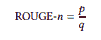

[来源](https://arxiv.org/abs/1707.02268v3)

*”其中 p 是“候选与参考摘要之间共有 n 元文法的个数”，q 是“仅从参考摘要中提取的 n 元文法的个数”。-* [*来源*](https://arxiv.org/abs/1707.02268v3)

**ROUGE-L:** 它表示两个文本中最长的公共子序列越长，它们就越相似。因此，它比 n 元语法更灵活。它根据一个序列的长度来分配分数，这对于机器生成的候选人和人类参考来说是常见的。

**胭脂素:**它带来了一个概念*跳过双字和单字。基本上，如果两个词之间有其他词，它允许或认为是一个二元词，即二元词不必是连续的词。*

胭脂-2 最受欢迎，由以下机构提供:


其中对于每个二元模型‘I ’,我们计算它在生成文档 X 和参考文档 S 中出现的次数的最小值，对于所有参考文档，除以每个二元模型在所有参考文档中出现的总次数。它基于 BLEU 分数。

**基于特征的摘要**:由 IBM 的 H. P Luhan 于 1958 年开发。该论文提出句子的重要性是文档中高频词的函数。详细地说，该算法测量文档中单词和短语的频率，并考虑句子中的单词及其频率来决定句子的重要性。它指出，如果句子中有出现频率较高的单词，这是很重要的，但这里我们不包括像“a”、“the”这样的常见单词。等等。

**抽取摘要:“** *抽取摘要技术通过选择原始文本中句子的子集来产生摘要”。-* [*来源*](https://arxiv.org/abs/1707.02268v3)

提取摘要器首先创建一个 ***中间表示*** ，其主要任务是基于该表示突出显示或提取要摘要的文本的最重要信息。有两种主要的表现形式:

1.  **主题表征:**侧重于表征文本中所表征的主题。有几种方法可以得到这种表示。我们在这里将谈论其中的两个。其他包括**潜在语义分析和贝叶斯模型。如果你也想研究其他人，我会鼓励你查阅参考资料。**

*   **频率驱动方法**:在这种方法中，我们给单词分配权重。如果这个词与主题相关，我们就给 1 分，否则就给 0 分。取决于实现方式，权重可以是连续的。主题表示的两种常用技术是:
*   **单词概率**:它只是简单的用单词出现的频率作为单词重要性的指标。单词 w 的概率由该单词出现的频率 f (w)除以总共有 N 个单词的输入中的所有单词给出。

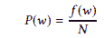

[来源](https://arxiv.org/abs/1707.02268v3)

对于使用单词概率的句子重要性，句子的重要性由句子中单词的平均重要性给出。

*   **TFIDF。(Tern Frequency Inver Document Frequency):**这种方法是对单词概率法的一种改进。这里，TF-IDF 方法用于分配权重。TFIDF 是一种为在大多数文档中频繁出现的单词分配低权重的方法，直觉地认为这些单词是停用词或类似“the”的单词。否则，由于术语频率，如果一个单词以高频率唯一地出现在文档中，则它被赋予高权重。
*   **主题词处理方式**:这种方式类似鹿晗的方式。*主题词技术是一种常见的主题表示方法，旨在识别描述输入文档主题的词。-* [*来源*](https://arxiv.org/abs/1707.02268v3) 这种方法计算单词频率，并使用频率阈值来找到可能描述主题的单词。它将一个句子的重要性分类为它包含的主题词数量的函数。

1.  **指示符表示:**这种类型的表示依赖于句子的特征，并基于这些特征对它们进行排序。因此，在这里，句子的重要性不取决于它所包含的单词，正如我们在主题表征中看到的那样，而是直接取决于句子的特征。这种类型的表示有两种方法。让我们看看他们。

*   **基于图形的方法**:基于页面排名算法。它将文本文档表示为连通图。句子被表示为图的节点，节点或句子之间的边是两个句子之间相似性的度量。我们将在接下来的部分详细讨论这一点。
*   **机器学习方法:**机器学习方法将摘要问题作为分类问题来处理。这些模型试图根据句子的特征将句子分为摘要句和非摘要句。为了训练模型，我们有一组训练文档及其相应的人类参考文献摘要。这里通常使用朴素贝叶斯、决策树和支持向量机。

## **评分和选句**

现在，一旦我们得到了中间表述，我们就开始给每个句子分配分数，以确定它们的重要性。对于主题表征，句子的得分取决于它所包含的主题词，而对于指示表征，得分取决于句子的特征。最后，具有最高分数的句子被挑选出来并用于生成摘要。

## **基于图形的方法**

北德克萨斯大学的 Rada Mihalcea 和 Paul Tarau 的一篇论文首先介绍了基于图形的方法。该方法被称为文本排名算法，并受到谷歌的页面排名算法的影响。这个算法主要是试图找出一个给定图形中顶点的重要性。

现在，算法是如何工作的？

在这个算法中，我们已经了解到，每一个句子都被表示为一个顶点。连接两个顶点或两个句子的边表示这两个句子是相似的。如果任何两个句子的相似性大于特定阈值，则表示句子的节点由边连接。

当两个顶点连接在一起时，它描绘了一个顶点在给另一个顶点投票。特定节点(顶点或句子)的票数越多，该节点和所代表的句子就越重要。现在，投票也是有权重的，每一票的权重和重要性都不一样。投票的重要性还取决于投票的节点或句子的重要性，投票节点的重要性越高，投票的重要性就越高。所以，投给一个句子的票数和这些票数的重要性决定了这个句子的重要性。这是谷歌网页排名算法背后的相同想法，以及它如何决定和排名网页，只是节点代表网页。

如果我们有一个段落，我们会把它分解成一组句子。现在，假设我们将每个句子表示为顶点‘VI ’,那么，我们获得一组顶点 V。如所讨论的，边将一个顶点与同一组中的另一个顶点连接起来，所以边 E 可以表示为(V×V)的子集。在有向图的情况下，In(V{i})是节点的输入边的数量，Out(v{j})是给定节点的输出边的数量，顶点的重要性分数由 S{j}给出。

## 页面排序算法

根据谷歌页面排名算法，

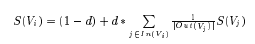

[来源](https://web.eecs.umich.edu/~mihalcea/papers/mihalcea.emnlp04.pdf)

其中 S(V{i})是所考虑的主题节点的分数，S(V(j))表示具有到 V{i}的外出边的所有节点。现在，V{j}的分数除以 V{j}的出度，这是对用户将选择该特定网页的概率的考虑。

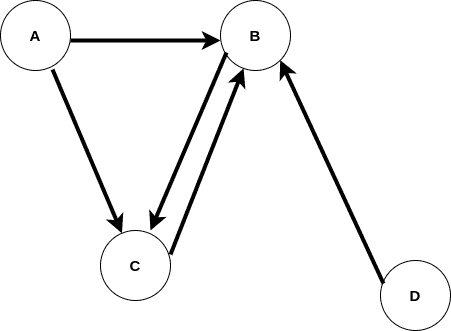

细想一下，如果这是图，站在 A，作为一个用户，我可以同时去 B 和 C，那么我去 C 的几率就是，即 1/(A 的出度)。因子 *d* 称为阻尼因子。在最初的页面排名算法中，因子 d 包含了随机性。1-d 表示用户将移动到随机网页，而不是连接的网页。该因子通常设置为 0.85。在文本排序算法中实现了相同的算法。

现在，问题来了，我们如何获得分数？

让我们先检查页面排名算法，然后将其转换为文本排名。正如我们在上面看到的，有 4 个顶点，首先，我们给所有的顶点分配随机分数，比如，[0.8，0.9，0.9，0.9]。然后，概率分数被分配给边缘。

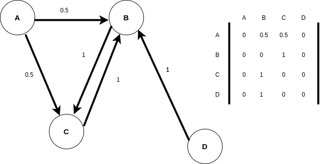

矩阵是图的邻接矩阵。可以观察到，相邻矩阵的值是概率值，即该节点或顶点的 1/出度。因此，实际上页面排名图变得不加权，因为等式只包含给出权重的项。

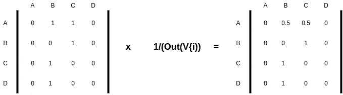

现在，整个等式变成了，

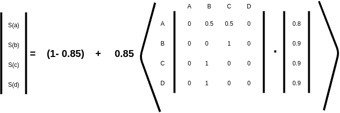

我们可以看到，旧的得分矩阵乘以邻接矩阵得到新的得分矩阵。我们将继续这一过程，直到新得分矩阵和旧得分矩阵的 L2 范数变得小于给定常数，通常为 1 x10^-8.这是一个基于线性代数和特征值与向量理论的收敛性质。为了简单起见，我们将跳过数学。一旦达到收敛，我们就从得分矩阵中获得最终的重要性得分。

对于文本排名算法，方程和图被修改为加权图，因为在这里，仅仅除以出度不会传达全部的重要性。结果，等式变成:

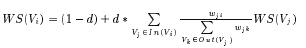

[来源](https://web.eecs.umich.edu/~mihalcea/papers/mihalcea.emnlp04.pdf)

w 代表权重因子。

文本排序的实现包括两个不同的自然语言过程:

1.  关键词提取任务，选择关键词和短语
2.  一个句子提取任务，这确定了最重要的句子。

**关键词提取任务**

以前，这是使用频率因子完成的，结果相对较差。文本排名论文介绍了一个完全无监督的算法。根据该算法，对自然语言文本进行标记化和词性标注，并将单个单词作为节点添加到单词图中。现在，如果两个单词相似，相应的节点用一条边连接起来。使用单词的共现来测量相似性。如果两个单词出现在 N 个单词的窗口中，N 从 2 到 10 变化，则这两个单词被认为是相似的。具有最大数量的重要关联边的单词被选为最重要的关键词。

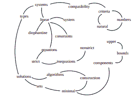

[来源](https://web.eecs.umich.edu/~mihalcea/papers/mihalcea.emnlp04.pdf)

**句子抽取任务**

它的工作方式也类似于关键词提取，唯一的区别是在关键词提取中，节点代表关键词，这里它们代表整个句子。现在，为了形成句子排序的图，算法为文本中的每个句子创建一个顶点，并添加到图中。句子太长，所以不能应用共现度量。因此，本文利用两个句子之间的内容重叠来使用两个句子之间的“相似度”，换句话说，相似度取决于两个句子中出现的共同单词标记的数量。作者在这里提出了一个非常有趣的“推荐”见解。它们表示两个相似句子或顶点之间的边的连接，好像它在建议读者阅读另一行，这与他/她正在阅读的当前行相似。因此，我感觉的相似性表示两个句子之间的相似内容或兴趣。为了防止长句被推荐，重要性被乘以一个标准化因子。

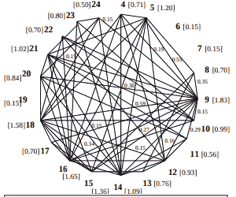

[来源](https://web.eecs.umich.edu/~mihalcea/papers/mihalcea.emnlp04.pdf)

两个句子之间的相似性由下式给出:

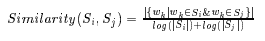

[来源](https://web.eecs.umich.edu/~mihalcea/papers/mihalcea.emnlp04.pdf)

其中给定两个句子 Si 和 Sj，一个句子由出现在该句子中的 Ni 个单词的集合来表示:

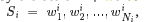

[来源](https://web.eecs.umich.edu/~mihalcea/papers/mihalcea.emnlp04.pdf)

最重要的句子是以与我们提取关键词相同的方式获得的。

这是一个关于文本排名如何运作的整体视图，请浏览原文以了解更多信息。

在实践中，对于摘要抽取，我们使用余弦相似度来决定两个句子之间的相似度。使用这种方法，我们可以得到几个连通的子图，这些子图表示整个文档中重要主题的数量。子图的连通部分给出了对相应主题重要的句子。

“ [Pytextrank](https://pypi.org/project/pytextrank/) ”库允许直接在 python 上应用文本排名算法。

```
import spacy
import pytextrank

# example text
text = "Compatibility of systems of linear constraints over the set of natural numbers. Criteria of compatibility of a system of linear Diophantine equations, strict inequations, and nonstrict inequations are considered. Upper bounds for components of a minimal set of solutions and algorithms of construction of minimal generating sets of solutions for all types of systems are given. These criteria and the corresponding algorithms for constructing a minimal supporting set of solutions can be used in solving all the considered types systems and systems of mixed types."

# load a spaCy model, depending on language, scale, etc.
nlp = spacy.load("en_core_web_sm")

# add PyTextRank to the spaCy pipeline
tr = pytextrank.TextRank()
nlp.add_pipe(tr.PipelineComponent, name="textrank", last=True)

doc = nlp(text)

# examine the top-ranked phrases in the document
for p in doc._.phrases:
    print("{:.4f} {:5d}  {}".format(p.rank, p.count, p.text))
    print(p.chunks)
```

由[源码](https://pypi.org/project/pytextrank/)实现 Pytextrank 库。

有关应用详情，请参考 [GitHub 链接。](https://github.com/abr-98/Automatic-Text-Summarizations)

## 结论

在本文中，我们已经看到了基本的摘要方法和 Textrank 算法的细节。对于抽象方法，请随意阅读本文的第 2 部分。

我希望这有所帮助。

## 参考

text rank:[https://web . eecs . umich . edu/~ mihalcea/papers/mihalcea . em NLP 04 . pdf](https://web.eecs.umich.edu/~mihalcea/papers/mihalcea.emnlp04.pdf)

概述:【https://arxiv.org/abs/1707.02268v3 

ROGUE:[https://www . Microsoft . com/en-us/research/publication/rouge-a-package-for-automatic-evaluation-of-summaries/](https://www.microsoft.com/en-us/research/publication/rouge-a-package-for-automatic-evaluation-of-summaries/)

基于机器学习的方法:[http://www . csie . ntnu . edu . tw/~ g 96470318/A _ trainible _ document _ summarizer _。pdf](http://www.csie.ntnu.edu.tw/~g96470318/A_trainable_document_summarizer_.pdf)

基于特征的方法:[https://www . semantic scholar . org/paper/The-Automatic-Creation-of-Literature-Abstracts-Luhn/a6 DCC 17 c 6 F3 DBC 2d 203 ade 9 ff 671 a 895 a9 dead 7c](https://www.semanticscholar.org/paper/The-Automatic-Creation-of-Literature-Abstracts-Luhn/a6dcc17c6f3dbc2d203ade9ff671a895a9dead7c)