# 理解自动文本摘要-2:抽象方法

> 原文：<https://towardsdatascience.com/understanding-automatic-text-summarization-2-abstractive-methods-7099fa8656fe?source=collection_archive---------11----------------------->

布雷特·乔丹在 [Unsplash](https://unsplash.com/s/photos/page?utm_source=unsplash&utm_medium=referral&utm_content=creditCopyText) 上的照片

## 怎样才能用深度学习来概括课文？

这是我关于文本摘要的第二篇文章。在我的[第一篇文章](/understanding-automatic-text-summarization-1-extractive-methods-8eb512b21ecc)中，我谈到了总结文本的提取方法和使用的度量标准。在本文中，我们将讨论抽象总结。我们将看到深度学习如何用于总结文本。所以，让我们开始吧。

## **抽象总结者**

抽象摘要器之所以被称为抽象摘要器，是因为它们不从最初给定的文本段落中选择句子来创建摘要。相反，他们使用不同于原始文档的词汇集，对给定文本的主要内容进行解释。概括地说，这与我们人类的行为非常相似。我们在大脑中创建文档的语义表示。然后，我们从我们的通用词汇表(我们常用的单词)中挑选符合语义的单词，以创建一个简短的摘要来表示实际文档的所有要点。正如你可能注意到的，开发这种摘要器可能很困难，因为他们需要自然语言生成。让我们看看最常用的解决问题的方法。

## **序列间 rnn 的应用**

这个方法是由 IBM 的 Ramesh Nallapati、Bowen Zhou、Cicero dos Santos、卡格拉尔 Gulcehre 和 Bing Xiang 在一篇论文中提出的。使用术语“序列到序列模型”是因为模型被设计成从输入单词序列创建输出单词序列。在所考虑的情况下，输入序列是实际的文本文档，输出序列是缩短的摘要。

该文提出了一种受注意力递归神经网络编码器-解码器模型启发的模型，该模型由德国雅各布大学的 Dzmitry Bahdanau 首先提出用于机器翻译。

尽管如此，问题与你已经感觉到的有很大不同。首先，对于机器翻译，我们需要无损失的翻译，因为我们需要翻译形式的准确句子，但是对于摘要生成，我们需要压缩原始文档，以创建摘要，所以它需要有一点损失。其次，对于摘要生成，摘要的长度不取决于原始文本。这两点是问题给出的问题中的关键挑战。

在讨论本文的应用细节之前，我们先来看看编码器和解码器网络，以及使用注意力层的原因。

## **编码器和解码器网络**

如果我们考虑一个一般的 LSTM(长期短期记忆)层，它看起来就像下面给出的图表。它或者为每个输入产生一个输出，或者它创建一个特征向量，该特征向量随后被密集神经网络层用于应用 softmax 层的分类任务。例如，情感检测，我们通过 RNN 传递整个句子，并使用适合 softmax 层的特征向量来产生最终结果。

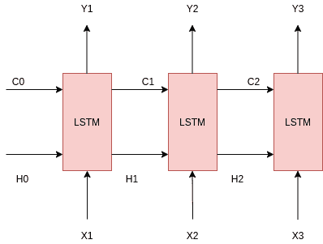

但这里要意识到的一件事是，对于当前的问题，或者像这样的问题，包括机器翻译，更一般地说，我们可以说这个问题是一个序列到序列的问题，这种特殊的模型方法不能应用。主要原因是输出的大小与输入的大小无关，两者都是序列。为了解决这个问题，引入了编码器-解码器网络模型。

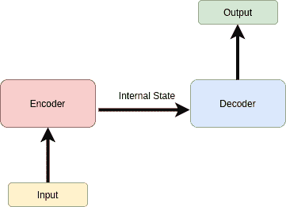

模型的基本架构如上图所示。

编码器负责接收输入句子或原始文档，并生成最终状态向量(隐藏状态和单元格状态)。这由图中的内部状态表示。编码器可能包含 LSTM 层、RNN 层或 GRU 层。由于消除了爆炸和消失梯度问题，大多数情况下使用 LSTM 层。

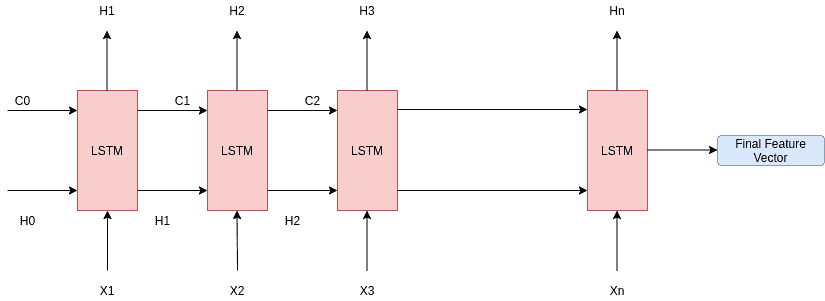

上图显示了我们的编码器网络。在编码器网络中，一个字在一个时间步长被馈送，最后，在第 n 个输入字被馈送到 LSTM 层之后，隐藏状态和单元状态成为我们的最终状态或特征向量。单元状态 Cn 和隐藏状态 Hn 被发送到解码器的第一组 LSTM 层。

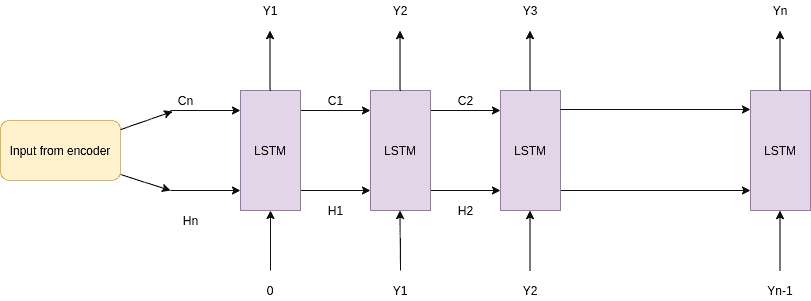

这是我们的解码器模型的样子。现在，第一层接收来自编码器最终状态的输入，即隐藏和单元状态激活。解码器模型接收输入并产生输出序列的预测字，给定先前产生的字。因此，对于时间步长 1 的 LSTM，解码器具有 0 个向量输入，Y1 是生成的预测字，对于时间步长 2，Y1 作为输入被馈送到 LSTM 层，Y2 是生成的字，依此类推。解码器一步一步地生成单词，直到面对<end>标签。</end>

这可能会提出一个问题，单词是如何生成的？。好吧，这就是答案。编码器-解码器模型是在单词的目标集合或词汇表上训练的。现在，在解码器的每个步骤中，LSTMs 隐藏激活通过 softmax 层发送，该层生成词汇表中每个单词被预测为下一个单词的概率。选择具有最大概率的单词作为该时间步长的输出。现在，模型如何知道哪个单词完全符合语义呢？为此，该模型在数据集上进行训练，并将问题转化为监督分类问题。此外，模型通常使用词汇中单词的单词嵌入，这些单词来自众所周知的嵌入向量，如 google 的 word2vec 或 Standford NLP 的 Glove。单词嵌入有助于获得关于单词的多种见解，例如给定的单词是否与给定的单词相似。有时 TFIDF 矢量化也用于生成上下文单词的意义。

我们来举个例子。假设我们有一个数据集，其中有一个长格式报告及其人工摘要的集合。这些信息可以用作训练我们的编码器-解码器网络的标签和目标。我们将矢量化我们的标签和目标，形成一个词汇表。接下来，我们将从 word2vec 或 Glove 中为我们的词汇表中的单词选取嵌入内容，然后将标签和目标与我们的训练模型相匹配。

但是这个特殊的总结问题有一个问题。原始文档可能非常大。假设文档有 100 行。现在，当我们人类从 1-5 行中总结时，我们需要考虑第 100 行吗？没有对吗？当我们手动总结时，我们会更多地关注第 1-5 行，然后慢慢向前。这一方面不能通过普通的编码器-解码器模型来实现，因此引入了注意机制。

## **注意机制**

该机制旨在仅关注来自输入的一些特定序列，而不是整个输入序列来预测单词。这种方法与人类的方法非常相似，似乎可以解决问题。

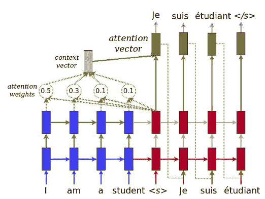

[来源](https://www.tensorflow.org/tutorials/text/nmt_with_attention)

上图是 TensorFlow 对注意力层的实现。我们可以看到，为了预测一个单词，输入序列中的每个单词都被赋予了一个权重，称为注意力权重。矢量化的注意力权重的总和用于形成用于预测的上下文向量。

让我们详细检查一下。该论文建议编码器由双向 GRU RNN 组成，解码器将具有单向 GRU RNN。编码器和解码器将具有相同数量的隐藏层和单元。

我们来看看这里的注意机制。

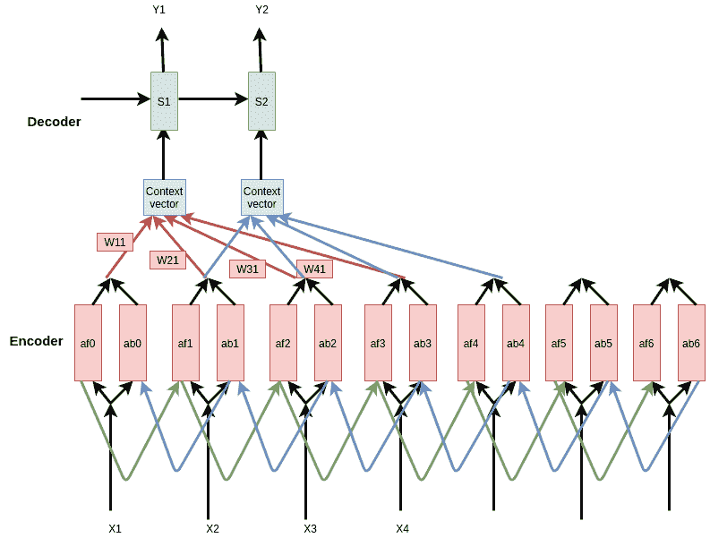

上面的绿色层显示解码器，Y1 和 Y2 是时间步长输出。X1，X2 是编码器的输入。“af0”是输入 0 的前向激活，“ab0”是时间步长 0 的后向激活，依此类推。

假设‘an’是(‘ABN’，‘afn’)在时间步长 n 的组合激活，那么，a0=(af0，ab0)，即，向前和向后组合。“Wmn”确定在预测解码器在时间步长 n 的输出时，在时间步长 m 应该给予输入多少权重。

上下文向量是注意力权重的加权和。它由下式给出:

> C < n > = Sum(W <m>)。一个<m>用于输入时间步长中的所有 m。</m></m>

对于输入中的所有 m 个时间步，即，如果输入中有 x 个字，则 x 个时间步，上述等式表示时间步 n 的上下文向量等于在时间步 m 给予输入的权重和时间步 m 的组合激活的总和。

那么，单词是如何获得的呢？

> W <m>=所有 m 的 softmax(e <m>)</m></m>

其中我们使用具有单一隐藏状态的神经网络来获得 e。网络接收 S(n-1)和 a(m)(时间步长 m 的组合激活)并给出 e(m，n)作为输出。用于获得‘e’的神经网络也在我们的编码器-解码器模型的训练期间被训练。

我们使用 softmax，因此分配给所有输入时间步长的所有权重之和始终等于 1。

这是注意力模型的整体机制。

## **大词汇绝招**

我们之前已经讨论过，解码器预测的字是使用 softmax 生成的。现在，如果我们使用我们的词汇表中的所有单词作为我们的目标单词集，softmax 将有大量的输出节点，并且预测在计算上将是低效的。本文提出了蒙特利尔大学的塞巴斯蒂安·让提出的大词汇量的方法来解决这个问题。该模型在小批量中被训练。每个小批量的目标单词集或解码器词汇表被限制到该特定小批量的源文档。现在，如果我们对每个小批量使用不同的解码器词汇子集，目标词汇就有可能变得长度不等，这是非常明显的，因为不同的样本具有不同的行数和不同的字数。因此，我们将总词汇表中最常用的单词添加到子集词汇表中，使它们具有固定的大小。这降低了时间要求并加快了收敛，因为随着目标集大小的减小，softmax 层也缩短了。

## **提取关键词**

之前，当我们讨论编码器-解码器模型时，我提到过我们通常使用单词嵌入来表示矢量化后的文档中的单词。现在，让我们试着想一想，为了进行总结，我们实际上需要这些词来表示什么。我们将意识到嵌入是不够的，因为对于摘要，我们需要关注文本片段中的上下文和关键词。嵌入有助于对一个词有一个大概的了解，但它与文本的上下文无关。因此，该论文提出考虑像词类标签、命名实体标签和单词的 TFIDF 统计以及嵌入来表示单词这样的因素。我们使用箱将连续的 TFIDF 值转换成分类值。最后，我们获取单词的所有特征和嵌入，并为单词创建新的嵌入。所以，基本上 TFIDF，POS 标签让我们了解单词在文档的上下文中有多重要，单词嵌入让我们了解单词的一般情况。接下来，我们将它们连接成一个长向量，并馈入网络。需要注意的一点是，我们只使用单词嵌入来表示目标端的单词。

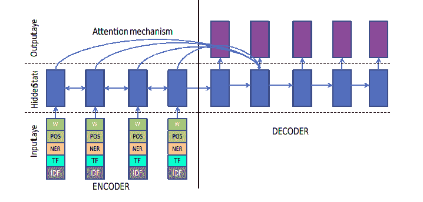

[来源](https://arxiv.org/abs/1602.06023)

接下来，我们将研究论文提出的另一个非常重要的方面。

## **切换发电机指针**

在自然语言处理中，当我们使用监督模型训练模型时，我们经常需要处理一些我们的词汇表中不存在的单词。这样的词被称为 OOV 或词汇之外。在正常情况下，我们使用“UNK”标签来处理它们。但是在总结的情况下，这是不正确的，因为这些词在总结中可能具有某种意义。本文提出了一种开关解码器指针来处理这种情况。在解码器的每个时间步，都有一个指针指向输入文本。每当解码器面对 OOV 术语时，它指向输入中的术语，并直接使用输入文本中的术语。因此，解码器在一个时间步长内基本上有两个动作，它可以从目标字典生成一个单词，或者它可以指向并复制一个单词。这个决定是使用开关作出的，如果开关接通，它产生一个字，否则它从输入端复制一个字。

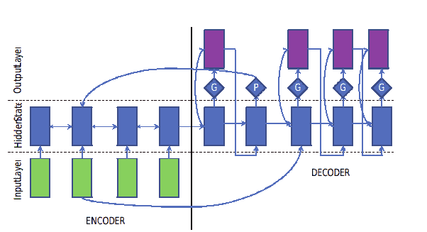

[来源](https://arxiv.org/abs/1602.06023)

现在，问题是开关是如何操作的？该切换是在特定解码器时间步长下整个上下文向量上的 sigmoid 激活函数。它由下式给出:

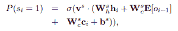

来源于

*“其中 P(si = 1)是开关在解码器的第 I 个时间步长打开的概率，hi 是隐藏状态，E[oi1]是来自前一个时间步长的发射的嵌入向量，ci 是注意力加权的上下文向量，Ws h、Ws e、Ws c、bs 和 vs 是开关参数”——*[来源 ](https://arxiv.org/abs/1602.06023)

在每个时间步长的指针必须指向一个单词，以便复制该单词，这是基于该解码器时间戳的注意力权重分布来决定的。

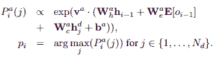

[来源](https://arxiv.org/abs/1602.06023)

*“在上面的等式中，pi 是摘要中第 I 个字位置处的指针值，从文档字位置 j ∈ {1，.。。，Nd}，其中 P a i (j)是解码器中第 I 个时间步长指向文件中第 j 个位置的概率，h d j 是编码器在 j 位置的隐藏状态“-* [*来源*](https://arxiv.org/abs/1602.06023)

在训练神经网络的过程中也训练开关。下面给出的函数在训练期间进行了优化。

[来源](https://arxiv.org/abs/1602.06023)

*“其中 y 和 x 分别为摘要词和文档词，gi 为指标函数”——*[*来源*](https://arxiv.org/abs/1602.06023) *。*每当 OOV 面对解码器词汇时，指示器功能被设置为 0。这将关闭开关，并从输入文本中复制一个单词。

这是用于文本摘要的序列到序列模型的概述。我鼓励您仔细阅读参考资料，了解更多实现细节。

需要注意的一点是，作者为长文档提出了层次化的注意层。如果文档非常非常长，我们有时可能需要用关键词来识别关键句子。为此，我们需要一个分层次的注意机制。一个层次负责句子的重要性，另一个层次负责单词的重要性。这两个注意层同时在两个层面上运作。

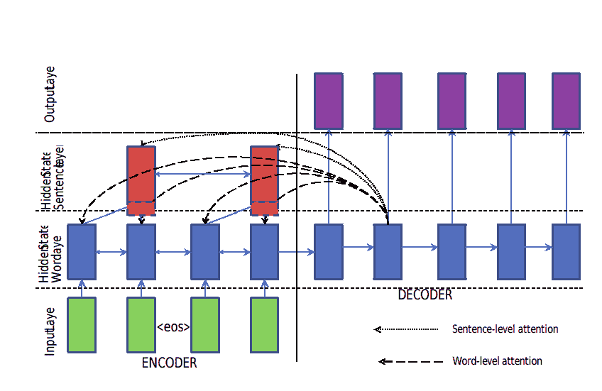

[来源](https://arxiv.org/abs/1602.06023)

另外两种最著名的方法是:

## 脸书的模型

这种方法是由脸书人工智能研究所的 Alexander Rush 在 2015 年提出的。

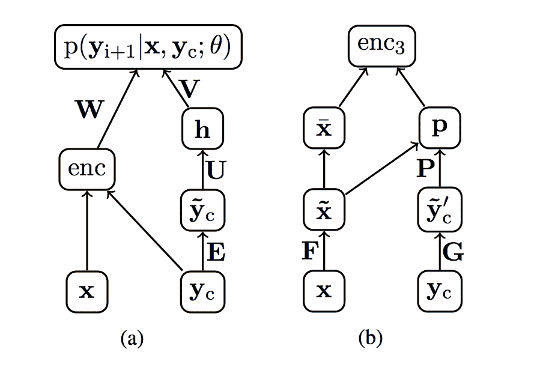

[来源](https://arxiv.org/abs/1509.00685)

上图描述了 facebook 的模式。它有三个编码器:

1.  **一个词袋编码器**:它只使用输入句子的词袋表示，忽略与相邻词的关系。解码器接收编码向量或单词包，并在时间步长预测单词。
2.  **卷积编码器**:卷积层用于从输入向量的字嵌入中生成特征向量，然后解码器用于在时间步长上创建字
3.  **基于注意力的编码器**:这个编码器在注意力层 RNN 上工作，正如我们在前面的方法中所讨论的。

最后，对结果进行波束搜索，以获得摘要文本。

## 谷歌的指针生成器模型

这个模型是由斯坦福大学的 Abigii See 提出的。

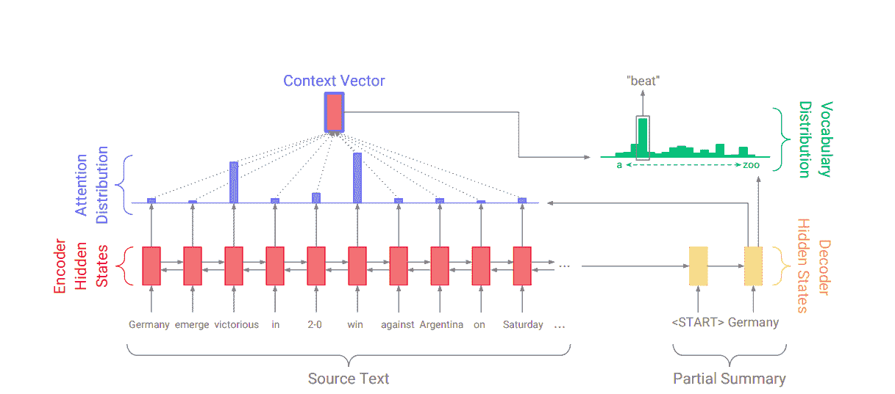

[来源](https://arxiv.org/abs/1704.04368)

我觉得这个模型类似于 IBM 的模型，但是这个模型使用了一个覆盖机制来减少序列到序列网络的重复问题。

你可以通过报纸了解更多的细节。我将提供参考中的链接。

## 结论

在本文中，我们讨论了深度学习用于文本摘要的几种方法。

我希望这有所帮助。

## 参考

IBM 的方法:[https://arxiv.org/abs/1602.06023](https://arxiv.org/abs/1602.06023)

谷歌的方法:[https://arxiv.org/abs/1704.04368](https://arxiv.org/abs/1704.04368)

https://arxiv.org/abs/1509.00685[脸书的做法](https://arxiv.org/abs/1509.00685)

神经机器翻译:[https://arxiv.org/abs/1409.0473](https://arxiv.org/abs/1409.0473)

大词汇绝招:[https://arxiv.org/abs/1409.0473](https://arxiv.org/abs/1412.2007)

关注层:[https://www . tensor flow . org/tutorials/text/NMT _ with _ attention](https://www.tensorflow.org/tutorials/text/nmt_with_attention)