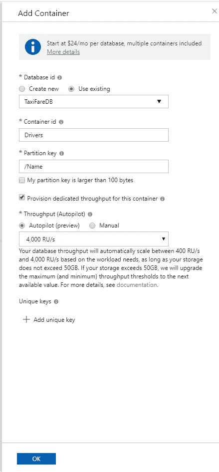
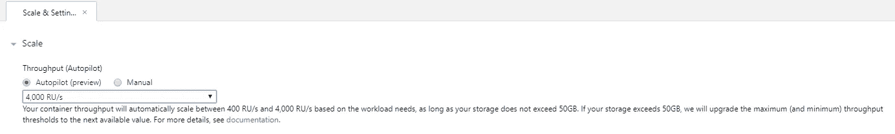

# 了解 Azure Cosmos DB 中的自动驾驶模式

> 原文：<https://towardsdatascience.com/understanding-autopilot-mode-in-azure-cosmos-db-105973083780?source=collection_archive---------27----------------------->

## 有了自动驾驶模式，计算您需要在 Cosmos DB 中提供多少吞吐量变得更加简单！

2019 年 11 月，Azure Cosmos DB 团队[宣布了一系列很酷的功能](https://devblogs.microsoft.com/cosmosdb/whats-new-in-azure-cosmos-db-nov-2019/)，使得开发和管理 [Cosmos DB](https://docs.microsoft.com/en-us/azure/cosmos-db/) 应用程序变得更加容易。

到目前为止，我最喜欢的功能是[新的自动驾驶模式](https://docs.microsoft.com/en-us/azure/cosmos-db/provision-throughput-autopilot)。在这篇文章中，我将谈论自动驾驶模式的好处，如何在启用自动驾驶模式的情况下供应数据库和容器，以及当前的限制是什么(毕竟它仍然是一个预览功能！😂)

**开始时**

在 Azure Cosmos DB 中，您提供吞吐量来管理您的工作负载。在 Autopilot 出现之前，您必须为一个容器或一个数据库可以拥有的**请求单位/秒(RU/s)** 设置一个硬性的最大限制。这是很难做到的，因为您必须猜测您需要多少吞吐量，并期待最好的结果。

即使你没有达到最高限额，你仍然被收取预订费。因此，您可以将最大吞吐量级别设置为 10K RU/s，但在一天中只使用 15 分钟。

我们可以使用一些工具来改变所调配的吞吐量。我们可以使用传送门(像穴居人一样)或者使用[。NET SDK 以编程方式更新金额](https://docs.microsoft.com/en-us/dotnet/api/microsoft.azure.documents.client.requestoptions.offerthroughput?view=azure-dotnet)(这只是增加了代码的复杂性😥).

我试图计算出我需要调配多少吞吐量。来源:[https://encrypted-tbn0.gstatic.com/images?q = tbn:and 9 gcrmf 4-sgz 3 rato qpcv 01 zreyvt 83 yj 99 _ tbnnuusbfmjw 4 _ kDX&s](https://encrypted-tbn0.gstatic.com/images?q=tbn:ANd9GcRmF4-SGZ3RRAtOQPCV01ZrEYVT83yJ99_tBnnUUsbfmjW4_kDX&s)

**激活自动驾驶模式！**

来源:[https://pics . me . me/thumb _ hes-going-do-a-super hero-landing-whoo-super hero-landing-13990540 . png](https://pics.me.me/thumb_hes-gonna-do-a-superhero-landing-whooo-superhero-landing-13990540.png)

进入自动驾驶模式😃我们可以在 Cosmos DB 中的容器和数据库上设置 Autopilot，而不是自己手动设置吞吐量，这将自动即时扩展所提供的吞吐量，而无需我们做任何事情，也不会影响我们应用程序的可用性。

Autopilot 目前在一个分层系统上工作，在这个系统中，您可以设置容器或数据库上不希望超过的最大吞吐量水平。容器或数据库可以在 0.1(最大值)到最大值之间瞬间伸缩。目前有 4 层可供选择:

1.  4000 RU/s*(最大存储容量 50GB)*
2.  20，000 RU/s *(200GB 最大存储)*
3.  100，000 RU/s *(1TB 最大存储)*
4.  500，000 RU/s *(最大存储容量 5TB)*

**自动驾驶有什么好处？**

首先，它更加灵活！我不能告诉你多少次，我不得不打破古老的算盘，计算出我不得不为宇宙(以及某些时候)提供的许多 RU。

这也使你的代码更加整洁。为了避开 429 错误。NET SDK 确实允许您在达到最大分配吞吐量时升级数据库或容器的吞吐量。但是这并不能避免我必须计算出我需要多少个 RU 来满足我的应用程序的需求。

自动驾驶也可以为你节省一些严重的现金！我曾经遇到过这样的情况，我们团队中的一名工程师在 Cosmos 中做了一些测试，将配置的 RU 提高到 20K。测试成功了，一切都很好，直到我们收到那个月的账单……

来源:[https://I . kym-cdn . com/entries/icons/original/000/000/554/Picard-face palm . jpg](https://i.kym-cdn.com/entries/icons/original/000/000/554/picard-facepalm.jpg)

有了 Autopilot，你只需为你的 Cosmos DB 账户按小时使用的资源付费。因此，以 20K 为例，如果我们使用自动驾驶仪达到 RU 要求的水平，我们将只需支付我们需要 RU 水平达到 20K 的小时数，而不是整个星期，工程师都忘记将它降下来。

**我什么时候会使用自动驾驶？**

来源:[https://encrypted-tbn0.gstatic.com/images?q = tbn:and 9 gcr 9y 85 xnqxkfvzlys _ kpjbbbwhnkwf 70 ksvnugvysefmva 83 nqs&s](https://encrypted-tbn0.gstatic.com/images?q=tbn:ANd9GcR9y85xnqXkFVZLys_kPJbBWHnkWf70kGsVnUgVYsEfmVa83Nqs&s)

*如果您的 Cosmos DB 帐户收到的工作负载是变化的或不可预测的*，启用 Autopilot 可确保您有足够的吞吐量来满足工作负载的需求。这样就不需要自己更改调配的吞吐量，因为 Autopilot 会在一个层内为您增减吞吐量。

*如果您正在开发一个新的应用程序，或者您只是在做一些测试*，启用自动驾驶功能可以帮助您评估部署应用程序后需要提供多少吞吐量。

**告诉我怎么做！**

在自动驾驶的情况下创建数据库和容器是非常简单的。我将假设您知道如何提供一个 Cosmos DB 帐户，所以为了节省时间，我将跳过这一步。

让我们创建一个启用了自动驾驶的容器。*如果你愿意*，你也可以在数据库级别启用自动驾驶，但是我只用容器作为例子。在你的 Cosmos DB 账户中，点击 New Container。

就像我们在 Cosmos 中创建新容器时通常会做的那样，我们会给容器一个名称、分区键值，然后要么创建一个新数据库，要么给它分配一个预先存在的数据库。单击为容器调配专用吞吐量的选项，您应该会看到两个选项:

1.  **自动驾驶仪(预览)。**
2.  **手动。**

因为这是一个关于实现自动驾驶的教程，你可以继续选择那个选项😊

如果是这样，你必须为你的容器选择一个自动导航层。现在只需选择 4K 层，然后单击“确定”。

如果您稍后需要更改等级，请进入容器的'*比例和设置'*选项卡，您可以选择一个新的等级。您可以上升或下降一个级别，这取决于哪些需求会影响您的容器。

如您所见，设置起来相当简单😊

**有什么蹊跷？**

就目前的情况而言，当谈到自动驾驶时，你需要注意几个问题。希望当这个特性普遍可用时，这些问题会得到解决，但是如果你不想等那么久…..

*你可以在 Cosmos 中的容器和数据库上启用自动驾驶的唯一方式是通过门户*。如果您使用 CLI、Powershell 或 REST APIs 通过 CI/CD 管道部署这些，您目前将无法做到这一点。

我设法解决这个问题的一个方法是在门户中提供自动引导的容器，然后测试我的部署脚本，看它们是否恢复到手动提供的容器。好消息是自动驾驶功能仍然存在。这是一个有点黑客，但它的工作🤷‍♂️

*您不能在现有的容器/数据库上启用自动驾驶*😥就像如果你想改变一个容器的分区键，你必须重新创建这个容器。我真的希望当 Autopilot 正式发布时，我们可以更新这个(提示提示宇宙团队中可能读到这个的任何人😊)

*你可以关闭自动驾驶，切换到手动，但是不能再回去了。*再次，有点限制，但我非常希望当 Autopilot 正式上市时，我们将能够根据需要改变。

Autopilot 还会考虑你的容器/数据库当前存储了多少数据。例如，如果我们创建一个最大吞吐量水平为 4，000RU/s 的容器，我们的最大存储限制也将是 50GB。一旦我们在容器中超过 50GB 存储，我们将自动升级到 20，000 RU/s。如果您不需要在 Cosmos 中存储这些数据，并且希望降低成本，您可能需要考虑如何归档数据，以保持在该自动驾驶层的存储限制内。

**结论……**

希望在本文中，您看到了在您的 Cosmos DB 数据库和容器中使用 Autopilot 的好处。虽然这是到目前为止的结尾，因为它仍然是一个预览功能，所以当它变得普遍可用时，我很确定我将不得不再次写这篇文章！😂

在为 Cosmos DB 开发和管理应用程序时，我不能强调这是多大的游戏改变者。我们不再需要自己花时间摆弄吞吐量调配了！

一如既往，如果你有任何问题，请在下面的评论区提问！