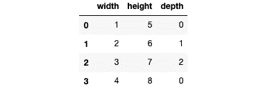

# 了解轴和维度| Numpy |熊猫

> 原文：<https://towardsdatascience.com/understanding-axes-and-dimensions-numpy-pandas-606407a5f950?source=collection_archive---------14----------------------->

## 知道如何沿数据的不同轴应用函数。


照片由 [Ridham Nagralawala](https://unsplash.com/@ridham?utm_source=unsplash&utm_medium=referral&utm_content=creditCopyText) 在 [Unsplash](https://unsplash.com/s/photos/rows?utm_source=unsplash&utm_medium=referral&utm_content=creditCopyText) 上拍摄

我要解释一个非常基本但重要的话题，**轴**和**尺寸**。很多人觉得挺混乱的，尤其是在多维数据上应用一个函数的时候使用 axis。

轴或尺寸是一个非常通用的概念。无论是在 **Numpy** 、 **Pandas、TensorFlow** 、**、**还是另一个库中处理数据，都要经常碰到。我将要解释的概念在所有这些库中都是通用的。

## 轴心是什么？

简单来说，**轴**就是代表数据的**维度**的东西。让我们通过各种例子来理解它的核心。

# 零维数据

一个**标量**是零维数据。它没有维度或轴。

```
4
```

# 一维数据

一个**向量**是一维数据。Vector 是标量的集合。Vector 有一个形状`(N,)`，其中 N 是其中标量的数量。

```
[1,2,3,4]
```

矢量只有一个轴，因为它是一维的。所以你只能跨`axis-0`应用一个函数。轴的索引始终为 0。

```
np.sum([1,2,3,4], axis=0)>> 10
```

# 二维数据

矩阵**是二维数据的一个例子。矩阵是向量的集合，形状为`(N,M)`，其中`N`是其中向量的数量，`M`是每个向量中标量的数量。**

以下示例矩阵的形状将是`(2,3)`。

```
[[1,2,3],
 [4,5,6]]
```

矩阵是二维数据，因此它有两个轴。让我们看看如何沿两个轴应用一个**和**函数。

## 应用求和函数

对`axis-0`求和意味着我们对所有向量求和。

```
data = [[1,2,3],[4,5,6]]np.sum(data, axis=0)>> [5, 7, 9]
```

对`axis-1`求和意味着，我们对一个向量中的所有标量求和。

```
data = [[1,2,3],[4,5,6]]np.sum(data, axis=1)>> [6, 15]
```

您也可以选择不在参数中提供任何轴。这样你将得到所有元素的总和。Means 函数适用于数据中存在的所有元素，与坐标轴无关。

```
data = [[1,2,3],[4,5,6]]np.sum(data)>> [21]
```

# 三维数据

类似地，3D 数据是 2D 数据点(矩阵)的集合。3D 数据的形状将是`(N,M,P)`。会有形状为`(M,P)`的`N`矩阵。

下面的三维数据的形状将是`(2,2,3)`。

```
[[[1,1,1],
  [3,3,3]], [[2,2,2],
  [4,4,4]]]
```

## 应用求和函数

*   对`axis-0`应用求和函数意味着你将所有矩阵求和。
*   对`axis-1`应用 sum 函数意味着您对每个指标内的所有向量求和。
*   对`axis-2`应用 sum 函数意味着对每个向量中的所有标量求和。

# 概括概念

让我们把这个概念推广到任意维数。维度为`n`的数据将具有以下形状。

```
(N1, N2, N3 ..... Nn)
```

*   沿着`axis-0`有`N1`个形状`(N2, N3 .. Nn)`的数据点。对`axis-0`应用函数意味着您正在这些`N1`数据点之间执行计算。
*   沿着`axis-0`的每个数据点将具有形状`(N3, N4 .. Nn)`的`N2`数据点。这些`N2`数据点将与`axis-1`一起考虑。对`axis-1`应用函数意味着您正在这些`N2`数据点之间执行计算。
*   同样的，还在继续。

## 注意

您也可以对轴使用负索引。`axis -1`将是最后一个轴，`axis -2`将是倒数第二个轴。

# 多个数据点

我们在单个数据点内应用函数。让我们看看当我们在多个数据点之间应用一个函数时，轴是什么意思。

让我们看看下面的例子，我们在`axis-0`上的两个不同的数据点上应用了 **Sum** 函数。

```
data1 = [1,2,3]
data2 = [4,5,6]np.sum((data1, data2), axis=0)>> [5, 7, 9]
```

由于有 2 个长度为 3 的向量，这些数据点将被视为形状为`(2,3)`的单个数据点，如下所示。

```
[[1,2,3],[4,5,6]]
```

类似地，如果有`N`不同的数据点，您可以将其视为一个组合的单个数据点，并像在单个数据点中应用一样应用任何函数。

# 熊猫的轴心

同样，在 **Pandas** 中，您可以将**系列**作为一维数据处理，将**数据帧**作为二维数据处理。



数据帧

例如，在数据帧中，**行**被认为是沿着`axis-0`的，而**列**被认为是沿着`axis-1`的。跨`axis-0`应用任何函数意味着在所有行之间执行计算，跨`axis-1`应用函数意味着在所有列之间执行计算。

在这篇博客中，我举了一个 **Sum** 函数的例子，但是您可以使用 axis 执行更多的函数。写这篇博客是为了给你的轴和维度打下基础。随着练习越来越多，你会越来越好。

## 下一个

[](/how-fast-numpy-really-is-e9111df44347) [## Numpy 到底有多快，为什么？

### 与标准 Python 列表的比较。

towardsdatascience.com](/how-fast-numpy-really-is-e9111df44347)