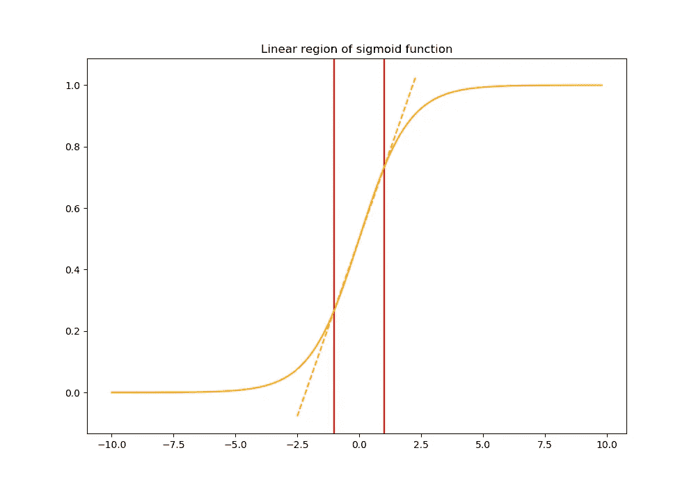
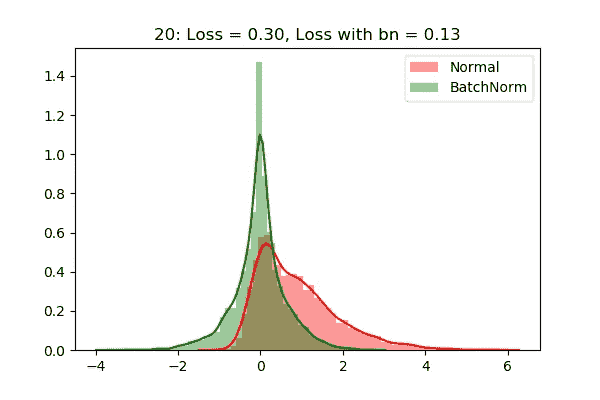
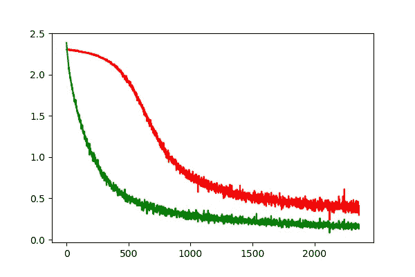

# 了解神经网络的批处理规范化

> 原文：<https://towardsdatascience.com/understanding-batch-normalization-for-neural-networks-1cd269786fa6?source=collection_archive---------7----------------------->

## 了解批处理规范化如何使您的深度学习模型学习得更好，以及如何在 PyTorch 中从头实现它。


来源:[链接](https://www.tes.com/news/grouping-primary-children-ability-indefensible)

在训练学习系统时所做的主要假设之一是假设输入的分布在整个训练中保持不变。对于简单地将输入数据映射到一些适当的输出的线性模型，这个条件总是满足的，但是当处理由相互堆叠的若干层组成的神经网络时，情况并非如此。

在这种架构中，每一层的输入都受到前面所有层的参数的影响(网络参数的微小变化会随着网络变深而放大)。因此，在层内的反向传播步骤期间所做的小的改变可以产生另一层的输入的巨大变化，并且最终改变特征图的分布。在训练期间，每一层都需要不断地适应从前一层获得的新分布，这减慢了收敛。

批处理标准化[1]克服了这个问题，同时通过在训练期间减少内部层内的协方差移动(由于训练期间网络参数的变化而引起的网络激活分布的变化)以及使用批处理的优点，使训练更有效。

## 本文将涵盖以下内容

*   批处理规范化如何减少内部协方差偏移，以及这如何改进神经网络的训练。
*   如何在 PyTorch 中实现一个批处理规范化层？
*   一些简单的实验显示了使用批处理规范化的优点。

# 通过小批量统计减少内部协方差变化

一种减少或消除神经网络内部协方差偏移的不良影响的方法是标准化层输入。该操作不仅强制输入具有相同的分布，而且白化它们中的每一个。该方法受到一些研究[2]的启发，这些研究表明，如果网络训练的输入被白化，则网络训练收敛得更快，因此，加强每层输入的白化是网络的期望属性。

然而，每层输入的完全白化是昂贵的，并且不是完全可微分的。批处理规范化通过考虑两个假设克服了这个问题:

*   我们将单独归一化每个标量要素(通过设置平均值为 0 和方差为 1)，而不是联合白化图层输入和输出中的要素。
*   我们没有使用整个数据集来标准化激活，而是使用小批量作为*，每个小批量产生每次激活的平均值和方差的估计值*。

对于具有 d 维输入的层，x = (x1，x2，..xd)我们通过以下公式获得归一化(通过批次 B 计算期望值和方差):


但是，简单地标准化图层的每个输入可能会改变图层所能表示的内容。例如，标准化 sigmoid 的输入会将它们限制在非线性的线性范围内。这种行为对于网络来说是不期望的，因为这将降低他的代表能力(这将变得等同于单层网络)。



sigmoid 函数图

为了解决这个问题，批量标准化还确保网络中插入的变换可以表示身份变换(模型仍然在每一层学习一些参数，这些参数在没有线性映射的情况下调整从前一层接收的激活)。这是通过引入一对可学习的参数 gamma_k 和 beta_k 来实现的，这两个参数根据模型学习的内容来缩放和移动归一化值。

最后，结果层的输入(基于先前层的输出 x)由下式给出:


# 批量标准化算法

# 训练期间

## 完全连接的层

全连接层的实现非常简单。我们只需要得到每一批的平均值和方差，然后用之前给出的 alpha 和 beta 参数来缩放和移动特征图。

在向后传递期间，我们将使用反向传播来更新这两个参数。

```
mean = torch.mean(X, axis=0)
variance = torch.mean((X-mean)**2, axis=0)
X_hat = (X-mean) * 1.0 /torch.sqrt(variance + eps)
out = gamma * X_hat + beta
```

## 卷积层

卷积层的实现几乎和以前一样。我们只需要执行一些整形，以适应我们从上一层获得的输入的结构。

```
N, C, H, W = X.shape
mean = torch.mean(X, axis = (0, 2, 3))
variance = torch.mean((X - mean.reshape((1, C, 1, 1))) ** 2, axis=(0, 2, 3))
X_hat = (X - mean.reshape((1, C, 1, 1))) * 1.0 / torch.sqrt(variance.reshape((1, C, 1, 1)) + eps)
out = gamma.reshape((1, C, 1, 1)) * X_hat + beta.reshape((1, C, 1, 1))
```

在 PyTorch 中，反向传播非常容易处理，这里重要的一点是指定我们的 alpha 和 beta 是在反向阶段更新它们的参数。

为此，我们将在我们的层中把它们声明为`nn.Parameter()`，并用随机值初始化它们。

# 在推理过程中

在推断过程中，我们希望网络的输出仅取决于输入，因此我们不能考虑对我们之前考虑的批次进行的统计(它们与批次相关，因此它们根据数据而变化)。为了确保我们有一个固定的期望值和方差，我们需要使用整个数据集来计算这些值，而不是只考虑批次。然而，计算所有数据集的这些统计数据在时间和计算上都是非常昂贵的。

[1]中提出的方法是使用我们在训练期间计算的移动统计。我们使用参数β(动量)调整当前批次上计算的期望值的重要性:


这个移动平均值存储在一个全局变量中，该变量在训练阶段更新。

为了在训练期间在我们的层中存储这个移动平均值，我们可以使用缓冲区。当我们用 PyTorch 的方法`register_buffer()`实例化我们的层时，我们初始化这些缓冲区。

# 最终模块

然后，最后一个模块由我们之前描述的所有模块组成。我们在输入数据的形状上添加一个条件，以了解我们正在处理的是全连接层还是卷积层。

这里需要注意的一件重要事情是，我们只需要实现`forward()`方法。因为我们的类继承自`nn.Module`，所以`backward()`函数将自动继承自这个类(谢谢 PyTorch ❤️).

# MNIST 实验

为了观察批规范化对训练的影响，我们可以比较没有批规范化的简单神经网络和具有批规范化的另一个神经网络之间的收敛速度。

为了简单起见，我们在 MNIST [3]数据集上训练这两个简单的全连接网络，而不进行预处理(仅应用数据归一化)。

## 无批量规范的网络架构

```
class SimpleNet(nn.Module):
    def __init__(self):
        super(SimpleNet, self).__init__()
        self.classifier = nn.Sequential(
            nn.Linear(28 * 28, 64),
            nn.ReLU(),
            nn.Linear(64, 128),
            nn.ReLU(),
            nn.Linear(128, 10)
        )

    def forward(self, x):
        x = x.view(x.size(0), -1)
        x = self.classifier(x)
        return x
```

## 具有批处理规范的网络体系结构

```
class SimpleNetBN(nn.Module):
    def __init__(self):
        super(SimpleNetBN, self).__init__()
        self.classifier = nn.Sequential(
            nn.Linear(28 * 28, 64),
            CustomBatchNorm(64),
            nn.ReLU(),
            nn.Linear(64, 128),
            CustomBatchNorm(128),
            nn.ReLU(),
            nn.Linear(128, 10)
        )

    def forward(self, x):
        x = x.view(x.size(0), -1)
        x = self.classifier(x)
        return x
```

# 结果

下图显示了我们的`SimpleNet`第一层后获得的激活分布。我们可以看到，即使在 20 个时期的训练之后，具有批次范数的激活分布仍然是高斯分布(具有小的尺度和在训练期间学习到的移位)。



实验结果(详见[https://github . com/Sini tame/neural-networks-experiments/blob/master/batch _ normalization/batch _ normalization . ipynb](https://github.com/sinitame/neural-networks-experiments/blob/master/batch_normalization/batch_normalization.ipynb)

我们还可以看到收敛速度方面的巨大改进。绿色曲线(使用批处理规范化)表明，使用批处理规范化，我们可以更快地收敛到最佳解决方案。



实验结果(详见[https://github . com/Sini tame/neural-networks-experiments/blob/master/batch _ normalization/batch _ normalization . ipynb](https://github.com/sinitame/neural-networks-experiments/blob/master/batch_normalization/batch_normalization.ipynb)

# 结论

## 使用批量标准化进行训练的优势

*   小批量损失的梯度是对训练集梯度的估计，其质量随着批量的增加而提高。
*   由于 GPU 提供的并行性，批量规模的计算比单个示例的多次计算更有效。
*   在每一层使用批量标准化来减少内部协变量偏移，极大地提高了网络的学习效率。

## 参考

[1]约夫，谢尔盖和克里斯蒂安·塞格迪。"批量标准化:通过减少内部协变量转移加速深度网络训练."arXiv 预印本 arXiv:1502.03167 (2015)。

[2]下代拉，英敏。"通过加权对数似然函数改进协变量移位下的预测推断."*统计规划与推断杂志*90.2(2000):227–244。

[3]http://yann.lecun.com/exdb/mnist/ MNIST 数据集，

## 密码

[](https://github.com/sinitame/neural-networks-experiments/tree/master/batch_normalization) [## sinitame/神经网络-实验

### 我在神经网络上做的所有实验的集合——sinitame/神经网络——实验

github.com](https://github.com/sinitame/neural-networks-experiments/tree/master/batch_normalization)