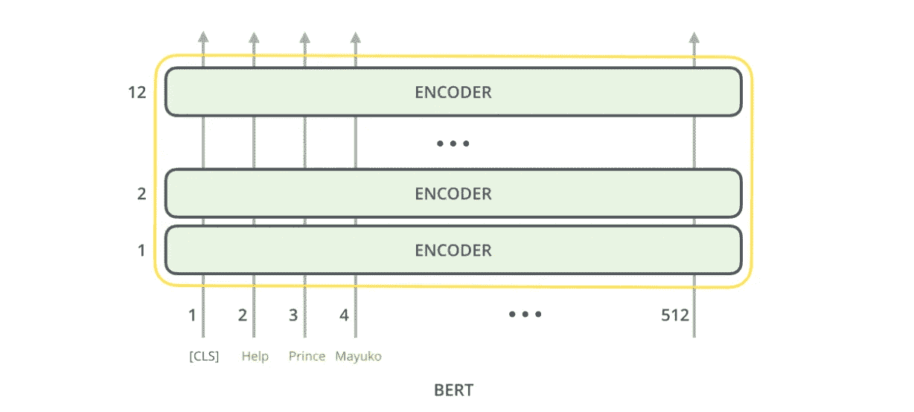
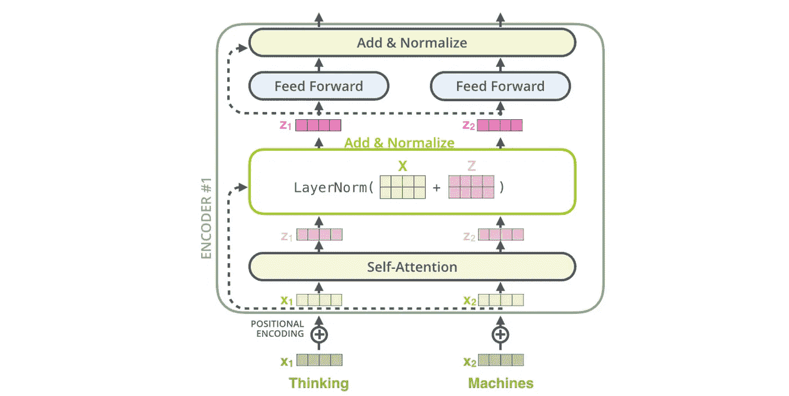
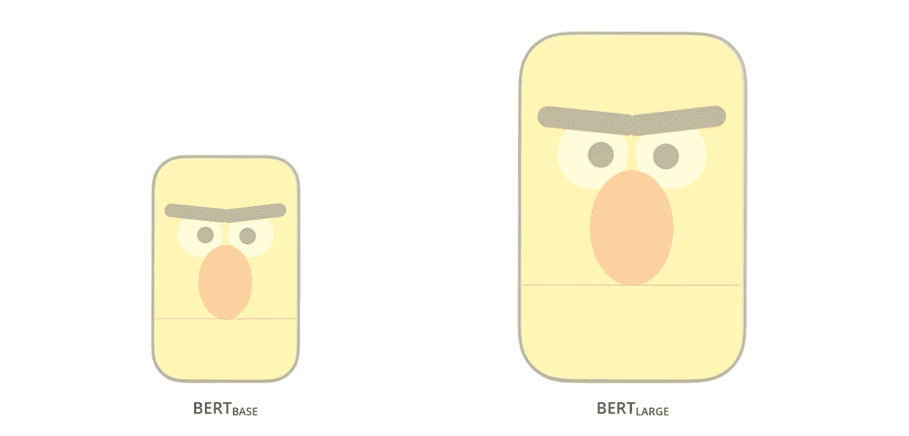
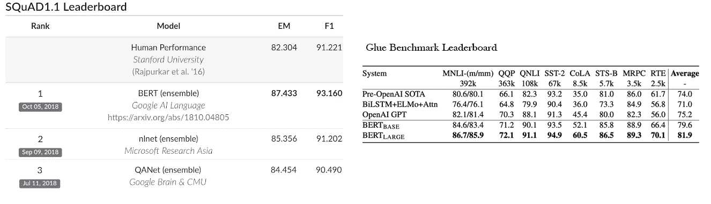
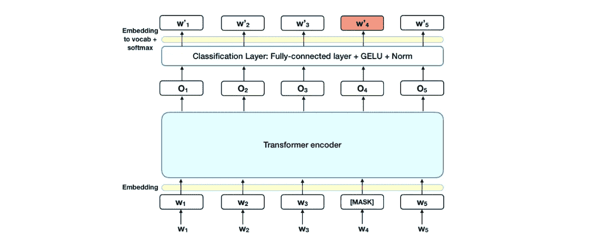
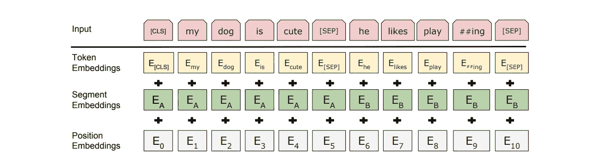
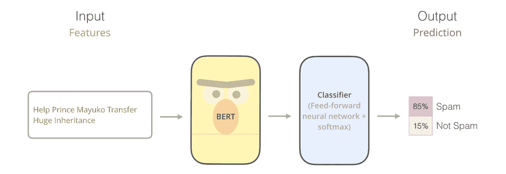
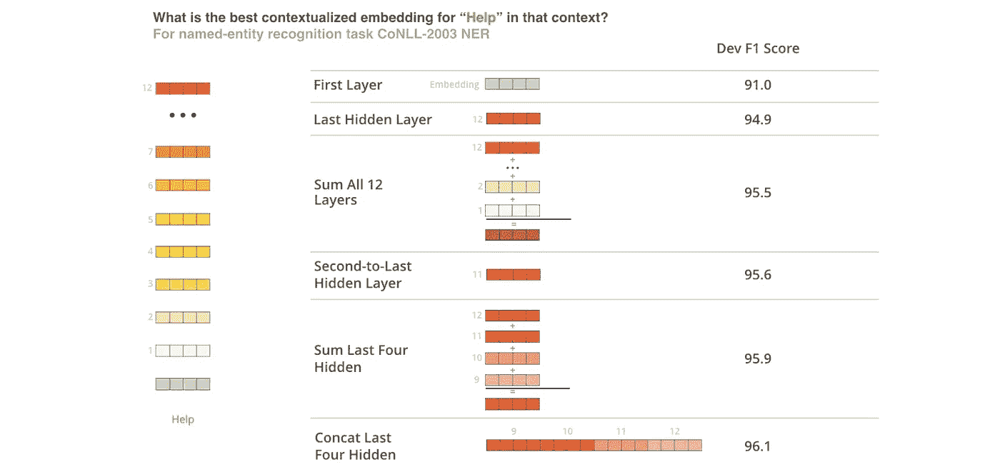
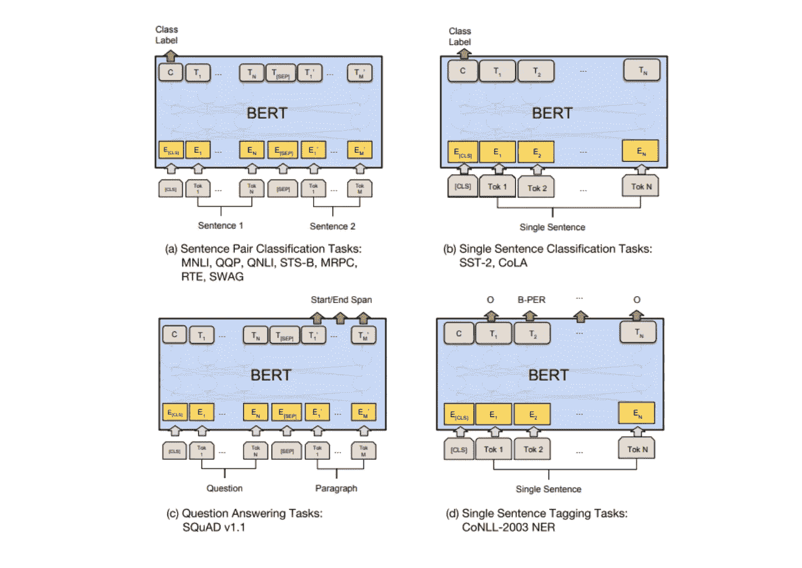

# 理解 BERT —(变压器的双向编码器表示)

> 原文：<https://towardsdatascience.com/understanding-bert-bidirectional-encoder-representations-from-transformers-45ee6cd51eef?source=collection_archive---------4----------------------->

## 《变形金刚》第 2/3 部分 vs 谷歌 QUEST 问答标注(Kaggle top 5%)。

*这是一个由 3 部分组成的系列，我们将经历变形金刚，伯特，和一个动手的 Kaggle 挑战—* [*谷歌任务 Q & A 标签*](https://www.kaggle.com/c/google-quest-challenge/) *来看看变形金刚的行动(在排行榜上排名第 4.4%)。
在这部分(2/3)中，我们将关注 BERT(变形金刚的双向编码器表示)*以及它*如何成为各种现代自然语言处理任务的最新技术。
由于 BERT 的架构是基于变压器的，所以您可能想要检查变压器的内部结构，这可以在第 1/3 部分中找到。*

我们意识到了这样一个事实，即在过去的几年里，迁移学习已经给计算机视觉领域带来了革命性的变化。像 VGG、YOLO、UNET、RESNET 等经过预训练的网络已经在计算机视觉的不同领域表现出了突破性的性能。
我们在自然语言处理领域也看到了类似的方法，如 Word2Vector、GloVe，但 BERT 将它提升到了一个全新的水平。

BERT 是谷歌人工智能语言的研究人员在 2018 年底发表的一篇论文，从那时起，它已经成为许多自然语言处理任务的艺术状态。BERT 采用不同的方法，它同时考虑输入句子的所有单词，然后使用注意机制来开发单词的上下文含义。
这种方法对许多 NLP 任务都很有效，正如最近 ELMo(来自语言模型的嵌入)[论文](https://arxiv.org/pdf/1802.05365.pdf)中所示。

在这篇博客中，我们将通过 4 个分主题来讨论 BERT

*   ***伯特和以前的嵌入技术的区别。***
*   ***引擎盖下看一看:*** 伯特内部架构。
*   ***前期训练的 BERT 是如何训练出来的:*** 让 BERT 如此高效的不同训练方法。
*   ***输入输出:*** 如何使用 BERT

***BERT 与 Word2Vector 或 GloVe 等其他嵌入生成算法有何不同？***

BERT 和 W2V 或 GloVe 的主要区别在于:

1.  W2V 和 GloVe 单词嵌入是上下文无关的。这些模型只为每个单词输出一个向量(嵌入)，*将单词的所有不同含义组合成一个向量*。例如在给定的句子中:
    *“如果两个家伙*****同时打成平手，这场比赛将导致一场**平手。”
    Word2Vector 或 GloVe 将无法捕捉到句子中的所有 3 个单词 **tie** 具有不同的含义，并将简单地为所有 3 个单词返回相同的嵌入。
    而 BERT 是上下文相关的，这意味着 3 个单词中的每一个都将具有不同的嵌入，因为 BERT 在生成嵌入之前关注相邻的单词。****
2.  ***因为 W2V 和 GloVe 是上下文无关的，所以我们不需要用于每次训练向量来生成嵌入的模型。我们可以简单地在单词语料库上训练向量一次，然后生成保存单词和它们各自的训练向量的表格或数据库。
    而在 BERT 的情况下，由于它是依赖于上下文的，所以每次在生成嵌入或执行任何 NLP 任务时，我们都需要预训练的模型。***

***现在我们已经对 BERT 有了一些了解，让我们来理解它是如何工作的。***

> *****在引擎盖下看一看*****

***BERT 的架构源自变压器。在 BERT 内部有几个堆叠的编码器单元，类似于我们在《变形金刚》中看到的。请记住，在转换器内部，编码器单元如何用于读取输入句子，解码器单元如何用于预测输出句子(逐字逐句)，但在 BERT 的情况下，由于我们只需要一个读取输入句子并生成一些可用于各种 NLP 任务的特征的模型，因此只使用了转换器的编码器部分。
BERT 中的双向部分来自于它同时读取所有输入单词的事实。***

******

***来源:[http://jalammar.github.io/illustrated-bert/](http://jalammar.github.io/illustrated-bert/)***

***如我之前所说，编码器单元类似于我们在变压器中看到的。有**自关注头**然后是**前馈神经网络。**注意头和前馈神经网络也是定义不同类型 BERT 模型的参数。***

******

***来源:[http://jalammar.github.io/illustrated-bert/](http://jalammar.github.io/illustrated-bert/)***

***如果我们看看两种伯特架构，即伯特基和伯特大，伯特基和伯特大都采用 512 维输入。***

******

***来源:http://jalammar.github.io/illustrated-bert/***

*   ***BERT base — 12 层(变压器块)，12 个注意头，1.1 亿个参数，输出大小为 768 维。***
*   ***BERT Large — 24 层(变压器块)，16 个注意头，3.4 亿个参数，输出大小为 1024 维。***

******

***来源:【https://medium.com/r/? URL = https % 3A % 2F % 2f towards data science . com % 2 funder standing-Bert-is-it-a-game-changer-in-NLP-7 CCA 943 cf 3 ad***

***在[小队 v1.1](https://rajpurkar.github.io/SQuAD-explorer/) 上，BERT 取得了 93.16%的 F1 分数，甚至超过了人类 91.2%的分数:BERT 还在极具挑战性的 GLUE 基准测试(一组 9 个不同的自然语言理解(NLU)任务)上提高了 7.6%的绝对水平。***

****本文将编码器单元称为变压器模块。***

> *****训练模型*****

***伯特是一个预先训练好的模型。它是在包括整个维基百科(25 亿字)和书籍语料库(8 亿字)在内的大型未标记文本语料库上进行预训练的。让我们来看看用来训练伯特的两种训练方法。***

*   *****屏蔽语言模型(MLM):** 在这种方法中，模型被输入一个句子，使得句子中 15%的单词被屏蔽。
    BERT 面临的挑战是在给定非屏蔽词的上下文的情况下正确预测屏蔽词。
    需要记住的几点是:
    -最终编码器模块的输出不直接用于预测，而是在两者之间添加一个具有 GELU 激活的全连接层。然后，该层的输出被转换为 vocab，并应用 softmax 函数来预测屏蔽字。
    -损失函数仅考虑屏蔽词的预测值，这使得学习更加基于上下文。***

******

*   *****下一句预测(NSP):** 在这种方法中，模型被输入两句话。伯特面临的挑战是预测两个句子的顺序。
    比如，假设这两句话是:
    *【我有一支笔】**【笔是红色的】*。在训练时，如果第一句在第二句之后，BERT 将返回 1，如果第二句在第一句之后，BERT 将返回 0。***

**在训练 BERT 模型时，同时使用上面讨论的两种方法。**

> ****输入和输出****

*****输入:*****

**了解了 BERT 的架构和训练过程后，现在让我们了解如何在给定一些输入文本的情况下使用 BERT 生成输出。**

***特殊记号:*在为 BERT 生成输入时，会用到一些特殊记号或关键字。主要有**【CLS】****【九月】**。
**【CLS】**用作添加在输入句子开头的第一个标记。**【SEP】**在传递多个输入句子时，用作不同句子之间的分隔符。
我们来考虑一个例子:假设我们要将两个句子*“我有一支笔”*和*“这支笔是红色的”*传递给 BERT。分词器会先把这些句子分词为:
**['[CLS]'，'我'，'有'，' a '，'笔'，'[SEP]'，' The '，'笔'，' is '，' red '，'[SEP]']** 然后转换成数字记号。**

****

**来源:[https://towards data science . com/Bert-explained-state-of-art-language-model-for-NLP-F8 b 21 a9 b 6270](/bert-explained-state-of-the-art-language-model-for-nlp-f8b21a9b6270)**

**BERT 接受 3 种类型的输入:**

1.  *****记号嵌入*** *:* 记号嵌入是输入句子中单词的数字表示。还有一种叫做子词标记化的东西，BERT 使用它首先将较大或复杂的单词分解为简单的单词，然后将它们转换为标记。例如，在上图中，在生成令牌嵌入之前，看看单词“playing”是如何被分解为“play”和“##ing”的。标记化中的这一调整创造了奇迹，因为它利用了一个复杂单词的子单词上下文，而不是像对待一个新单词一样对待它。**
2.  *****片段嵌入*** *:* 片段嵌入用于帮助 BERT 区分单个输入中的不同句子。对于来自同一个句子的单词，这个嵌入向量的元素都是相同的，并且如果句子不同，该值也会改变。
    我们来考虑一个例子:假设我们要将两个句子*“我有一支笔”*和*“笔是红色的”*传递给 BERT。分词器首先将这些句子分词为:
    **['[CLS]'，'我'，' have '，' a '，' pen '，'[SEP]'，' is '，' red '，'[SEP]']** 并且这些句子的段嵌入看起来像:
    **【0，0，0，0，0，0，1，1，1，1，1，1]** 注意对应于第一个句子中的单词的所有元素如何具有**
3.  ****由于伯特采用 512 维输入，假设我们只有 10 个单词的输入。为了使标记化的单词与输入大小兼容，我们将在末尾添加大小为 512–10 = 502 的填充。连同填充符一起，我们将生成大小为 512 的屏蔽令牌，其中对应于相关单词的索引将具有 **1** s，对应于填充符的索引将具有 **0** s。****
4.  *****位置嵌入:*** 最后是在 BERT 内部生成的位置嵌入，它为输入数据提供了一种有序感。这和我们在《变形金刚》中讨论的是一样的。**

*****输出:*****

**请记住，对于输入中的每个单词，BERT 库在内部创建了一个 768 维的输出，但是对于分类这样的任务，我们实际上并不需要所有嵌入的输出。因此，默认情况下，BERT 只考虑对应于第一个令牌**【CLS】**的输出，并丢弃对应于所有其他令牌的输出向量。**

**这对于垃圾邮件检测之类的分类任务非常有用，对于给定的输入文本，我们需要预测它是否是垃圾邮件。
我们为输入句子生成 token _ embeddings、segmentation _ embeddings 和 mask_tokens，将它们传递给 BERT，它生成 768 维的输出。最后，我们将此输出传递到一个前馈网络，该网络类似于一个具有 2 个节点的密集层，并将 softmax 作为激活函数。**

****

**来源:[http://jalammar.github.io/illustrated-bert/](http://jalammar.github.io/illustrated-bert/)**

**上面输出的问题是，对于我们需要更多关注句子语义的任务，比如机器翻译，它并不那么有效。对于这样的任务，建议使用编码器隐藏状态的汇集或平均输出。这有时也被称为*特征提取*。**

**在对哪种向量作为情境化嵌入效果最好进行了大量实验后，论文提到了 6 种选择。**

****

**来源:[http://jalammar.github.io/illustrated-bert/](http://jalammar.github.io/illustrated-bert/)**

**事实证明，对于大多数任务，将最后四个编码器的隐藏状态串联起来似乎效果最好。**

**要了解更多关于输入参数和我的 BERT 返回的值，你可以查看这里的官方文档:[https://huggingface.co/transformers/model_doc/bert.html](https://huggingface.co/transformers/model_doc/bert.html)**

> ****可用性****

**最后，让我们看看根据本文，BERT 可以执行哪些任务。**

****

**来源:http://jalammar.github.io/illustrated-bert/**

**(一)。对一对句子进行分类，例如一个问答对是否相关。**

**(二)。对单个句子进行分类，例如检测输入的句子是否是垃圾邮件。**

**(三)。生成给定问题标题和段落的答案。**

**(四)。单句标记任务，例如命名实体识别，必须为输入中的每个单词预测标记。**

***这就是伯特的博客，希望阅读愉快。
我要感谢所有的创作者，他们创作了我写这篇博客时提到的精彩内容。***

***参考链接:***

*   ***应用人工智能教程:*[*https://www.appliedaicourse.com/*](https://www.appliedaicourse.com/)**
*   **[https://arxiv.org/abs/1810.04805](https://arxiv.org/abs/1810.04805)**
*   **[https://towards data science . com/Bert-explained-state-of-art-state-language-model-for-NLP-F8 b 21 a9 b 6270](/bert-explained-state-of-the-art-language-model-for-nlp-f8b21a9b6270)**
*   **[http://jalammar.github.io/illustrated-bert/](http://jalammar.github.io/illustrated-bert/)**
*   **【https://www.youtube.com/watch?v=BhlOGGzC0Q0】**
*   **[https://towards data science . com/understanding-Bert-is-it-a-game-changer-in-NLP-7 CCA 943 cf 3 ad](/understanding-bert-is-it-a-game-changer-in-nlp-7cca943cf3ad)**

> ****最终注释****

**感谢您阅读博客。我希望它对那些渴望做项目或学习 NLP 新概念的人有用。**

**在第 1/3 部分中，我们报道了变形金刚如何成为各种现代自然语言处理任务及其工作的艺术。**

**在[第 3/3 部分](/hands-on-transformers-kaggle-google-quest-q-a-labeling-affd3dad7bcb?source=friends_link&sk=159fd259d7ae346bb4cfa07dc5180938)中，我们将经历一次动手的 Kaggle 挑战——[Google QUEST Q&A Labeling](https://www.kaggle.com/c/google-quest-challenge/)以观看变形金刚的行动(在排行榜上排名第 4.4%)。**

**在 LinkedIn 上找到我:[www.linkedin.com/in/sarthak-vajpayee](http://www.linkedin.com/in/sarthak-vajpayee)**

**和平！☮**