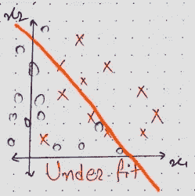

# 理解偏差——方差权衡:示例和简单解释

> 原文：<https://towardsdatascience.com/understanding-bias-variance-trade-offs-101-ff8f44533731?source=collection_archive---------54----------------------->

## 本教程涵盖了你需要知道的关于偏差和方差的一切


[Cytonn 摄影](https://unsplash.com/@cytonn_photography?utm_source=medium&utm_medium=referral)在 [Unsplash](https://unsplash.com?utm_source=medium&utm_medium=referral) 上拍照

偏差和方差是一些很容易理解但很难掌握的主题。因此，在本教程中，我将解释偏差和方差，这样你就再也不用担心它了。不浪费太多时间，让我们开门见山吧。

# 偏差 101:

> 偏差与训练集误差有关，也与欠拟合有关。

让我们从上面关于偏见的陈述中理解我的意思。

想象你有一个分类器，任何分类器，你在训练集上训练分类器，然后计算训练集误差；然后，如果训练集误差高，我们可以说我们的模型具有高偏差。并且如果训练集误差低，那么我们可以说我们的模型具有低偏差。

简而言之，高训练集误差对应于高偏差。高训练集误差背后的主要原因是我们的模型对训练数据拟合不足。这就是为什么高偏差也与欠拟合有关。

# 差异 101:

> 方差与测试集误差(与训练集误差相比，测试集误差有多大)相关，也与过拟合相关。


让我们再一次理解我上面关于方差的陈述是什么意思。

在训练分类器并获得训练集误差之后，我们必须获得测试集误差，并将训练集误差和测试集误差相互比较。

如果训练集和测试集误差之间的差异更大(测试集误差比训练集误差高得多),那么我们可以说我们具有高方差。获得 0.5%的训练集误差和 10%的测试集误差意味着我们的模型不能很好地概括，这意味着我们的模型也是过度拟合的。

简而言之，当测试集误差比训练集误差大得多时，我们有高方差。当这种情况发生时，我们的模型也是过度拟合的。

# 偏差-方差权衡 101:

偏差-方差权衡之所以出现是因为，

> 减少偏差会增加方差&减少方差会增加偏差。

简而言之，如果你试图减少太多的偏差，那么这将导致模型更加复杂和不通用。意味着你会过度适应模型。

如果你试图减少太多的方差，那么这将导致一个更一般化和更简单的模型。也就是说你会低估这个模型。

因此，我们的目标是在偏差和方差之间找到正确的平衡。

# 可视化不同的偏差-方差情景:

现在，为了更好地理解，让我们在一个包含两个维度(x1 和 x2)和两个标签(o 和 x)的数据集上可视化不同的偏差-方差场景。对于所有不同的偏差-方差情况，我们讨论了不同的决策边界。


这个图有四种不同的偏差-方差情况，你可以在其中找到自己。为了更好地理解，让我们把它们形象化。

```
Low Bias & High Variance:
```


如果我们的训练集误差较低(0.5%)，而测试集误差较高(10%)。然后，我们有低偏差和高方差条件，这也被称为模型的过拟合。低偏差和高方差的例子可以在二维双标签数据集中看到。

```
High Bias & Low Variance:
```



如果我们有一个高的训练集误差(13%)，而测试集误差(13.50%)与训练集误差相比并不高，那么我们就有高偏差和低方差的情况。也称为欠拟合。上面可以看到在二维& 2 标签数据集上的例子。

```
High Bias & High Variance: ***The worst case scenario.***
```


如果我们有高训练集误差(12%)和高测试集误差(20%)，那么我们有高偏差和高方差条件。这是下装和上装的结合。其示例可以在上面的图像中看到，上面显示了二维 2 标签数据集。

```
Low Bias & Low Variance: ***This is what we want***.
```


如果你有低训练集误差(0.5%)和低测试集误差(1%)，那么我们可以说我们有低偏差和低方差的完美模型。其例子可以在上面看到。

# 解决高偏差和高方差问题:


如果你有一个高偏差或高方差的问题，那么尝试上述解决方案将会奏效。但是要小心！当你试图减少偏差时，注意方差，因为你不想让偏差太低，因为那会增加方差。这一切都是为了找到偏差和差异的最佳点。

# 结论:

所以，你将不得不处理偏差-方差权衡，现在你明白了什么是偏差-方差权衡，以及如何解决偏差-方差问题。我想你会更轻松地处理这些事情。

我希望你现在没有任何疑虑。如果您有任何疑问，请在下面留言，我们将在 24 小时内回复。

如果你没有任何疑问，并且喜欢阅读它，或者它以任何方式帮助了你，那么请为它鼓掌。它在这个令人沮丧的新冠肺炎时代激励着我。

平安无事:)