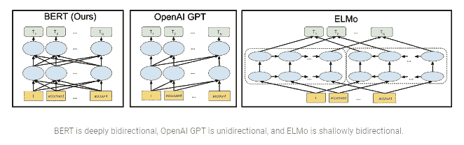
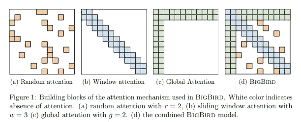
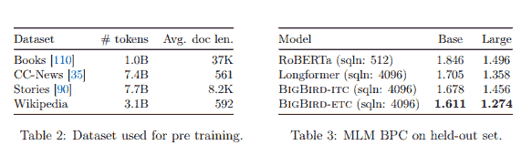

# 理解 Google 的 Big bird——它是 NLP 的另一个重要里程碑吗？

> 原文：<https://towardsdatascience.com/understanding-bigbird-is-it-another-big-milestone-in-nlp-e7546b2c9643?source=collection_archive---------6----------------------->

## 谷歌研究人员最近在 arXiv 上发表了一篇题为《大鸟:更长序列的变形金刚》的论文。

图片由[皮克斯拜](https://pixabay.com/?utm_source=link-attribution&utm_medium=referral&utm_campaign=image&utm_content=2167835)的 Gerd Altmann 提供

去年，谷歌的研究人员发布了 BERT，这被证明是自 RankBrain 以来最高效和最有效的算法变革之一。看看最初的结果，BigBird 也有类似的迹象！

在本文中，我介绍了:

*   基于变压器的模型的简要概述，
*   基于变压器的模型的局限性，
*   什么是大鸟，还有
*   大鸟的潜在应用。

我们开始吧！

# 基于变压器的模型概述

自然语言处理(NLP)在过去的几年中有了很大的改进，基于变形金刚的模型在其中扮演了重要的角色。尽管如此，仍有许多事情有待发现。

Transformers 是 2017 年推出的自然语言处理模型，主要用于提高处理和理解文本翻译和摘要等任务的顺序数据的效率。

与在输入结束之前处理输入开始的递归神经网络(RNNs)不同，变压器可以并行处理输入，从而显著降低计算的复杂性。

BERT 是 NLP 中最大的里程碑式的成就之一，它是一个开源的基于 Transformers 的模型。一篇介绍 BERT 的[论文，与大鸟一样，由谷歌研究人员于 2018 年 10 月 11 日发表。](https://arxiv.org/abs/1810.04805)

来自变压器的双向编码器表示(BERT)是基于变压器的高级模型之一。它在大量数据(预训练数据集)上进行预训练，BERT-Large 在超过 25 亿个单词上进行训练。

话虽如此，BERT 是开源的，允许任何人创建自己的问题回答系统。这也有助于它的广泛流行。

但是 BERT 不是唯一的上下文预训练模型。然而，与其他模型不同，它是双向的。这也是其成功和应用多样的原因之一。

[**来源**](https://ai.googleblog.com/2018/11/open-sourcing-bert-state-of-art-pre.html)

这个预训练模型的结果绝对令人印象深刻。它被成功地用于许多基于序列的任务，如摘要、翻译等。甚至谷歌也采用 BERT 来理解其用户的搜索查询。

但是，像其他基于变形金刚的模型一样，BERT 也有其自身的局限性。

# 以前基于变压器的模型的局限性

虽然基于变压器的模型，尤其是 BERT，比 rnn 有很大的改进和效率，但它们也有一些限制。

伯特工作在一个完全自我关注的机制上。这导致每个新输入令牌的计算和存储需求呈二次增长。最大输入大小约为 512 个令牌，这意味着该模型不能用于大型文档摘要等任务的较大输入&。

这基本上意味着在将一个大字符串作为输入应用之前，必须将其分解成更小的片段。这种内容碎片还会导致大量的上下文丢失，从而限制了它的应用。

那么，*什么是大鸟，它与 BERT 或者其他基于变形金刚的 NLP 模型有什么不同？*

# 介绍大鸟—适用于更长序列的变压器

如前所述，BERT 和其他基于变形金刚的 NLP 模型的一个主要限制是，它们运行在一个完全的自我关注机制上。

当谷歌的研究人员在 arXiv 上发表了一篇题为 [**“大鸟:更长序列的变形金刚”**](https://arxiv.org/pdf/2007.14062.pdf) **的论文后，这种情况发生了变化。**

BigBird 运行在一种稀疏注意力机制上，这种机制允许它克服 BERT 的二次依赖性，同时保留完全注意力模型的属性。研究人员还提供了大鸟支持的网络模型如何超越以前的 NLP 模型以及基因组学任务的性能水平的实例。

[来源](https://arxiv.org/pdf/2007.14062.pdf)

在我们进入 BigBird 的可能应用之前，让我们来看看 BigBird 的主要亮点。

## 大鸟的主要亮点

以下是 BigBird 的一些特性，这些特性使它优于以前基于 transformer 的模型。

*   **稀疏注意机制**

假设您收到一张图片，并被要求为其创建一个相关的标题。你将从识别图片中的关键物体开始，比如说一个扔“球”的人。

作为人类，识别这个主要对象对我们来说很容易，但是为计算机系统简化这个过程在 NLP 中是一件大事。注意力机制被引入来降低整个过程的复杂性。

大鸟使用稀疏注意力机制，这使它能够处理

序列长度比使用 BERT 可能达到的长度多 8 倍。请记住，这个结果可以使用与 BERT 相同的硬件来实现。

在 BigBird 的上述论文中，研究人员展示了 BigBird 中使用的稀疏注意机制如何与完全自我注意机制(在 BERT 中使用)一样强大。除此之外，他们还展示了*“图灵完全编码解码器有多稀疏”。*

简而言之，BigBird 使用稀疏注意机制，这意味着注意机制是一个令牌一个令牌地应用的，不像 BERT 那样，注意机制只应用于整个输入一次！

*   **可以处理长达 8 倍的输入序列**

BigBird 的一个关键特性是它能够处理比以前长 8 倍的序列。

研究小组设计了 BigBird，以满足像 BERT 这样的完整变形金刚的所有要求。

使用大鸟和它的稀疏注意力机制，研究小组将 O(n)(伯特的)复杂性降低到仅为 O(n)。这意味着限制为 512 个记号的输入序列现在增加到 4096 个记号(8 * 512)。

创造大鸟的研究人员之一 Philip Pham 在一次 [**黑客新闻讨论**](https://news.ycombinator.com/item?id=24041758) — ***中说，“在我们的大部分论文中，我们使用 4096，但我们可以使用更大的 16k+”***

*   **根据大型数据集进行预训练**

谷歌研究人员在大鸟的预训练中使用了 4 个不同的数据集——****[**琐事-QA**](http://nlp.cs.washington.edu/triviaqa/)**[**HotpotQA-分心物**](https://www.aclweb.org/anthology/D18-1259/)**&**[**WikiHop**](https://www.mitpressjournals.org/doi/abs/10.1162/tacl_a_00021)。******

****虽然 BigBird 的集体预训练数据集远不如 GPT-3 的大(在 1750 亿个参数上训练)，但研究论文的表 3 显示，它的表现优于 RoBERTa(一种稳健优化的 BERT 预训练方法)和 Longformer(一种用于长文档的类似 BERT 的模型)。****

****当一位[用户要求 Philip Pham](https://news.ycombinator.com/item?id=24041758) 比较 GPT-3 和大鸟时，他说—***“GPT-3 只使用 2048 的序列长度。“大鸟”只是一种注意力机制，实际上可能是 GPT-3 的补充。”*******

**** [## 新发现的友谊的故事:艾、曼梯·里和疫情

### 这篇文章讲述了这个疫情如何给了人工智能-人工智能阿朵急需的推动，以及这个新发现的…

towardsdatascience.com](/the-story-of-newly-found-friendship-ai-ml-and-the-pandemic-6ceb02376ebd) 

# 大鸟的[可能]应用

一篇介绍大鸟的论文是最近才推出的——2020 年 7 月 28 日。因此，大鸟的全部潜力还有待确定。

但是这里有几个可能的应用领域。其中几个应用也是 BigBird 的创作者在 [**原创研究论文**](https://arxiv.org/pdf/2007.14062.pdf) 中提出的。

*   **基因组处理**

深度学习在基因组数据处理中的使用有所增加。编码器将 DNA 序列片段作为任务的输入，如甲基化分析、预测非编码变体的功能效应等。

BigBird 的创建者说: ***“我们引入了一种基于注意力的模型的新应用，其中长上下文是有益的:提取基因组序列(如 DNA)的上下文表示”。***

在使用 BigBird 进行启动子区域预测时，该论文声称已经将最终结果的准确性提高了 5%!

*   **长文档摘要&问答**

由于 BigBird 现在可以处理 8 倍长的序列长度，它可以用于 NLP 任务，如较长文档形式的摘要和问题回答。在大鸟的创建过程中，研究人员还测试了它在这些任务中的表现，并见证了“最先进的结果”。

*   **谷歌搜索大鸟**

[**谷歌于 2019 年 10 月开始使用 BERT**](https://www.blog.google/products/search/search-language-understanding-bert/) 来理解搜索查询，并为其用户显示更多相关结果。谷歌更新搜索算法的最终目的是比平时更好地理解搜索查询。

随着 BigBird 在自然语言处理(NLP)方面优于 BERT，开始使用这一新发现的更有效的模型来优化 Google 的搜索结果查询是有意义的。

*   **Web &手机 App 开发**

十年来，自然语言处理取得了显著的进步。有了一个 GPT-3 驱动的平台，它可以将你的简单语句转化为已经到位的功能性 web 应用程序(以及代码)， [**人工智能开发者**](https://www.resourcifi.com/hire-ai-developer/) 可以真正改变你开发 web & web 应用程序的方式。

由于大鸟可以处理比 GPT-3 更长的输入序列，它可以与 GPT-3 一起使用，为您的业务高效快速地创建 [**web &移动应用**](https://www.resourcifi.com/) 。

# 结论

虽然关于 BigBird 还有很多有待探索，但它绝对有能力彻底改变自然语言处理(NLP)。*你对大鸟及其对 NLP 未来的贡献有什么看法？*

**参考资料:**
【1】曼齐尔·扎希尔和他的团队，《大鸟:更长序列的变形金刚》(2020)，《T9》arXiv.org

[2]Jacob Devlin，张明蔚，Kenton Lee，Kristina Toutanova，BERT:用于语言理解的深度双向转换器的预训练，[arXiv.org](https://arxiv.org/)****