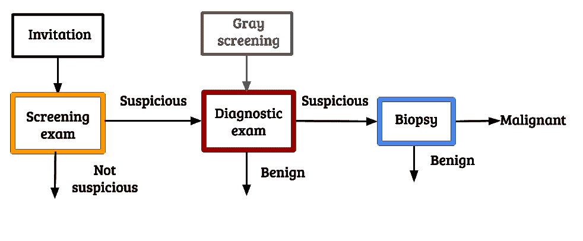
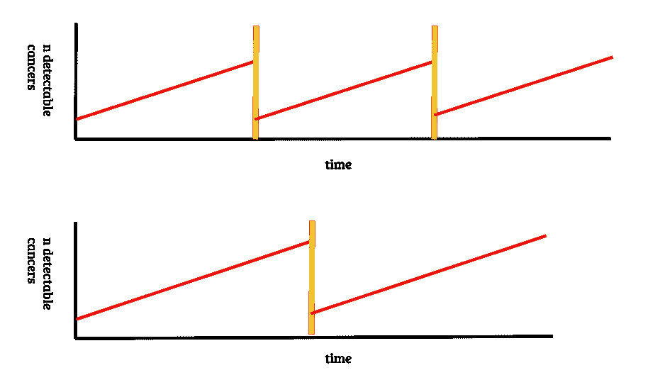
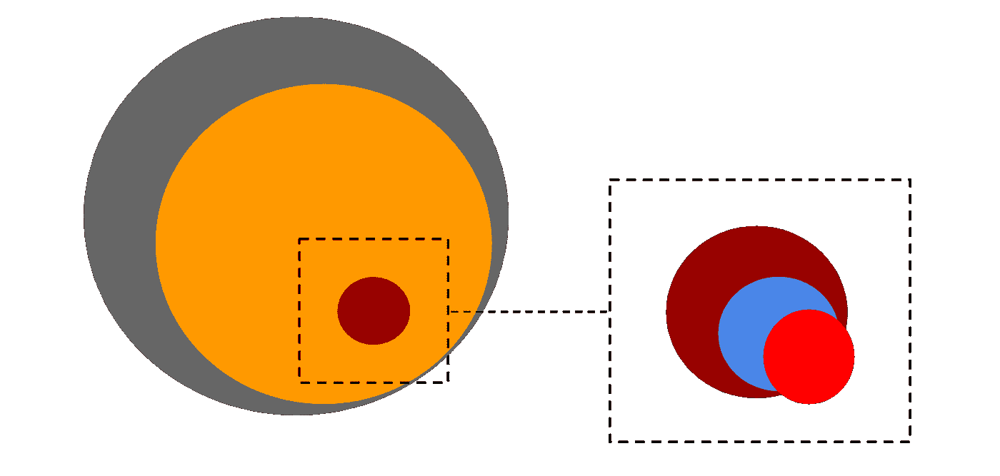
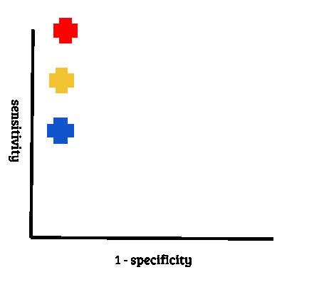

# 了解乳腺癌筛查数据

> 原文：<https://towardsdatascience.com/understanding-breast-cancer-screening-data-ce656b221670?source=collection_archive---------64----------------------->

## 如何利用数据的流行病学基础来更好地训练和理解人工智能模型

2020 年的头几个月可能会成为现代史上最伟大的疫情的开端。来自世界各地的流行病学家争先恐后地想出紧急计划来控制这种疾病。巨大的生命损失掩盖了更好的消息:人工智能令人印象深刻的进展，特别是筛查性乳房 x 线照相术[1，2]。

人工智能在医学领域的成功应用通常至少与调整数据和调整模型一样重要。不管你给 VGG 或雷斯内特喂狗和猫的照片，他们都学不会在乳房 x 光检查中发现癌症。了解您所处理的数据的流行病学基础真的会有所不同。

然而，进入这个领域可能会令人生畏，因为它需要从过去 60 年的医学文献中提取精华。此外，该领域往往不像大多数人工智能从业者起源的工程或数学等硬科学那样结构化。

这篇文章旨在简要介绍(基于乳房 x 线摄影的)乳腺癌筛查数据及其主要方面，这些方面对于开发人工智能应用程序和理解各种最近关于乳房 x 线摄影的人工智能论文的结果非常重要。

# **乳腺癌筛查流程**

乳腺癌是一种常见疾病:八分之一的女性会在一生中的某个时候患上乳腺癌。大多数欧洲国家、美国和一些亚洲国家通过定期乳房 x 光检查(x 光图像)对超过一定年龄的无症状妇女进行乳腺癌筛查。几项随机对照试验显示死亡率显著降低，因此筛查可以挽救生命[3]。这个筛选过程的执行方式因国家而异。大多数欧洲国家都有国有化的项目，由政府机构用一封信邀请妇女，美国没有。

如果一名妇女参加筛查，乳房 x 线照片会被记录下来。如果这项检查发现可疑，她被召回进行诊断检查，其中可能包括进一步的成像。如果这仍然是不确定的，进行活检。在一些国家，女性会跳过官方邀请，直接进行诊断检查，这被称为灰色筛查。图 1 提供了一个示例。

*图一。乳腺癌筛查流程概述，即在欧洲普遍执行的方式。在一些国家(如德国),并非所有被邀请的妇女都参加常规筛查，但有时会投机性地进行诊断性乳房 x 光检查。这被称为“灰色筛选”。*(图片作者提供)

除了确切的过程，筛选政策的参数也因国家而异。下面是几个重要的变量。

**首次筛查年龄**

患癌症的风险随着年龄的增长而增加。在年轻时进行筛查通常是不必要的。例外情况是高危人群中的妇女(例如，因为基因突变使其更有可能患乳腺癌)，她们通常从比普通人群更年轻的年龄开始筛查，并进行补充成像，如 MRI。除了风险之外，组织成分会随着年龄的增长而变化，这使得年轻女性很难发现癌症。在大多数欧洲国家，筛查从 50 岁开始(尽管有些例外是瑞典和英国)。在美国和东亚，这一比例通常为 40。

当一名妇女第一次接受筛查时，发现癌症的几率更高，因为你会发现癌症已经发展了几年。第一轮和随后的筛查通常分别称为患病率和发病率筛查。

**筛选轮次之间的时间**

筛查之间的时间，或筛查间隔从美国的一年到英国的三年不等，在英国大多数欧洲国家使用两年的间隔。与筛查开始和筛查周期的年龄类似，间隔时间在一定程度上决定了每次筛查中检测到(或可能检测到)的癌症数量。图 2 对此进行了说明。

y 轴代表人群中可检测到的癌症数量，x 轴代表时间。一个人在筛查之间等待的时间越长，被检测出的癌症就越多。请注意，这是一种简化，在实践中，并不是群体中的所有女性都被同时筛查。还要注意的是，可检测到的癌症数量不会下降到零:有些癌症被遗漏了，我们将在这篇文章的后面谈到这一点。

*图二。说明两种不同的筛查间隔及其对可检测癌症数量的影响。红线表示可检测到的癌症数量，黄线表示一轮筛查。你在两次检查之间等待的时间越长，你发现的癌症就越多。请注意,“一轮筛查”是指所有患者同时接受筛查的单一事件。实际上当然不是这样(图片由作者提供)。*

除了上面提到的变量之外，还有一些参数可以通过“比率”来获取，这些参数主要是(除了参与率之外)在计划的敏感性和特异性之间进行权衡的结果。以下是一些常用的费率。

*   **参与率**在全国性的筛查项目中，政府通常会发出邀请函。参与率描述了实际参加筛查的女性比例，通过所有收到邀请的人进行标准化。请看图 3，我们可以用橙色圆圈除以灰色圆圈来得到参与率。
*   **召回率**在所有参与筛查的女性中，只有一小部分被召回(被邀请进行后续检查)。这个比例很大程度上取决于筛查项目和/或中心。在美国，召回率通常很高:约为 10%，而在欧洲，这一数字接近 3%。患病率筛查的召回率通常也更高。在图 3 中，用暗红色的圆圈除以橙色的圆圈可以得到召回率。
*   **活检率**当女性被召回进行后续检查时，他们有时会进行第二次乳房 x 光检查(诊断性乳房 x 光检查)，进行超声波检查或活检，如果他们仍然不确定的话。大约 50%的诊断检查会导致活检。活检率是通过将图 3 中的蓝色圆圈除以深红色圆圈获得的。
*   **癌症检出率**癌症检出率(CDR)就是每 1000 名患者中检出的癌症数量。再次使用图 3 中的斑点，这是通过取亮红色圆、亮蓝色圆的交集并除以橙色圆获得的。就像召回率一样，CDR 通常在患病率筛查上更高。

*图三。筛选过程中不同“比率”的说明。大的灰色斑点代表该年龄组中所有接受筛查的女性，橙色圆圈代表所有实际参加筛查的女性，深红色圆圈代表所有被召回的女性，亮蓝色圆圈代表所有接受活检的病例，亮红色圆圈代表所有癌症(图片由作者提供)。*

**错过的癌症**

注意，在图 2 中，可检测的癌症的数量在一轮筛选后没有下降到零，并且在图 3 中，亮红色斑点不是暗红色斑点的子集。这是为了说明癌症被遗漏了。其中一些是在两次筛查之间检测到的，这些被称为*间期癌。*有些在下一次筛查时被查出。

间断性癌症通常用于评估筛查项目的质量。如果有很多，这意味着许多癌症可能在筛查过程中被遗漏，灵敏度太低。然而，间隔癌症并不直接意味着在筛查过程中遗漏了癌症。研究表明，约 20-30%的间隔期癌症和下一轮筛查中检测到的大致相同数量的癌症被遗漏[4，5，6](即，在先前的乳房 x 光片中可检测到)。这是因为癌症可以在最后一轮筛查后开始生长，或者在乳房 x 光片上根本看不到。图 4 提供了这一过程的图示。

*图 4。乳腺癌筛查中癌症检测过程的图示。左侧的亮红色圆圈表示在筛查时间 t 内检测到的所有癌症(筛查检测到的癌症)。中间的斑点是一组间隔期癌症，右边的斑点是在下一轮筛查中检测到的癌症(时间 t +间隔期 I)。大约 20 到 30 个间歇期癌症和在下一轮筛查中检测到的癌症在先前的筛查中已经是可见的。所有亮红色斑点代表时间 t 时所有可检测的癌症(图片由作者提供)。*

# **定义标签**

定义标签很重要，没有它，人工智能模型就不能很好地学习。对于医学数据来说，这通常没有自然图像简单，因为并不总是清楚“真相”是什么。有时会区分参照标准和黄金标准。在第一种情况下，这是一组读者的最佳猜测，在第二种情况下，它具有一些更多的信息，例如来自组织病理学的信息，读者不能仅通过查看图像来知道。

不幸的是，选择哪一个也不是那么明显。例如，当构建用于筛查的人工智能工具时，你应该只检测癌症还是检测放射科医生认为可疑的一切？如果您选择前者，并使用该工具来协助放射科医生，他们可能会认为奇怪的是，该系统没有标记他们认为非常可疑的东西。但是，如果系统只能访问相同的信息，要比放射科医生好得多就很难了。下面将进一步解释这两种选择。

**比拉德分数—参考标准**

在大多数欧洲国家，考试是由两个认证的放射科医生阅读。在美国，这通常只是一个人。看完试卷后，她给出一个分数:比拉德分数[7]。这是在乳房 x 线照相术的国际标准化报告系统中定义的等级。这些分数可以解释为[8]:

*   这是个好消息，考试是空的，没有发现。
*   这也是好消息，但是发现了一些良性异常。
*   **BIRADS 3** 在这种情况下，放射科医师不确定，需要半年左右的随访。这个分数在一些国家是不允许的，因为读者会倾向于过多地使用它。
*   **BIRADS 4a** 这意味着在乳房 x 光片上发现了可疑之处，需要进行诊断检查。然而，这实际上是癌症的可能性仍然很小。
*   这意味着患癌症的几率比 4A 略高。这个分数也不是在所有国家都使用，因为 4A 有足够的理由召回这个女人。
*   **BIRADS 4C** 发现了一个非常可疑的病变，读者非常确定这个检查描述的是癌症。
*   这意味着发现了一种或多种教科书上的癌症，并且读者非常确定检查描述的是恶性肿瘤。

从技术上来说，BIRADS 分数不是一个序数量表，因为 BIRADS 1 和 2 具有相似的可疑程度。因此，不应如此解释。

**组织病理学结果—金标准**

如果诊断检查不能排除癌症，临床医生进行乳腺活检。这通常通过(真空辅助)针芯活检来完成，由此从可疑部位提取一小块组织。放在显微镜下的组织以确定它到底是什么。病理学家通常同意它是否是癌症，但对确切的亚分类有不同意见。

常见的(乳腺癌)分类系统是根据它们的起源组织。乳房中的大多数癌症是癌，这意味着它们起源于上皮组织。乳房由小叶和导管组成，负责乳汁的产生和运输。癌症可以是原位的，这意味着它们没有增殖到其来源组织之外，或者是侵入性的/浸润性的，这意味着癌细胞开始迁移。

取其笛卡儿积，我们得到四种主要类型:浸润性导管癌(最常见)、浸润性小叶癌、导管原位癌和小叶原位癌。在最近的乳腺病理学指南中，最后一种不再被认为是真正的癌症[9]。侵袭性癌症是最危险的，绝对不应该被人工智能系统遗漏。这只是冰山一角，还有其他几十种病理和分类系统[9]。

# **定义积极和消极**

阳性的最常见定义是简单地观察组织病理学结果，即是否为癌症。然而，通过这样做，我们还没有到达那里。因为筛选过程具有时间成分，我们还需要定义*何时*获得特定结果。(至少)有三种选择:

**检查后立即通过活组织检查确诊癌症**这是阳性的最常见定义。然而，使用这个定义，很难表明一个算法比人类具有更高的灵敏度，除非你通过阅读来区分它们，或者让读者再次阅读相同的案例。

这个定义相当于只取筛查出的癌症，图 4 中左边的大红色斑点。相应的人的操作点在图 5 的 ROC 图中用红叉表示。

**癌症通过活组织检查确认，直到下一次筛查检查**这通常用于确定筛查程序的灵敏度，因为它很容易从癌症注册表中计算出来。你可以简单地将筛查检测到的癌症数量除以筛查检测到的+间隔期癌症。这通常会导致 70–80%的灵敏度。尽管它在评估研究中并不常用。

在图 4 中，这意味着将左边的大红色斑点和中间的两个斑点中较大的一个作为阳性。相应的人工操作点由图 5 中的黄色十字表示。

**在下一次筛查检查后三个月，通过活检确诊癌症**deep mind 在最近的《自然》杂志论文中使用了这个定义【1】。使用这种方法的原因是他们称之为“看门人效应”的东西:通过只将筛查出的癌症视为阳性，你会使结果有偏差，并使人类看起来更好。然而，另一方面，许多将在未来几年发展的癌症在当前的检查中还不可见，这意味着敏感性显著下降。

我们通过将图 4 中的所有大斑点视为阳性来得到这个定义。相应的人工操作点是图 5 中的蓝色十字。

最后一个也可能是最纯粹的定义阳性的方法是简单地观察所有“可检测的癌症”(图 4 中所有的亮红色斑点)。然而，这可能是乏味的，因为它需要确定错过了什么，这只能通过再次阅读案例来评估。

*图五。ROC 图中不同阳性定义的不同人为操作点的图示。红色:只有筛查出的癌症被认为是阳性。黄色:筛查出的和间隔期的癌症为阳性。蓝色:检查后两年内发现的癌症被视为阳性(图片由作者提供)。*

# **对人工智能研究的启示**

那么这一切和人工智能有什么关系呢？首先，如何定义数据以及如何将数据呈现给模型非常重要。这是人工智能产品的秘密成分的一部分，所以我不会在这里详述。在评估模型并将结果与文献进行比较时，考虑上述变量也是很有趣的。以下是最近文献中的几个例子:

*   如上所述，DeepMind 最近在《自然》杂志上发表的论文[1]使用了一个有点不寻常的积极的定义。这意味着这篇论文的结果看起来比其他论文差很多(包括读者和算法)，这让许多人感到困惑。
*   乳房 x 线摄影梦想挑战[10]的最新评估论文展示了两个数据集的模型结果。第一个是由挑战组织者提供的美国数据集，第二个是瑞典数据集。该模型是在第一个数据集上开发的，但当应用于第二个数据集时，表现出更好的性能。作者假设(除其他因素外),这是因为第二组筛查的筛查间隔和癌症构成更长:筛查间隔时间越长，发现的浸润性癌症越多。这些可能更容易被发现。
*   一些人工智能论文结合了筛选和诊断数据[2，11]。虽然癌症在诊断和筛查检查中可能看起来几乎一样，但从诊断数据而不是筛查数据中获得阴性结果可能意味着“更难”(当然也取决于你如何训练你的模型)获得阴性结果，因为这些结果会在常规筛查中被召回，这意味着其中可能有可疑之处。这可能低估了模型在纯筛选数据上的表现。
*   美国和欧洲的筛查存在相当大的差异，这使得方法的比较变得困难。美国通常每年筛查一次，召回率更高。美国的癌症检出率更高，这意味着更多微妙的癌症可能在阳性结果中，可能更难检测到。Yala 等人[12]报告的 AUC 值约为 0.8，与欧洲的研究相比可能显得较低，但可能只是更硬的数据的结果。

总之，乳房 x 线摄影人工智能的最新进展令人兴奋，可能意味着朝着更好的医疗保健迈出了一大步。将数据中的临床和流行病学因素考虑在内有助于理解结果并提高性能。然而，比较研究仍然很复杂。目前最好的比较可能是简单地将每种方法与放射科医生进行对比[13]。

**参考文献**

[1]麦金尼、西耶克、戈德博勒、戈德温、安特罗波娃、阿什拉菲安、巴克、切苏斯、克拉多、乔治·c、达尔齐和埃特马迪，2020 年。乳腺癌筛查人工智能系统的国际评价。*自然*， *577* (7788)，第 89–94 页。

[2] Kim，H.E .，Kim，H.H .，Han，B.K .，Kim，K.H .，Han，k .，Nam，h .，Lee，E.H .，Kim，E.K .，2020 年。使用人工智能的乳腺 x 线摄影中癌症检测和假阳性回忆的变化:一项回顾性、多读者研究。*《柳叶刀》数字健康*， *2* (3)，第 e138-e148 页。

[3] Marmot，M.G .，Altman，D.G .，Cameron，D.A .，Dewar，J.A .，Thompson，S.G .，Wilcox，m .，2013。乳腺癌筛查的益处和危害:一项独立综述。*《英国癌症杂志*， *108* (11)，第 2205–2240 页。

[4]hov vind，s .，Geller，b .，Vacek，P.M .，Thoresen，s .和 Skaane，p .，2007 年。使用欧洲指南评估挪威乳腺癌筛查项目。*《欧洲流行病学杂志》*， *22* (7)，第 447 页

[5]霍夫、亚伯拉罕森、萨姆塞特、杰赫、维格兰、克莱普和霍夫温德，2012 年。乳腺癌:错过的间隔和筛查-全数字化乳腺摄影和屏-片乳腺摄影检测到的癌症-来自一项回顾性综述的结果。*放射学*， *264* (2)，第 378–386 页。

[6]n . Perry，m . Broeders，c . de Wolf，s . t rnberg，r . Holland 和 von Karsa，l .，2008 年。欧洲乳腺癌筛查和诊断质量保证指南。—总结文件。*肿瘤学年鉴*， *19* (4)，第 614–622 页。

[7] Sickles，EA，D'Orsi CJ，Bassett LW，等. ACR BI-RADS 乳房 x 线照相术.载于:ACR BI-RADS 图谱，乳腺成像报告和数据系统。弗吉尼亚州雷斯顿，美国放射学院；2013.

[8]h[ttps://www . Hopkins medicine . org/breast _ center/](https://www.hopkinsmedicine.org/breast_center/treatments_services/breast_cancer_screening/digital_mammography/breast_imaging_reporting_data_system.html)

[9]朱利亚诺、埃奇、S.B .和奥尔托巴依、G.N .，2018 年。AJCC 癌症分期手册:乳腺癌。*外科肿瘤学年鉴*， *25* (7)，第 1783–1785 页。

[10] Schaffter，t .，Buist，D.S .，Lee，C.I .，Nikulin，y .，Ribli，d .，Guan，y .，Lotter，w .，Jie，z .，Du，h .，Wang，s .和 Feng，j .，2020 年。结合人工智能和放射科医师评估来解释筛查乳房 x 光片的评价。 *JAMA 网开*， *3* (3)，pp.e200265-e200265。

[11] Rodriguez-Ruiz，a .，Lå ng，k .，Gubern-Merida，a .，Teuwen，j .，Broeders，m .，Gennaro，g .，Clauser，p .，Helbich，T.H .，Chevalier，m .，Mertelmeier，t .和 Wallis，M.G .，2019 年。能否通过人工智能自动识别正常检查来减少乳腺 x 线筛查的工作量？可行性研究。*欧洲放射学*， *29* (9)，第 4825–4832 页。

[12]亚拉，a .，舒斯特，t .，迈尔斯，r .，巴兹莱和雷曼，c .，2019 年。一个深度学习模型来分类筛查乳房 x 光片:一项模拟研究。*放射学*， *293* (1)，第 38–46 页。

[13] Lotter，w .，Diab，A.R .，b .，Kim，J.G .，Grisot，g .，Wu，e .，Wu，k .，Onieva，J.O .，Boxerman，J.L .，Wang，m .和 Bandler，m .，2019 年。使用注释有效的深度学习方法在乳房 x 线照相术和数字乳房断层合成中进行鲁棒的乳腺癌检测。 *arXiv 预印本 arXiv:1912.11027* 。