# 理解中心性度量

> 原文：<https://towardsdatascience.com/understanding-centrality-measures-60393959bb39?source=collection_archive---------39----------------------->

中心性度量是让您更好地了解数据集的工具。它们指向你的分布中心。

中心性度量在数据分析的探索阶段非常有用。在对数据管道的输出进行健全检查时，或者在开始回答一个新产品问题时，您可能会用到它们。

当你读完这篇文章的时候，你会意识到你已经使用中心性度量很长时间了，甚至没有注意到。

## 为什么您应该关注中心性指标

我们每天都会在某个时候查看数据，无论是在工作中还是在查看我们最喜欢的运动队的数据。

如果您是一名数据科学家，并且正在用数据回答一个产品问题，中心性指标可以帮助您:

*   显示您正在处理的数据的分布中心。
*   定义更简单、更容易解释的指标。大多数时候，您只需要将正确的中心性指标应用到您的问题的上下文中。
*   传达您正在处理的数据的一些重要特征。
*   解读仪表板并发现是否有问题。

这些度量将你指向分布的中心。它们告诉你大多数数据点聚集在哪里。

对于这些图中的每一个，您认为大多数数据点接近什么值？

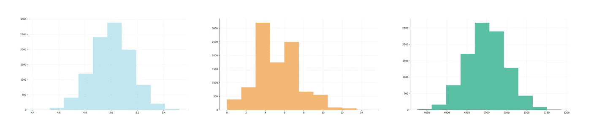

我们将学习如何回答这个问题。

我们可以用中心性度量来回答这个问题，例如，通过计算

*   平均
*   中位数
*   方式

如果这些名字听起来很陌生，不要担心！我相信你从小就使用过这些指标。你甚至可以根据它们做决定。

让我们来看看这些中心性指标中的每一个。

# 平均

*我们都知道这是平均值*

你可能不会称之为卑鄙，但你可能熟悉平均的概念。

例如，如果我告诉你一个 MLB 球员在[的平均击球率](https://en.wikipedia.org/wiki/Batting_average_(baseball))是 0.3，你就会知道我是通过以下方式得出这个数字的:

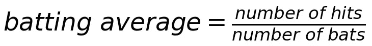

这就是我们所说的平均，花哨的数学名称是算术平均。简而言之，大家都称之为卑鄙。

要计算平均值，您需要:

1.  将你感兴趣的所有观察值相加，比如一个 MLB 玩家的总点击次数，
2.  用它除以你观察到的总数，就像，蝙蝠的总数。

如果我们要使这个公式更通用，我们应该:

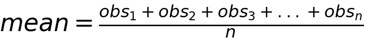

其中 *obs_1* 到 *obs_n* 为你关心的观察值，n 为你看到的观察值总数。

这就是每个人提到手段时都在谈论的，但是，如果你好奇的话，还有几种其他类型的手段。

## 诠释意义

当我告诉你一个 MLB 球员的平均击球率是 0.3 时，我的意思是每 10 次击球中，那个球员会击中其中的 3 次。

这是一个令人敬畏的见解，因为现在你有一种方法来比较不同球员的击球率。

这种方法还有一个有趣的特性，它的工作原理就像一种秤或者一场拔河比赛。添加过高或过低的数据点，平均值将向那个方向移动。

如果我给你看一个例子，就很容易发现这一点。

你想学习新的聚会技巧，所以你决定练习倒立。为了看看你是否有进步，你也要计时你能倒立多长时间。

在练习的第一天，你尝试做 5 次倒立:

*   有一次你倒立了一秒钟，
*   下一次你拿着它两秒钟的时候，
*   然后持续 3 秒钟，
*   随着你的进步，接下来的几次你保持 4 秒，然后 5 秒。

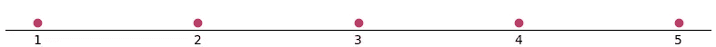

第一天倒立练习后的数据集。

第一天练习后，如果你要计算倒立的平均时间，你会做:

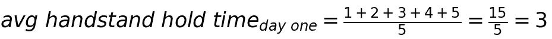

太好了，你倒立平均保持了 3 秒钟！

在接下来的练习中，你感觉不舒服，所以你只做了几次倒立。第一次尝试时，你保持 1 秒钟，第二次尝试时，你保持倒立 3 秒钟。

如果我们查看到目前为止您所有练习数据的数据集，我们有:

*   上次练习的数据点，
*   两个新的数据点，聚集在 1 和 3 周围。

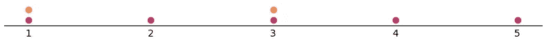

第二天倒立练习后的数据集。

你认为这些新数据点将如何影响平均值？让我们计算一下最新的保持时间。

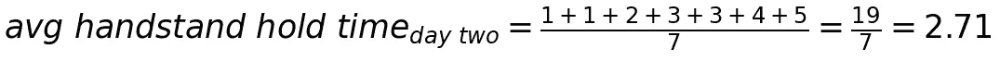

您已经向数据集添加了两次以上的尝试，但是这些保持时间更短。因此，您的平均等待时间现在更短了。

但是你对目前的成绩不满意，想改进你的倒立游戏。所以你决定休息一会儿，改天再练习。

在下一次练习中，你首先做一个倒立 1 秒钟，然后再做一个 3 秒钟，然后打破你的个人记录:做一个倒立 10 秒钟！

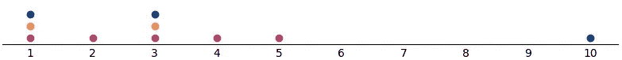

第三天倒立练习后的数据集。

请记住，平均值就像一场拔河比赛，所以如果您添加的数据点与您之前看到的数据点大相径庭，平均值就会被推向这些值。

在第三个练习中，您添加了两个数据点，即 1 秒和 3 秒的观察值，这两个数据点将平均值拉向一个较低的值。如果您停在那里，您的平均等待时间确实会更短:

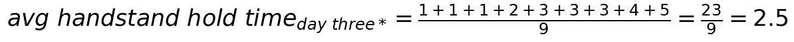

但是你用 10 秒倒立打破了你的个人记录。这个保持时间比你之前的最好时间要长，所以你的平均保持时间会增加。

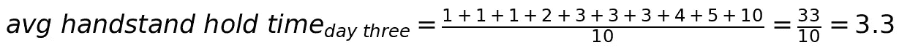

我们可以说平均值对极端观测值很敏感，因为它向数据集中更极端的值移动。

# 中位数

*中间的数据点*

为了计算中位数，你要寻找正好在分布中间的点。所以你要:

*   对数据集进行排序。
*   取中间的值。
*   如果数据集中间有两个数字，求它们的平均值。

从第一天的实践中获取数据集，我们想把它分成大小相等的两部分。我们可以通过分离数字 3 来实现。

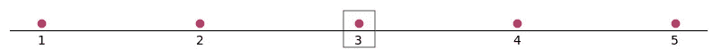

第一次练习后倒立保持时间的中位数。

这是我们的中位数，3 秒，这意味着:

*   在这个练习的一半尝试中，你做了长达 3 秒钟的倒立，
*   另一半时间，你手倒立 3 秒以上。

现在，如果我们看看练习的第三天，中间值就不那么容易发现了。我们实际上有两个值，在分布的中间。但是没关系，我们可以将它们平均来计算中位数。

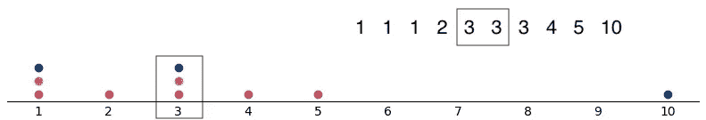

第三次练习后倒立保持时间的中位数。

中位数的力量在于你现在用百分比来思考。您不需要知道数据集的大小来完全解释您的结果，因为您知道 50%的分布将低于中位数，而另外 50%将高于中位数。

如果你仔细观察，当 10 秒倒立将平均值从 3 秒提高到 3.3 秒时，中位数保持不变。这就是为什么我们可以说，中位数对极端的观察更稳健。

# 方式

*最受欢迎的数据点*

该模式捕获数据集中最频繁出现的值。

让我们再回顾一遍倒立练习的第一天，画出保持时间的直方图。我们可以看到，在我们的例子中，有两个值是最常见的 1 秒和 3 秒保持时间。

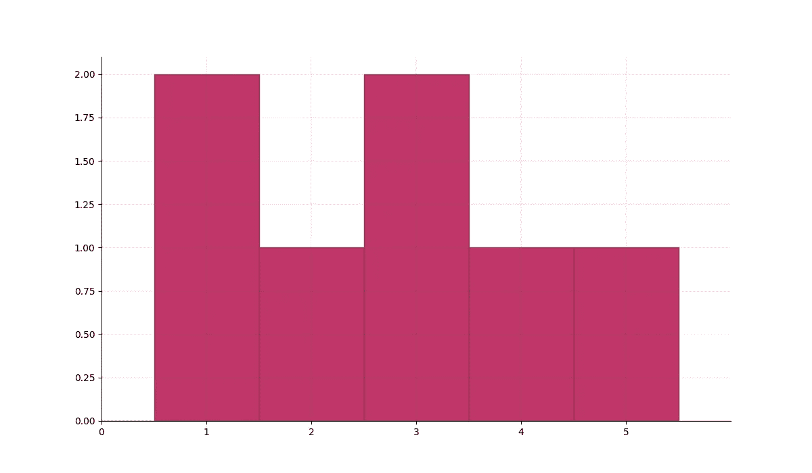

第一次练习后倒立保持时间直方图。

你可能认为，像均值和中值一样，众数必须是一个单一的值。但事实并非如此。该模式将显示更频繁出现的值，它将告诉您分布向哪个值倾斜。

例如，第一次练习的保持时间分布有两个峰值，因为有两个值是最常见的。

在 1 秒内有一个峰值，在 3 秒保持时间内有另一个峰值。因为我们的分布有两个模式，我们说它是双峰的。但是，如果我们的分布只有一个峰值，如一个模式，它将是一个单峰分布。

因为重点是频率而不是值的顺序，所以不需要对数据集进行排序来计算模式。

而且，像中位数一样，该模型对异常值也是稳健的。

如果我们看一下第三次练习，即使记录保持时间为 10 秒，模式也保持不变。我们仍然可以看到 1 秒和 3 秒处的两个峰值，因为这是我们数据集中最常见的值。

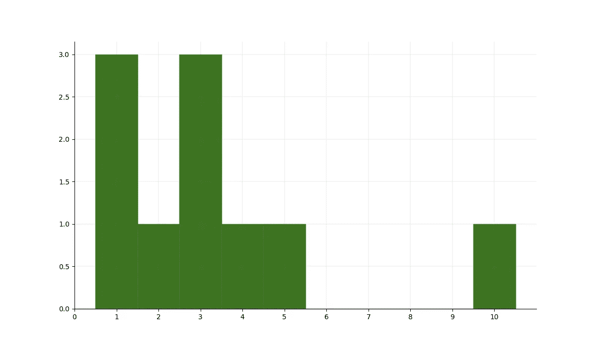

第三次练习后倒立保持时间直方图。

该模式的另一个特点是它不局限于数值数据集。您也可以计算分类数据的模式。

如果您的数据集是关于在美国不同州度过的假期，您可以计算数据集的模式。过程是一样的，你绘制直方图或者你去过每个州的次数，模式是你去过最多的州。

既然您对中心性度量有了更多的了解，回答这个问题就很容易了。

对于这些图中的每一个，您认为大多数数据点接近什么值？

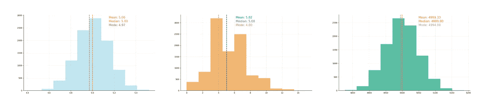

现在你知道我们是如何得到这些平均值、中间值和众数的了😀

*感谢阅读！*