# 理解链式法则——一种直观的方法

> 原文：<https://towardsdatascience.com/understanding-chain-rule-an-intuitive-way-a7e715f43c86?source=collection_archive---------37----------------------->

图片来自[https://unsplash.com/@kaleyloved](https://unsplash.com/@kaleyloved)，来源:[https://unsplash.com/photos/gtVrejEGdmM](https://unsplash.com/photos/gtVrejEGdmM)

这篇文章是针对那些在理解链式法则上有困难的高中生或大学生的。我试图用一种直观而又不同的方式来解释一个概念，同时为将来会对你有所帮助的‘全微分’概念打下基础。尽管如此，如果你只是对数学感兴趣，那么这篇文章也适合你！

这是一个微积分系列的第一部分，在这里我将解释一元问题和多元问题的链规则的概念(在引入偏导数之后)。我打算通过提供“材料导数”概念的直观感受来结束这个系列。

在数据科学中，链规则是一个非常重要的概念，尤其是如果你想了解像神经网络这样的概念是如何工作的。

我会假设你从头到尾都知道什么是“导数”。

## 什么是链式法则？

链式法则是微积分中的一个概念，其中一个**复合函数**的导数不仅仅是母函数的导数，它还受到其子函数导数的影响。

那么这看起来像什么？

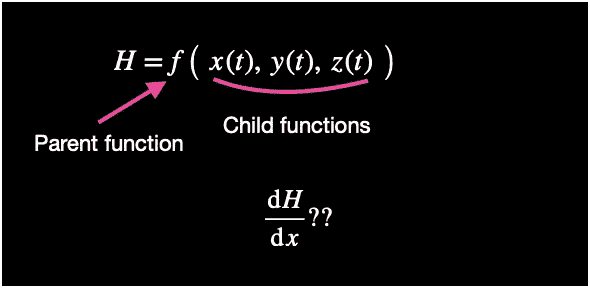

这个问题有点抽象不是吗？我们先简化一下，再赋予它意义。

假设你正试图衡量你的幸福😊变化，碰巧食物🍞让你开心，听起来很合理，对吗？

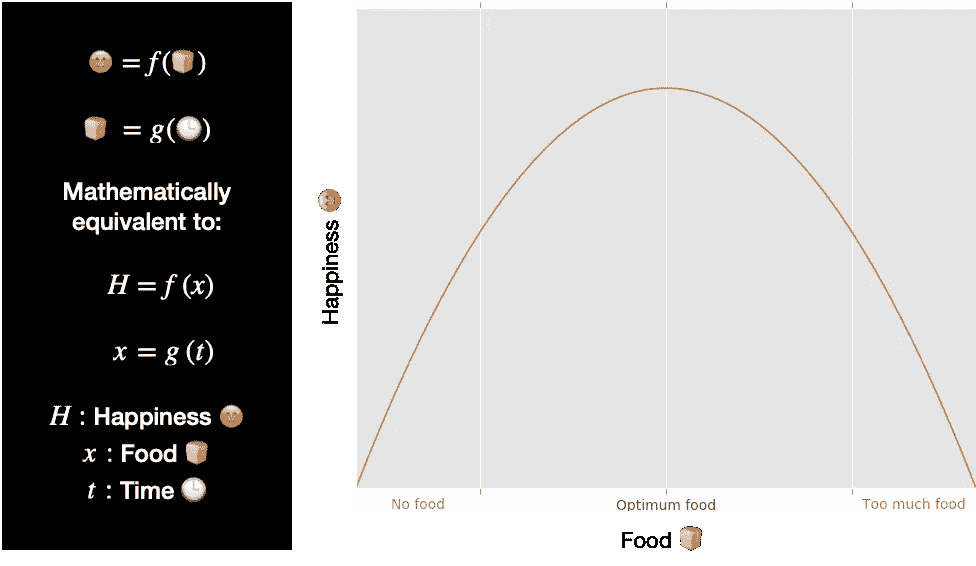

我理解你可能会觉得用表情符号来代表变量令人困惑，比你想象的要多(这发生在我们大多数人身上！).我将在开始写数学形式，但是我鼓励你‘打破符号’,试着理解概念是什么，而不是‘记忆’数学！

自然，真实的模型比上面描述的要复杂得多，但是我们都可以与之相关。当没有食物时，我们不快乐。当我们有足够的食物时，我们非常满足。当食物太多的时候，我们就不开心。

现在假设，食物🍞是时间的函数，所以它看起来像这样(当你有非常饥饿的家庭成员时尤其如此…):

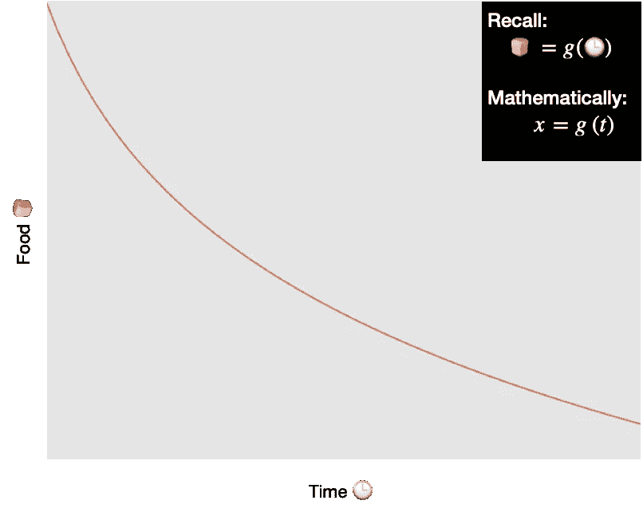

现在，我对测量我的快乐随着时间的变化非常感兴趣。本质上:

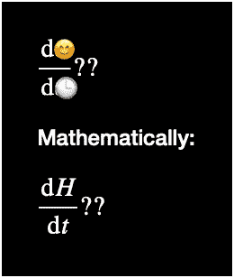

我敢肯定，你的老师/讲师已经对你进行了训练，“你必须使用链式法则，因为🕒不是的直接变量😊。所以:

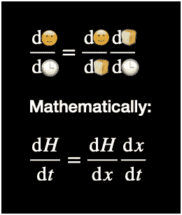

你有没有想过为什么这行得通？或者，如果我们的幸福方程式中有另一个变量，会发生什么？如果我们的幸福也依赖于其他东西呢？

## 另一种观点…全微分

考虑全微分的概念。对于一个简单的单变量问题(在我们的例子中，幸福😊只有 T1 是食物的功能吗🍞)，意思是:

> *的总变化😊*由*的**导数**给出😊*相对于*🍞*、**乘以**乘以*中的**变化**🍞*。

所以:

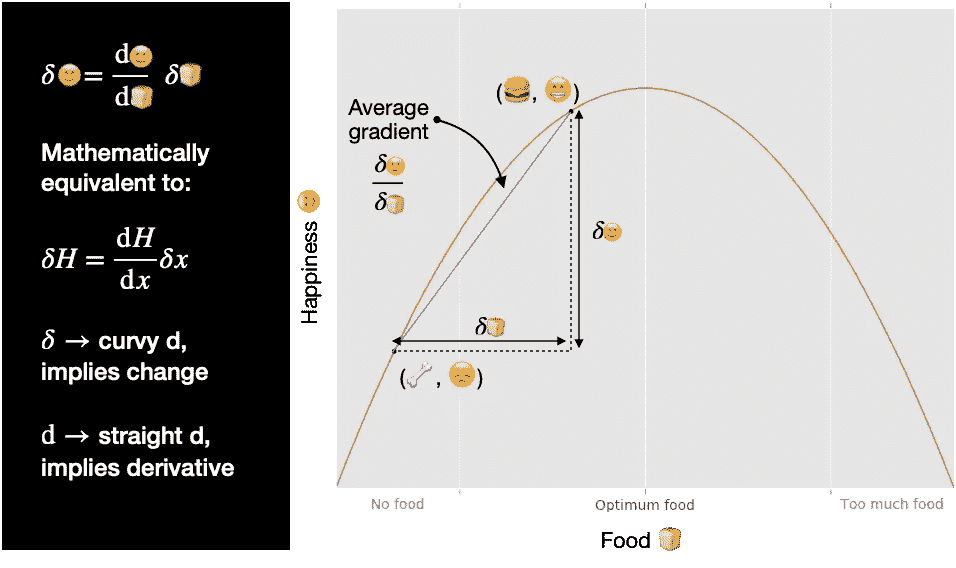

但是为什么我们首先要用全导数的定义呢？的**导数**有意义吗😊关于🍞，乘以**中的变化**🍞给了我们**变化**在😊？

让我们进一步研究这个问题:

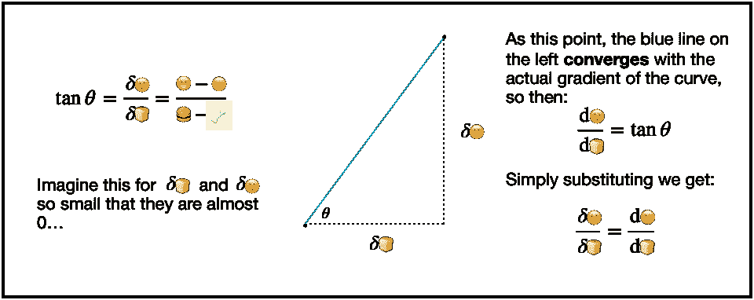

既然我们现在**理解了**为什么全微分有意义，我们可以开始应用它了。

我们知道快乐😊是食物的一个功能🍞，所以我们可以用幸福的全微分来写:

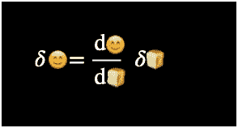

我们**也**知道食物🍞是时间的函数🕒，所以我们可以用食物的总导数来写:

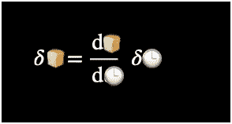

替代食物中的变化🍞在第一个表达式中，通过第二个表达式，我们得到最后一个表达式:

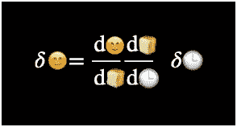

现在，我们再次调用时间变化接近 0 的假设。这允许我们将弯曲的 d 转换成直的 d，所以:

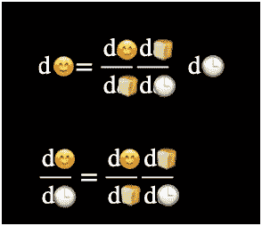

如果您对曲线 d 如何变成直线 d 感到困惑，请查看此动画:

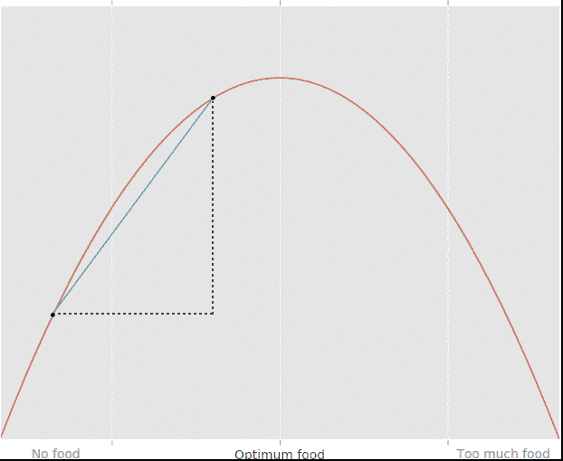

我们现在已经到了链式法则的表达式了！

## 现在来应用它…

好了，我希望你现在已经更好地理解了链式法则的概念，它是如何产生的，以及它为什么有意义。

我留给你一个问题去解决…

我用来代表快乐和食物的曲线如下:

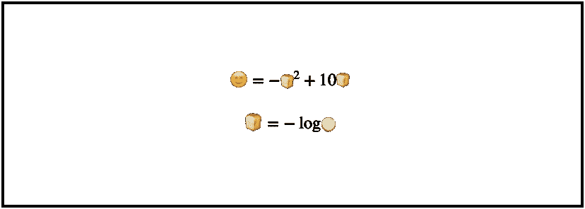

利用链式法则，你能找到快乐随时间的变化吗？

## 读者注意:

我希望你喜欢这篇文章。我希望能启发你，不要把数学看作是学校里的一门无聊的课程，或者一堆丑陋的符号……而是一种美丽的语言，你可以用它从不同的角度看世界。

我希望我介绍这个概念的相当“非正统”的方法有所帮助。

如果你喜欢我的内容，请关注我，因为这将激励我创造更多…不要羞于通过评论提供反馈！我总是希望学习新的东西；)