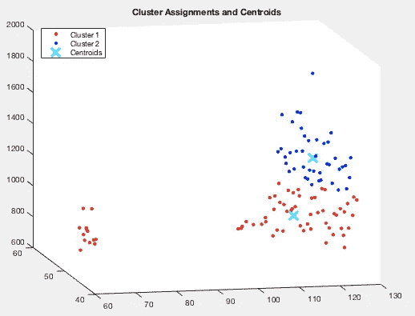
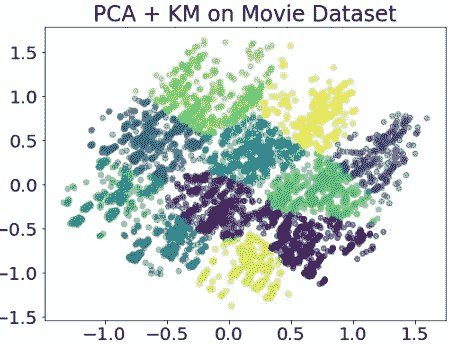
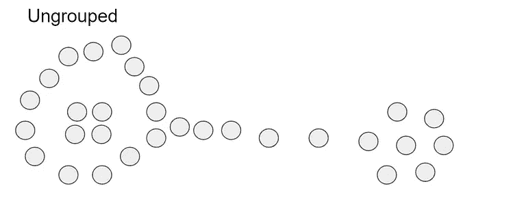
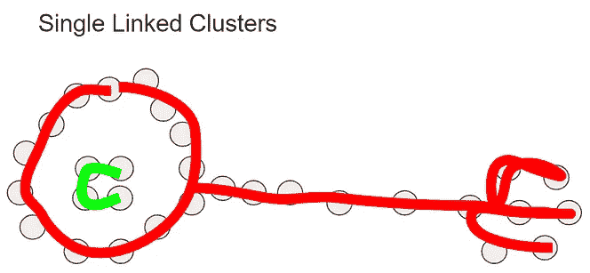
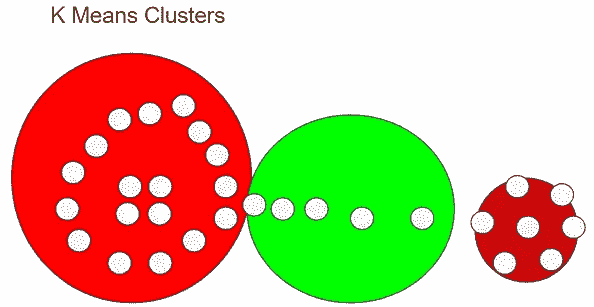
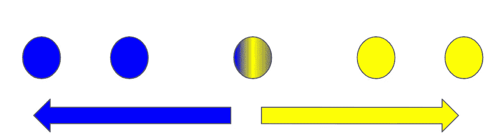
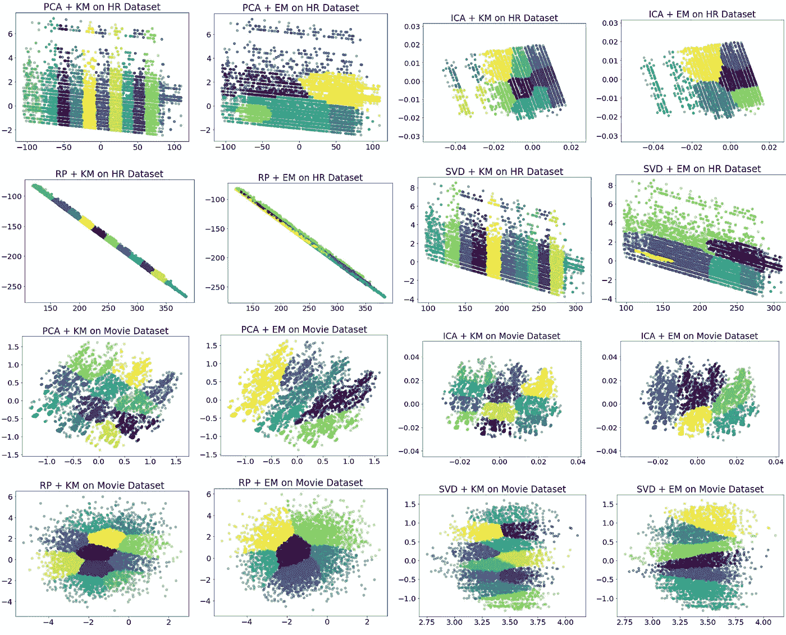

# 了解聚类

> 原文：<https://towardsdatascience.com/understanding-clustering-f25908f3ede5?source=collection_archive---------49----------------------->

## 让数据科学家理解机器学习的简单笔记

## 从复杂数据集中自动提取自然群体

来源( [Unsplash](https://unsplash.com/photos/EkR984nTyMA) )

# 什么是集群

聚类是一种无监督的学习技术，用于从预定义的类和先验信息中提取自然分组或标签。这是一项重要的技术，用于探索性数据分析(EDA)以从数据中发现隐藏的分组。通常，我会使用聚类来发现关于数据分布和特征工程的见解，从而为其他算法生成一个新类

# 聚类在数据科学中的应用

## 电子商务中的卖家细分

当我在 Lazada(电子商务)实习时，我处理 3D 聚类来找到卖家的自然分组。Lazada 销售团队要求进行分析，以通过多种促销和徽章奖励表现出色的销售人员。然而，要做到这一点，我们需要了解卖家是谁，他们的表现如何。为了做到这一点，我们设计并选择了三个主要维度:客户评论、交付和退款质量，以及产品供应(专业卖家或普通卖家)。

基于这些主要标准，我们创建了 3D 聚类可视化来识别我们的卖家。根据结果，我们对这些卖家进行了分类，并为每个卖家创建了奖励和徽章跟踪。最终，通过 AB 测试，我们提高了 23%的关键销售业绩，并改善了一般用户体验指标。

在 [Lazada](https://www.lazada.sg/products/5pcs-resistance-band-set-available-latex-gym-strength-training-rubber-loops-bands-fitness-crossfit-equipment-i278184302-s429431206.html?spm=a2o42.home.flashSale.3.3cc246b5LzU8LT&search=1&mp=1&c=fs&clickTrackInfo=%7B%22rs%22%3A%220.19304150943396226%22%2C%22prior_score%22%3A%220%22%2C%22submission_discount%22%3A%2260%25%22%2C%22iss%22%3A%220.19304150943396226%22%2C%22type%22%3A%22entrance%22%2C%22prior_type%22%3A%22racing%22%2C%22userid%22%3A%22%22%2C%22sca%22%3A%227%22%2C%22hourtonow%22%3A%228%22%2C%22abid%22%3A%22169252%22%2C%22itemid%22%3A%22278184302_1_racing_0.19304150943396226_0.19304150943396226%22%2C%22pvid%22%3A%220b4e3920-5166-4230-ade9-d90775df8b78%22%2C%22pos%22%3A%221%22%2C%22rms%22%3A%220.0%22%2C%22c2i%22%3A%220.0%22%2C%22scm%22%3A%221007.17760.169252.%22%2C%22ss%22%3A%220.19304150943396226%22%2C%22i2i%22%3A%220.0%22%2C%22ms%22%3A%220.19304150943396226%22%2C%22itr%22%3A%220.11333333333333333%22%2C%22mt%22%3A%22racing%22%2C%22its%22%3A%22150%22%2C%22promotion_price%22%3A%227.92%22%2C%22anonid%22%3A%22db37f758-ace2-4564-91ec-cc836df6f86c%22%2C%22FinalScore%22%3A%220.0603798%22%2C%22isc%22%3A%2217%22%2C%22iss2%22%3A%220.7003338123346776%22%2C%22data_type%22%3A%22flashsale%22%2C%22iss1%22%3A%220.2833333333333333%22%2C%22config%22%3A%22%22%2C%22HP_score%22%3A%220.0603798%22%2C%22channel_id%22%3A%220000%22%7D&scm=1007.17760.169252.0) 使用 Scikit Learn 和一般关键销售业绩进行三维聚类。这是一个例子，而不是避免 NDA 冲突的真实表示(保密协议)。

## **其他应用**

如果我的这个亲身经历还不够的话，在我们的生活中你还可以找到更多的集群应用。

**标签标注**:假设你想对很多产品进行分类，比如相机、衣服和冰箱。你怎么知道给他们贴什么样的标签合适呢？相机、电视和台式机应该归入相同的标签吗？为了更好地区分这些产品，您应该创建多少个标签？

**客户细分:**假设你正在努力改善零售采购。你能根据买家的购买模式对他们进行分类吗？什么是适当的标签和促销，以增加每个客户群的支出？

**推荐系统中的类型选择:**假设网飞向我们推荐要观看的节目。每个推荐应该有哪些合适的标签或流派来分析用户的观看行为？在节目创作的时间段上对他们的观点进行分类是个好主意吗？

所有这些都需要聚类技术来创建自然分组，尤其是在多维数据复杂性中。

# 集群是如何工作的？

给定一组对象，我们希望对它们进行聚类；将他们分成一组。

我从 IMDB 电影数据中分离聚类

在这个图像中，你可以直接看到一些点的自然组合。这很容易想象，因为我们这里只有两个维度(y 轴和 x 轴)。因此，我们可以突出分组。但是假设我们有很多维度。我们如何使用这些特性将它们分组？

# 集群目标:

*   **输入**:一组物体:x .这是一个距离度量 D(。,.)其中它定义了物体间距离，使得 D(x，y) = D(y，x)其中 x，y E X。
*   **输出**:如果 x 和 y 属于同一个集群，对象的划分使得 Pd(x) = Pd(y)

这种由距离定义的相似性概念使人想起 k 近邻(KNN)。这意味着我们可以将对象填充到特定的簇中，而无需测量好簇或坏簇。重要的是我们用来创建分区和分隔组的距离函数。

这意味着解往往具有很高的方差，并且依赖于算法。每个聚类算法可能会得出不同的最佳聚类结果。在本文中，我们将讨论单链接集群，K 表示集群和软集群:

具有单个链接聚类(2)和 K 表示聚类(3)的未分组数据集

# 单连锁聚类

这是最简单的聚类算法。

## 基本 SLC 聚类步骤

给定 k 个聚类的输入:

*   我们将每个对象视为具有 n 个簇的簇
*   我们将类间距离函数定义为多个类中最近的可能距离
*   合并两个最近的集群
*   重复这个算法 n-k 次，生成 k 个聚类。

这种算法让我想起了“连点”游戏，这是一种将点一个接一个连接起来以构建特定形状和结构的游戏。

把这些点连接起来([来源](https://freesvg.org/connect-the-dots-mouse-vector))

## 复杂性和局限性

有趣的是，这种聚类算法拥有有趣的属性:确定性(它像 MST 最小生成树算法一样运行)，因为它将距离视为边长，时间复杂度为 O(n)。我们需要在 n 次内评估 n 对(最坏的情况)。我们需要重复 k 次(n/2 ),但是我们还需要查看所有距离，以找到具有不同标签的最近的一对 O(n)。

单链接聚类还应用试探法将多个可能没有预期行为的接近点连接在一起。

# k 均值聚类

k 表示聚类是一种简单直接的算法，因为每次迭代只需要少量的琐碎操作。它还确定收敛到局部/全局最小值，这意味着我们可以增加置信水平来信任结果。

## 基本 K 均值聚类步骤

*   选择 k 个随机质心
*   将每个点与最近的中心点相关联
*   通过平均聚类点来重新计算中心
*   重复这些步骤，直到它收敛。

## k 均值优化函数

1.  配置→中心，P
2.  分数→P 中心和 x 的平方差总和。
3.  邻域→离质心最近的点。

## 与 SLC 相比，范式发生了转变

与 SLC 相比，这需要一些范式转换，并且是现在世界上广泛使用的聚类算法。

*   取聚类中心(质心)的随机位置，而不是使用现有的观察值作为中心。
*   迭代每个质心的多个观测成员，直到看不到进一步的改进(收敛)

## 复杂性和局限性

就 O 符号而言，k 均值比 SLC 更有效——每次迭代的多项式时间为 O(kn)。

然而，也有我们需要考虑的缺点。**第一个**，k 中的 k 表示之前需要识别。这意味着，在运行该算法之前，我们需要首先通过使用肘方法等来分析最佳聚类数(k)。**其次**，我们放置的初始种子/质心也会极大地影响我们的聚类。**第三个**，离群点会极大地影响我们放置的质心，从而影响集群成员。**最后**，k 表示对假设的球形聚类进行聚类，这在一些非球形数据分布中可能是个问题。

以前我们只讨论了某个只有一个类作为其成员的观察。如果观察结果不明确怎么办？

# 软聚类

以前我们只讨论了某个只有一个类作为其成员的观察。如果观察结果不明确怎么办？然后我们将观察结果分成两组。

分配该观察的正确类别是什么？这仍不清楚。如果我们把这个观察分配给两个类呢？

这就是软集群的用武之地。它使用概率确定性来识别使用所选高斯分布的可能聚类。目标是最大化数据属于某一类的可能性。这被定义为期望最大化(EM 聚类)。

有趣的是，由于 EM 是基于概率的聚类，这意味着有无限多的配置。你永远不会做得更差，但你会不断接近，永远不会接近最终的最佳配置。

# 聚类算法的属性

那么我们如何选择使用哪个集群呢？对于我们的聚类算法，我们需要考虑以下属性。每个属性将根据我们使用的数据模式和距离矩阵而变化。

*   **丰富度**:对于将对象分配给聚类，存在某种距离矩阵 D，使得聚类收敛已经对给出最佳拟合的聚类数量设置了限制。如果我们在聚类未达到 k 时过早地停止 SLC 算法，我们将牺牲丰富性，因为我们限制了聚类的数量。
*   **尺度不变性**:假设我们用一个任意的常数(比如从摄氏温度到华氏温度)提升距离度量，聚类成员结果应该不会改变。如果聚类相距某个单位，缩放结果将会改变生成的聚类成员。如果我们在聚类相距预定值单位时过早地停止 SLC 算法，我们将牺牲尺度不变性。
*   **一致性**:通过压缩或扩展点，没有点会转移到另一个集群。如果聚类是具有最大识别距离的度数识别单元，那么我们可以转换这个距离公式并改变聚类成员。这意味着当我们使相似的点更相似或使不相似的点更不相似时，聚类不应该改变。如果当聚类是预定义的值单位除以最长的聚类内距离时，我们过早地停止 SLC 算法，我们将牺牲一致性。

理想情况下，您的集群应该具备所有这三个属性。但是，不幸的是，正如[不可能定理](https://www.cs.cornell.edu/home/kleinber/nips15.pdf)中提到的，这是不可能的。请随意查看本文中的证明。

> 没有一种聚类方案可以同时满足这三个条件:丰富性、规模不变性和聚类性— [乔恩·克莱因伯格 15](https://www.google.com/search?q=kleinberg+15+clustering&rlz=1C1GCEA_enSG866SG866&oq=kleinberg+15+clustering&aqs=chrome..69i57.3751j0j1&sourceid=chrome&ie=UTF-8)

# 最后…

我自己的聚类分析，使用各种聚类和特征变换技术

我真的希望这是一本很棒的读物，是你发展和创新的灵感来源。

请在下面的**评论**提出建议和反馈。就像你一样，我也在学习如何成为一名更好的数据科学家和工程师。请帮助我改进，以便我可以在后续的文章发布中更好地帮助您。

谢谢大家，编码快乐:)

**免责声明:这是为我创建的复习笔记，用于更新我在佐治亚理工学院 OMSCS 课程中关于机器学习的知识。许多参考资料来自乔治亚理工学院的课堂和外部资源。**

# 关于作者

Vincent Tatan 是一名数据和技术爱好者，拥有在 Google LLC、Visa Inc .和 Lazada 实施微服务架构、商业智能和分析管道项目的相关工作经验。

Vincent 是土生土长的印度尼西亚人，在解决问题方面成绩斐然，擅长全栈开发、数据分析和战略规划。

他一直积极咨询 SMU BI & Analytics Club，指导来自不同背景的有抱负的数据科学家和工程师，并为企业开发他们的产品开放他的专业知识。

最后，请通过[**LinkedIn**](http://www.linkedin.com/in/vincenttatan/?source=post_page---------------------------)**[**Medium**](https://medium.com/@vincentkernn?source=post_page---------------------------)**或** [**Youtube 频道**](https://www.youtube.com/user/vincelance1/videos?source=post_page---------------------------) 联系文森特**