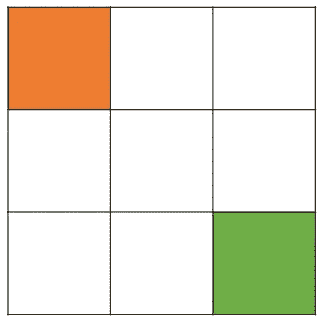
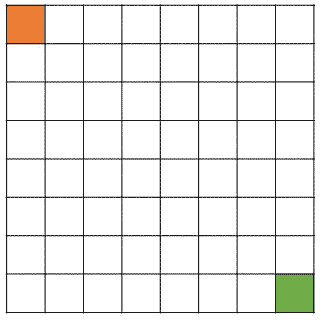
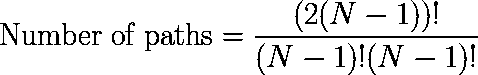
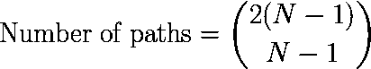
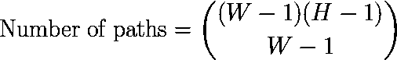
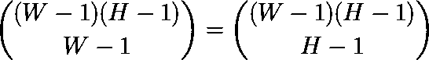

# 理解组合学:网格上的路径数

> 原文：<https://towardsdatascience.com/understanding-combinatorics-number-of-paths-on-a-grid-bddf08e28384?source=collection_archive---------6----------------------->

## 你能数出一个普通的 WxH 网格上有多少条路径吗？

照片由 [Unsplash](https://unsplash.com?utm_source=medium&utm_medium=referral) 上的[延斯·勒列](https://unsplash.com/@leliejens?utm_source=medium&utm_medium=referral)拍摄

B asic 组合学是编程人员不可或缺的工具，无论是开发人员、人工智能专家还是数据科学家。

> 在本文中，我们将解决一个简单的组合问题:计算从一个普通 WxH 网格的一个角到另一个角的路径数。

让我们从这个 3x3 的网格开始:

假设我们想从橙色方块到绿色方块。每一步我们都可能向右或向下移动。我们将用 R 表示向右移动的**，用 D** 表示向下移动的**。我们感兴趣的是我们可以选择的不同路径的数量。让我们手动列举路径:**

*   RRDD
*   DDRR
*   RDRD
*   DRDR
*   RDDR
*   DRRD

我们可以得出结论，在这个网格中有 **6 条不同的路径**。现在来看看这个 8×8 的网格:

如果你试图计算这个网格上的路径数，这将花费你相当长的时间。我们需要一些更聪明的数学方法。首先要注意的是，我们要走的步数并不取决于所走的路。

> 以步数计算的距离总是一样的。

这个距离也被称为 **L1 距离、城市街区距离或曼哈顿距离**，因为纽约市中心的街区是方形的。

另一方面，我们注意到在正方形网格上，由于对称性，R 移动的次数必须等于 D 移动的次数。此外，我们在每条路径上需要 7+7=14 步(你可以很容易地沿着网格的边界移动)。这两个要求使得以如下方式重新定义 8×8 栅格的问题成为可能:

> 找出字符串 RRRRRRRDDDDDDD 的不同排列的数目。

现在，排列的数量通常由 *N 定义！或 N*(N-1)*(N-2)*…*2* ，也称**阶乘**。据此， *N* 为弦的长度。在我们的情况下，14！= 87178291200.然而，我们必须考虑这样一个事实，即 R 和 D 的顺序并不重要；他们是一样的。两者不同排列的数量是 7！= 5040.我们必须数两遍这个数字，因为 R 和 D 是无法区分的。换句话说，我们分 14！7 点前！*7!。这给了我们 3432，这是正确的答案。

为了将我们的公式推广到任何 NxN 网格，我们可以写成:

顺便说一下，还有一种更简单的写法:**数字 D = N！/ (K！* (N-K)！)也叫二项式系数，我们可以写成(N 选 K)** 。这个数字表示我们可以从一袋 N 个物体中挑选 K 个物体的方法的数量，不考虑挑选的顺序。因此，我们也可以把我们的公式写成:

更通用的 WxH 网格呢？在这种情况下，步数是(W-1) * (H-1)，我们必须选择(W-1) R 步(你可以自己检查)。因此，公式变为:

很简单，对吧？注意，我们可以选择(H-1) D 步，而不是选择(W-1) R 步。直觉上，这应该会给我们相同的答案，而**确实是这样**。换句话说，这意味着二项式系数是**对称的:**

作为练习，尝试在 30x20 甚至 99x99 的网格上计算路径的数量。你也可以试着写一个递归计算所有路径的程序，但是这样的程序在 99x99 的网格上要花很长时间才能完成！

# 结论

我希望你在这篇文章中学到了一些实用的组合学，并且你将被激励去学习更多关于这个迷人的主题。