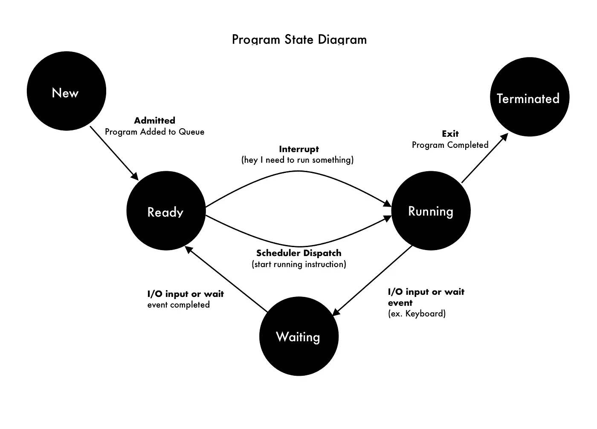
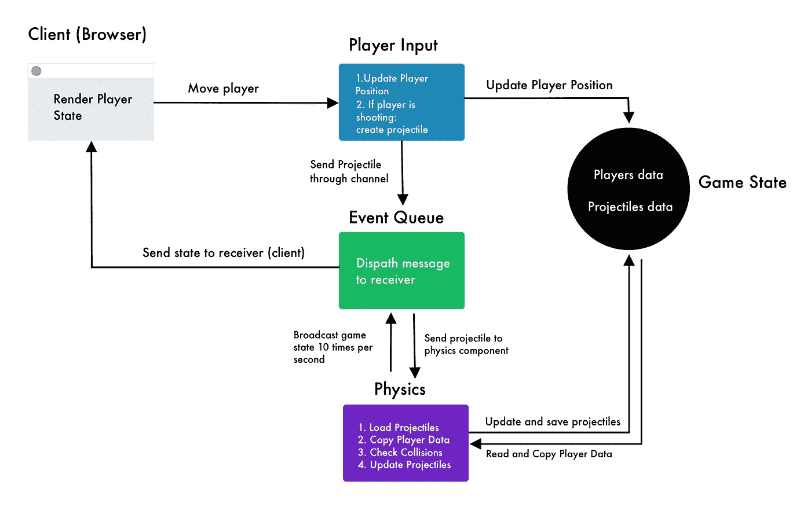

# 理解并发和多线程程序

> 原文：<https://towardsdatascience.com/understanding-concurrency-and-multi-threaded-programs-261047c8231f?source=collection_archive---------16----------------------->

迈克尔·泽兹奇在 [Unsplash](https://unsplash.com?utm_source=medium&utm_medium=referral) 上的照片

## 以及如何让你的程序变得高效

我最近不得不学习在 Go 中编程，因为我正在为浏览器开发一个多人游戏。

我在 reddit 的 [r/gamedev](https://www.reddit.com/r/gamedev/) 社区上问了一下，被推荐去看看 GO 的后端服务器。

Go 是一种相对较新的语言，由 Google 工程师开发，具有并发特性。

我们将在下一篇文章中学习围棋和多人视频游戏，但首先，我们必须了解并发是如何工作的。

# 并行执行到底是什么？

与其直接讨论并发性，不如理解什么是并行执行

如果您对计算机科学感兴趣，您可能听说过并行编程，但是如果您没有听说过，请不要担心。

并行执行一个程序基本上就是这个意思。

> 同时运行两段不同的代码

这意味着两个程序在任何给定的时间点都在运行。一个指令可能会在另一个指令之前完成，但它们不会像常规程序那样顺序执行——一个指令接一个指令。

这很棒，因为这意味着我们可以在相同的时间内将程序的速度提高一倍。同时做两件事比做一件事要快，对吗？

但是伴随着强大的力量而来的是巨大的责任和代价。实际上是两个。

# 并行运行程序的条件

## 并行执行需要额外的硬件才能同时运行。

*   每个并行运行的程序需要一个内核

## 为了并行运行，两个程序必须严格无关。

*   这是因为我们不能在不阻塞其中一个的情况下访问两个程序中的相同数据源，这将使程序不再是并行的

让我们讨论一下限制#1，以便更好地理解为什么我们至少需要两个内核来并行运行。

# 关于处理器的一些信息

程序和线程由我们计算机的处理器执行。处理器由内核组成，每个内核一次只能处理一条指令。

幸运的是，大多数现代处理器都配有 **4 核**或更多。这就是为什么我们称它们为**四核处理器**。像桌子这样的小设备可能只有不到四个内核来节省电池，或者因为它们需要更少的计算能力。

比如我的 2019 款 macbook air 就有双处理器。**平行哭泣* *

因为每个内核一次只能处理一件事情。我们至少需要两个内核才能执行任何类型的并行执行。所以如果你有四个内核，理论上，你可以同时执行四个不同的程序。速度快了 4 倍！但同样，它们必须是严格无关的。

两个相关的程序不能并行运行，因为它们需要某种同步才能正常工作。

# 双赢的并发性

计算机科学家意识到许多程序不能并行执行，因为它们是相互关联的。

每个内核通常也有 4 个线程。

一个**线程**只是一个开销较小的程序的子进程。

多线程程序将利用额外的线程和内核来更有效地分配程序负载，而不是让一个糟糕的内核完成所有工作，而其他内核只是旁观。

并发的前提是同时运行两个或更多不同的程序。

# **利用浪费的 CPU 周期**

假设我们有一个程序，它等待用户的输入来打印“Hello {user's input}”，而不是“Hello World”。

一个进程(一个线程也是一个进程)有 5 种状态，在它的生命周期中的任何时候都可以处于这 5 种状态。

由你真正创造

每当程序处于就绪或等待状态时，当程序等待一些输入或事件触发时，cpu 周期就会被浪费。

并发利用这种“浪费的时间”来执行另一个程序，而第一个程序正在等待所述事件，例如等待用户键入他的用户名和密码。

今天的计算机速度如此之快，以至于它们的操作系统使用这种策略来“同时”运行可能的程序，但实际上，程序之间的切换真的很快，以至于我们无法分辨它们的区别。

> 尽管没有并行那么快，但并发可以显著提高程序的速度。

# 并发编程很难

既然我们知道了什么是并发性以及它能实现什么，那么让我们来看看在实现它时可能会遇到的一些问题。

## **比赛条件**

当两个进程争夺同一个资源时，就会产生争用情况。这意味着整个程序变得不可预测，因为一个程序可能会在另一个程序读取值之前修改它。

## 再次举例！

假设我们正在实现一个游戏，并将玩家的位置(X，Y)存储在一个哈希映射中。

现在假设玩家 A 向玩家 B 开枪，我们需要检查子弹是否会击中玩家 B 并造成伤害。

我们游戏的碰撞检测和玩家输入组件是同时运行的，所以我们需要确保不会产生竞争情况。

因此，如果我们有一个函数正在检查玩家 A 的子弹和玩家 B 的角色之间的碰撞，但玩家 B 可能同时在移动，则在我们寻找碰撞时，碰撞检测程序可能会修改玩家 B 在数组中的位置。

在最好的情况下，这会造成游戏逻辑的不一致，就像一个玩家没有受到碰撞的影响，但在最坏的情况下，我们的游戏会崩溃，因为内存不能同时读写。

无论哪种方式，我们都不希望发生这种情况，因为这个问题非常难以调试，因为我们不知道代码何时被执行。

# 并行问题解决方案

我们将使用下面的多人游戏设计来讨论一些现实世界中可以使用并发的场景。

多人游戏系统设计

## 线程间共享数据

有时，一些数据需要在线程之间共享，如果处理不当，这可能会导致争用情况。

解决这个问题的一种方法是提供一种同步线程的方法，这样在任何给定的时间，只有一个线程可以访问或读取选定的源。

在围棋中，这些解被称为通道。不要被这个名字吓倒，因为通道基本上只是一个添加了一些功能的队列。

当一个线程从一个通道中读取数据时，它将阻塞对任何其他线程的所有访问，直到当前线程使用完它。如果有两个或更多的线程想要访问通道，它们必须等到通道可用。这样，我们可以确保不会发生竞争情况。

## 创建数据的副本

我们可能会遇到这样的情况:我们需要每秒更新数据很多次，而与此同时，用户可能同时在修改数据。有时，我们不能对所有事情都使用同一个通道，除非我们不介意所有组件相互依赖。解耦是确保一个易于维护的干净项目的好方法。

比如，让我们回到游戏的例子。当玩家射击时，一个组件负责创建一个射弹，如果它移动了，还负责更新玩家。

使用第一种方法，我们可以通过一个通道发送每一个输入请求和抛射体创建，并让它从一个单一的源更新一切，以防止竞争情况。

但是直接更新玩家的位置并只发送投射物可能是一个更好的解决方案。这样，我们只需要担心更新投射物和检查物理组件中的碰撞，而不是处理玩家的移动。

为此，我们创建玩家位置的副本，并检查与该副本的碰撞，因为原始数据可能会在我们检查它时发生变化。

因为我们每秒 60 次更新抛射体并检查碰撞，这防止了同时读取被修改的数据，也使我们的物理逻辑与玩家的输入逻辑分开。

如上所述，另一种方法是处理物理组件中的所有内容，这会使我们的代码可读性更差，并且依赖于不相关的组件。

# 下一步是什么？

通过优化资源和等待时间的使用，并发性可以显著加快我们的程序，否则这些资源和等待时间会被浪费掉。在许多情况下，使用并发性可能会改进程序，但它通常是实时应用程序和视频游戏等高性能系统所必需的。

我们将在下一篇文章中讨论用于解决这些问题的各种策略，以及在 GO 中实现并发程序。

与此同时，你可以开始学习围棋，因为它不同于传统语言，可能需要一些时间来适应它。

祝您愉快！

## 参考

[1]麻省理工学院，并发性(2014)，[https://web.mit.edu/6.005/www/fa14/classes/17-concurrency/](https://web.mit.edu/6.005/www/fa14/classes/17-concurrency/)

[2]伊恩·哈里斯，《围棋中的并发》(2019)，【https://www.coursera.org/learn/golang-concurrency 