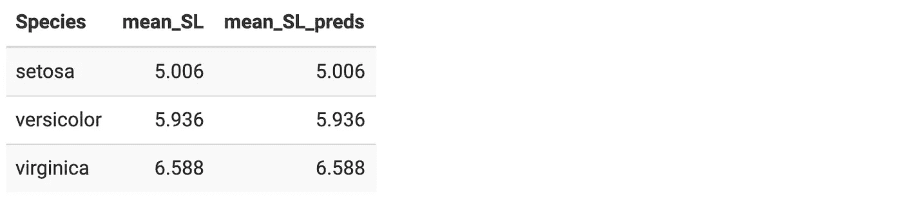

# 使用 R 中的线性回归模型对条件期望和迭代期望的回顾

> 原文：<https://towardsdatascience.com/understanding-conditional-and-iterated-expectations-with-a-linear-regression-model-f90fb0a5533b?source=collection_archive---------33----------------------->

## 重访(意料之外？！)概率论结果使用`lm()`

## **太长；没看:**

*   您可以对分组变量*加上任何其他变量*的结果进行回归，未调整和调整后的分组均值将是相同的。
*   我们可以在一个使用`iris`数据的简单示例中看到这一点:

```
iris %>%
 # fit a linear regression for sepal length given sepal width and species 
 # make a new column containing the fitted values for sepal length
 mutate(preds = predict(lm(Sepal.Length ~ Sepal.Width + Species, data = .))) %>%
 # compute unadjusted and adjusted group means group_by(Species)
 %>% summarise(mean_SL = mean(Sepal.Length), mean_SL_preds = mean(preds)) %>%
 kable()
```


*   这是因为 E[E[Y|X，Z]| Z =*Z*]= E[Y | Z =*Z*。
*   我们可以将回归得到的拟合值 E[Y|X，Z]视为随机变量来帮助我们理解这一点。
*   [跳到最后](https://www.khstats.com/blog/iterated-expectations/iterated-expectations/#step-by-step-proof)看证明。


我承认我在概率论第一学期的大部分时间都在努力理解 X 和 x 之间的区别。当我最终学会了随机变量期望的所有规则时，我仍然对它们在我未来作为一名应用统计学家的工作中的影响毫无兴趣。

最近，当我试图在`R`中编写一个看似简单的函数时，我发现自己陷入了期望属性的兔子洞。现在我已经把函数的输出整理好了，我对如何使用回归(一个我非常熟悉的框架)来重新思考我在概率论课程中学到的一些性质有了新的认识。

在函数中，我回归了几个变量加上一个分组变量的结果，然后返回拟合值的分组平均值。我的函数一直输出调整后的组平均值，这些平均值与未调整的组平均值相同。

我很快意识到，对于我需要做的事情，我的分组变量不应该在回归模型中。然而，我仍然感到困惑的是，调整后的和未调整的组均值怎么可能是相同的。

我创建了一个非常基本的例子来测试这个意外的结果。我回归了一个来自`iris`数据集的变量`Sepal.Length`，一个叫做`Sepal.Width`的变量和一个分组变量`Species`。然后，我查看了未调整的`Sepal.Length`和来自我的线性回归模型的`Sepal.Length`的拟合值在`Species`的每个类别中的平均值。

```
library(dplyr) 
library(knitr)iris %>% 
# fit a linear regression for sepal length given sepal width and species 
# make a new column containing the fitted values for sepal length
 mutate(preds = predict(lm(Sepal.Length ~ Sepal.Width + Species, data = .))) %>%
 # compute unadjusted and adjusted group means
 group_by(Species) %>%
 summarise(mean_SL = mean(Sepal.Length), mean_SL_preds = mean(preds)) %>%
 kable()
```



我看到了同样奇怪的输出，甚至在我的简单示例中也是如此。我意识到这一定是我学过但后来忘了的一些统计学特性，所以我决定写下我在 expectations 中做了什么。

首先，我以期望值的形式写下了未调整组的均值。我写下了一个条件期望，因为当`Species`被限制在某个类别时，我们在看`Sepal.Length`的平均值。我们可以通过取一个随机变量**萼片长度**的期望值，同时设置另一个随机变量**物种**，一次只等于一个类别，来明确地展示这一点。

E[ **分离** | **物种** = *刚毛*

E[ **分离度** | **种类** = *海滨锦鸡儿*

E[ **独立** | **物种** = *云芝*

更一般地，我们可以使用一个组指示变量**物种**写出未调整的组均值，它可以采用所有可能的值*物种*。

E[ **分离** | **种** = *种*

这就是我们的未调整群的意思。调整后的群体均值呢？我们可以从写出线性回归模型开始，它是以随机变量 **SepalWidth** 和**物种**为条件的 **SepalLength** 的期望值。

E[ **萼片长度** | **萼片长度**，**种类**

当我对线性回归模型的拟合使用`predict`函数时，我从该期望值中获得了拟合值，然后将拟合值分组以获得分组平均值。我们可以将这些拟合值视为随机变量本身，并使用分组指示变量写出另一个条件均值，就像我们之前对未调整的分组均值所做的那样。

E[E[ **分离长度** | **分离宽度**，**物种**|**物种** = *物种* ]]

我的未调整和调整的萼片长度的表因此向我显示:

[E[E[**sepal length**|**sepal width，Species**|**Species**=*Species*

= E[ **分离长度** | **物种** = *物种* ]]

或者，用更一般的符号来说:

E[E[Y|X，Z]|Z=z] = E[Y|Z=z]]

是真的吗？！剧透警报-是的。让我们一个一个地完成证明的步骤。

# 验证设置

让我们假设证明我们的 Y *(结果)* X *(调整变量)和* Z *(分组变量)都是分类(离散)变量。这只是为了使数学更清晰，因为离散变量的期望(加权求和)比连续变量的期望(概率密度函数的积分乘以随机变量的实现)更容易显示。*

*我们需要一些基本的预期结果:*

## 条件概率

P(A | B)= P(A∩B)P(B)P(A | B)= P(A∩B)P(B)

## 划分定理

e[a|b]=∑ba⋅p(a=a|b=b)e[a|b]=∑ba⋅p(a=a|b=b)

## 联合分布的边际分布

∑a∑ba⋅p(a=a,b=b)=∑aa∑b⋅p(a=a,b=b)=∑aa⋅p(a=a)=e[a]

# 逐步证明

点击每个步骤后的上标数字了解更多信息。

E[E[Y|X，Z]| Z =*Z*E[E[Y | X，Z]|Z= *z*

=E[E[Y|X，Z =*Z*]| Z =*Z*]= E[E[Y | X，Z =*Z*]| Z =*Z*[1](https://www.khstats.com/blog/iterated-expectations/iterated-expectations/#fn1)

=∑XE[Y|X= *x* ，z =*z*]⋅p(x=*x*| z =*z*)=∑x e[y | x =*x*，z =*z*]⋅p(x=*x*| z =*z*)[2](https://www.khstats.com/blog/iterated-expectations/iterated-expectations/#fn2)

=∑x∑y⋅p(y=*y*| x =*x*，z =*z*)⋅p(x=*x*| z =*z*)=∑x∑y⋅p(y=*y*| x =*x*，z =*z*)⋅p(x=*x*| z =*z*[3](https://www.khstats.com/blog/iterated-expectations/iterated-expectations/#fn3)

=∑X∑Y⋅P(Y= *y* ，X= *x* ，z =*z*p(X= *x*，Z= *z* )⋅P(X= *x* ，z =*z*p(z =*z*)=∑x∑y⋅p(y=*y*，x =【t

=∑X∑Y⋅P(Y= *y* ，X= *x* ，z =*z*p(z =*z*)=∑x∑y⋅p(y=*y*，X= *x* ，z =*z*p(z =*z*)[5](https://www.khstats.com/blog/iterated-expectations/iterated-expectations/#fn5)

=∑Y∑X⋅P(Y= *y* ，X= *x* ，z =*z*p(z =*z*)=∑y∑x⋅p(y=*y*，X= *x* ，z =*z*p(z =*z*)[6](https://www.khstats.com/blog/iterated-expectations/iterated-expectations/#fn6)

=∑Y⋅P(Y= *y* ，z =*z*p(z =*z*)=∑y⋅p(y=*y*，z =*z*p(z =*z*)[7](https://www.khstats.com/blog/iterated-expectations/iterated-expectations/#fn7)

=∑y⋅p(y=*y*z =*z*)=∑y⋅p(y=*y*| z =*z*)[8](https://www.khstats.com/blog/iterated-expectations/iterated-expectations/#fn8)

= E[Y | Z =*Z*]= E[Y | Z =*Z*[9](https://www.khstats.com/blog/iterated-expectations/iterated-expectations/#fn9)

所以，我们已经证明了:

E[E[Y|X，Z]| Z =*Z*= E[Y | Z =*Z*]

谢天谢地，这意味着我有了函数输出混乱的答案。我突然意识到，我可以把内心的期望看作一个随机变量，我学到的关于条件和迭代期望的所有规则都可以应用到我每天拟合的回归中。

这里希望你也能感受到不时重温概率论的灵感，即使你的工作非常实用。毕竟，这是一个社交距离的完美活动！😷

# 说明

1.  因为我们使我们的外部期望以 Z= *z* 为条件，我们也可以将 Z= *z* 移入我们的内心期望。这在`iris`示例中变得很明显，因为我们仅使用来自`Species`的一个类别的拟合值来获得该类别的调整组均值。 [↩](https://www.khstats.com/blog/iterated-expectations/iterated-expectations/#fnref1)
2.  我们可以将 E[Y|X，Z= *z* 改写为 X 可以取的所有可能值的加权求和。E[Y|X，Z= *z* 将只能取在 *x* ，E[Y|X= *x* ，Z= *z* 范围内变化的 X 值，因为我们的值 *z* 已经固定了。我们可以用 P(X= *x* |Z= *z* )来加权这些可能的 E[Y|X= *x* ，Z= *z* 值中的每一个，因为这是 X 在我们已经固定的 *z* 取值 *x* 的概率。于是，我们就可以开始用 P(X =*X*| Z =*Z*)P(X =*X*| Z =*Z*)对每个 E[Y|X=x，Z= *z* 进行加权，并把它们全部加起来，就可以求出 E[E[Y|X，Z =*Z*| Z =*Z*]定理。 [↩](https://www.khstats.com/blog/iterated-expectations/iterated-expectations/#fnref2)
3.  我们可以通过与步骤 2 类似的过程(用 P(Y= *y* |X= *x* ，Z =*Z*P(Y =*Y*| X =*X*，Z= *z* )加权每个 *y* 得到 Y 在 X 的每个可能值上的期望值。 [↩](https://www.khstats.com/blog/iterated-expectations/iterated-expectations/#fnref3)
4.  根据条件概率定律，我们可以将条件概率改写为联合分布。 [↩](https://www.khstats.com/blog/iterated-expectations/iterated-expectations/#fnref4)
5.  第一个分数的分母与第二个分数的分子相抵消。 [↩](https://www.khstats.com/blog/iterated-expectations/iterated-expectations/#fnref5)
6.  我们可以交换求和，这样 *y* 在 x 的所有值的求和之外。这让我们只得到 y 和 z 的联合分布。 [↩](https://www.khstats.com/blog/iterated-expectations/iterated-expectations/#fnref6)
7.  这是一个有条件的期望，写成联合分布的形式。 [↩](https://www.khstats.com/blog/iterated-expectations/iterated-expectations/#fnref7)
8.  根据分割定理。 [↩](https://www.khstats.com/blog/iterated-expectations/iterated-expectations/#fnref8)
9.  将之前的等式改写为期望值。 [↩](https://www.khstats.com/blog/iterated-expectations/iterated-expectations/#fnref9)

# 参考

[一个条件期望——亚利桑那数学](https://www.math.arizona.edu/~tgk/464_07/cond_exp.pdf)

*原载于 2020 年 3 月 15 日*[*【https://www.khstats.com】*](https://www.khstats.com/blog/iterated-expectations/iterated-expectations/)*。*